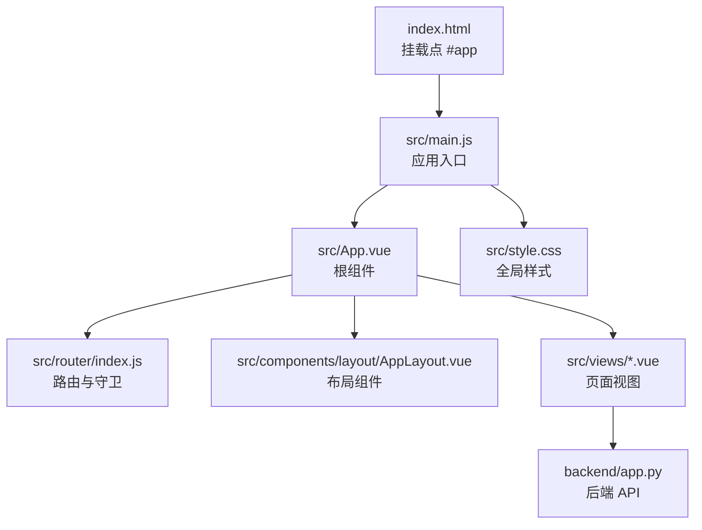
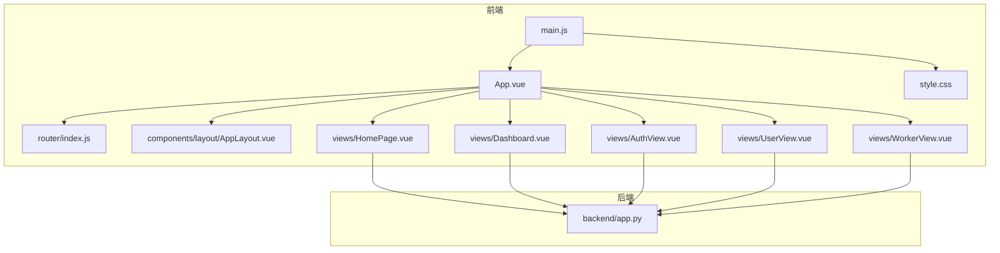
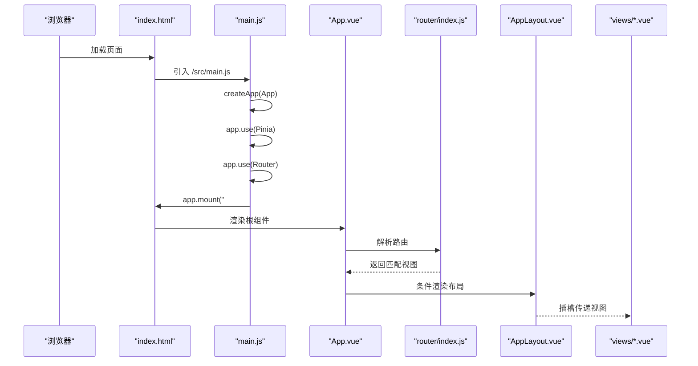
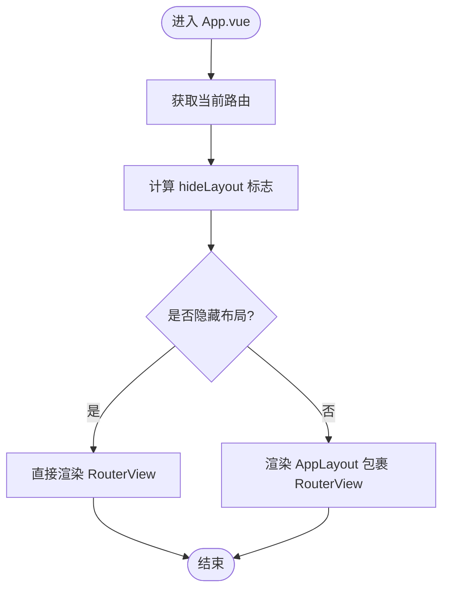
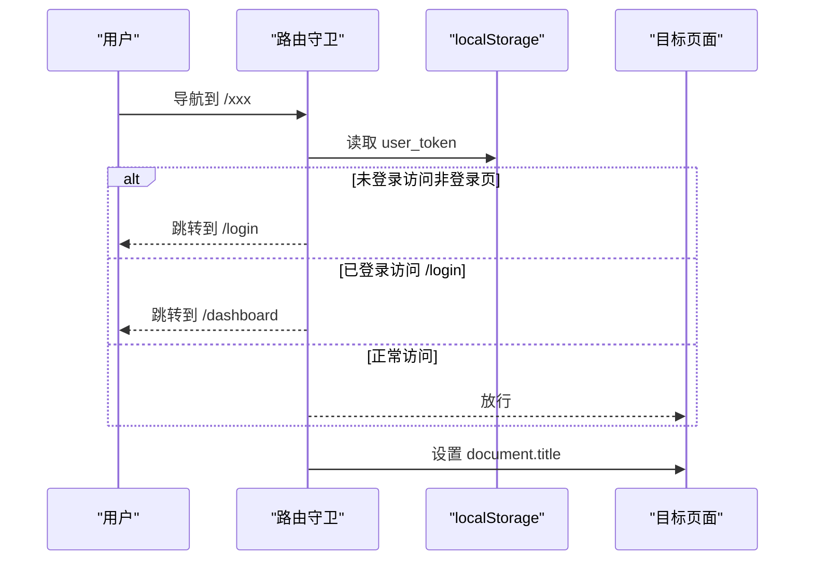
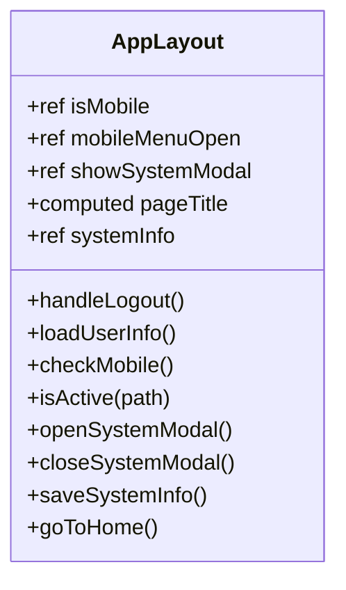
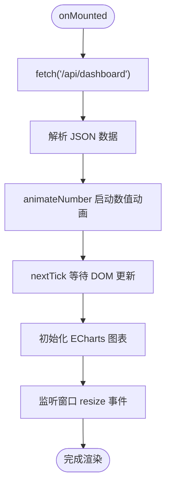
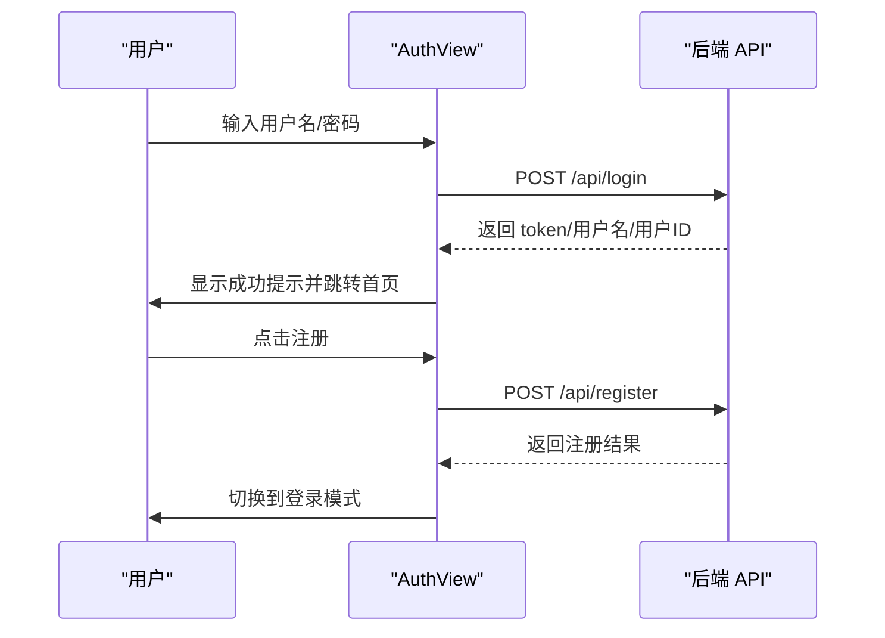
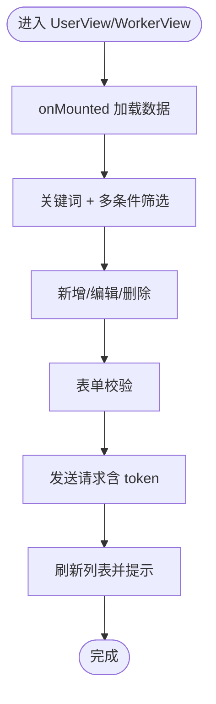
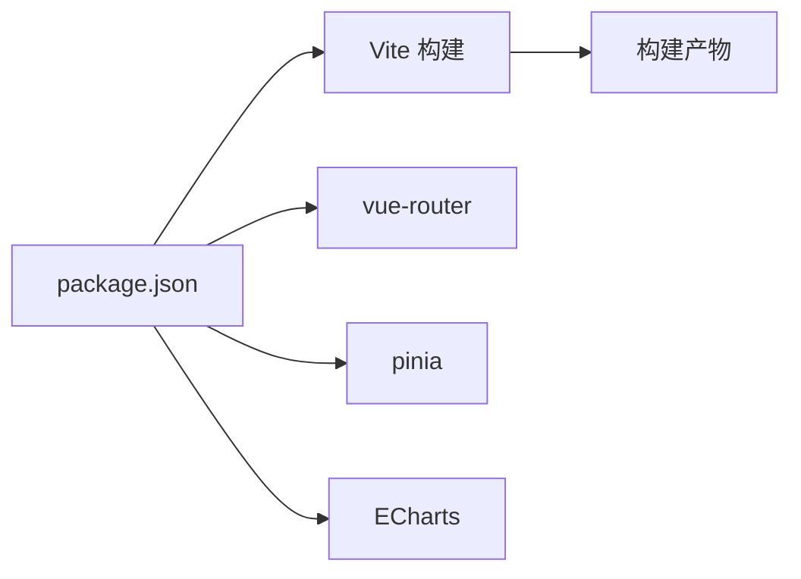

# Vue应用结构

<cite>
**本文引用的文件**
- [main.js](file://src/main.js)
- [App.vue](file://src/App.vue)
- [index.html](file://index.html)
- [package.json](file://package.json)
- [vite.config.js](file://vite.config.js)
- [style.css](file://src/style.css)
- [router/index.js](file://src/router/index.js)
- [components/layout/AppLayout.vue](file://src/components/layout/AppLayout.vue)
- [views/HomePage.vue](file://src/views/HomePage.vue)
- [views/Dashboard.vue](file://src/views/Dashboard.vue)
- [views/AuthView.vue](file://src/views/AuthView.vue)
- [views/UserView.vue](file://src/views/UserView.vue)
- [views/WorkerView.vue](file://src/views/WorkerView.vue)
- [backend/app.py](file://backend/app.py)
</cite>

## 目录
1. [简介](#简介)
2. [项目结构](#项目结构)
3. [核心组件](#核心组件)
4. [架构总览](#架构总览)
5. [详细组件分析](#详细组件分析)
6. [依赖关系分析](#依赖关系分析)
7. [性能考量](#性能考量)
8. [故障排查指南](#故障排查指南)
9. [结论](#结论)
10. [附录](#附录)

## 简介
本技术文档围绕一个基于 Vue 3 的前端应用展开，系统性解析其初始化流程、应用实例创建与挂载、插件注册顺序、全局配置与错误边界处理、根组件设计理念、样式体系与响应式策略，以及启动流程中的依赖注入、插件初始化与运行时配置。同时提供最佳实践与常见陷阱规避建议，帮助开发者高效构建与维护该应用。

## 项目结构
该仓库采用典型的 Vue 3 + Vite 前端工程结构：
- 根 HTML 文件负责挂载入口模块
- main.js 作为应用入口，负责创建应用实例、注册插件、导入全局样式与挂载
- App.vue 作为根组件，统一承载路由视图与布局切换逻辑
- views 目录存放页面级视图组件
- components/layout 提供可复用布局组件
- router/index.js 统一管理路由与导航守卫
- style.css 提供全局样式与主题变量
- backend/app.py 提供后端 API 服务，支持认证、数据聚合与资源 CRUD

**图表来源**
- [index.html:1-14](file://index.html#L1-L14)
- [main.js:1-11](file://src/main.js#L1-L11)
- [App.vue:1-24](file://src/App.vue#L1-L24)
- [router/index.js:1-61](file://src/router/index.js#L1-L61)
- [components/layout/AppLayout.vue:1-1094](file://src/components/layout/AppLayout.vue#L1-L1094)
- [views/HomePage.vue:1-970](file://src/views/HomePage.vue#L1-L970)
- [views/Dashboard.vue:1-967](file://src/views/Dashboard.vue#L1-L967)
- [views/AuthView.vue:1-380](file://src/views/AuthView.vue#L1-L380)
- [views/UserView.vue:1-520](file://src/views/UserView.vue#L1-L520)
- [views/WorkerView.vue:1-1384](file://src/views/WorkerView.vue#L1-L1384)
- [backend/app.py:1-330](file://backend/app.py#L1-L330)

**章节来源**
- [index.html:1-14](file://index.html#L1-L14)
- [main.js:1-11](file://src/main.js#L1-L11)
- [App.vue:1-24](file://src/App.vue#L1-L24)
- [router/index.js:1-61](file://src/router/index.js#L1-L61)
- [components/layout/AppLayout.vue:1-1094](file://src/components/layout/AppLayout.vue#L1-L1094)
- [views/HomePage.vue:1-970](file://src/views/HomePage.vue#L1-L970)
- [views/Dashboard.vue:1-967](file://src/views/Dashboard.vue#L1-L967)
- [views/AuthView.vue:1-380](file://src/views/AuthView.vue#L1-L380)
- [views/UserView.vue:1-520](file://src/views/UserView.vue#L1-L520)
- [views/WorkerView.vue:1-1384](file://src/views/WorkerView.vue#L1-L1384)
- [backend/app.py:1-330](file://backend/app.py#L1-L330)

## 核心组件
- 应用入口与初始化
  - main.js 使用 createApp(App) 创建应用实例，按顺序注册 Pinia 状态管理与路由插件，最后挂载到 #app。
  - 该顺序确保 Pinia 在路由守卫中可用，避免运行时访问状态失败。
- 根组件 App.vue
  - 通过 useRoute 计算当前路由元信息，动态判断是否隐藏布局；通过 RouterView 渲染视图；引入全局样式。
- 路由系统
  - 使用 createRouter + createWebHashHistory，定义多条路由并设置 meta 标题；在 beforeEach 中实现登录拦截与标题设置。
- 布局组件
  - AppLayout.vue 提供侧边栏导航、顶部工具栏、移动端菜单、系统信息弹窗与登出逻辑，配合响应式断点。
- 视图组件
  - HomePage/Dashboard：集成 ECharts 图表，实现数据拉取、动画过渡与图表渲染。
  - AuthView：登录/注册表单，令牌存储与路由跳转。
  - UserView/WorkerView：CRUD 表单、筛选、弹窗交互与 Toast 提示。
- 全局样式
  - style.css 定义 CSS 变量、基础排版、组件通用类与媒体查询，支撑整体视觉一致性与响应式布局。

**章节来源**
- [main.js:1-11](file://src/main.js#L1-L11)
- [App.vue:1-24](file://src/App.vue#L1-L24)
- [router/index.js:1-61](file://src/router/index.js#L1-L61)
- [components/layout/AppLayout.vue:1-1094](file://src/components/layout/AppLayout.vue#L1-L1094)
- [views/HomePage.vue:1-970](file://src/views/HomePage.vue#L1-L970)
- [views/Dashboard.vue:1-967](file://src/views/Dashboard.vue#L1-L967)
- [views/AuthView.vue:1-380](file://src/views/AuthView.vue#L1-L380)
- [views/UserView.vue:1-520](file://src/views/UserView.vue#L1-L520)
- [views/WorkerView.vue:1-1384](file://src/views/WorkerView.vue#L1-L1384)
- [style.css:1-308](file://src/style.css#L1-L308)

## 架构总览
应用采用“入口 -> 根组件 -> 路由 -> 视图”的清晰层次结构，并通过 Pinia 提供跨组件状态共享，通过 ECharts 实现可视化数据展示，通过后端 API 提供认证与业务数据。

**图表来源**
- [main.js:1-11](file://src/main.js#L1-L11)
- [App.vue:1-24](file://src/App.vue#L1-L24)
- [router/index.js:1-61](file://src/router/index.js#L1-L61)
- [components/layout/AppLayout.vue:1-1094](file://src/components/layout/AppLayout.vue#L1-L1094)
- [views/HomePage.vue:1-970](file://src/views/HomePage.vue#L1-L970)
- [views/Dashboard.vue:1-967](file://src/views/Dashboard.vue#L1-L967)
- [views/AuthView.vue:1-380](file://src/views/AuthView.vue#L1-L380)
- [views/UserView.vue:1-520](file://src/views/UserView.vue#L1-L520)
- [views/WorkerView.vue:1-1384](file://src/views/WorkerView.vue#L1-L1384)
- [style.css:1-308](file://src/style.css#L1-L308)
- [backend/app.py:1-330](file://backend/app.py#L1-L330)

## 详细组件分析

### 应用初始化与挂载流程
- 入口文件 main.js
  - 导入 Vue、Pinia、全局样式、根组件与路由
  - 使用 createApp(App) 创建应用实例
  - app.use(createPinia()) 注册状态管理
  - app.use(router) 注册路由
  - app.mount('#app') 将应用挂载到 index.html 中的 #app 容器
- 启动顺序的重要性
  - Pinia 必须在路由守卫之前注册，以保证守卫中可访问状态
  - 全局样式在根组件前导入，确保组件样式具备一致基线
- 错误边界与容错
  - 当前未显式声明错误边界，可在根组件中通过 onErrorCaptured 或 Suspense 提升错误处理能力

**图表来源**
- [index.html:1-14](file://index.html#L1-L14)
- [main.js:1-11](file://src/main.js#L1-L11)
- [App.vue:1-24](file://src/App.vue#L1-L24)
- [router/index.js:1-61](file://src/router/index.js#L1-L61)
- [components/layout/AppLayout.vue:1-1094](file://src/components/layout/AppLayout.vue#L1-L1094)
- [views/HomePage.vue:1-970](file://src/views/HomePage.vue#L1-L970)
- [views/Dashboard.vue:1-967](file://src/views/Dashboard.vue#L1-L967)
- [views/AuthView.vue:1-380](file://src/views/AuthView.vue#L1-L380)
- [views/UserView.vue:1-520](file://src/views/UserView.vue#L1-L520)
- [views/WorkerView.vue:1-1384](file://src/views/WorkerView.vue#L1-L1384)

**章节来源**
- [main.js:1-11](file://src/main.js#L1-L11)
- [index.html:1-14](file://index.html#L1-L14)

### 根组件 App.vue 设计理念
- 功能定位
  - 通过 useRoute 获取当前路由，结合 meta.hideLayout 决定是否包裹 AppLayout
  - 使用 RouterView 渲染当前页面，实现“有布局/无布局”两种渲染模式
- 性能优化策略
  - 仅在需要时渲染布局，减少不必要的 DOM 结构
  - 通过计算属性 isHideLayout 缓存判断结果，避免重复计算
- 样式组织
  - 在组件内 @import 全局样式，确保组件样式与全局主题一致

**图表来源**
- [App.vue:1-24](file://src/App.vue#L1-L24)
- [components/layout/AppLayout.vue:1-1094](file://src/components/layout/AppLayout.vue#L1-L1094)

**章节来源**
- [App.vue:1-24](file://src/App.vue#L1-L24)

### 路由与导航守卫
- 路由配置
  - 使用 createWebHashHistory，便于静态部署与兼容性
  - 定义多条路由，包含登录、仪表盘、首页、用户与护工视图
  - 为各路由设置 meta.title，用于页面标题动态更新
- 导航守卫
  - beforeEach 中读取 localStorage 中的 user_token
  - 未登录访问非登录页则跳转登录；已登录访问登录页则跳转仪表盘
  - 设置 document.title，提升用户体验

**图表来源**
- [router/index.js:1-61](file://src/router/index.js#L1-L61)

**章节来源**
- [router/index.js:1-61](file://src/router/index.js#L1-L61)

### 布局组件 AppLayout.vue
- 结构与职责
  - 侧边栏导航、顶部工具栏、移动端菜单、系统信息弹窗与登出逻辑
  - 响应式断点：窗口宽度小于 1024px 时启用移动端菜单
  - 本地存储用户信息：加载时读取 user_name、user_id，Token 过期时触发登出
- 交互细节
  - 打开/关闭系统弹窗、跳转到仪表盘、退出登录并清除本地存储
  - 通过 isActive 判断当前激活菜单项，动态设置标题

**图表来源**
- [components/layout/AppLayout.vue:1-1094](file://src/components/layout/AppLayout.vue#L1-L1094)

**章节来源**
- [components/layout/AppLayout.vue:1-1094](file://src/components/layout/AppLayout.vue#L1-L1094)

### 视图组件：HomePage 与 Dashboard
- 数据获取与渲染
  - onMounted 中通过 fetch 请求后端 /api/dashboard，解析返回数据
  - 使用 reactive/ref 管理响应式状态，nextTick 确保 DOM 已渲染再初始化 ECharts
  - 折线图与饼图分别通过 initTrendChart 与 initPieChart 初始化
- 动画与性能
  - animateNumber 使用 requestAnimationFrame 实现平滑补间动画
  - onUnmounted 清理定时器，避免内存泄漏与跨页面资源占用
- 错误处理
  - try/catch 包裹数据请求，控制台输出错误信息

**图表来源**
- [views/HomePage.vue:1-970](file://src/views/HomePage.vue#L1-L970)
- [views/Dashboard.vue:1-967](file://src/views/Dashboard.vue#L1-L967)

**章节来源**
- [views/HomePage.vue:1-970](file://src/views/HomePage.vue#L1-L970)
- [views/Dashboard.vue:1-967](file://src/views/Dashboard.vue#L1-L967)

### 视图组件：AuthView（登录/注册）
- 登录流程
  - 发送 POST 到 /api/login，成功后将 token、用户名与用户 ID 写入 localStorage，并跳转首页
- 注册流程
  - 发送 POST 到 /api/register，成功后切换到登录模式
- 安全与提示
  - 使用 alert 提示用户反馈，实际项目建议使用 Toast 组件

**图表来源**
- [views/AuthView.vue:1-380](file://src/views/AuthView.vue#L1-L380)
- [backend/app.py:120-170](file://backend/app.py#L120-L170)

**章节来源**
- [views/AuthView.vue:1-380](file://src/views/AuthView.vue#L1-L380)
- [backend/app.py:120-170](file://backend/app.py#L120-L170)

### 视图组件：UserView 与 WorkerView（CRUD）
- 搜索与筛选
  - 支持关键词与多项过滤条件，计算属性组合筛选结果
- 表单校验与提交
  - validateForm 校验必填字段与格式，buildPayload 构造请求体
  - 提交时携带 Authorization: Bearer token
- 弹窗与提示
  - 详情弹窗、新增/编辑弹窗、删除确认弹窗与 Toast 提示
- 响应式与媒体查询
  - 在小屏设备上调整网格与表单布局，提升移动端体验

**图表来源**
- [views/UserView.vue:1-520](file://src/views/UserView.vue#L1-L520)
- [views/WorkerView.vue:1-1384](file://src/views/WorkerView.vue#L1-L1384)

**章节来源**
- [views/UserView.vue:1-520](file://src/views/UserView.vue#L1-L520)
- [views/WorkerView.vue:1-1384](file://src/views/WorkerView.vue#L1-L1384)

### 全局样式与响应式设计
- 主题变量
  - style.css 定义 CSS 变量（如 --primary、--bg-dark、--font-main），统一颜色与字体
- 基础排版
  - 重置默认样式、设置 body 最小高度、#app 最小高度
- 组件通用类
  - 提供 .glass-card、.btn-primary、.modal-overlay 等通用样式类
- 响应式策略
  - 使用媒体查询在 1200px 与 768px 断点下调整网格列数与布局
- 动画与交互
  - 定义多种动画（pulse、shimmer、slideIn、fadeIn、scaleIn）与过渡效果

**章节来源**
- [style.css:1-308](file://src/style.css#L1-L308)

## 依赖关系分析
- 构建与打包
  - Vite 配置启用 @vitejs/plugin-vue 与 vite-plugin-singlefile，构建时将资源内联，适配单文件部署
  - base: './' 与 rollup 输出配置确保资源路径正确
- 运行时依赖
  - Vue 3、vue-router、pinia、ECharts 及相关生态库
- 开发依赖
  - Vite、@vitejs/plugin-vue、vite-plugin-singlefile

**图表来源**
- [package.json:1-28](file://package.json#L1-L28)
- [vite.config.js:1-27](file://vite.config.js#L1-L27)

**章节来源**
- [package.json:1-28](file://package.json#L1-L28)
- [vite.config.js:1-27](file://vite.config.js#L1-L27)

## 性能考量
- 资源加载
  - 使用 vite-plugin-singlefile 将资源内联，减少请求数，适合静态部署场景
  - 建议对大体积图表库进行按需引入，避免首屏阻塞
- 渲染优化
  - App.vue 中按需渲染布局，减少不必要的 DOM 层级
  - 视图组件中使用 nextTick 确保 DOM 更新后再初始化图表
- 生命周期管理
  - 在 onUnmounted 中清理定时器与事件监听，防止内存泄漏
- 样式与动画
  - 合理使用 CSS 变量与媒体查询，避免重复计算与重绘
  - 动画使用 requestAnimationFrame，避免主线程阻塞

[本节为通用指导，无需特定文件引用]

## 故障排查指南
- 登录失败
  - 检查后端 /api/login 是否返回 token，确认前端是否正确写入 localStorage
  - 确认路由守卫是否正确读取 user_token 并放行
- 数据加载失败
  - 检查后端 /api/dashboard 与 /api/users、/api/workers 接口是否可达
  - 确认请求头 Authorization 是否包含 Bearer token
- 图表不显示
  - 确认 DOM 已渲染（nextTick）后再初始化 ECharts
  - 检查容器尺寸与 resize 事件绑定
- 移动端布局异常
  - 检查断点设置与媒体查询规则
  - 确认移动端菜单开关逻辑与事件绑定

**章节来源**
- [views/AuthView.vue:1-380](file://src/views/AuthView.vue#L1-L380)
- [router/index.js:1-61](file://src/router/index.js#L1-L61)
- [views/HomePage.vue:1-970](file://src/views/HomePage.vue#L1-L970)
- [views/Dashboard.vue:1-967](file://src/views/Dashboard.vue#L1-L967)
- [views/UserView.vue:1-520](file://src/views/UserView.vue#L1-L520)
- [views/WorkerView.vue:1-1384](file://src/views/WorkerView.vue#L1-L1384)
- [backend/app.py:1-330](file://backend/app.py#L1-L330)

## 结论
该 Vue 3 应用通过清晰的入口初始化、合理的插件注册顺序、灵活的路由与布局设计、完善的全局样式体系与响应式策略，构建了一个可扩展、易维护的前端架构。结合 Pinia 的状态管理与 ECharts 的可视化能力，配合后端 API 的认证与数据服务，形成了从前端到后端的完整闭环。建议在后续迭代中进一步完善错误边界、引入更健壮的错误提示与国际化支持，并持续优化图表与列表的性能表现。

[本节为总结性内容，无需特定文件引用]

## 附录
- 最佳实践
  - 插件注册顺序：Pinia -> Router -> 其他插件
  - 生命周期清理：onUnmounted 中清理定时器与事件
  - 样式组织：全局变量 + 组件 scoped 样式 + 通用类
  - 错误处理：统一的错误捕获与用户提示
- 常见陷阱
  - 忽略路由守卫中的 token 校验
  - 直接在组件中初始化图表而未等待 DOM 更新
  - 未清理定时器导致内存泄漏
  - 样式作用域混乱导致覆盖冲突

[本节为通用指导，无需特定文件引用]