# 前端架构

<cite>
**本文档引用的文件**
- [main.js](file://src/main.js)
- [App.vue](file://src/App.vue)
- [router/index.js](file://src/router/index.js)
- [components/layout/AppLayout.vue](file://src/components/layout/AppLayout.vue)
- [views/AuthView.vue](file://src/views/AuthView.vue)
- [views/Dashboard.vue](file://src/views/Dashboard.vue)
- [views/HomePage.vue](file://src/views/HomePage.vue)
- [views/UserView.vue](file://src/views/UserView.vue)
- [views/WorkerView.vue](file://src/views/WorkerView.vue)
- [style.css](file://src/style.css)
- [package.json](file://package.json)
- [vite.config.js](file://vite.config.js)
- [users.json](file://database/users.json)
- [workers.json](file://database/workers.json)
- [foods.json](file://database/foods.json)
</cite>

## 目录
1. [引言](#引言)
2. [项目结构](#项目结构)
3. [核心组件](#核心组件)
4. [架构总览](#架构总览)
5. [详细组件分析](#详细组件分析)
6. [依赖关系分析](#依赖关系分析)
7. [性能考虑](#性能考虑)
8. [故障排查指南](#故障排查指南)
9. [结论](#结论)
10. [附录](#附录)

## 引言
本项目是一个基于 Vue 3 的前端应用，采用 Composition API 和 MVVM 架构模式，结合 Vue Router 进行路由管理，并通过 Vite 构建工具进行开发与打包。应用围绕养老机构管理场景，提供用户信息展示、护工信息管理、数据大屏展示等功能模块。本文档将从整体架构、组件层次、状态管理、路由系统、MVVM 实现、样式体系、组件通信以及最佳实践等维度进行全面解析。

## 项目结构
项目采用按功能模块划分的目录结构，主要包含入口文件、路由配置、视图组件、布局组件、样式资源与构建配置等：

- 入口与根组件：main.js、App.vue
- 路由：router/index.js
- 视图：views 下的各页面组件
- 布局：components/layout/AppLayout.vue
- 样式：style.css
- 构建：vite.config.js、package.json

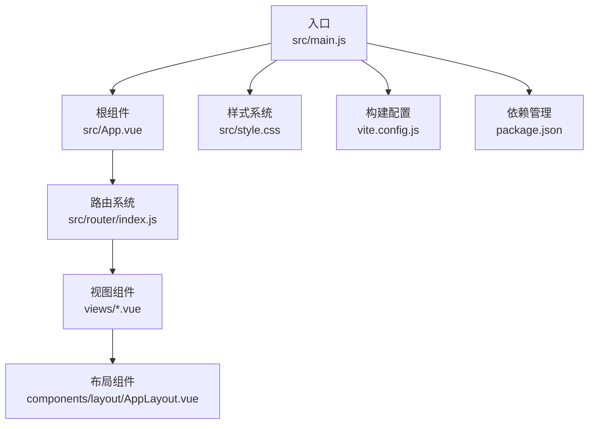

**图表来源**
- [main.js:1-11](file://src/main.js#L1-L11)
- [App.vue:1-24](file://src/App.vue#L1-L24)
- [router/index.js:1-61](file://src/router/index.js#L1-L61)
- [components/layout/AppLayout.vue:1-1094](file://src/components/layout/AppLayout.vue#L1-L1094)
- [style.css:1-308](file://src/style.css#L1-L308)
- [vite.config.js:1-27](file://vite.config.js#L1-L27)
- [package.json:1-28](file://package.json#L1-L28)

**章节来源**
- [main.js:1-11](file://src/main.js#L1-L11)
- [App.vue:1-24](file://src/App.vue#L1-L24)
- [router/index.js:1-61](file://src/router/index.js#L1-L61)
- [components/layout/AppLayout.vue:1-1094](file://src/components/layout/AppLayout.vue#L1-L1094)
- [style.css:1-308](file://src/style.css#L1-L308)
- [vite.config.js:1-27](file://vite.config.js#L1-L27)
- [package.json:1-28](file://package.json#L1-L28)

## 核心组件
- 应用入口与初始化：main.js 负责创建应用实例、注册插件（路由、状态管理）、挂载根组件。
- 根组件与布局：App.vue 根据路由元信息决定是否渲染布局；AppLayout.vue 提供统一导航、头部、侧边栏与模态交互。
- 路由系统：router/index.js 定义路由表与全局前置守卫，负责鉴权与标题设置。
- 视图组件：AuthView（登录/注册）、Dashboard（数据大屏）、HomePage（首页）、UserView（老人信息）、WorkerView（护工信息）。
- 样式系统：style.css 统一定义 CSS 变量、基础样式与响应式网格。

**章节来源**
- [main.js:1-11](file://src/main.js#L1-L11)
- [App.vue:1-24](file://src/App.vue#L1-L24)
- [router/index.js:1-61](file://src/router/index.js#L1-L61)
- [components/layout/AppLayout.vue:1-1094](file://src/components/layout/AppLayout.vue#L1-L1094)
- [views/AuthView.vue:1-380](file://src/views/AuthView.vue#L1-L380)
- [views/Dashboard.vue:1-967](file://src/views/Dashboard.vue#L1-L967)
- [views/HomePage.vue:1-970](file://src/views/HomePage.vue#L1-L970)
- [views/UserView.vue:1-520](file://src/views/UserView.vue#L1-L520)
- [views/WorkerView.vue:1-1384](file://src/views/WorkerView.vue#L1-L1384)
- [style.css:1-308](file://src/style.css#L1-L308)

## 架构总览
应用采用 MVVM 架构，ViewModel 层由 Vue 3 的 Composition API 实现，通过响应式数据驱动视图更新；路由层负责页面切换与鉴权；布局层提供一致的导航与交互体验；样式层通过 CSS 变量与网格系统实现主题化与响应式布局。

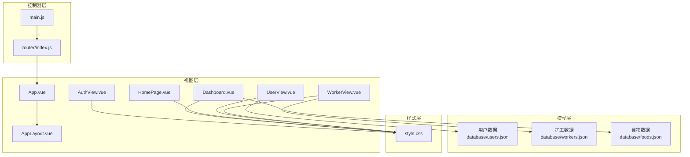

**图表来源**
- [main.js:1-11](file://src/main.js#L1-L11)
- [router/index.js:1-61](file://src/router/index.js#L1-L61)
- [App.vue:1-24](file://src/App.vue#L1-L24)
- [components/layout/AppLayout.vue:1-1094](file://src/components/layout/AppLayout.vue#L1-L1094)
- [views/AuthView.vue:1-380](file://src/views/AuthView.vue#L1-L380)
- [views/Dashboard.vue:1-967](file://src/views/Dashboard.vue#L1-L967)
- [views/HomePage.vue:1-970](file://src/views/HomePage.vue#L1-L970)
- [views/UserView.vue:1-520](file://src/views/UserView.vue#L1-L520)
- [views/WorkerView.vue:1-1384](file://src/views/WorkerView.vue#L1-L1384)
- [style.css:1-308](file://src/style.css#L1-L308)
- [users.json:1-582](file://database/users.json#L1-L582)
- [workers.json:1-442](file://database/workers.json#L1-L442)
- [foods.json:1-38](file://database/foods.json#L1-L38)

## 详细组件分析

### 应用入口与初始化（main.js）
- 创建应用实例并挂载根组件。
- 注册路由与状态管理插件，确保全局可用。
- 引入全局样式文件，保证主题一致性。

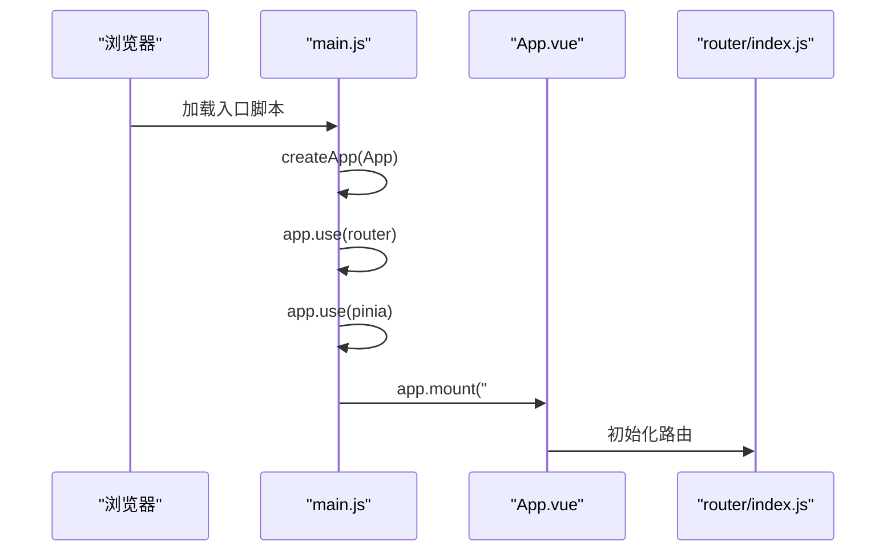

**图表来源**
- [main.js:1-11](file://src/main.js#L1-L11)
- [router/index.js:1-61](file://src/router/index.js#L1-L61)

**章节来源**
- [main.js:1-11](file://src/main.js#L1-L11)

### 根组件与布局（App.vue、AppLayout.vue）
- App.vue 根据路由元信息动态决定是否渲染布局，支持无布局页面（如登录页）。
- AppLayout.vue 提供统一导航、顶部栏、侧边菜单、移动端菜单、系统信息弹窗与登出流程。

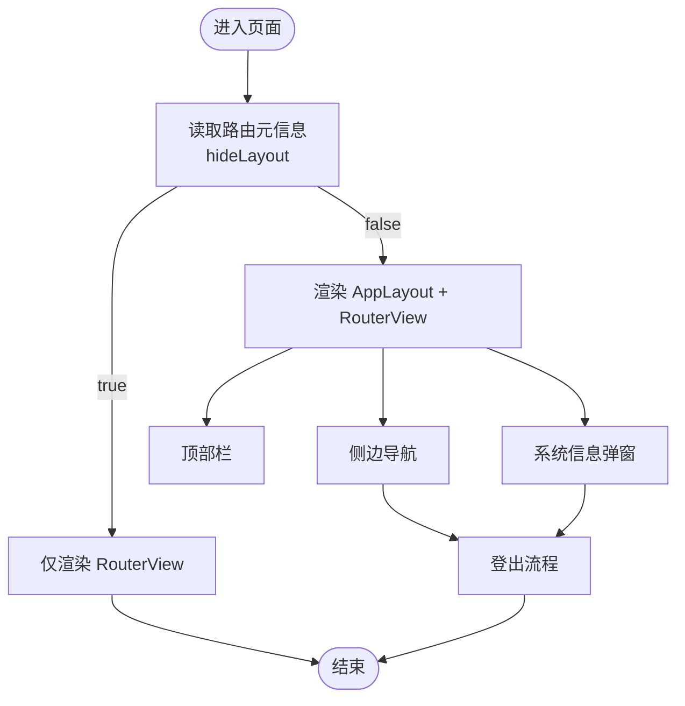

**图表来源**
- [App.vue:1-24](file://src/App.vue#L1-L24)
- [components/layout/AppLayout.vue:1-1094](file://src/components/layout/AppLayout.vue#L1-L1094)

**章节来源**
- [App.vue:1-24](file://src/App.vue#L1-L24)
- [components/layout/AppLayout.vue:1-1094](file://src/components/layout/AppLayout.vue#L1-L1094)

### 路由系统（router/index.js）
- 定义多条路由，包含登录、数据大屏、首页、老人信息、护工信息等。
- 全局前置守卫实现鉴权：未登录访问非登录页跳转登录；已登录访问登录页跳转大屏。
- 动态设置页面标题，提升用户体验。

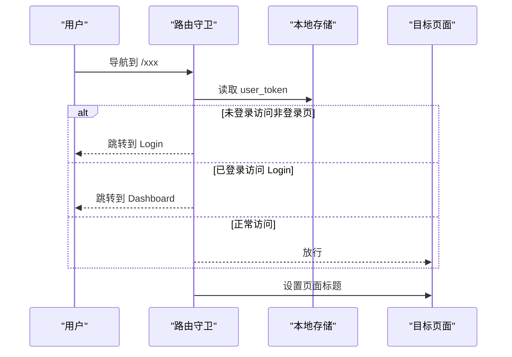

**图表来源**
- [router/index.js:1-61](file://src/router/index.js#L1-L61)

**章节来源**
- [router/index.js:1-61](file://src/router/index.js#L1-L61)

### 登录与认证（AuthView.vue）
- 提供登录/注册表单，使用 fetch 与后端 API 交互。
- 登录成功后写入 token 与用户信息，跳转首页；注册成功后切换到登录模式。
- 使用过渡动画与输入校验增强交互体验。

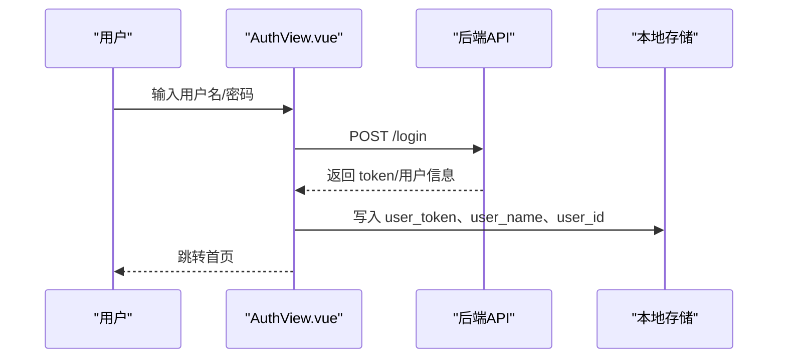

**图表来源**
- [views/AuthView.vue:1-380](file://src/views/AuthView.vue#L1-L380)

**章节来源**
- [views/AuthView.vue:1-380](file://src/views/AuthView.vue#L1-L380)

### 数据大屏与首页（Dashboard.vue、HomePage.vue）
- 两个页面共享相似的数据加载与可视化逻辑，使用 ECharts 展示趋势与分布。
- 通过响应式数据与补间动画实现数值过渡效果。
- 使用网格布局与卡片组件组织信息，支持响应式断点。

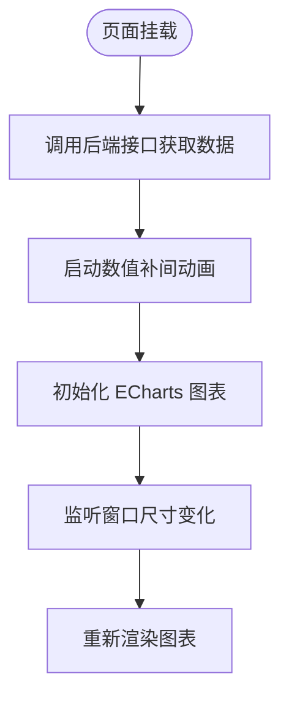

**图表来源**
- [views/Dashboard.vue:1-967](file://src/views/Dashboard.vue#L1-L967)
- [views/HomePage.vue:1-970](file://src/views/HomePage.vue#L1-L970)

**章节来源**
- [views/Dashboard.vue:1-967](file://src/views/Dashboard.vue#L1-L967)
- [views/HomePage.vue:1-970](file://src/views/HomePage.vue#L1-L970)

### 老人信息管理（UserView.vue）
- 支持搜索、筛选、新增、编辑、删除与详情查看。
- 表单验证与错误提示，使用模态弹窗承载复杂交互。
- 数据来源于后端 API，支持分页与响应式布局。

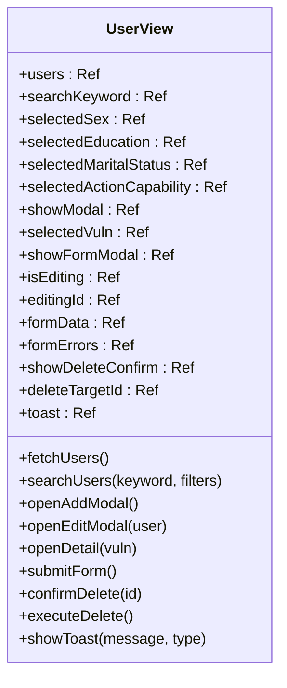

**图表来源**
- [views/UserView.vue:1-520](file://src/views/UserView.vue#L1-L520)

**章节来源**
- [views/UserView.vue:1-520](file://src/views/UserView.vue#L1-L520)

### 护工信息管理（WorkerView.vue）
- 类似 UserView 的 CRUD 流程，支持评分、政治面貌、教育程度等字段管理。
- 表单验证与加载状态控制，删除流程具备二次确认。
- 使用模态弹窗承载详情与表单，支持响应式布局。

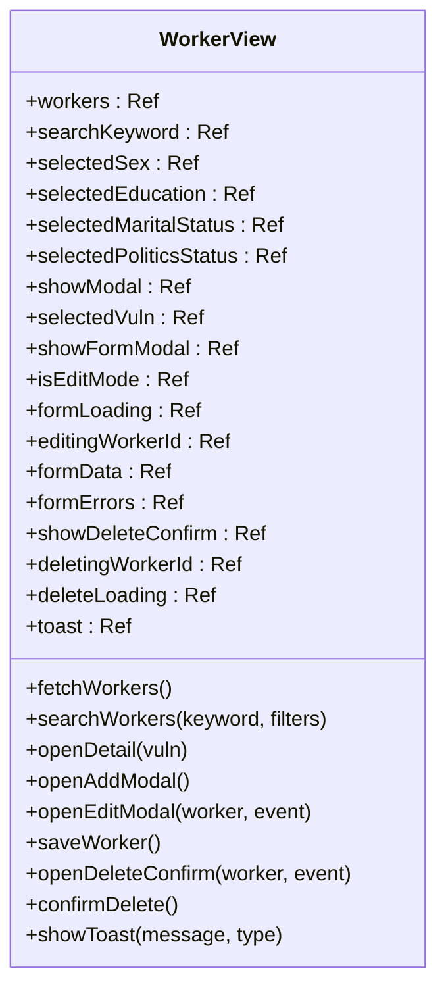

**图表来源**
- [views/WorkerView.vue:1-1384](file://src/views/WorkerView.vue#L1-L1384)

**章节来源**
- [views/WorkerView.vue:1-1384](file://src/views/WorkerView.vue#L1-L1384)

### 样式系统与响应式设计（style.css）
- 定义 CSS 变量（颜色、字体、背景、阴影等），统一主题风格。
- 基础样式与组件样式分离，使用 scoped 样式避免污染。
- 响应式网格系统与媒体查询，适配不同屏幕尺寸。

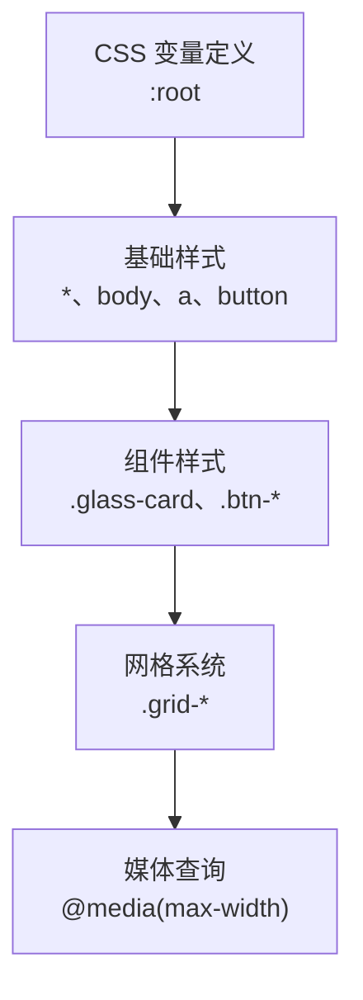

**图表来源**
- [style.css:1-308](file://src/style.css#L1-L308)

**章节来源**
- [style.css:1-308](file://src/style.css#L1-L308)

## 依赖关系分析
- 依赖管理：package.json 定义运行时依赖（Vue、Vue Router、Pinia、ECharts 等）与开发依赖（Vite、插件）。
- 构建配置：vite.config.js 配置插件、输出策略与单文件打包选项。
- 数据源：views 组件通过 fetch 访问后端 API，数据样例来自 database 目录下的 JSON 文件。

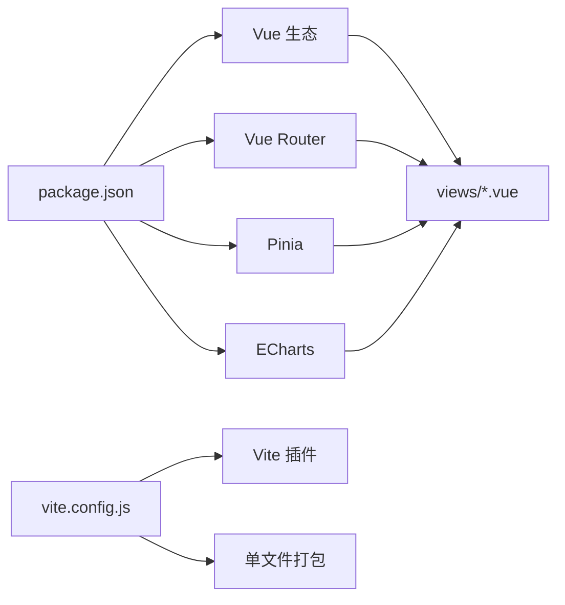

**图表来源**
- [package.json:1-28](file://package.json#L1-L28)
- [vite.config.js:1-27](file://vite.config.js#L1-L27)

**章节来源**
- [package.json:1-28](file://package.json#L1-L28)
- [vite.config.js:1-27](file://vite.config.js#L1-L27)

## 性能考虑
- 图表性能：ECharts 图表在页面挂载后初始化，resize 时自动重绘；建议在 onUnmounted 中清理定时器与事件监听，避免内存泄漏。
- 网络请求：统一使用 fetch，建议引入请求拦截与重试机制，减少重复请求。
- 样式体积：通过 CSS 变量集中管理，避免重复定义；合理拆分组件样式，减少全局污染。
- 构建优化：Vite 默认启用代码分割与预构建，可根据需要进一步优化产物体积与加载性能。

[本节为通用指导，无需特定文件引用]

## 故障排查指南
- 登录失败：检查 AuthView 中的 API 地址与返回字段，确认本地存储写入逻辑。
- 路由跳转异常：检查 router/index.js 的守卫逻辑与 meta.title 设置。
- 图表不显示：确认 ECharts 初始化时机与容器尺寸，确保在 nextTick 后执行。
- 样式异常：核对 style.css 中的 CSS 变量与组件 scoped 样式作用域。

**章节来源**
- [views/AuthView.vue:1-380](file://src/views/AuthView.vue#L1-L380)
- [router/index.js:1-61](file://src/router/index.js#L1-L61)
- [views/Dashboard.vue:1-967](file://src/views/Dashboard.vue#L1-L967)
- [style.css:1-308](file://src/style.css#L1-L308)

## 结论
本项目以 Vue 3 为核心，结合 Composition API、MVVM 架构与路由守卫，实现了清晰的页面结构与一致的交互体验。通过统一的样式系统与响应式布局，提升了跨设备的可用性。建议在后续迭代中完善状态管理、错误处理与性能监控，持续优化用户体验与开发效率。

[本节为总结性内容，无需特定文件引用]

## 附录

### MVVM 架构在项目中的实现要点
- Model：通过 fetch 与后端 API 交互，或使用 database 目录下的 JSON 数据进行演示。
- View：各视图组件负责模板渲染与用户交互。
- ViewModel：使用 Composition API 的响应式数据与计算属性，封装业务逻辑与生命周期钩子。

**章节来源**
- [views/Dashboard.vue:1-967](file://src/views/Dashboard.vue#L1-L967)
- [views/HomePage.vue:1-970](file://src/views/HomePage.vue#L1-L970)
- [views/UserView.vue:1-520](file://src/views/UserView.vue#L1-L520)
- [views/WorkerView.vue:1-1384](file://src/views/WorkerView.vue#L1-L1384)

### 组件通信机制
- Props 传递：父组件向子组件传递配置与数据。
- 事件触发：子组件通过 emit 向父组件传递用户操作与状态变更。
- provide/inject：适用于跨层级共享配置或服务（可在布局与子组件间传递导航状态）。

[本节为概念性说明，无需特定文件引用]

### 最佳实践建议
- 使用 Composition API 将逻辑按功能拆分，提升可维护性。
- 在路由守卫中集中处理鉴权与标题设置，避免分散逻辑。
- 组件样式尽量使用 scoped，配合 CSS 变量统一主题。
- 对图表与大数据渲染场景，注意内存释放与重绘优化。

[本节为通用指导，无需特定文件引用]