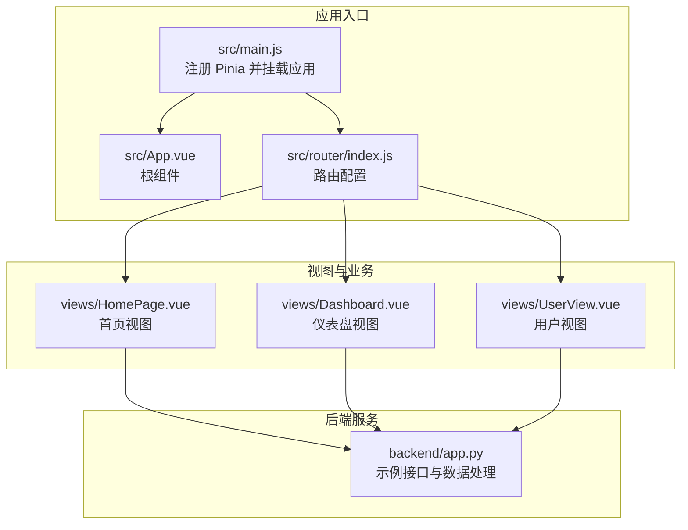
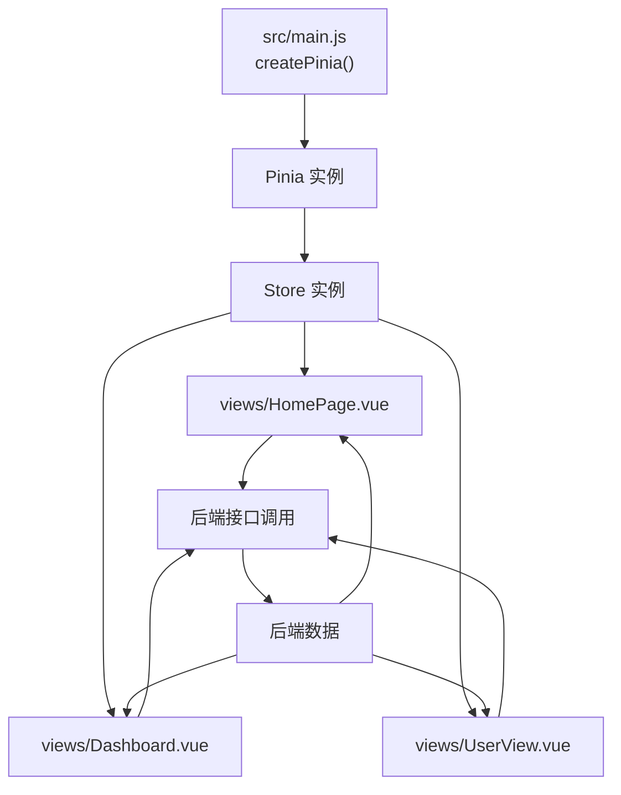
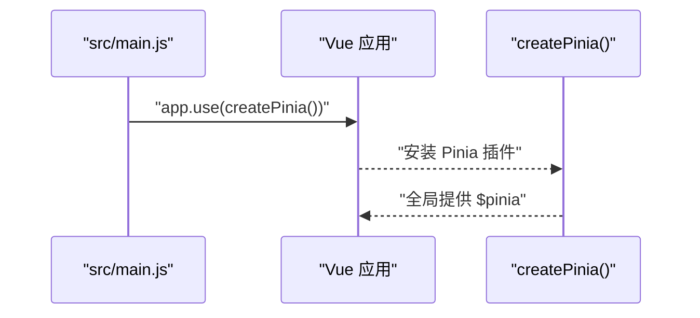
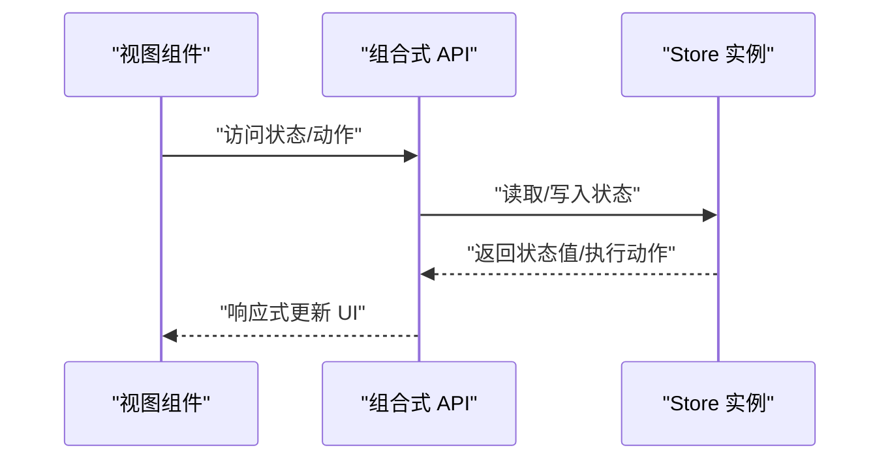
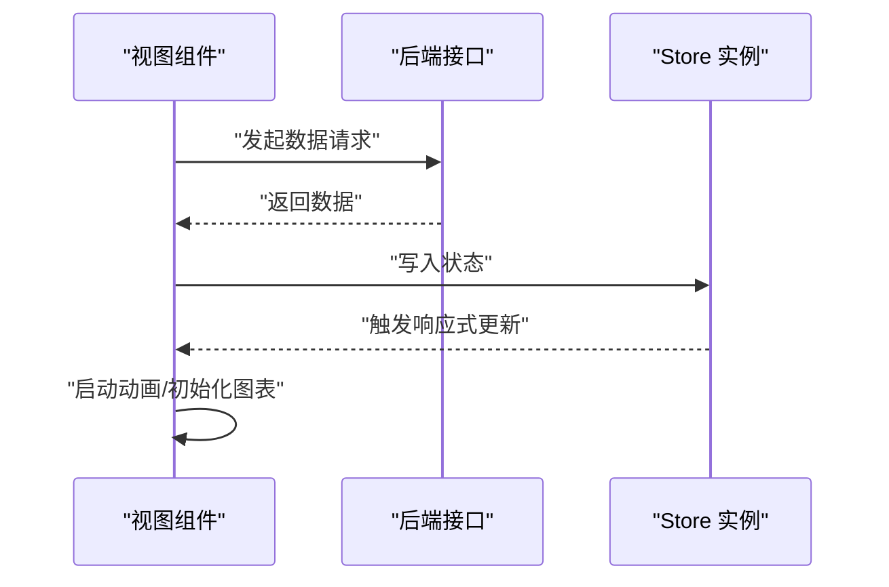
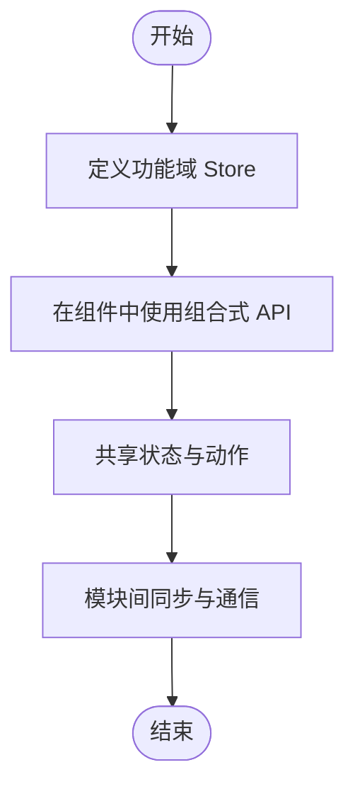
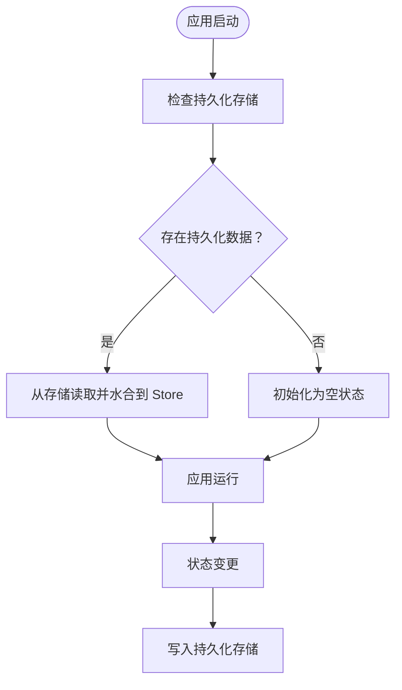
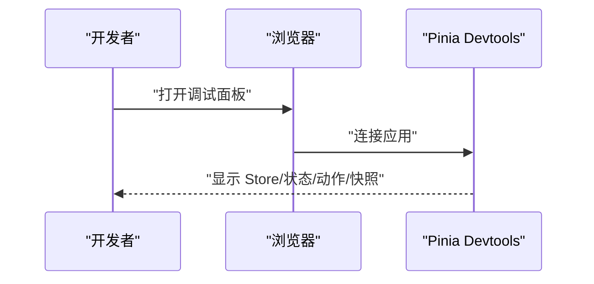
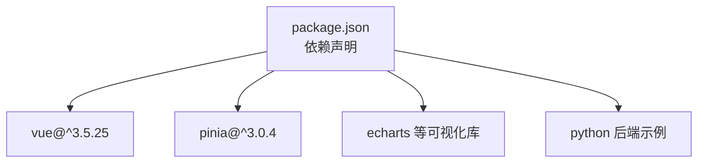

# 状态管理

<cite>
**本文引用的文件**
- [package.json](file://package.json)
- [main.js](file://src/main.js)
- [pinia 源码片段](file://node_modules/pinia/dist/pinia.esm-browser.js)
- [App.vue](file://src/App.vue)
- [router/index.js](file://src/router/index.js)
- [views/HomePage.vue](file://src/views/HomePage.vue)
- [views/Dashboard.vue](file://src/views/Dashboard.vue)
- [views/UserView.vue](file://src/views/UserView.vue)
- [backend/app.py](file://backend/app.py)
</cite>

## 目录
1. [简介](#简介)
2. [项目结构](#项目结构)
3. [核心组件](#核心组件)
4. [架构总览](#架构总览)
5. [详细组件分析](#详细组件分析)
6. [依赖分析](#依赖分析)
7. [性能考虑](#性能考虑)
8. [故障排查指南](#故障排查指南)
9. [结论](#结论)
10. [附录](#附录)

## 简介
本项目采用 Vue 3 推荐的状态管理方案 Pinia。仓库中已安装并启用 Pinia，应用入口在主程序中完成注入；同时项目集成了图表库与后端服务，用于展示与演示数据驱动的界面更新。本文档围绕 Pinia 的优势与特性，结合现有代码，系统讲解其在本项目中的落地方式，并给出模块化设计、响应式更新、持久化、调试与最佳实践建议。

## 项目结构
- 应用入口通过主程序完成 Pinia 注册与全局挂载，确保后续组件可按需使用状态管理能力。
- 视图层组件通过组合式 API 访问状态与动作，配合路由进行页面级数据加载与渲染。
- 后端提供示例接口，前端通过视图组件发起请求并更新本地状态，驱动图表与数字动画。

**图表来源**
- [main.js:1-11](file://src/main.js#L1-L11)
- [router/index.js](file://src/router/index.js)
- [views/HomePage.vue:178-204](file://src/views/HomePage.vue#L178-L204)
- [views/Dashboard.vue:181-206](file://src/views/Dashboard.vue#L181-L206)
- [views/UserView.vue:1-38](file://src/views/UserView.vue#L1-L38)
- [backend/app.py:44-78](file://backend/app.py#L44-L78)

**章节来源**
- [main.js:1-11](file://src/main.js#L1-L11)
- [router/index.js](file://src/router/index.js)

## 核心组件
- Pinia 实例与插件：在应用入口完成 Pinia 的创建与安装，使全局具备状态管理能力。
- 组合式 Store 使用：在视图组件中通过组合式 API 访问状态、计算属性与动作，实现数据驱动的 UI 更新。
- 路由与数据加载：路由守卫或组件生命周期中触发数据拉取，将后端返回的数据写入状态，驱动图表与动画。

**章节来源**
- [main.js:1-11](file://src/main.js#L1-L11)
- [views/HomePage.vue:178-204](file://src/views/HomePage.vue#L178-L204)
- [views/Dashboard.vue:181-206](file://src/views/Dashboard.vue#L181-L206)
- [views/UserView.vue:1-38](file://src/views/UserView.vue#L1-L38)

## 架构总览
下图展示了 Pinia 在本项目中的运行时关系：应用入口创建并注入 Pinia；视图组件通过组合式 API 访问 Store；后端服务提供数据源，视图组件在生命周期中拉取数据并更新状态，最终驱动 UI 变化。

**图表来源**
- [main.js:1-11](file://src/main.js#L1-L11)
- [views/HomePage.vue:178-204](file://src/views/HomePage.vue#L178-L204)
- [views/Dashboard.vue:181-206](file://src/views/Dashboard.vue#L181-L206)
- [views/UserView.vue:1-38](file://src/views/UserView.vue#L1-L38)
- [backend/app.py:44-78](file://backend/app.py#L44-L78)

## 详细组件分析

### Pinia 初始化与安装
- 在应用入口创建并安装 Pinia，确保全局可用。
- 该步骤是后续所有 Store 使用的前提。

**图表来源**
- [main.js:1-11](file://src/main.js#L1-L11)

**章节来源**
- [main.js:1-11](file://src/main.js#L1-L11)

### Store 定义与使用（组合式 API）
- Store 的定义与使用遵循组合式 API 模式：在组件中通过组合式 API 访问状态、计算属性与动作。
- 本项目未直接提供具体 Store 文件，但 Pinia 的组合式 API 已在运行时可用，可在组件中按需创建与使用 Store。

**图表来源**
- [pinia 源码片段:1226-1523](file://node_modules/pinia/dist/pinia.esm-browser.js#L1226-L1523)
- [pinia 源码片段:1798-1896](file://node_modules/pinia/dist/pinia.esm-browser.js#L1798-L1896)

**章节来源**
- [pinia 源码片段:1226-1523](file://node_modules/pinia/dist/pinia.esm-browser.js#L1226-L1523)
- [pinia 源码片段:1798-1896](file://node_modules/pinia/dist/pinia.esm-browser.js#L1798-L1896)

### 数据流与响应式更新
- 视图组件在生命周期中拉取后端数据，写入状态，触发响应式更新，进而驱动图表与动画。
- 以首页与仪表盘为例，组件在加载完成后启动数字动画与图表初始化。

**图表来源**
- [views/HomePage.vue:178-204](file://src/views/HomePage.vue#L178-L204)
- [views/Dashboard.vue:181-206](file://src/views/Dashboard.vue#L181-L206)
- [backend/app.py:44-78](file://backend/app.py#L44-L78)

**章节来源**
- [views/HomePage.vue:178-204](file://src/views/HomePage.vue#L178-L204)
- [views/Dashboard.vue:181-206](file://src/views/Dashboard.vue#L181-L206)
- [backend/app.py:44-78](file://backend/app.py#L44-L78)

### 模块化状态管理与模块间通信
- 本项目未显式划分多个独立的 Store 文件，但可通过组合式 API 在不同组件中共享与复用状态。
- 若未来扩展，建议按功能域拆分 Store（如用户、数据统计等），并通过组件间通信或共享状态实现模块间协作。

[此图为概念性流程图，不直接映射具体源码文件]

### 状态持久化（localStorage/sessionStorage/IndexedDB）
- 本项目未实现持久化逻辑。
- 如需持久化，可在应用入口或 Store 中引入持久化插件或自定义序列化策略，将状态写入 localStorage 或 IndexedDB，并在应用启动时进行水合（hydrate）。

[此图为概念性流程图，不直接映射具体源码文件]

### 开发工具与调试
- Pinia 内置开发工具支持：安装后可在浏览器中查看 Store 结构、状态快照与变更历史，便于时间旅行调试与性能分析。
- 建议在开发阶段开启调试工具，结合组件日志定位问题。

[此图为概念性流程图，不直接映射具体源码文件]

## 依赖分析
- 依赖项中包含 Pinia 与 Vue，表明本项目基于 Vue 3 与 Pinia 进行状态管理。
- 项目还包含图表库与后端示例，用于演示数据驱动的可视化与接口交互。

**图表来源**
- [package.json:11-21](file://package.json#L11-L21)

**章节来源**
- [package.json:11-21](file://package.json#L11-L21)

## 性能考虑
- 响应式更新：Pinia 基于 Vue 3 的响应式系统，自动追踪依赖，减少不必要的重渲染。
- 批量更新：在一次事件循环内对状态的多次修改会被合并，降低渲染成本。
- 持久化策略：避免频繁写入大对象，建议只持久化必要字段，并在应用启动时进行增量水合。
- 图表与动画：在组件中延迟初始化图表与动画，避免阻塞首屏渲染。

[本节为通用性能指导，不直接分析具体源码文件]

## 故障排查指南
- Store 无法访问：确认应用入口已正确安装 Pinia，且组件在组合式 API 上下文中使用。
- 数据未更新：检查组件生命周期中的数据拉取逻辑与状态写入路径，确保动作被正确调用。
- 后端接口异常：核对后端接口地址与返回格式，确保前端解析无误。

**章节来源**
- [main.js:1-11](file://src/main.js#L1-L11)
- [views/HomePage.vue:178-204](file://src/views/HomePage.vue#L178-L204)
- [views/Dashboard.vue:181-206](file://src/views/Dashboard.vue#L181-L206)
- [views/UserView.vue:1-38](file://src/views/UserView.vue#L1-L38)
- [backend/app.py:44-78](file://backend/app.py#L44-L78)

## 结论
本项目已正确接入 Pinia，为后续的状态管理与模块化演进奠定了基础。建议在实际开发中：
- 明确状态设计边界，按功能域拆分 Store；
- 利用组合式 API 提升可测试性与可维护性；
- 引入必要的持久化与调试工具，提升开发效率；
- 遵循性能优化与团队协作规范，保障长期可维护性。

[本节为总结性内容，不直接分析具体源码文件]

## 附录
- 关键文件路径与职责概览
  - [src/main.js:1-11](file://src/main.js#L1-L11)：应用入口，注册并安装 Pinia
  - [src/App.vue](file://src/App.vue)：根组件
  - [src/router/index.js](file://src/router/index.js)：路由配置
  - [src/views/HomePage.vue:178-204](file://src/views/HomePage.vue#L178-L204)：首页数据加载与动画
  - [src/views/Dashboard.vue:181-206](file://src/views/Dashboard.vue#L181-L206)：仪表盘数据加载与动画
  - [src/views/UserView.vue:1-38](file://src/views/UserView.vue#L1-L38)：用户列表数据加载
  - [backend/app.py:44-78](file://backend/app.py#L44-L78)：后端接口与数据处理

[本节为附录性内容，不直接分析具体源码文件]