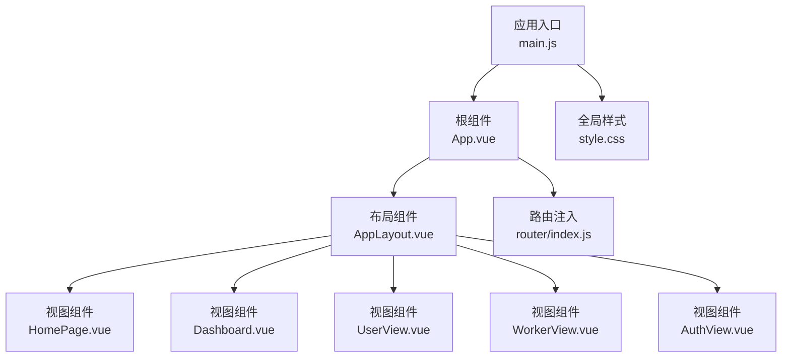
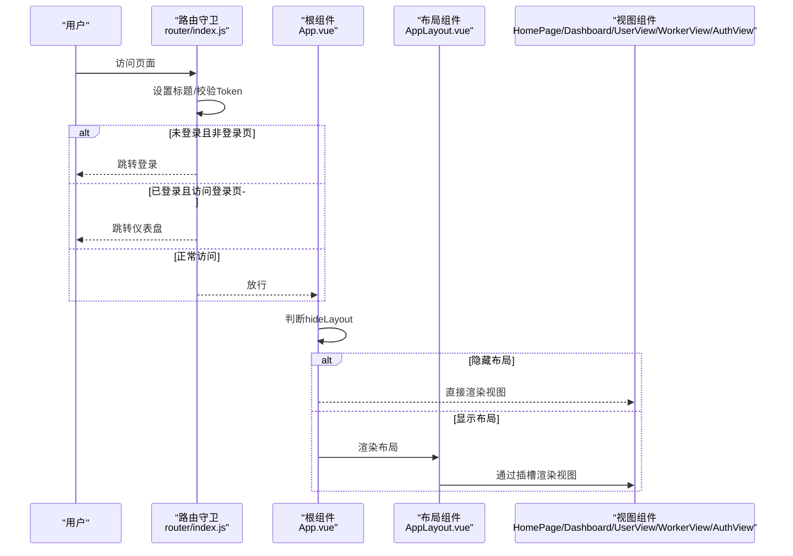
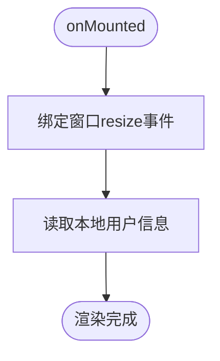
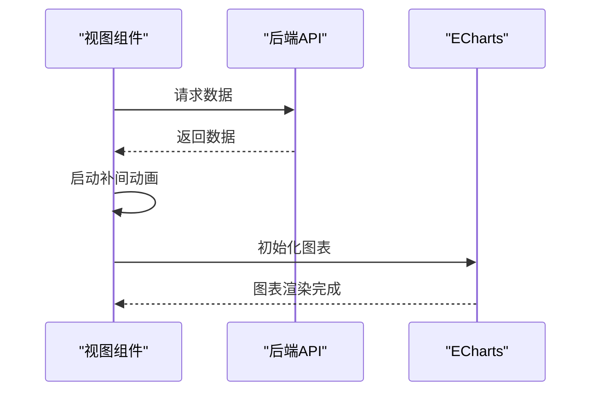
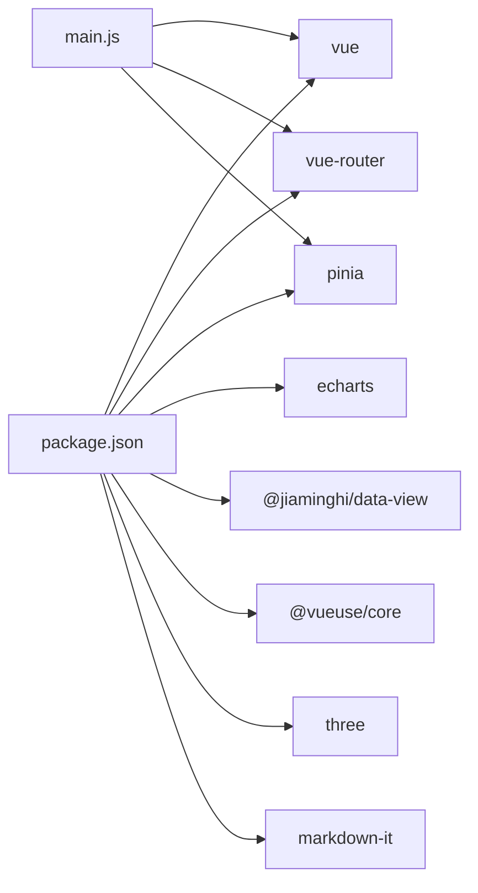

# 组件系统

<cite>
**本文引用的文件**
- [App.vue](file://src/App.vue)
- [AppLayout.vue](file://src/components/layout/AppLayout.vue)
- [main.js](file://src/main.js)
- [router/index.js](file://src/router/index.js)
- [style.css](file://src/style.css)
- [HomePage.vue](file://src/views/HomePage.vue)
- [Dashboard.vue](file://src/views/Dashboard.vue)
- [AuthView.vue](file://src/views/AuthView.vue)
- [UserView.vue](file://src/views/UserView.vue)
- [WorkerView.vue](file://src/views/WorkerView.vue)
- [package.json](file://package.json)
</cite>

## 目录
1. [简介](#简介)
2. [项目结构](#项目结构)
3. [核心组件](#核心组件)
4. [架构总览](#架构总览)
5. [组件详解](#组件详解)
6. [依赖关系分析](#依赖关系分析)
7. [性能与渲染机制](#性能与渲染机制)
8. [故障排查指南](#故障排查指南)
9. [结论](#结论)
10. [附录](#附录)

## 简介
本技术文档围绕 Vue.js 组件系统进行深入解析，重点覆盖：
- 组件定义方式与 Composition API 使用模式
- AppLayout.vue 主布局组件的架构设计（导航菜单、侧边栏布局、响应式适配）
- 组件间通信机制（props、事件、provide/inject、跨层级通信）
- 组件复用性设计原则（可配置、可扩展、可测试）
- 开发最佳实践（命名规范、代码组织、性能优化）
- 渲染机制（虚拟 DOM、diff 策略、更新策略）
- 面向初学者的入门指导与面向高级开发者的架构深度分析

## 项目结构
该项目采用基于功能模块的目录组织方式，前端入口集中于 src 目录，包含应用根组件、布局组件、视图组件、路由与全局样式等。整体结构清晰，便于按功能域扩展与维护。

**图表来源**
- [main.js:1-11](file://src/main.js#L1-L11)
- [App.vue:1-24](file://src/App.vue#L1-L24)
- [router/index.js:1-61](file://src/router/index.js#L1-L61)
- [style.css:1-308](file://src/style.css#L1-L308)

**章节来源**
- [main.js:1-11](file://src/main.js#L1-L11)
- [App.vue:1-24](file://src/App.vue#L1-L24)
- [router/index.js:1-61](file://src/router/index.js#L1-L61)
- [style.css:1-308](file://src/style.css#L1-L308)

## 核心组件
- 应用根组件 App.vue：负责根据路由元信息决定是否包裹布局，并注入全局样式。
- 主布局组件 AppLayout.vue：提供统一的导航、侧边栏、顶部栏、内容区与弹窗交互，支持移动端响应式。
- 视图组件：HomePage.vue、Dashboard.vue、UserView.vue、WorkerView.vue、AuthView.vue，分别承载业务页面与交互逻辑。
- 路由与状态：router/index.js 提供路由配置与前置守卫；全局样式 style.css 提供主题变量与通用样式。

**章节来源**
- [App.vue:1-24](file://src/App.vue#L1-L24)
- [AppLayout.vue:1-338](file://src/components/layout/AppLayout.vue#L1-L338)
- [HomePage.vue:1-341](file://src/views/HomePage.vue#L1-L341)
- [Dashboard.vue:1-341](file://src/views/Dashboard.vue#L1-L341)
- [UserView.vue:1-520](file://src/views/UserView.vue#L1-L520)
- [WorkerView.vue:1-800](file://src/views/WorkerView.vue#L1-L800)
- [AuthView.vue:1-380](file://src/views/AuthView.vue#L1-L380)
- [router/index.js:1-61](file://src/router/index.js#L1-L61)
- [style.css:1-308](file://src/style.css#L1-L308)

## 架构总览
应用采用“根组件 + 布局组件 + 视图组件”的分层架构。根组件根据路由元信息动态选择是否渲染布局；布局组件作为页面骨架，内部通过插槽承载具体视图内容；路由守卫负责鉴权与标题设置；全局样式提供一致的主题与动画。

**图表来源**
- [router/index.js:42-59](file://src/router/index.js#L42-L59)
- [App.vue:8-19](file://src/App.vue#L8-L19)
- [AppLayout.vue:296-299](file://src/components/layout/AppLayout.vue#L296-L299)

**章节来源**
- [router/index.js:1-61](file://src/router/index.js#L1-L61)
- [App.vue:1-24](file://src/App.vue#L1-L24)
- [AppLayout.vue:1-338](file://src/components/layout/AppLayout.vue#L1-L338)

## 组件详解

### App.vue：根组件与布局选择
- 使用 Composition API 获取路由实例，计算当前页面是否隐藏布局。
- 通过条件渲染在需要时直接渲染 RouterView，或包裹 AppLayout 以启用统一布局。

**章节来源**
- [App.vue:1-24](file://src/App.vue#L1-L24)

### AppLayout.vue：主布局组件
- 状态与行为
  - 响应式判断移动端宽度，控制侧边栏与遮罩显示。
  - 菜单数据结构化，支持图标、名称、路径与子项。
  - 当前路径计算与激活态判定，动态生成页面标题。
  - 用户信息本地存储读取与登出流程。
  - 弹窗状态管理与模态交互。
- 结构与样式
  - 侧边栏导航、顶部栏、主内容区与遮罩层。
  - 插槽承载视图内容，实现布局与视图解耦。
  - 移动端媒体查询实现侧滑菜单与遮罩层。
- 生命周期与事件
  - onMounted 中监听窗口 resize、读取用户信息。
  - 提供跳转、打开/关闭弹窗、登出等方法。

**图表来源**
- [AppLayout.vue:123-128](file://src/components/layout/AppLayout.vue#L123-L128)

**章节来源**
- [AppLayout.vue:1-338](file://src/components/layout/AppLayout.vue#L1-L338)

### 视图组件：HomePage.vue 与 Dashboard.vue
- 数据与动画
  - 通过 fetch 获取后端数据，初始化响应式统计对象。
  - 使用 requestAnimationFrame 实现纯 JS 补间动画，提升性能与流畅度。
  - 使用 ECharts 初始化折线图与饼图，处理窗口 resize 事件。
- 生命周期
  - onMounted 拉取数据、启动动画与图表初始化。
  - onUnmounted 清理定时器，避免内存泄漏。
- 结构与样式
  - 响应式网格布局，卡片化展示数据与图表。
  - 滚动列表动画，鼠标悬停暂停滚动。

**图表来源**
- [HomePage.vue:173-204](file://src/views/HomePage.vue#L173-L204)
- [Dashboard.vue:173-204](file://src/views/Dashboard.vue#L173-L204)

**章节来源**
- [HomePage.vue:1-341](file://src/views/HomePage.vue#L1-L341)
- [Dashboard.vue:1-341](file://src/views/Dashboard.vue#L1-L341)

### 视图组件：UserView.vue
- 功能特性
  - 多维度搜索与筛选（姓名、性别、教育、婚姻、行动能力等）。
  - 新增/编辑/删除老人信息，含表单校验与错误提示。
  - 详情弹窗、确认删除弹窗、Toast 提示。
- 数据流
  - 通过 fetch 获取数据，computed 进行过滤与展示。
  - 表单提交时构建 payload 并调用后端接口。
- 样式与交互
  - 响应式网格卡片布局，风险等级标签，悬浮效果与阴影。
  - 表单弹窗多列栅格布局，错误高亮与必填标记。

**章节来源**
- [UserView.vue:1-520](file://src/views/UserView.vue#L1-L520)

### 视图组件：WorkerView.vue
- 功能特性
  - 类似 UserView 的搜索、筛选、弹窗交互与 CRUD。
  - 新增/编辑护工信息，含评分校验与保存流程。
  - 详情弹窗、确认删除弹窗、Toast 提示。
- 数据流
  - 通过 fetch 获取数据，computed 进行过滤与展示。
  - 表单提交时构建 payload 并调用后端接口。
- 样式与交互
  - 响应式网格卡片布局，标签与评分展示。
  - 表单弹窗多列栅格布局，错误高亮与禁用状态。

**章节来源**
- [WorkerView.vue:1-800](file://src/views/WorkerView.vue#L1-L800)

### 视图组件：AuthView.vue
- 功能特性
  - 登录/注册切换，表单输入与提交。
  - 登录成功写入 Token、用户名与 ID，跳转首页。
  - 注册成功提示并切换到登录模式。
- 样式与交互
  - 背景光晕、玻璃卡片、扫描线动画。
  - 切换动画与输入框聚焦高亮。

**章节来源**
- [AuthView.vue:1-380](file://src/views/AuthView.vue#L1-L380)

### 路由与鉴权：router/index.js
- 路由配置
  - 登录页、仪表盘、首页、老人信息、护工信息等页面。
  - 登录页与仪表盘 meta 中设置 hideLayout 与标题。
- 路由守卫
  - 设置页面标题。
  - 校验本地 Token，未登录跳转登录，已登录访问登录页跳转仪表盘。

**章节来源**
- [router/index.js:1-61](file://src/router/index.js#L1-L61)

### 全局样式：style.css
- 主题变量与字体
  - 定义主色、辅助色、文本色、背景色与字体族。
- 通用组件样式
  - 按钮、输入框、滚动条、卡片等通用样式。
- 动画与过渡
  - 脉冲、闪光、滑入、淡入、缩放等动画。
- 响应式网格
  - 基于断点的网格列数调整。

**章节来源**
- [style.css:1-308](file://src/style.css#L1-L308)

## 依赖关系分析
- 运行时依赖
  - vue、vue-router、pinia、echarts、@jiaminghi/data-view、@vueuse/core、three、markdown-it。
- 构建工具
  - vite、@vitejs/plugin-vue、vite-plugin-singlefile。
- 应用装配
  - main.js 创建应用实例，注册路由与状态管理，挂载根组件。

**图表来源**
- [package.json:11-26](file://package.json#L11-L26)
- [main.js:1-11](file://src/main.js#L1-L11)

**章节来源**
- [package.json:1-28](file://package.json#L1-L28)
- [main.js:1-11](file://src/main.js#L1-L11)

## 性能与渲染机制
- 组件渲染与更新
  - 使用 Composition API 管理响应式状态，减少不必要的重渲染。
  - 在视图组件中使用 nextTick 确保 DOM 更新后再初始化图表，避免闪烁。
- 动画与性能
  - 使用 requestAnimationFrame 实现补间动画，避免主线程阻塞。
  - 图表 resize 事件绑定在窗口上，确保图表自适应。
- 生命周期与资源释放
  - 在 onUnmounted 中清理定时器与事件监听，防止内存泄漏。
- 响应式与媒体查询
  - 布局组件通过窗口 resize 事件与媒体查询实现移动端适配。

**章节来源**
- [HomePage.vue:173-204](file://src/views/HomePage.vue#L173-L204)
- [Dashboard.vue:173-204](file://src/views/Dashboard.vue#L173-L204)
- [AppLayout.vue:123-128](file://src/components/layout/AppLayout.vue#L123-L128)

## 故障排查指南
- 登录与鉴权
  - 若访问非登录页被重定向到登录页，检查本地 Token 是否存在。
  - 登录成功后需确保 Token、用户名与 ID 写入本地存储。
- 路由跳转异常
  - 检查路由守卫逻辑与 meta 配置，确认 hideLayout 与标题设置。
- 图表不显示或尺寸异常
  - 确认 DOM 已渲染再初始化图表，使用 nextTick。
  - 确保窗口 resize 事件正确绑定与解绑。
- 动画卡顿
  - 检查 requestAnimationFrame 的使用是否正确，避免在动画回调中做重型计算。
- 移动端布局问题
  - 检查媒体查询断点与侧边栏 transform 属性。

**章节来源**
- [router/index.js:42-59](file://src/router/index.js#L42-L59)
- [AuthView.vue:23-46](file://src/views/AuthView.vue#L23-L46)
- [HomePage.vue:196-200](file://src/views/HomePage.vue#L196-L200)
- [Dashboard.vue:196-200](file://src/views/Dashboard.vue#L196-L200)

## 结论
本项目以清晰的分层架构与 Composition API 的合理使用，实现了布局与视图的解耦、数据与视图的分离、以及良好的响应式与可维护性。通过路由守卫与本地存储实现基础鉴权，配合 ECharts 与动画库提供丰富的可视化体验。建议在后续迭代中进一步引入单元测试与组件测试，完善错误边界与加载状态，持续优化首屏性能与可访问性。

## 附录

### 组件通信机制
- Props 传递
  - 布局组件通过插槽承载视图内容，实现父子组件的隐式通信。
- 事件发射
  - 组件内部通过方法触发事件（如打开/关闭弹窗、登出），父组件通过 v-model 或事件监听处理。
- provide/inject
  - 当前代码未使用 provide/inject，可在跨层级共享状态时考虑引入。
- 跨层级通信
  - 使用 Pinia 管理全局状态，视图组件通过 store 访问与修改状态，实现跨层级通信。

**章节来源**
- [AppLayout.vue:296-299](file://src/components/layout/AppLayout.vue#L296-L299)
- [main.js:7-9](file://src/main.js#L7-L9)

### 复用性设计原则
- 可配置性
  - 菜单数据结构化，便于动态扩展与配置。
- 可扩展性
  - 布局组件通过插槽与类名体系，支持新视图快速接入。
- 可测试性
  - 将副作用（如 fetch、事件监听）集中在生命周期钩子中，便于隔离与模拟。

**章节来源**
- [AppLayout.vue:75-113](file://src/components/layout/AppLayout.vue#L75-L113)

### 开发最佳实践
- 命名规范
  - 文件与组件命名采用 PascalCase，视图组件以 View 结尾，布局组件以 Layout 结尾。
- 代码组织
  - 将样式与逻辑分离，公共样式集中于全局样式文件。
- 性能优化
  - 使用 Composition API 的响应式 API 管理状态，避免重复渲染。
  - 使用 requestAnimationFrame 与 nextTick 优化动画与图表初始化。

**章节来源**
- [style.css:1-308](file://src/style.css#L1-L308)
- [HomePage.vue:29-45](file://src/views/HomePage.vue#L29-L45)
- [Dashboard.vue:29-45](file://src/views/Dashboard.vue#L29-L45)