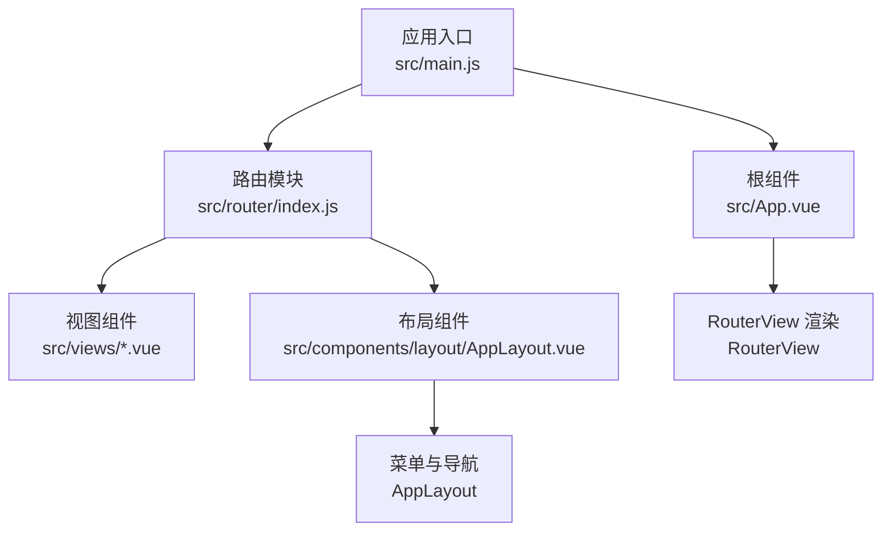
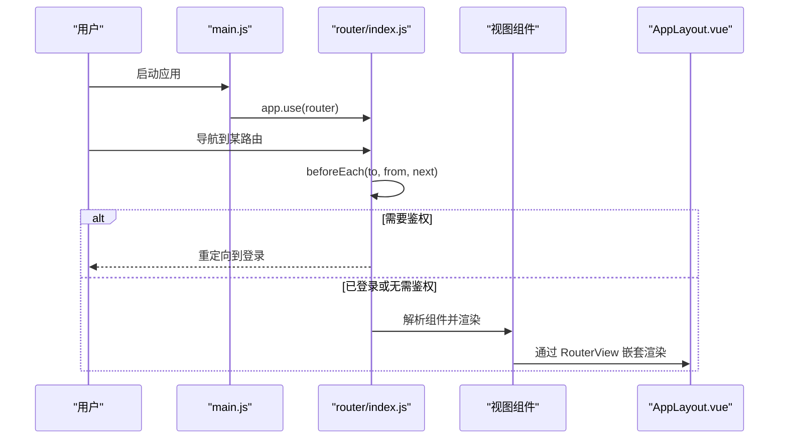
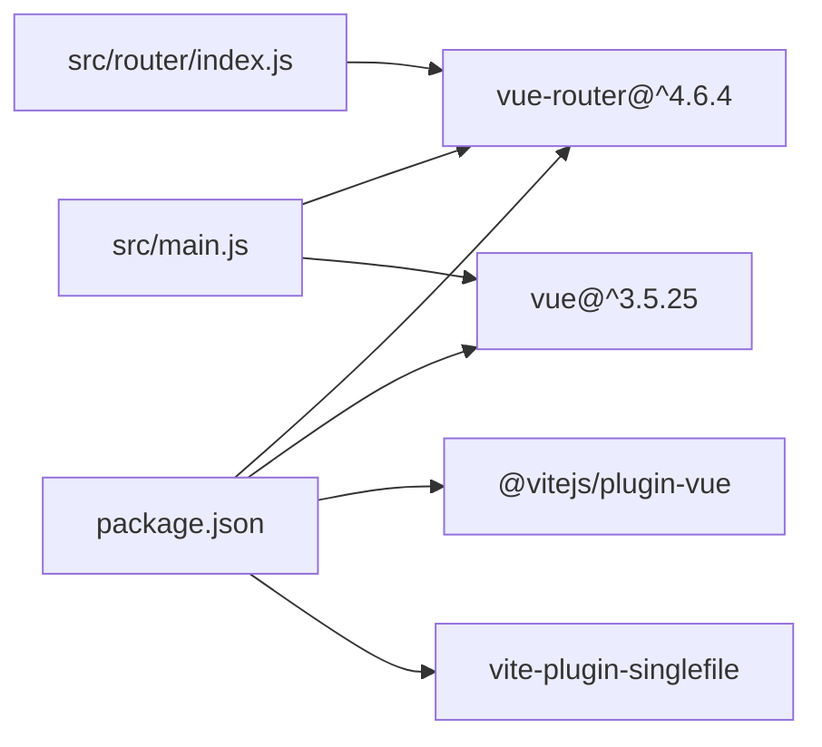

# 路由系统

<cite>
**本文引用的文件**
- [src/router/index.js](file://src/router/index.js)
- [src/main.js](file://src/main.js)
- [src/App.vue](file://src/App.vue)
- [src/components/layout/AppLayout.vue](file://src/components/layout/AppLayout.vue)
- [src/views/AuthView.vue](file://src/views/AuthView.vue)
- [src/views/Dashboard.vue](file://src/views/Dashboard.vue)
- [src/views/HomePage.vue](file://src/views/HomePage.vue)
- [src/views/UserView.vue](file://src/views/UserView.vue)
- [src/views/WorkerView.vue](file://src/views/WorkerView.vue)
- [package.json](file://package.json)
- [vite.config.js](file://vite.config.js)
</cite>

## 目录
1. [简介](#简介)
2. [项目结构](#项目结构)
3. [核心组件](#核心组件)
4. [架构总览](#架构总览)
5. [详细组件分析](#详细组件分析)
6. [依赖关系分析](#依赖关系分析)
7. [性能考量](#性能考量)
8. [故障排查指南](#故障排查指南)
9. [结论](#结论)
10. [附录](#附录)

## 简介
本文件面向 Vue Router 路由系统，基于仓库现有实现进行技术文档梳理与最佳实践建议。重点覆盖：
- 路由配置组织：路由定义、嵌套路由与动态路由参数的现状与扩展建议
- 路由守卫：全局前置守卫、路由独享守卫与组件内守卫的实现与建议
- 导航解析流程：解析顺序、异步解析与错误处理
- 路由懒加载：代码分割、预加载策略与性能优化
- 路由元信息：权限控制、面包屑生成与页面标题管理
- 历史模式：hash 模式与 history 模式的对比与选择
- 最佳实践：URL 设计规范、SEO 优化与用户体验

## 项目结构
本项目采用基于文件的路由组织方式，路由定义集中在路由器入口文件中，并通过应用入口挂载到根实例上。布局与页面视图分别位于独立的组件与视图文件中，配合全局前置守卫实现鉴权与标题管理。

图表来源
- [src/main.js:1-11](file://src/main.js#L1-L11)
- [src/router/index.js:1-61](file://src/router/index.js#L1-L61)
- [src/App.vue:1-24](file://src/App.vue#L1-L24)
- [src/components/layout/AppLayout.vue:1-100](file://src/components/layout/AppLayout.vue#L1-L100)

章节来源
- [src/main.js:1-11](file://src/main.js#L1-L11)
- [src/router/index.js:1-61](file://src/router/index.js#L1-L61)
- [src/App.vue:1-24](file://src/App.vue#L1-L24)

## 核心组件
- 路由器与路由表：集中定义路由与历史模式，提供全局前置守卫
- 应用入口：安装路由插件并挂载应用
- 根组件：根据路由元信息决定是否渲染布局
- 布局组件：提供菜单、标题与退出登录等交互
- 视图组件：各业务页面，包含页面级的导航与数据交互

章节来源
- [src/router/index.js:1-61](file://src/router/index.js#L1-L61)
- [src/main.js:1-11](file://src/main.js#L1-L11)
- [src/App.vue:1-24](file://src/App.vue#L1-L24)
- [src/components/layout/AppLayout.vue:1-100](file://src/components/layout/AppLayout.vue#L1-L100)

## 架构总览
下图展示了从应用启动到页面渲染的关键交互链路，以及路由守卫在导航过程中的作用点。

图表来源
- [src/main.js:1-11](file://src/main.js#L1-L11)
- [src/router/index.js:42-59](file://src/router/index.js#L42-L59)
- [src/App.vue:12-20](file://src/App.vue#L12-L20)
- [src/components/layout/AppLayout.vue:1-100](file://src/components/layout/AppLayout.vue#L1-L100)

## 详细组件分析

### 路由器与路由表
- 历史模式：使用 hash 模式，便于静态部署与兼容性
- 路由定义：集中于数组，包含登录、仪表盘、首页、用户信息、护工信息等页面
- 路由懒加载：通过动态导入实现按需加载视图组件
- 元信息：在路由项中定义标题与布局控制字段
- 全局前置守卫：统一设置页面标题、鉴权拦截与登录页跳转

章节来源
- [src/router/index.js:1-61](file://src/router/index.js#L1-L61)

### 全局前置守卫与鉴权
- 标题设置：根据路由元信息动态设置 document.title
- 鉴权逻辑：检测本地 Token，未登录访问非登录页则重定向；已登录访问登录页则重定向到仪表盘
- 可扩展点：可在此处加入权限校验、白名单放行、登录态刷新等

章节来源
- [src/router/index.js:42-59](file://src/router/index.js#L42-L59)

### 根组件与布局控制
- 根组件根据路由元信息判断是否渲染布局，支持“隐藏布局”的页面（如登录页）
- 布局组件提供菜单、标题与退出登录等交互，菜单项与路由路径保持一致

章节来源
- [src/App.vue:1-24](file://src/App.vue#L1-L24)
- [src/components/layout/AppLayout.vue:75-113](file://src/components/layout/AppLayout.vue#L75-L113)

### 视图组件与页面交互
- 登录页：负责用户认证与 Token 存储，并在成功后跳转首页
- 仪表盘与首页：展示数据与图表，包含生命周期与资源清理
- 用户与护工信息页：提供列表、搜索、筛选、新增/编辑/删除与表单校验

章节来源
- [src/views/AuthView.vue:1-72](file://src/views/AuthView.vue#L1-L72)
- [src/views/Dashboard.vue:1-210](file://src/views/Dashboard.vue#L1-L210)
- [src/views/HomePage.vue:1-210](file://src/views/HomePage.vue#L1-L210)
- [src/views/UserView.vue:1-225](file://src/views/UserView.vue#L1-L225)
- [src/views/WorkerView.vue:1-380](file://src/views/WorkerView.vue#L1-L380)

### 导航解析流程与错误处理
- 解析顺序：全局前置守卫 -> 路由独享守卫（若存在）-> 组件内守卫（若存在）-> 渲染目标视图
- 异步解析：动态导入组件、API 请求、图表初始化等均属于异步流程
- 错误处理：视图组件中对网络请求与图表初始化进行 try/catch 与资源清理

章节来源
- [src/router/index.js:42-59](file://src/router/index.js#L42-L59)
- [src/views/Dashboard.vue:173-204](file://src/views/Dashboard.vue#L173-L204)
- [src/views/HomePage.vue:173-204](file://src/views/HomePage.vue#L173-L204)
- [src/views/UserView.vue:34-43](file://src/views/UserView.vue#L34-L43)
- [src/views/WorkerView.vue:97-106](file://src/views/WorkerView.vue#L97-L106)

### 路由懒加载与性能优化
- 代码分割：通过动态导入实现按需加载，减少首屏体积
- 构建配置：Vite 配置中未启用手动分块，保持默认打包策略
- 预加载策略：可在路由级别结合 keep-alive 与缓存策略进一步优化

章节来源
- [src/router/index.js:8, 14, 20, 26, 32:8-34](file://src/router/index.js#L8-L34)
- [vite.config.js:14-26](file://vite.config.js#L14-L26)

### 路由元信息与权限控制
- 元信息用途：页面标题、布局控制
- 权限控制：当前通过全局前置守卫基于 Token 实现简单鉴权，可扩展为基于角色/资源的细粒度权限

章节来源
- [src/router/index.js:9, 15, 21, 27, 33:9-34](file://src/router/index.js#L9-L34)
- [src/App.vue:8-9](file://src/App.vue#L8-L9)

### 嵌套路由与动态参数
- 现状：当前路由表未显式声明嵌套路由与动态参数
- 建议：对于需要共享布局或复用父级逻辑的场景，可引入嵌套路由；对于需要参数化的页面，可使用动态段并在组件内通过路由参数访问

章节来源
- [src/router/index.js:3-35](file://src/router/index.js#L3-L35)

### 路由守卫实现机制
- 全局前置守卫：统一处理鉴权与标题设置
- 路由独享守卫：当前未使用
- 组件内守卫：当前未使用
- 建议：在需要复杂权限或页面级守卫时，可引入路由独享与组件内守卫

章节来源
- [src/router/index.js:42-59](file://src/router/index.js#L42-L59)

## 依赖关系分析
- 路由依赖：Vue 3 与 Vue Router 4
- 构建工具：Vite 插件与单文件打包插件
- 第三方库：ECharts、Three.js、Markdown-it、@vueuse 等（与路由解耦）

图表来源
- [package.json:11-20](file://package.json#L11-L20)
- [src/main.js:1-11](file://src/main.js#L1-L11)
- [src/router/index.js:1](file://src/router/index.js#L1)

章节来源
- [package.json:11-20](file://package.json#L11-L20)
- [src/main.js:1-11](file://src/main.js#L1-L11)
- [src/router/index.js:1](file://src/router/index.js#L1)

## 性能考量
- 代码分割：已通过动态导入实现按需加载，建议结合 keep-alive 缓存热点页面
- 构建策略：Vite 默认打包策略已满足需求；如需进一步优化可考虑手动分块与资源预加载
- 图表与资源：图表初始化与定时器在组件卸载时需清理，避免内存泄漏

章节来源
- [src/router/index.js:8, 14, 20, 26, 32:8-34](file://src/router/index.js#L8-L34)
- [vite.config.js:14-26](file://vite.config.js#L14-L26)
- [src/views/Dashboard.vue:205-209](file://src/views/Dashboard.vue#L205-L209)
- [src/views/HomePage.vue:205-209](file://src/views/HomePage.vue#L205-L209)

## 故障排查指南
- 登录后无法跳转：检查全局前置守卫中的 Token 检测与重定向逻辑
- 页面标题不更新：确认路由元信息与守卫中标题设置逻辑
- 图表不显示：检查图表初始化时机与容器尺寸，确保在 nextTick 后执行
- 资源泄漏：确认组件卸载时清理定时器与事件监听

章节来源
- [src/router/index.js:42-59](file://src/router/index.js#L42-L59)
- [src/views/Dashboard.vue:196-204](file://src/views/Dashboard.vue#L196-L204)
- [src/views/HomePage.vue:196-204](file://src/views/HomePage.vue#L196-L204)

## 结论
本项目基于 Vue Router 4 实现了清晰的路由组织与鉴权流程，配合动态导入与布局控制，具备良好的可维护性与扩展性。建议后续在以下方面持续完善：
- 引入嵌套路由与动态参数，提升页面复用与参数化能力
- 扩展路由守卫体系，增加路由独享与组件内守卫
- 强化权限模型，结合角色/资源进行细粒度控制
- 优化构建与缓存策略，进一步提升首屏与交互性能

## 附录

### URL 设计规范与 SEO 优化建议
- URL 设计：使用名词短语、连字符分隔、小写、避免多余层级
- SEO：结合路由元信息设置页面标题与描述，必要时在视图组件中注入结构化数据

### 历史模式选择
- Hash 模式：无需服务端配置，适合静态部署与快速上线
- History 模式：URL 更美观，但需服务端回退到 index.html

章节来源
- [src/router/index.js:37-40](file://src/router/index.js#L37-L40)