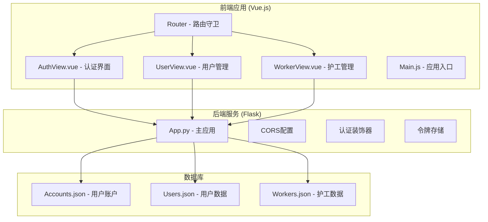
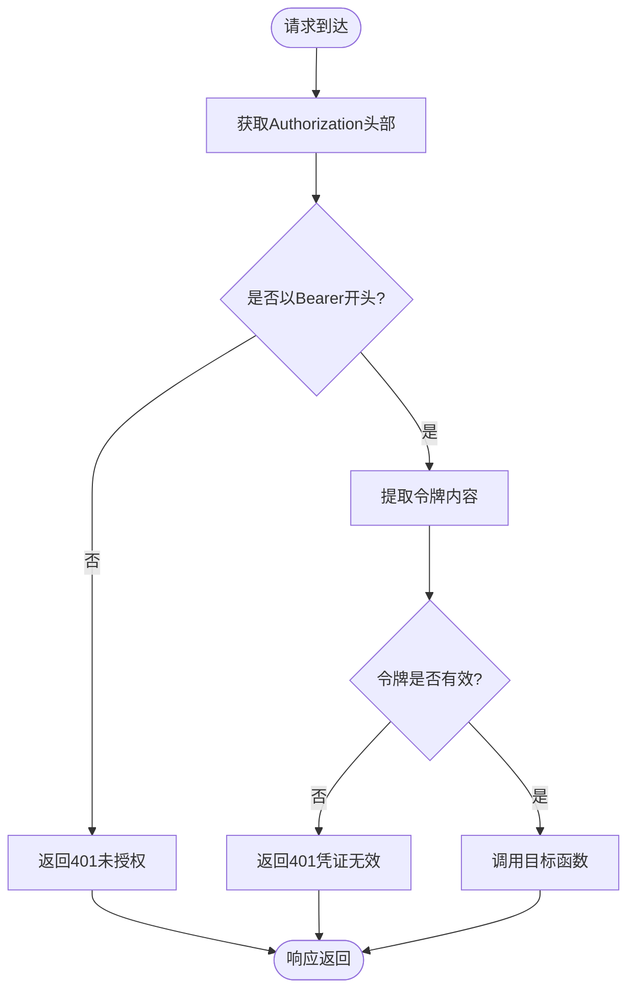
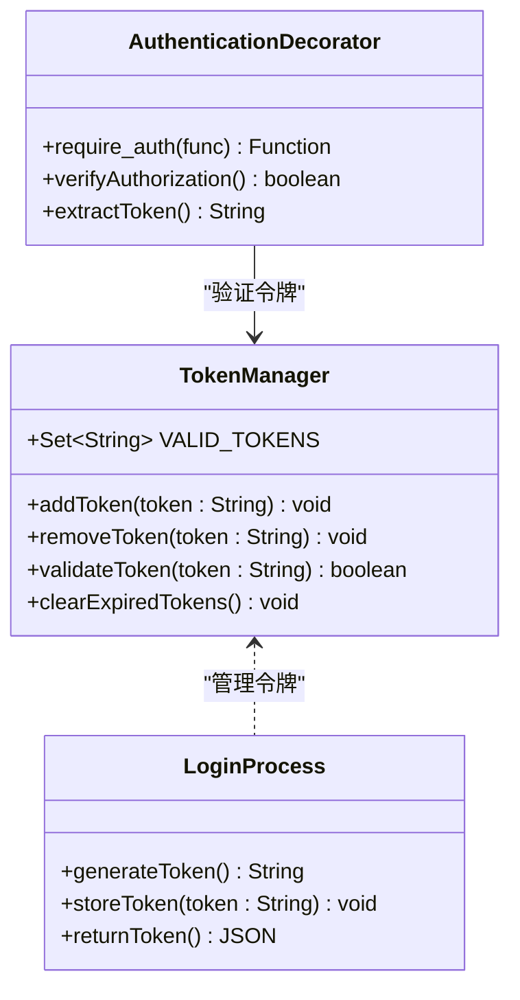
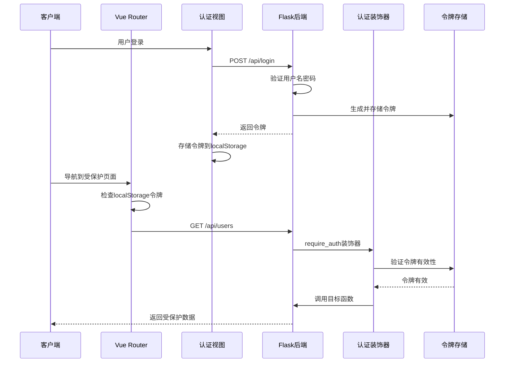
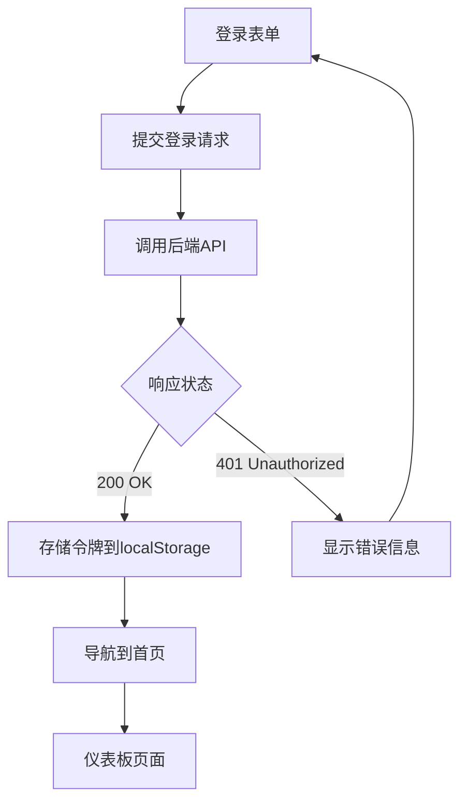
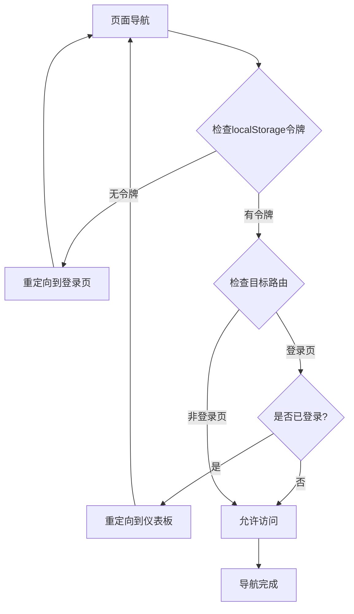
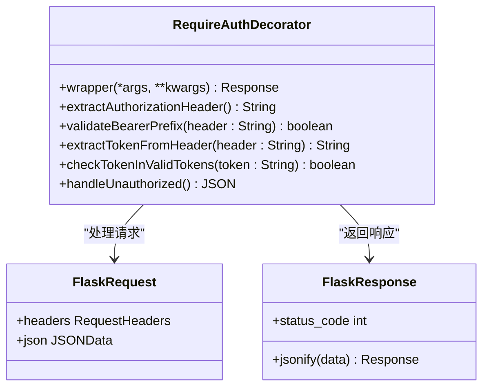
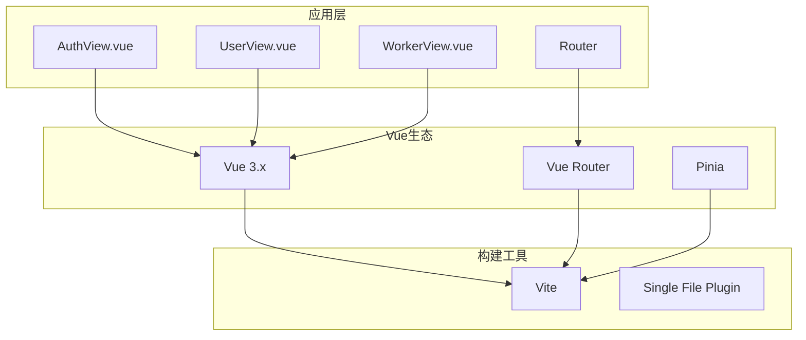
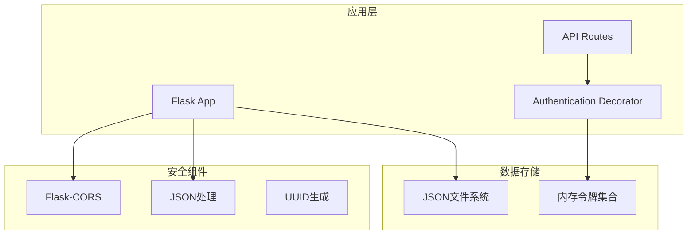

# API安全与认证

<cite>
**本文档引用的文件**
- [backend/app.py](file://backend/app.py)
- [src/views/AuthView.vue](file://src/views/AuthView.vue)
- [src/router/index.js](file://src/router/index.js)
- [src/views/UserView.vue](file://src/views/UserView.vue)
- [src/views/WorkerView.vue](file://src/views/WorkerView.vue)
- [src/main.js](file://src/main.js)
- [package.json](file://package.json)
</cite>

## 目录
1. [简介](#简介)
2. [项目结构](#项目结构)
3. [核心组件](#核心组件)
4. [架构概览](#架构概览)
5. [详细组件分析](#详细组件分析)
6. [依赖分析](#依赖分析)
7. [性能考虑](#性能考虑)
8. [故障排除指南](#故障排除指南)
9. [结论](#结论)

## 简介

本项目是一个基于Vue.js的智慧康养管理系统，实现了完整的API安全机制。系统采用Flask作为后端框架，实现了基于Bearer Token的认证授权机制，通过装饰器模式统一处理API访问控制，并使用内存集合进行令牌管理。

## 项目结构

该项目采用前后端分离架构，主要包含以下模块：



**图表来源**
- [backend/app.py:1-330](file://backend/app.py#L1-L330)
- [src/views/AuthView.vue:1-380](file://src/views/AuthView.vue#L1-L380)
- [src/router/index.js:1-61](file://src/router/index.js#L1-L61)

**章节来源**
- [backend/app.py:1-330](file://backend/app.py#L1-L330)
- [src/main.js:1-11](file://src/main.js#L1-L11)
- [package.json:1-28](file://package.json#L1-L28)

## 核心组件

### 认证装饰器 (require_auth)

系统的核心安全机制是`require_auth`装饰器，它提供了统一的API访问控制：



**图表来源**
- [backend/app.py:15-25](file://backend/app.py#L15-L25)

### 令牌管理系统

系统使用内存集合`VALID_TOKENS`进行令牌管理：



**图表来源**
- [backend/app.py:13](file://backend/app.py#L13)
- [backend/app.py:15-25](file://backend/app.py#L15-L25)
- [backend/app.py:148-169](file://backend/app.py#L148-L169)

**章节来源**
- [backend/app.py:13-25](file://backend/app.py#L13-L25)
- [backend/app.py:148-169](file://backend/app.py#L148-L169)

## 架构概览

系统采用三层架构设计，实现了完整的安全控制流程：



**图表来源**
- [src/views/AuthView.vue:23-46](file://src/views/AuthView.vue#L23-L46)
- [src/router/index.js:42-59](file://src/router/index.js#L42-L59)
- [backend/app.py:15-25](file://backend/app.py#L15-L25)
- [backend/app.py:208-234](file://backend/app.py#L208-L234)

## 详细组件分析

### 前端认证流程

#### 登录组件 (AuthView.vue)

前端认证流程实现了标准的OAuth 2.0 Bearer Token模式：



**图表来源**
- [src/views/AuthView.vue:23-46](file://src/views/AuthView.vue#L23-L46)
- [src/views/AuthView.vue:34](file://src/views/AuthView.vue#L34)

#### 路由守卫 (Router)

路由守卫实现了客户端侧的访问控制：



**图表来源**
- [src/router/index.js:42-59](file://src/router/index.js#L42-L59)

**章节来源**
- [src/views/AuthView.vue:1-380](file://src/views/AuthView.vue#L1-L380)
- [src/router/index.js:1-61](file://src/router/index.js#L1-L61)

### 后端认证机制

#### 认证装饰器实现

后端认证装饰器提供了统一的API安全控制：



**图表来源**
- [backend/app.py:15-25](file://backend/app.py#L15-L25)

#### 令牌生成策略

后端令牌生成采用了UUID4的随机性保证：

| 特征 | 实现细节 |
|------|----------|
| 令牌格式 | `neural-core-auth-{uuid4().hex}` |
| 唯一性保证 | UUID4算法提供128位随机性 |
| 有效期管理 | 内存存储，无自动过期机制 |
| 存储方式 | Python set数据结构 |

**章节来源**
- [backend/app.py:15-25](file://backend/app.py#L15-L25)
- [backend/app.py:148-169](file://backend/app.py#L148-L169)

### API安全配置

#### CORS跨域配置

系统使用Flask-CORS库实现跨域资源共享：

```mermaid
graph LR
subgraph "浏览器安全策略"
A[SOP Same-Origin Policy]
B[CORS Cross-Origin Resource Sharing]
end
subgraph "后端配置"
C[Flask-CORS]
D[app = Flask(__name__)]
E[CORS(app)]
end
subgraph "前端请求"
F[http://localhost:5000/api]
G[http://localhost:5173]
end
A --> B
D --> C
E --> F
F --> G
```

**图表来源**
- [backend/app.py:10-11](file://backend/app.py#L10-L11)

**章节来源**
- [backend/app.py:10-11](file://backend/app.py#L10-L11)

## 依赖分析

### 前端依赖关系



**图表来源**
- [package.json:11-21](file://package.json#L11-L21)
- [src/main.js:1-11](file://src/main.js#L1-L11)

### 后端依赖关系



**图表来源**
- [backend/app.py:1-8](file://backend/app.py#L1-L8)

**章节来源**
- [package.json:1-28](file://package.json#L1-L28)
- [backend/app.py:1-8](file://backend/app.py#L1-L8)

## 性能考虑

### 令牌存储性能

当前实现使用Python set进行令牌存储，具有以下性能特征：

| 操作类型 | 时间复杂度 | 空间复杂度 |
|----------|------------|------------|
| 令牌添加 | O(1) | O(n) |
| 令牌验证 | O(1) | O(n) |
| 令牌移除 | O(1) | O(n) |
| 内存使用 | - | O(n) |

### 建议优化方案

1. **令牌过期机制**
   - 实现令牌TTL（Time To Live）机制
   - 添加定期清理过期令牌的任务

2. **分布式支持**
   - 使用Redis等外部缓存存储令牌
   - 支持多实例部署场景

3. **性能监控**
   - 添加令牌验证成功率统计
   - 监控内存使用情况

## 故障排除指南

### 常见认证问题

#### 1. 401未授权错误

**症状**: API请求返回401状态码

**可能原因**:
- Authorization头部缺失或格式错误
- 令牌不在有效令牌集合中
- 令牌格式不是Bearer模式

**解决方案**:
```javascript
// 检查前端请求头设置
const token = localStorage.getItem('user_token');
if (!token) {
    console.error('令牌不存在');
    // 重定向到登录页
}

const response = await fetch('/api/users', {
    headers: {
        'Authorization': `Bearer ${token}`,
        'Content-Type': 'application/json'
    }
});
```

#### 2. 跨域请求失败

**症状**: 浏览器控制台出现CORS错误

**解决方案**:
```python
# 确保CORS正确配置
from flask_cors import CORS

app = Flask(__name__)
CORS(app)  # 允许所有域名访问
```

#### 3. 令牌过期问题

**症状**: 登录后一段时间内API请求失败

**解决方案**:
```javascript
// 前端令牌管理
const handleTokenRefresh = () => {
    const token = localStorage.getItem('user_token');
    const tokenExpiry = localStorage.getItem('token_expiry');
    
    if (tokenExpiry && Date.now() > tokenExpiry) {
        // 令牌过期，重新登录
        localStorage.removeItem('user_token');
        localStorage.removeItem('token_expiry');
        router.push('/login');
    }
};
```

**章节来源**
- [src/views/UserView.vue:169-190](file://src/views/UserView.vue#L169-L190)
- [src/views/WorkerView.vue:288-323](file://src/views/WorkerView.vue#L288-L323)

## 结论

本项目实现了基础但完整的API安全机制，主要包括：

### 已实现的安全特性

1. **Bearer Token认证**: 符合OAuth 2.0标准的令牌认证机制
2. **统一访问控制**: 通过装饰器模式实现API级别的安全控制
3. **CORS配置**: 正确的跨域资源共享设置
4. **客户端路由保护**: 基于localStorage的令牌检查

### 安全改进建议

1. **令牌过期机制**: 实现TTL和自动刷新
2. **HTTPS支持**: 生产环境必须使用HTTPS
3. **密码哈希**: 使用更安全的密码哈希算法
4. **CSRF防护**: 添加CSRF令牌防止跨站请求伪造
5. **审计日志**: 记录重要的安全事件

### 最佳实践

1. **令牌管理**: 将令牌存储在HttpOnly Cookie中
2. **权限控制**: 实施最小权限原则
3. **输入验证**: 对所有用户输入进行严格验证
4. **错误处理**: 不泄露敏感错误信息
5. **安全监控**: 实施实时安全监控和告警

该系统为智慧康养管理提供了坚实的安全基础，通过进一步的安全加固可以满足生产环境的要求。