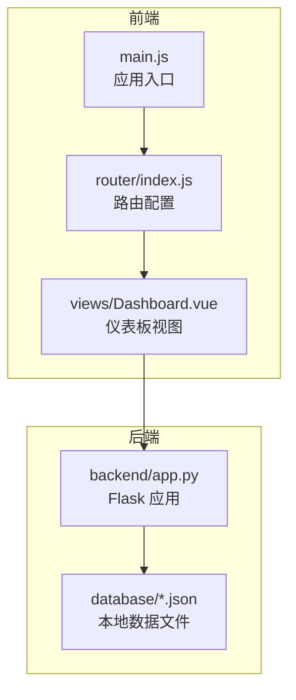
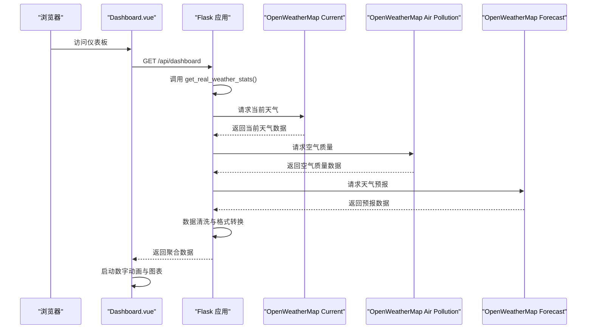
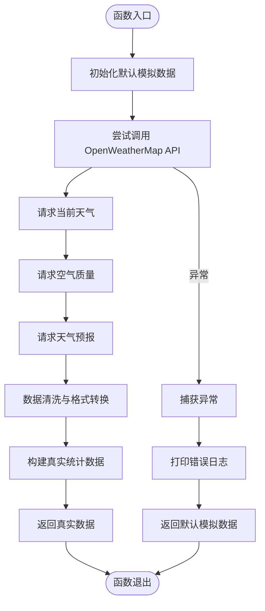
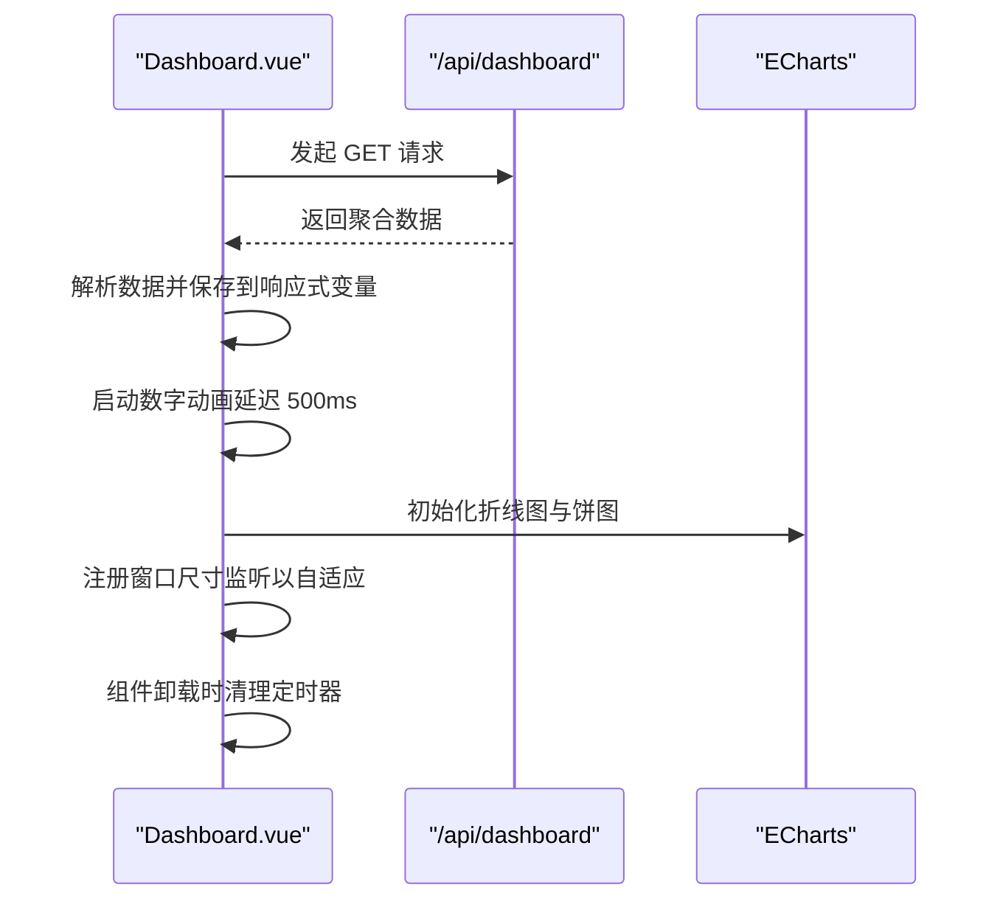
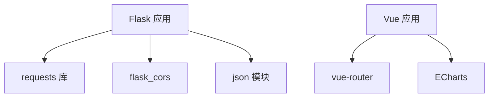

# 仪表板数据API

<cite>
**本文档引用的文件**
- [backend/app.py](file://backend/app.py)
- [src/views/Dashboard.vue](file://src/views/Dashboard.vue)
- [src/router/index.js](file://src/router/index.js)
- [src/main.js](file://src/main.js)
- [database/scoringList.json](file://database/scoringList.json)
- [database/users.json](file://database/users.json)
- [database/foods.json](file://database/foods.json)
</cite>

## 目录
1. [简介](#简介)
2. [项目结构](#项目结构)
3. [核心组件](#核心组件)
4. [架构概览](#架构概览)
5. [详细组件分析](#详细组件分析)
6. [依赖分析](#依赖分析)
7. [性能考虑](#性能考虑)
8. [故障排除指南](#故障排除指南)
9. [结论](#结论)
10. [附录](#附录)

## 简介
本文档详细说明了仪表板数据接口的实现，特别是 `/api/dashboard` 接口的工作原理。该接口整合了实时天气数据获取、环境指标统计以及综合数据展示功能。文档重点解释了 `get_real_weather_stats()` 函数如何调用 OpenWeatherMap API、进行数据清洗和格式转换，并提供了完整的返回数据结构说明。同时，文档涵盖了数据回退机制（在 API 调用失败时使用模拟数据）、前端数据消费的最佳实践（包括数据缓存、错误处理和实时更新策略），以及与前端组件的集成方式。

## 项目结构
该项目采用前后端分离架构：
- 后端使用 Python Flask 提供 RESTful API，负责天气数据获取、数据清洗、格式转换以及综合数据聚合。
- 前端使用 Vue 3 + Vite 构建，通过路由导航到仪表板视图，调用后端接口获取数据并在页面中渲染。

**图表来源**
- [backend/app.py:1-330](file://backend/app.py#L1-L330)
- [src/views/Dashboard.vue:1-967](file://src/views/Dashboard.vue#L1-L967)
- [src/router/index.js:1-61](file://src/router/index.js#L1-L61)
- [src/main.js:1-11](file://src/main.js#L1-L11)

**章节来源**
- [backend/app.py:1-330](file://backend/app.py#L1-L330)
- [src/views/Dashboard.vue:1-967](file://src/views/Dashboard.vue#L1-L967)
- [src/router/index.js:1-61](file://src/router/index.js#L1-L61)
- [src/main.js:1-11](file://src/main.js#L1-L11)

## 核心组件
- 后端 Flask 应用：提供 `/api/dashboard` 接口，调用 `get_real_weather_stats()` 获取天气数据，并从本地 JSON 文件读取评分列表、用户信息和食物信息，最终返回聚合数据。
- 前端 Dashboard 视图：在页面加载时调用 `/api/dashboard`，解析返回数据，启动数字动画效果，并初始化 ECharts 图表。
- 路由系统：基于 Vue Router 的路由守卫实现登录状态检查，确保只有已认证用户才能访问仪表板。

**章节来源**
- [backend/app.py:171-182](file://backend/app.py#L171-L182)
- [src/views/Dashboard.vue:173-204](file://src/views/Dashboard.vue#L173-L204)
- [src/router/index.js:42-59](file://src/router/index.js#L42-L59)

## 架构概览
后端通过三个 OpenWeatherMap API 端点获取数据：
- 当前天气：获取温度、湿度、能见度、气压等基础指标
- 空气质量：获取 AQI 指数
- 天气预报：提取每日最高/最低温度

随后进行数据清洗与格式转换，生成统一的数据结构，并在 `/api/dashboard` 中与其他本地数据合并返回。

**图表来源**
- [backend/app.py:65-116](file://backend/app.py#L65-L116)
- [backend/app.py:171-182](file://backend/app.py#L171-L182)
- [src/views/Dashboard.vue:173-204](file://src/views/Dashboard.vue#L173-L204)

## 详细组件分析

### 后端 API：/api/dashboard
- 路由定义：`@app.route('/api/dashboard', methods=['GET'])`
- 功能：调用 `get_real_weather_stats()` 获取实时天气数据，从本地 JSON 文件读取评分列表、用户信息和食物信息，最终返回包含 `stats`、`scoringList`、`users`、`foods` 的对象。
- 认证：该接口未添加认证装饰器，因此无需 Bearer Token 即可访问。

**章节来源**
- [backend/app.py:171-182](file://backend/app.py#L171-L182)

### get_real_weather_stats() 函数详解
该函数负责从 OpenWeatherMap API 获取实时天气数据，并进行数据清洗与格式转换，同时提供数据回退机制。

#### 调用流程
1. **默认模拟数据**：定义兜底数据结构，包含温度、湿度、AQI、能见度、气压、平均温度及一周最高/最低温度数组。
2. **获取当前天气**：构造当前天气 API 请求 URL，设置超时时间为 5 秒，解析 JSON。
3. **获取空气质量**：从当前天气响应中提取经纬度，构造空气质量 API 请求 URL，解析 JSON。
4. **获取天气预报**：构造天气预报 API 请求 URL，解析 JSON。
5. **数据清洗与转换**：
   - 从预报数据中按 8 个点一组提取每日最高/最低温度，确保返回 7 天数据。
   - 将 AQI 指数乘以 20 转换为常见范围（0-200）。
   - 将能见度从米转换为公里并保留一位小数。
   - 计算平均温度。
6. **异常处理**：捕获任何异常，打印错误信息，并返回默认模拟数据。

**图表来源**
- [backend/app.py:65-116](file://backend/app.py#L65-L116)

**章节来源**
- [backend/app.py:65-116](file://backend/app.py#L65-L116)

### 返回数据结构说明
后端 `/api/dashboard` 接口返回的数据包含以下字段：
- `stats`：实时天气与环境指标统计
  - `temperature`：当前温度（摄氏度）
  - `humidity`：当前湿度（百分比）
  - `humidityChange`：湿度变化率（示例值）
  - `aqi`：空气质量指数（转换后的 0-200 范围）
  - `aqiChange`：AQI 变化率（示例值）
  - `visibility`：能见度（公里）
  - `visibilityChange`：能见度变化率（示例值）
  - `pressure`：大气压强（百帕）
  - `pressureChange`：气压变化率（示例值）
  - `averageTemperature`：一周平均温度
  - `maximumTemperature`：过去七天每日最高温度数组
  - `minimumTemperature`：过去七天每日最低温度数组
- `scoringList`：护工评分列表（来自本地 JSON 文件）
- `users`：用户信息列表（来自本地 JSON 文件）
- `foods`：三餐情况列表（来自本地 JSON 文件）

**章节来源**
- [backend/app.py:68-111](file://backend/app.py#L68-L111)
- [database/scoringList.json:1-7](file://database/scoringList.json#L1-L7)
- [database/users.json:1-582](file://database/users.json#L1-L582)
- [database/foods.json:1-38](file://database/foods.json#L1-L38)

### 前端数据消费与最佳实践
前端 Dashboard 视图通过 fetch 调用 `/api/dashboard` 获取数据，并进行以下处理：
- 页面加载时发起请求，解析响应并保存到响应式变量中
- 启动数字动画：延迟 500ms 后，使用 requestAnimationFrame 实现平滑补间动画，将真实统计数据过渡到界面显示
- 初始化图表：使用 ECharts 在 nextTick 确保 DOM 已渲染后初始化折线图和饼图
- 生命周期管理：在组件卸载时清理定时器，避免内存泄漏

**图表来源**
- [src/views/Dashboard.vue:173-204](file://src/views/Dashboard.vue#L173-L204)
- [src/views/Dashboard.vue:48-112](file://src/views/Dashboard.vue#L48-L112)
- [src/views/Dashboard.vue:114-169](file://src/views/Dashboard.vue#L114-L169)

**章节来源**
- [src/views/Dashboard.vue:173-204](file://src/views/Dashboard.vue#L173-L204)
- [src/views/Dashboard.vue:28-45](file://src/views/Dashboard.vue#L28-L45)

### 数据回退机制
当 OpenWeatherMap API 调用失败时，`get_real_weather_stats()` 函数会捕获异常并返回默认模拟数据。该机制确保即使外部 API 不可用，仪表板仍能正常显示数据，提升系统的健壮性。

**章节来源**
- [backend/app.py:114-116](file://backend/app.py#L114-L116)

### 前端数据缓存与实时更新策略
- 缓存策略：建议在前端使用响应式状态管理（如 Pinia）缓存 `/api/dashboard` 的数据，避免重复请求。在页面可见性变化或路由切换时，根据需要刷新缓存。
- 错误处理：在 fetch 请求中添加 try/catch，记录错误并提示用户网络异常或服务不可用。对于图表渲染，应检查数据有效性后再初始化。
- 实时更新：可以设置定时器定期轮询 `/api/dashboard`，但需注意频率控制与资源消耗。对于高频更新场景，可考虑 WebSocket 或 Server-Sent Events。

**章节来源**
- [src/views/Dashboard.vue:173-204](file://src/views/Dashboard.vue#L173-L204)
- [src/router/index.js:42-59](file://src/router/index.js#L42-L59)

## 依赖分析
后端依赖关系：
- Flask：提供 Web 服务器与路由
- requests：调用外部 OpenWeatherMap API
- flask_cors：启用跨域支持
- json：读写本地 JSON 数据文件

前端依赖关系：
- Vue 3：组件化开发框架
- ECharts：可视化图表库
- vue-router：前端路由管理

**图表来源**
- [backend/app.py:5-8](file://backend/app.py#L5-L8)
- [src/views/Dashboard.vue:1-5](file://src/views/Dashboard.vue#L1-L5)
- [src/router/index.js:1](file://src/router/index.js#L1)

**章节来源**
- [backend/app.py:5-8](file://backend/app.py#L5-L8)
- [src/views/Dashboard.vue:1-5](file://src/views/Dashboard.vue#L1-L5)
- [src/router/index.js:1](file://src/router/index.js#L1)

## 性能考虑
- API 调用超时：当前实现设置了 5 秒超时，建议根据网络状况调整，避免阻塞主线程。
- 数据清洗复杂度：按 8 个点一组提取每日最高/最低温度的时间复杂度为 O(n)，其中 n 为预报条目数量。对于大量数据，可考虑分页或限制天数。
- 图表渲染：ECharts 初始化应在 DOM 就绪后进行，避免不必要的重绘。合理设置图表尺寸与主题，减少内存占用。
- 前端动画：requestAnimationFrame 的补间动画性能良好，但应避免在同一帧内触发过多动画。

[本节提供一般性指导，无需特定文件来源]

## 故障排除指南
- OpenWeatherMap API 失败：检查 API 密钥与城市名称配置，确认网络连通性。查看后端日志中的异常信息。
- 响应数据为空：确认本地 JSON 文件是否存在且格式正确。检查读取函数的路径拼接逻辑。
- 图表不显示：确认 ECharts 引用正确，DOM 元素已渲染。检查图表初始化参数与数据格式。
- 前端路由问题：检查路由守卫逻辑，确保已登录用户才能访问仪表板。

**章节来源**
- [backend/app.py:32-35](file://backend/app.py#L32-L35)
- [backend/app.py:48-59](file://backend/app.py#L48-L59)
- [src/views/Dashboard.vue:173-204](file://src/views/Dashboard.vue#L173-L204)
- [src/router/index.js:42-59](file://src/router/index.js#L42-L59)

## 结论
本项目通过 `/api/dashboard` 接口实现了仪表板数据的统一聚合与展示。后端利用 `get_real_weather_stats()` 函数高效调用 OpenWeatherMap API，并提供完善的回退机制；前端通过响应式状态与动画效果提升了用户体验。建议在生产环境中进一步优化 API 超时、图表渲染与缓存策略，以获得更好的性能与稳定性。

[本节为总结性内容，无需特定文件来源]

## 附录
- OpenWeatherMap API 配置：在后端配置文件中设置 API 密钥与城市名称。
- 本地数据文件：评分列表、用户信息与食物信息分别存储在对应的 JSON 文件中，供后端读取并返回。

**章节来源**
- [backend/app.py:32-35](file://backend/app.py#L32-L35)
- [database/scoringList.json:1-7](file://database/scoringList.json#L1-L7)
- [database/users.json:1-582](file://database/users.json#L1-L582)
- [database/foods.json:1-38](file://database/foods.json#L1-L38)