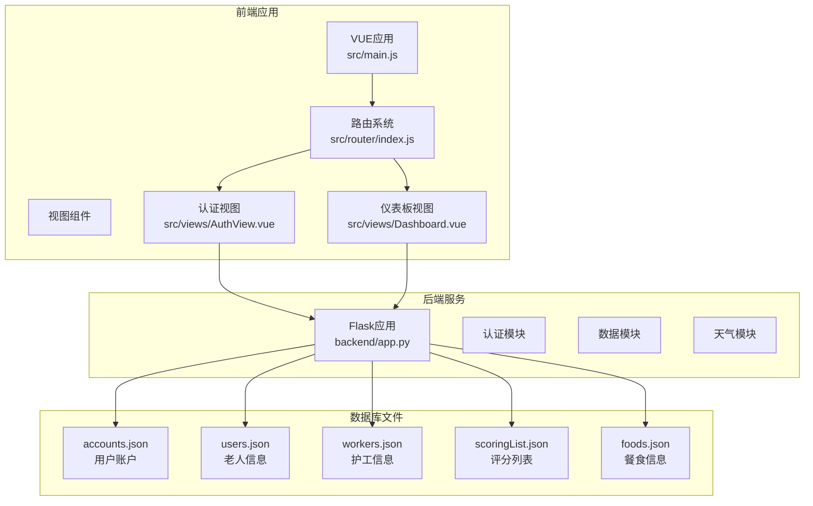
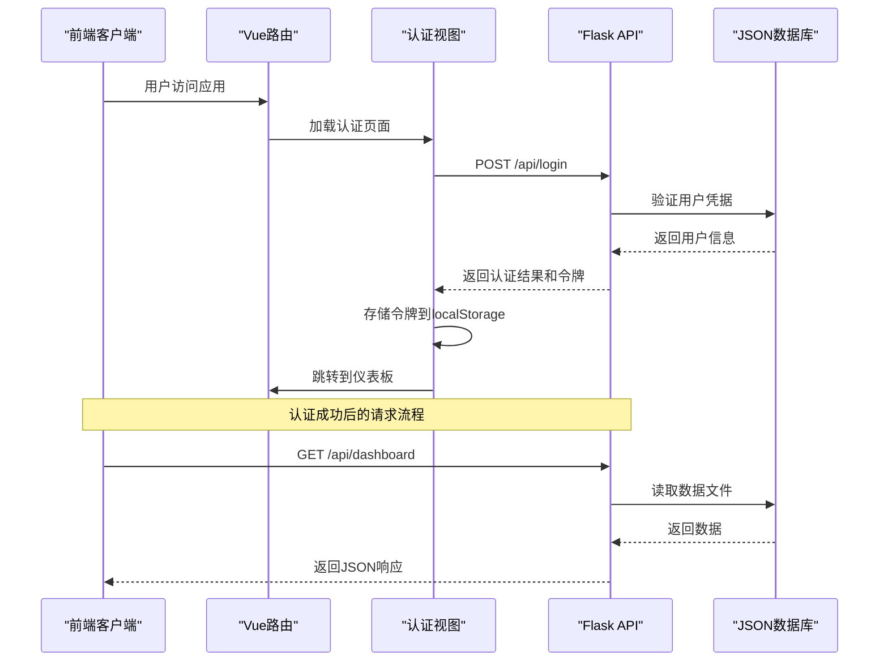
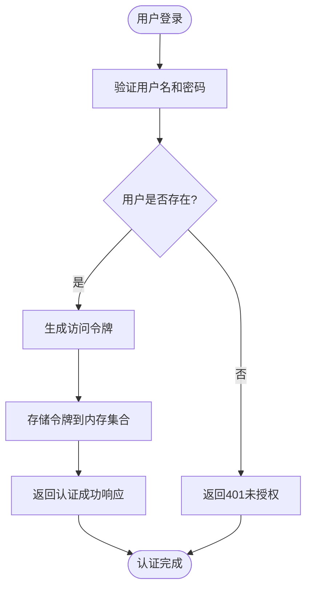
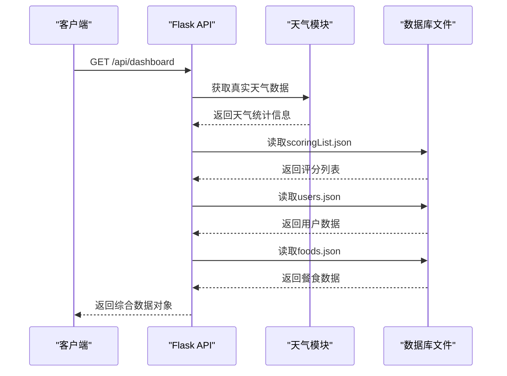
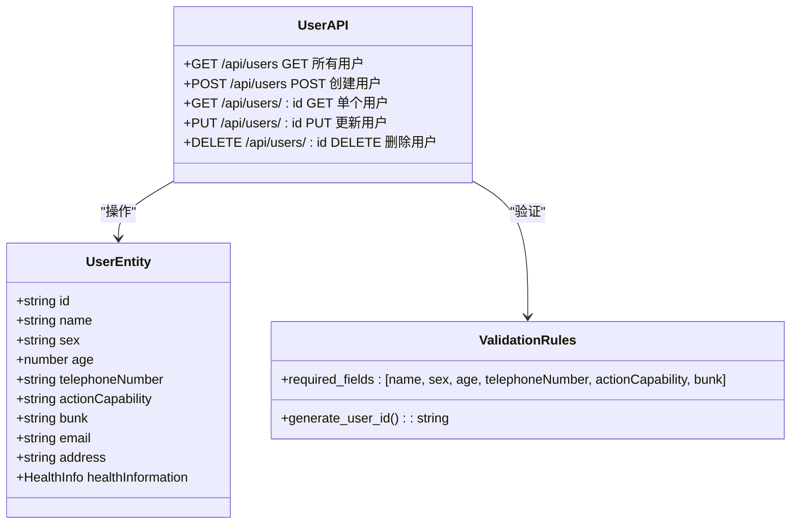
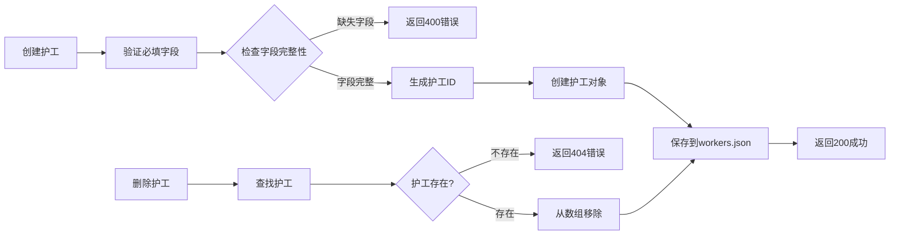
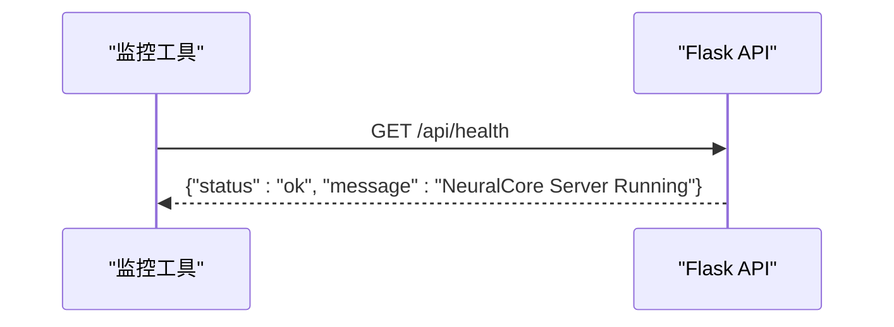
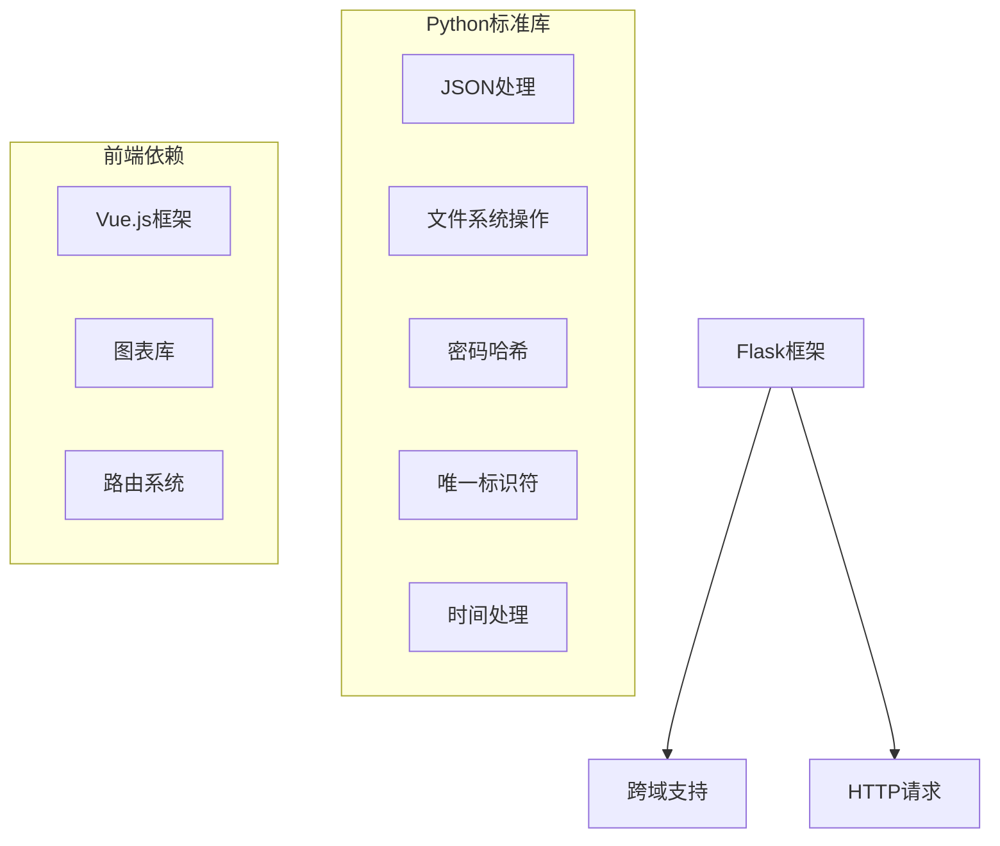
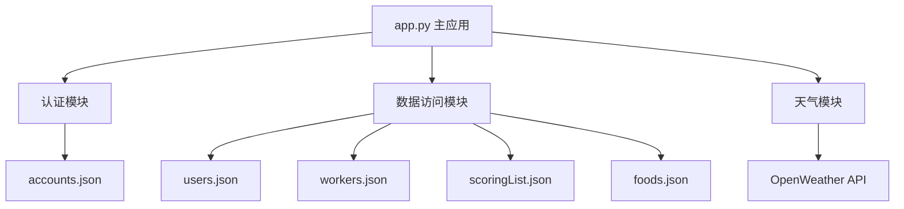

# 后端API设计

<cite>
**本文档引用的文件**
- [backend/app.py](file://backend/app.py)
- [database/accounts.json](file://database/accounts.json)
- [database/users.json](file://database/users.json)
- [database/workers.json](file://database/workers.json)
- [database/scoringList.json](file://database/scoringList.json)
- [database/foods.json](file://database/foods.json)
- [src/views/AuthView.vue](file://src/views/AuthView.vue)
- [src/views/Dashboard.vue](file://src/views/Dashboard.vue)
- [src/router/index.js](file://src/router/index.js)
- [src/main.js](file://src/main.js)
- [src/App.vue](file://src/App.vue)
</cite>

## 目录
1. [简介](#简介)
2. [项目结构](#项目结构)
3. [核心组件](#核心组件)
4. [架构概览](#架构概览)
5. [详细组件分析](#详细组件分析)
6. [依赖分析](#依赖分析)
7. [性能考虑](#性能考虑)
8. [故障排除指南](#故障排除指南)
9. [结论](#结论)
10. [附录](#附录)

## 简介
本项目是一个基于Flask的后端服务，为智慧康养管理系统提供RESTful API接口。系统采用前后端分离架构，后端提供用户认证、数据查询和数据管理功能，前端使用Vue.js构建用户界面。后端实现了基于内存的JWT令牌认证机制，支持用户注册、登录、数据展示和数据管理等核心功能。

## 项目结构
项目采用模块化组织方式，主要分为后端服务、数据库文件和前端应用三个部分：

**图表来源**
- [backend/app.py:1-330](file://backend/app.py#L1-L330)
- [src/main.js:1-11](file://src/main.js#L1-L11)
- [src/router/index.js:1-61](file://src/router/index.js#L1-L61)

**章节来源**
- [backend/app.py:1-330](file://backend/app.py#L1-L330)
- [src/main.js:1-11](file://src/main.js#L1-L11)
- [src/router/index.js:1-61](file://src/router/index.js#L1-L61)

## 核心组件
后端服务的核心组件包括认证中间件、数据访问层和业务逻辑层：

### 认证中间件
系统实现了基于装饰器的认证中间件，通过`require_auth`装饰器保护需要认证的API端点。认证机制采用简单的令牌验证，所有有效令牌存储在内存集合中。

### 数据访问层
数据访问层通过统一的JSON文件读写函数实现数据持久化，支持用户、护工、老人等实体的数据操作。

### 业务逻辑层
业务逻辑层包含用户认证、数据查询、数据管理和天气数据获取等功能模块。

**章节来源**
- [backend/app.py:15-25](file://backend/app.py#L15-L25)
- [backend/app.py:47-59](file://backend/app.py#L47-L59)
- [backend/app.py:65-116](file://backend/app.py#L65-L116)

## 架构概览
系统采用经典的三层架构模式，前后端通过HTTP协议进行通信：

**图表来源**
- [src/views/AuthView.vue:23-46](file://src/views/AuthView.vue#L23-L46)
- [src/views/Dashboard.vue:173-204](file://src/views/Dashboard.vue#L173-L204)
- [backend/app.py:148-169](file://backend/app.py#L148-L169)

## 详细组件分析

### 认证系统组件

#### JWT令牌认证机制
系统实现了简化的JWT令牌认证机制，具体实现如下：

**图表来源**
- [backend/app.py:148-169](file://backend/app.py#L148-L169)
- [backend/app.py:13-13](file://backend/app.py#L13-L13)

认证响应包含以下字段：
- `message`: 认证状态消息
- `token`: 生成的访问令牌
- `username`: 用户名
- `authId`: 用户ID

**章节来源**
- [backend/app.py:148-169](file://backend/app.py#L148-L169)
- [backend/app.py:13-13](file://backend/app.py#L13-L13)

### 数据查询接口组件

#### 仪表板数据接口
`/api/dashboard`接口提供综合数据展示功能：

**图表来源**
- [backend/app.py:171-182](file://backend/app.py#L171-L182)
- [backend/app.py:65-116](file://backend/app.py#L65-L116)

响应数据结构包含：
- `stats`: 天气统计信息
- `scoringList`: 护工评分列表
- `users`: 老人信息列表
- `foods`: 餐食信息列表

**章节来源**
- [backend/app.py:171-182](file://backend/app.py#L171-L182)

### 数据管理接口组件

#### 用户管理接口
系统提供了完整的用户CRUD操作接口：

**图表来源**
- [backend/app.py:204-262](file://backend/app.py#L204-L262)
- [backend/app.py:184-202](file://backend/app.py#L184-L202)

**章节来源**
- [backend/app.py:204-262](file://backend/app.py#L204-L262)
- [backend/app.py:184-202](file://backend/app.py#L184-L202)

#### 护工管理接口
护工管理接口与用户管理接口类似，但具有不同的必填字段：

**图表来源**
- [backend/app.py:268-320](file://backend/app.py#L268-L320)

**章节来源**
- [backend/app.py:268-320](file://backend/app.py#L268-L320)

### 健康检查接口组件
系统提供了简单的健康检查接口用于服务监控：

**图表来源**
- [backend/app.py:322-324](file://backend/app.py#L322-L324)

**章节来源**
- [backend/app.py:322-324](file://backend/app.py#L322-L324)

## 依赖分析

### 外部依赖关系
系统的主要外部依赖包括：

**图表来源**
- [backend/app.py:1-8](file://backend/app.py#L1-L8)

### 内部模块依赖
后端模块之间的依赖关系：

**图表来源**
- [backend/app.py:27-29](file://backend/app.py#L27-L29)
- [backend/app.py:32-35](file://backend/app.py#L32-L35)

**章节来源**
- [backend/app.py:1-8](file://backend/app.py#L1-L8)
- [backend/app.py:27-29](file://backend/app.py#L27-L29)

## 性能考虑
系统在设计时考虑了以下性能优化策略：

### 缓存策略
- **内存令牌缓存**: 使用Python集合存储有效的认证令牌，提供O(1)的令牌验证时间复杂度
- **文件缓存**: JSON文件读取操作在应用启动时完成，减少重复I/O操作

### 数据访问优化
- **批量读取**: 仪表板接口一次性读取多个数据文件，减少网络往返次数
- **数据预处理**: 在服务端进行数据聚合和格式转换，减轻前端负担

### 并发处理
- **单线程模型**: Flask开发服务器采用单线程模型，适合开发和测试场景
- **异步I/O**: 天气API调用使用异步HTTP请求，避免阻塞主线程

## 故障排除指南

### 常见认证问题
1. **401未授权错误**
   - 检查Authorization头格式是否正确
   - 确认令牌是否存在于有效令牌集合中
   - 验证令牌是否已过期

2. **令牌验证失败**
   - 确认前端正确存储了localStorage中的token
   - 检查令牌格式是否符合预期

### 数据访问问题
1. **404资源不存在**
   - 确认用户ID或护工ID格式正确
   - 检查对应的数据文件是否存在

2. **400请求参数错误**
   - 验证必填字段是否完整
   - 检查字段类型是否正确

### 天气数据问题
1. **API调用失败**
   - 检查网络连接
   - 验证API密钥有效性
   - 确认城市名称配置正确

**章节来源**
- [backend/app.py:15-25](file://backend/app.py#L15-L25)
- [backend/app.py:214-215](file://backend/app.py#L214-L215)

## 结论
本Flask后端服务为智慧康养管理系统提供了完整的RESTful API解决方案。系统采用简洁的架构设计，实现了用户认证、数据查询和数据管理等核心功能。虽然目前采用内存存储和简化的认证机制，但为后续的功能扩展和生产部署奠定了良好的基础。

系统的主要优势包括：
- 清晰的模块化设计
- 完善的错误处理机制
- 良好的前后端分离架构
- 易于扩展的数据访问层

## 附录

### API版本控制策略
当前系统采用简单的版本控制策略：
- API路径前缀 `/api` 作为版本标识
- 所有接口均位于 `/api` 命名空间下
- 未来可通过添加版本号（如 `/api/v1`）实现向后兼容

### 向后兼容性考虑
为确保系统的向后兼容性，建议：
1. **保持现有API不变**: 不破坏现有的接口签名和响应格式
2. **添加新字段而非删除**: 新增字段时保持向后兼容
3. **版本迁移策略**: 为重大变更提供迁移指南
4. **文档同步更新**: 随时更新API文档以反映变更

### 前端集成最佳实践
1. **统一的错误处理**: 在前端实现统一的错误处理机制
2. **令牌自动续期**: 实现令牌过期检测和自动刷新
3. **请求拦截器**: 使用拦截器统一添加认证头
4. **状态管理**: 使用Vuex/Pinia管理全局状态

**章节来源**
- [src/views/AuthView.vue:7-7](file://src/views/AuthView.vue#L7-L7)
- [src/router/index.js:43-59](file://src/router/index.js#L43-L59)