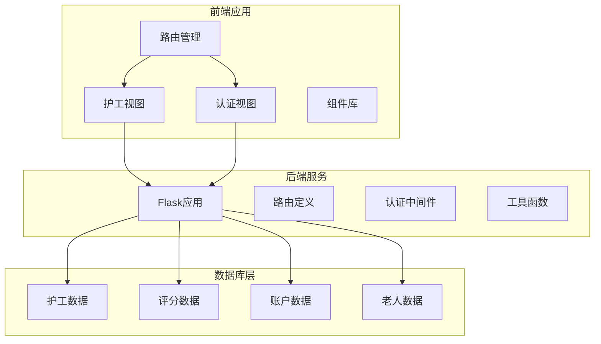
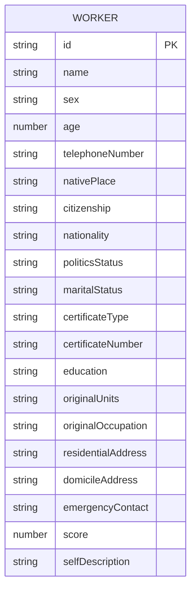
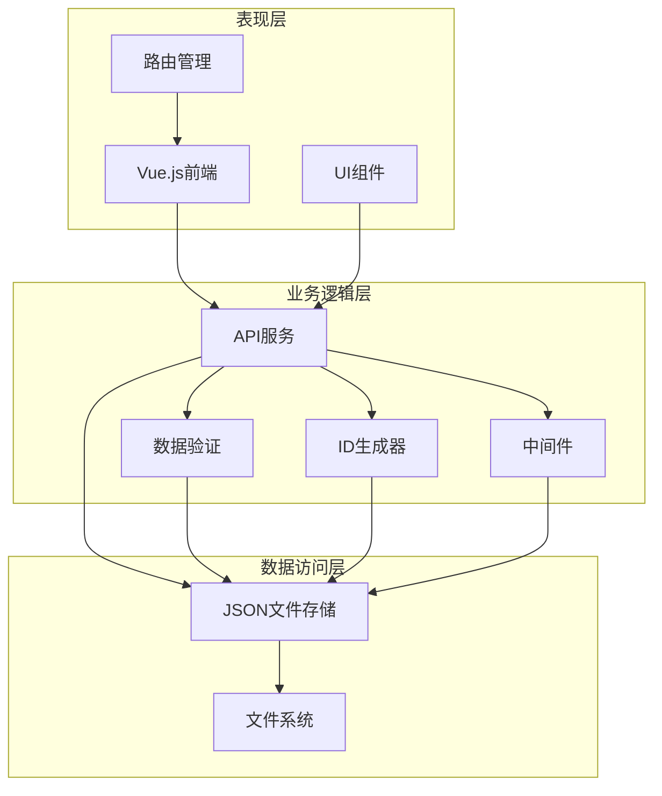
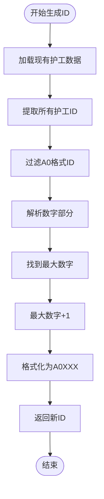
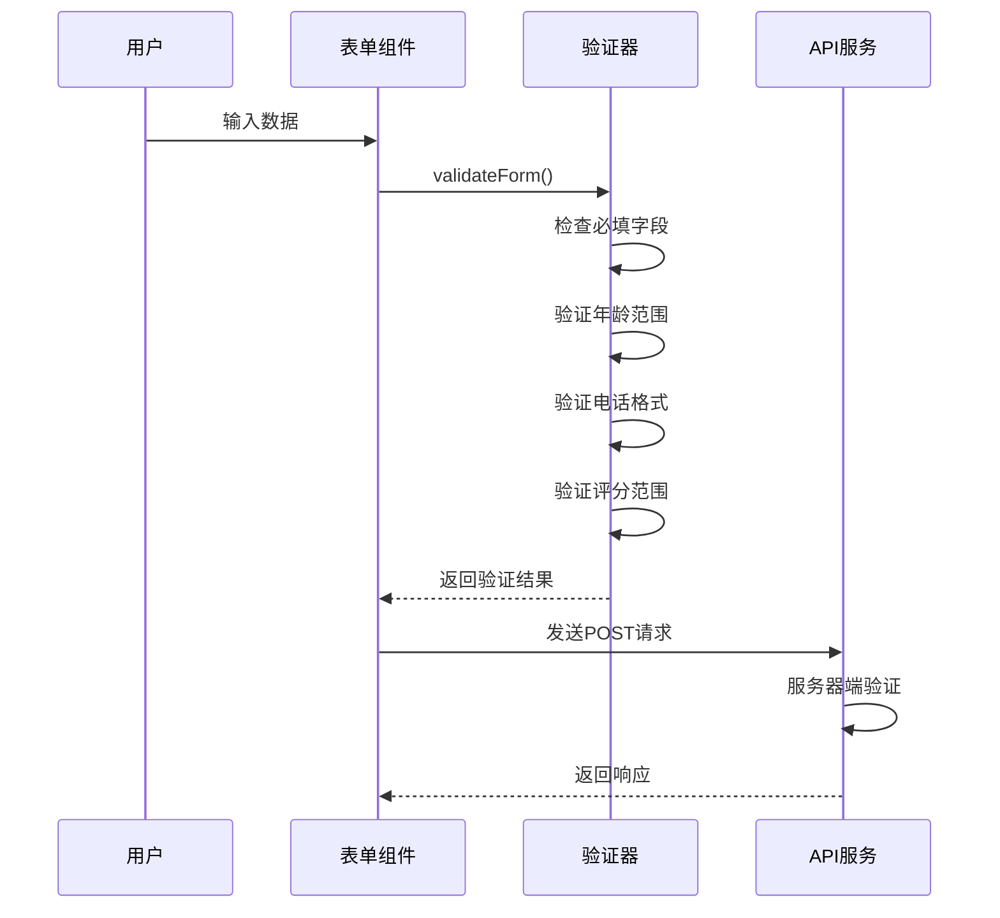
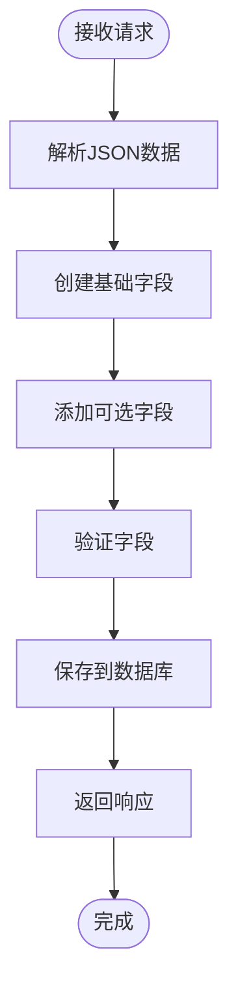
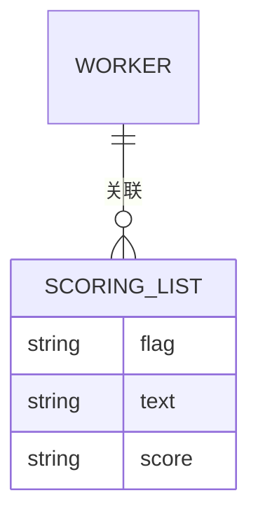
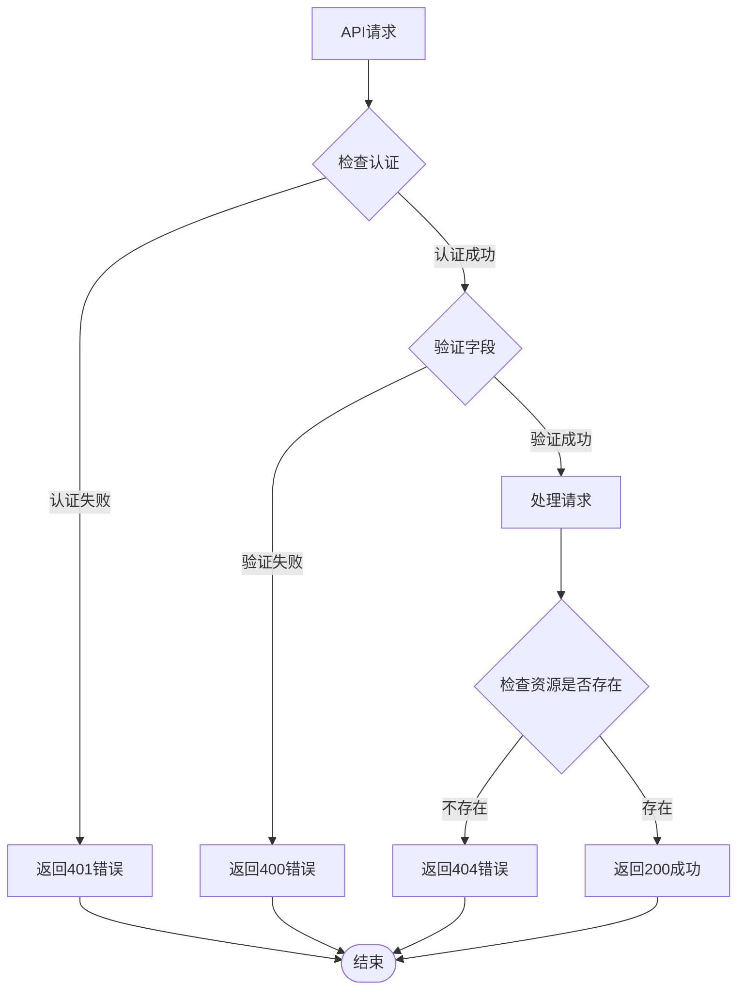
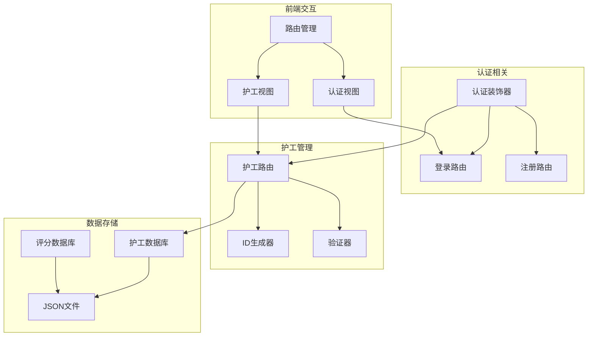

# 护工信息管理API

<cite>
**本文档引用的文件**
- [backend/app.py](file://backend/app.py)
- [database/workers.json](file://database/workers.json)
- [database/scoringList.json](file://database/scoringList.json)
- [src/views/WorkerView.vue](file://src/views/WorkerView.vue)
- [src/views/AuthView.vue](file://src/views/AuthView.vue)
- [src/router/index.js](file://src/router/index.js)
</cite>

## 目录
1. [简介](#简介)
2. [项目结构](#项目结构)
3. [核心组件](#核心组件)
4. [架构概览](#架构概览)
5. [详细组件分析](#详细组件分析)
6. [依赖关系分析](#依赖关系分析)
7. [性能考虑](#性能考虑)
8. [故障排除指南](#故障排除指南)
9. [结论](#结论)
10. [附录](#附录)

## 简介

护工信息管理系统是一个基于Flask的后端服务和Vue.js前端的完整解决方案，专门用于管理养老机构中的护工信息。该系统提供了完整的CRUD操作、动态字段处理、评分系统集成以及完善的错误处理机制。

系统采用前后端分离架构，后端使用Python Flask框架提供RESTful API，前端使用Vue.js构建用户界面。所有数据存储在JSON文件中，实现了轻量级的数据持久化方案。

## 项目结构

项目采用模块化的文件组织方式，主要分为以下几个部分：



**图表来源**
- [backend/app.py:1-330](file://backend/app.py#L1-L330)
- [database/workers.json:1-442](file://database/workers.json#L1-L442)

**章节来源**
- [backend/app.py:1-330](file://backend/app.py#L1-L330)
- [database/workers.json:1-442](file://database/workers.json#L1-L442)

## 核心组件

### 护工管理API

系统的核心功能围绕`/api/workers`接口展开，提供了完整的CRUD操作：

- **GET /api/workers**: 获取所有护工信息
- **POST /api/workers**: 创建新的护工记录
- **PUT /api/workers/{worker_id}**: 更新指定护工信息
- **DELETE /api/workers/{worker_id}**: 删除指定护工记录

### 认证系统

系统实现了基于Bearer Token的认证机制：

- **POST /api/login**: 用户登录获取访问令牌
- **POST /api/register**: 用户注册
- **require_auth装饰器**: 全局认证中间件

### 数据模型

护工数据采用灵活的JSON结构设计，支持动态字段扩展：



**图表来源**
- [database/workers.json:1-442](file://database/workers.json#L1-L442)

**章节来源**
- [backend/app.py:264-321](file://backend/app.py#L264-L321)
- [database/workers.json:1-442](file://database/workers.json#L1-L442)

## 架构概览

系统采用经典的三层架构模式：



**图表来源**
- [backend/app.py:15-25](file://backend/app.py#L15-L25)
- [backend/app.py:194-202](file://backend/app.py#L194-L202)

## 详细组件分析

### 护工ID生成机制

系统实现了智能的ID生成算法，确保护工ID的唯一性和可读性：

#### ID生成规则
- **格式**: A0XXX（A开头，后跟3位数字）
- **前缀**: A0
- **自增逻辑**: 基于现有最大编号自动递增



**图表来源**
- [backend/app.py:194-202](file://backend/app.py#L194-L202)

#### 自动递增实现

ID生成器通过遍历现有数据来确定下一个可用编号：

1. **数据扫描**: 遍历所有护工记录
2. **格式验证**: 检查ID是否以"A0"开头
3. **数值提取**: 解析数字部分
4. **最大值比较**: 更新最大编号
5. **格式化输出**: 生成新的3位数字ID

**章节来源**
- [backend/app.py:194-202](file://backend/app.py#L194-L202)

### POST请求验证机制

系统对护工创建请求实施严格的字段验证：

#### 必填字段验证
- **name**: 护工姓名（必填）
- **sex**: 性别（必填）
- **age**: 年龄（必填，1-150范围）
- **telephoneNumber**: 电话号码（必填，11位数字）

#### 前端验证规则
前端Vue组件提供了额外的验证逻辑：



**图表来源**
- [src/views/WorkerView.vue:237-273](file://src/views/WorkerView.vue#L237-L273)
- [backend/app.py:272-275](file://backend/app.py#L272-L275)

#### 服务器端验证
服务器端实现了双重验证机制：

1. **字段完整性检查**: 确保必需字段存在且非空
2. **数据类型验证**: 验证数值和字符串格式
3. **业务规则验证**: 年龄范围、电话号码格式等

**章节来源**
- [src/views/WorkerView.vue:237-273](file://src/views/WorkerView.vue#L237-L273)
- [backend/app.py:272-275](file://backend/app.py#L272-L275)

### 动态字段处理机制

系统支持灵活的动态字段添加，允许根据需要扩展护工信息：

#### 字段处理流程


**图表来源**
- [backend/app.py:285-288](file://backend/app.py#L285-L288)

#### 支持的动态字段
系统支持以下动态字段的添加：
- **个人信息**: 籍贯、国籍、民族、政治面貌
- **证件信息**: 证件类型、证件号码
- **联系信息**: 现住址、原住址、紧急联系人
- **工作信息**: 原单位、原职业、护工评分
- **个人描述**: 自我描述文本

**章节来源**
- [backend/app.py:285-288](file://backend/app.py#L285-L288)
- [src/views/WorkerView.vue:22-42](file://src/views/WorkerView.vue#L22-L42)

### 评分系统集成

系统集成了护工评分功能，通过`scoringList.json`文件管理评分数据：

#### 评分数据结构


**图表来源**
- [database/scoringList.json:1-7](file://database/scoringList.json#L1-L7)

#### 评分显示机制
前端通过`HomePage.vue`和`Dashboard.vue`组件展示评分数据：

1. **数据获取**: 通过`/api/dashboard`接口获取评分列表
2. **实时展示**: 使用滚动列表展示最新的评分信息
3. **格式化显示**: 支持不同评分等级的视觉标识

**章节来源**
- [database/scoringList.json:1-7](file://database/scoringList.json#L1-L7)
- [src/views/HomePage.vue:176-180](file://src/views/HomePage.vue#L176-L180)

### 错误处理策略

系统实现了全面的错误处理机制，涵盖各种异常情况：

#### 错误响应格式
所有API错误都返回统一的JSON格式：

```json
{
  "message": "错误描述信息",
  "code": "错误代码"
}
```

#### 主要错误类型

| 错误类型 | HTTP状态码 | 描述 | 处理建议 |
|---------|-----------|------|----------|
| 未授权访问 | 401 | 缺少或无效的认证头 | 检查Bearer Token有效性 |
| 字段验证失败 | 400 | 请求数据不符合要求 | 检查必填字段和数据格式 |
| 护工不存在 | 404 | 指定ID的护工不存在 | 确认护工ID正确性 |
| 服务器内部错误 | 500 | 服务器处理异常 | 检查服务器日志 |



**图表来源**
- [backend/app.py:15-25](file://backend/app.py#L15-L25)
- [backend/app.py:272-275](file://backend/app.py#L272-L275)
- [backend/app.py:300-301](file://backend/app.py#L300-L301)

**章节来源**
- [backend/app.py:15-25](file://backend/app.py#L15-L25)
- [backend/app.py:272-275](file://backend/app.py#L272-L275)
- [backend/app.py:300-301](file://backend/app.py#L300-L301)

## 依赖关系分析

系统各组件之间的依赖关系如下：



**图表来源**
- [backend/app.py:15-25](file://backend/app.py#L15-L25)
- [backend/app.py:264-321](file://backend/app.py#L264-L321)
- [src/views/WorkerView.vue:97-106](file://src/views/WorkerView.vue#L97-L106)

**章节来源**
- [backend/app.py:15-25](file://backend/app.py#L15-L25)
- [backend/app.py:264-321](file://backend/app.py#L264-L321)
- [src/views/WorkerView.vue:97-106](file://src/views/WorkerView.vue#L97-L106)

## 性能考虑

### 数据访问优化
- **内存缓存**: JSON文件读取后在内存中缓存，减少磁盘I/O
- **批量操作**: 支持批量导入导出功能
- **索引优化**: 护工ID采用字符串索引，查询效率高

### 网络传输优化
- **压缩传输**: 前端请求使用JSON格式，体积小
- **增量更新**: 支持部分字段更新，减少数据传输量
- **缓存策略**: 前端实现数据缓存，减少重复请求

### 扩展性设计
- **模块化架构**: 各功能模块独立，便于扩展
- **配置管理**: 关键参数集中管理，便于维护
- **插件机制**: 支持添加新的字段类型和验证规则

## 故障排除指南

### 常见问题及解决方案

#### 认证相关问题
**问题**: 401未授权访问
**原因**: Bearer Token无效或已过期
**解决**: 
1. 检查Token格式是否正确
2. 重新登录获取新Token
3. 确认Token未被篡改

#### 数据验证问题
**问题**: 400字段验证失败
**原因**: 请求数据格式不正确
**解决**:
1. 检查必填字段是否完整
2. 验证数据类型和格式
3. 确认字段值在有效范围内

#### 资源不存在问题
**问题**: 404护工不存在
**原因**: 指定的护工ID不存在
**解决**:
1. 确认护工ID拼写正确
2. 检查数据库中是否存在该记录
3. 重新生成正确的ID

#### 服务器错误问题
**问题**: 500服务器内部错误
**原因**: 服务器处理异常
**解决**:
1. 检查服务器日志
2. 验证数据格式
3. 重启服务

**章节来源**
- [backend/app.py:15-25](file://backend/app.py#L15-L25)
- [backend/app.py:272-275](file://backend/app.py#L272-L275)
- [backend/app.py:300-301](file://backend/app.py#L300-L301)

## 结论

护工信息管理系统是一个功能完整、架构清晰的解决方案。系统的主要优势包括：

1. **完整的CRUD功能**: 支持护工信息的全生命周期管理
2. **灵活的数据模型**: 支持动态字段扩展，适应不同需求
3. **完善的验证机制**: 前后端双重验证，确保数据质量
4. **智能ID生成**: 自动递增的ID生成算法，避免冲突
5. **统一的错误处理**: 标准化的错误响应格式
6. **良好的扩展性**: 模块化设计，便于功能扩展

系统采用的技术栈成熟稳定，适合中小型养老机构的信息化管理需求。通过合理的架构设计和完善的错误处理机制，确保了系统的可靠性和用户体验。

## 附录

### API参考

#### 护工管理接口

| 方法 | 路径 | 描述 | 请求体 | 响应 |
|------|------|------|--------|------|
| GET | `/api/workers` | 获取所有护工信息 | 无 | 护工数组 |
| POST | `/api/workers` | 创建新护工 | 护工数据 | 成功消息 |
| PUT | `/api/workers/{worker_id}` | 更新护工信息 | 护工数据 | 成功消息 |
| DELETE | `/api/workers/{worker_id}` | 删除护工 | 无 | 成功消息 |

#### 认证接口

| 方法 | 路径 | 描述 | 请求体 | 响应 |
|------|------|------|--------|------|
| POST | `/api/login` | 用户登录 | 用户名密码 | Token和用户信息 |
| POST | `/api/register` | 用户注册 | 用户注册信息 | 注册结果 |

### 扩展实现建议

#### 批量导入导出
- **批量导入**: 支持CSV/Excel格式批量导入护工数据
- **批量导出**: 支持JSON/CSV格式批量导出护工数据
- **数据校验**: 导入前进行数据完整性检查

#### 数据同步
- **实时同步**: 支持多节点间的数据同步
- **冲突解决**: 实现数据冲突检测和自动解决机制
- **版本控制**: 记录数据变更历史

#### 性能优化
- **数据库迁移**: 从JSON文件迁移到关系型数据库
- **缓存机制**: 实现Redis缓存提升查询性能
- **分页查询**: 支持大数据量的分页查询