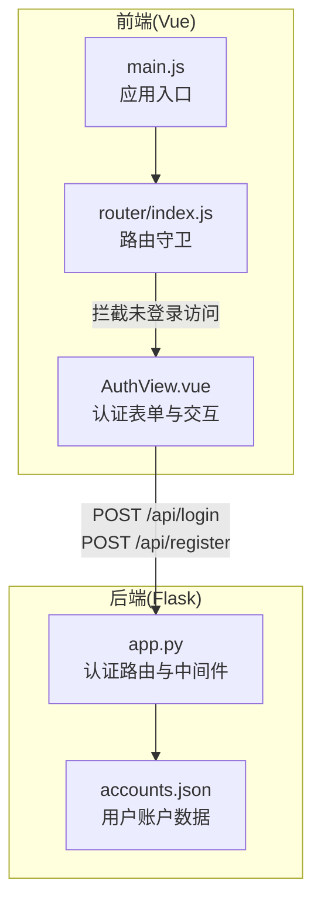
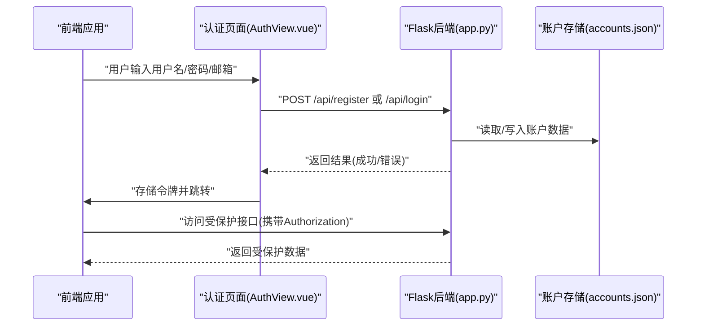
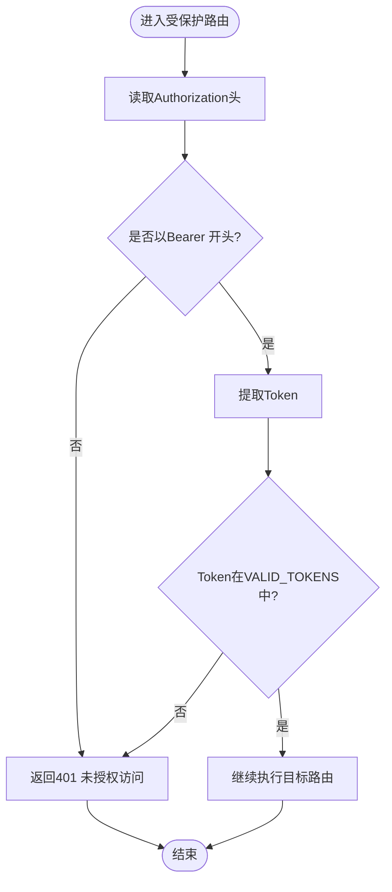
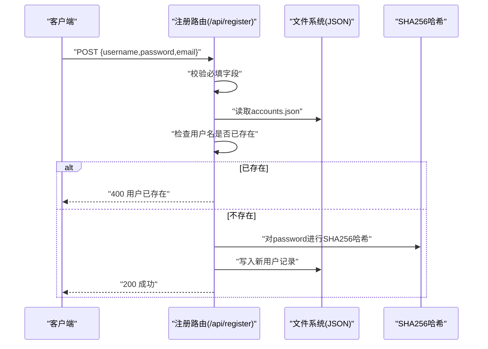
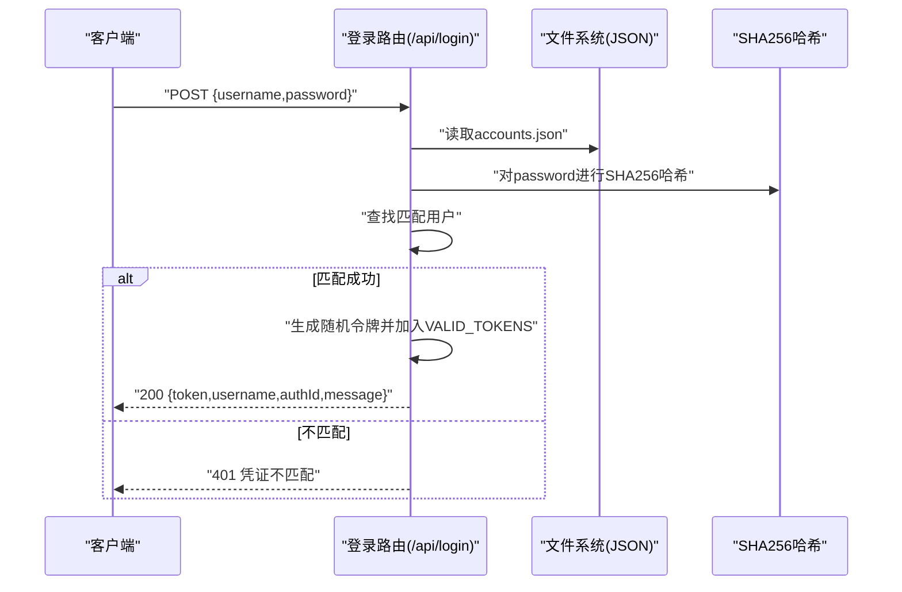
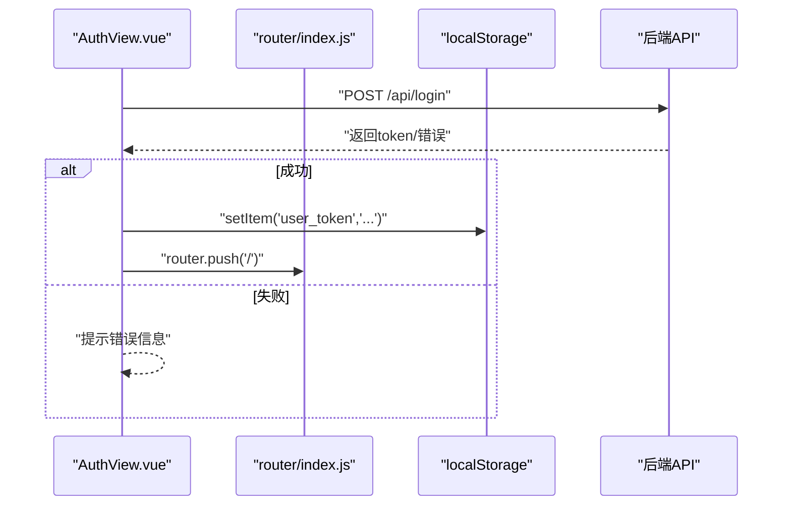
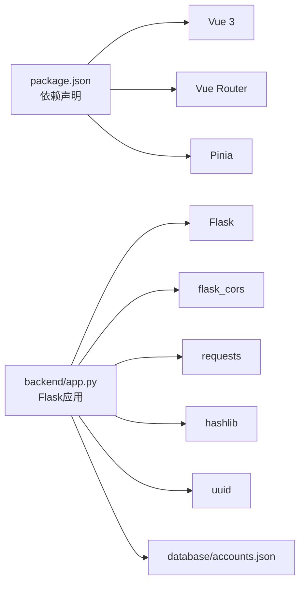

# 用户认证API

<cite>
**本文档引用的文件**
- [backend/app.py](file://backend/app.py)
- [database/accounts.json](file://database/accounts.json)
- [src/views/AuthView.vue](file://src/views/AuthView.vue)
- [src/router/index.js](file://src/router/index.js)
- [src/main.js](file://src/main.js)
- [package.json](file://package.json)
</cite>

## 目录
1. [简介](#简介)
2. [项目结构](#项目结构)
3. [核心组件](#核心组件)
4. [架构总览](#架构总览)
5. [详细组件分析](#详细组件分析)
6. [依赖关系分析](#依赖关系分析)
7. [性能考虑](#性能考虑)
8. [故障排除指南](#故障排除指南)
9. [结论](#结论)
10. [附录](#附录)

## 简介
本文件为用户认证系统的完整API文档，重点覆盖基于JWT令牌的认证机制，包括登录接口(/api/login)与注册接口(/api/register)的设计原理与实现细节。文档涵盖：
- HTTP POST请求参数格式与字段要求
- 密码加密存储机制（SHA256哈希）
- 令牌生成、验证与失效处理流程（VALID_TOKENS集合管理）
- 错误处理策略（凭证验证失败、用户已存在、缺少必要字段等）
- 前端集成示例与最佳实践建议

## 项目结构
后端采用Flask框架，前端采用Vue 3 + Vue Router，数据库使用JSON文件进行轻量级持久化。认证相关的核心文件如下：
- 后端认证与路由：backend/app.py
- 认证账户数据：database/accounts.json
- 前端认证页面与路由守卫：src/views/AuthView.vue、src/router/index.js
- 应用入口与依赖：src/main.js、package.json

图表来源
- [backend/app.py:120-170](file://backend/app.py#L120-L170)
- [src/views/AuthView.vue:23-69](file://src/views/AuthView.vue#L23-L69)
- [src/router/index.js:42-59](file://src/router/index.js#L42-L59)

章节来源
- [backend/app.py:10-330](file://backend/app.py#L10-L330)
- [src/views/AuthView.vue:1-380](file://src/views/AuthView.vue#L1-L380)
- [src/router/index.js:1-61](file://src/router/index.js#L1-L61)
- [src/main.js:1-11](file://src/main.js#L1-L11)
- [package.json:1-28](file://package.json#L1-L28)

## 核心组件
- 认证中间件(require_auth)：通过Authorization头中的Bearer Token校验令牌有效性，令牌存储于内存集合VALID_TOKENS中
- 注册接口(/api/register)：接收username、password、email，校验必填字段，检查用户名重复，使用SHA256对密码加密后写入accounts.json
- 登录接口(/api/login)：接收username、password，使用SHA256哈希比对，成功则生成随机令牌并加入VALID_TOKENS
- 前端认证视图(AuthView.vue)：提供登录/注册表单，调用后端API，存储令牌到localStorage并跳转
- 路由守卫(router/index.js)：拦截非登录页面访问，若无令牌则重定向至登录页

章节来源
- [backend/app.py:13-25](file://backend/app.py#L13-L25)
- [backend/app.py:120-170](file://backend/app.py#L120-L170)
- [src/views/AuthView.vue:23-69](file://src/views/AuthView.vue#L23-L69)
- [src/router/index.js:42-59](file://src/router/index.js#L42-L59)

## 架构总览
下图展示了认证流程的端到端交互：前端发起登录/注册请求，后端执行业务逻辑与数据校验，返回令牌或错误信息；后续受保护接口需携带令牌访问。

图表来源
- [backend/app.py:120-170](file://backend/app.py#L120-L170)
- [src/views/AuthView.vue:23-69](file://src/views/AuthView.vue#L23-L69)

## 详细组件分析

### 认证中间件(require_auth)
- 功能：从Authorization头解析Bearer Token，检查是否存在于VALID_TOKENS集合
- 行为：缺失或无效令牌时返回401未授权
- 注意：令牌仅在内存集合中维护，重启后会丢失

图表来源
- [backend/app.py:15-25](file://backend/app.py#L15-L25)

章节来源
- [backend/app.py:13-25](file://backend/app.py#L13-L25)

### 注册接口(/api/register)
- 请求方法：POST
- 请求体字段：
  - username: 必填
  - password: 必填
  - email: 可选
- 业务逻辑：
  - 校验必填字段，若缺失返回400
  - 读取accounts.json，检查username是否已存在，若存在返回400
  - 使用SHA256对password进行哈希，生成唯一id，写入accounts.json
- 成功响应：返回消息提示
- 错误响应：
  - 缺少必填字段：400
  - 用户名已存在：400

图表来源
- [backend/app.py:120-147](file://backend/app.py#L120-L147)

章节来源
- [backend/app.py:120-147](file://backend/app.py#L120-L147)
- [database/accounts.json:1-14](file://database/accounts.json#L1-L14)

### 登录接口(/api/login)
- 请求方法：POST
- 请求体字段：
  - username: 必填
  - password: 必填
- 业务逻辑：
  - 读取accounts.json，对password进行SHA256哈希
  - 查找匹配的用户名与哈希密码
  - 若匹配，生成随机令牌并加入VALID_TOKENS，返回令牌与用户信息
  - 若不匹配，返回401凭证不匹配
- 成功响应：包含token、username、authId等
- 错误响应：401 凭证不匹配

图表来源
- [backend/app.py:148-170](file://backend/app.py#L148-L170)

章节来源
- [backend/app.py:148-170](file://backend/app.py#L148-L170)
- [database/accounts.json:1-14](file://database/accounts.json#L1-L14)

### 前端集成与最佳实践
- 基础URL配置：前端通过BASE_URL指向后端API根路径
- 登录流程：
  - 发送POST请求到/api/login
  - 成功后将token、username、authId存入localStorage
  - 跳转至仪表盘
- 注册流程：
  - 发送POST请求到/api/register
  - 成功后切换到登录模式
- 路由守卫：
  - 访问非登录页且无token时重定向至登录
  - 已登录访问登录页时重定向至仪表盘

图表来源
- [src/views/AuthView.vue:23-69](file://src/views/AuthView.vue#L23-L69)
- [src/router/index.js:42-59](file://src/router/index.js#L42-L59)

章节来源
- [src/views/AuthView.vue:23-69](file://src/views/AuthView.vue#L23-L69)
- [src/router/index.js:42-59](file://src/router/index.js#L42-L59)

## 依赖关系分析
- 后端依赖：Flask、flask_cors、requests、hashlib、uuid
- 前端依赖：Vue 3、Vue Router、Pinia
- 认证数据：accounts.json用于持久化用户账户信息
- 中间件：require_auth装饰器统一校验令牌

图表来源
- [package.json:11-26](file://package.json#L11-L26)
- [backend/app.py:1-8](file://backend/app.py#L1-L8)

章节来源
- [package.json:1-28](file://package.json#L1-L28)
- [backend/app.py:1-330](file://backend/app.py#L1-L330)

## 性能考虑
- 令牌存储：当前令牌保存在内存集合中，重启后丢失，适合开发环境；生产环境建议使用Redis或数据库持久化
- 文件IO：账户数据读写基于JSON文件，适合小规模数据；大规模并发场景建议迁移到关系型或NoSQL数据库
- 密码哈希：SHA256为纯哈希，无加盐，安全性较低；建议升级为带盐的哈希算法（如bcrypt、argon2）或使用PBKDF2
- 跨域：已启用CORS，便于前后端分离部署

## 故障排除指南
- 400 缺少必填字段
  - 症状：注册/新增用户时返回缺少字段
  - 排查：确认请求体包含username、password；注册接口可选email
  - 参考
    - [backend/app.py:127-128](file://backend/app.py#L127-L128)
    - [backend/app.py:133-134](file://backend/app.py#L133-L134)
- 400 用户名已存在
  - 症状：注册时提示用户已存在
  - 排查：检查accounts.json中是否存在相同username
  - 参考
    - [backend/app.py:133-134](file://backend/app.py#L133-L134)
    - [database/accounts.json:1-14](file://database/accounts.json#L1-L14)
- 401 未授权访问/凭证无效或已过期
  - 症状：访问受保护接口返回401
  - 排查：确认Authorization头格式为Bearer Token；检查token是否在VALID_TOKENS中
  - 参考
    - [backend/app.py:18-23](file://backend/app.py#L18-L23)
    - [backend/app.py:13](file://backend/app.py#L13)
- 401 凭证不匹配
  - 症状：登录失败
  - 排查：确认username与password正确；后端使用SHA256哈希比对
  - 参考
    - [backend/app.py:156-169](file://backend/app.py#L156-L169)

章节来源
- [backend/app.py:127-134](file://backend/app.py#L127-L134)
- [backend/app.py:156-169](file://backend/app.py#L156-L169)
- [backend/app.py:18-23](file://backend/app.py#L18-L23)
- [database/accounts.json:1-14](file://database/accounts.json#L1-L14)

## 结论
本认证系统通过Flask提供基础的注册与登录能力，配合Vue前端实现用户交互与路由守卫，整体结构清晰、易于扩展。当前实现适合开发与演示用途，建议在生产环境中：
- 引入数据库持久化令牌
- 升级密码哈希算法并增加盐值
- 增强错误日志与监控
- 实现令牌刷新与撤销机制

## 附录

### API定义与参数规范
- 注册接口
  - 方法：POST
  - 路径：/api/register
  - 请求体字段：
    - username: 字符串，必填
    - password: 字符串，必填
    - email: 字符串，可选
  - 成功响应：消息提示
  - 错误响应：400 缺少必填字段；400 用户名已存在
  - 参考
    - [backend/app.py:120-147](file://backend/app.py#L120-L147)

- 登录接口
  - 方法：POST
  - 路径：/api/login
  - 请求体字段：
    - username: 字符串，必填
    - password: 字符串，必填
  - 成功响应：包含token、username、authId、message
  - 错误响应：401 凭证不匹配
  - 参考
    - [backend/app.py:148-170](file://backend/app.py#L148-L170)

### 前端集成要点
- 基础URL：BASE_URL指向后端API根路径
- 登录成功后将token、username、authId存入localStorage
- 路由守卫根据localStorage中的token决定是否放行
- 参考
  - [src/views/AuthView.vue:7](file://src/views/AuthView.vue#L7)
  - [src/views/AuthView.vue:34-36](file://src/views/AuthView.vue#L34-L36)
  - [src/router/index.js:47-58](file://src/router/index.js#L47-L58)