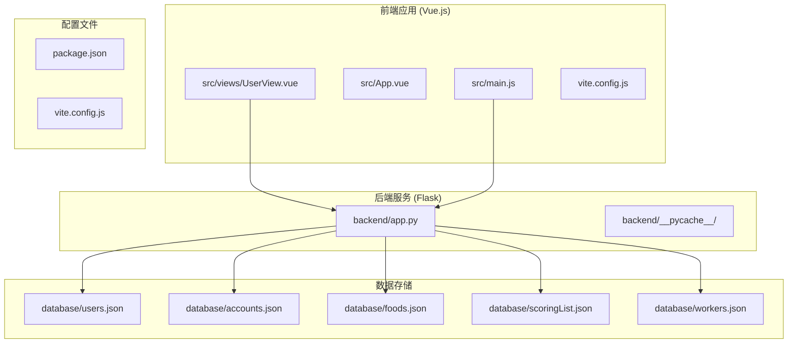
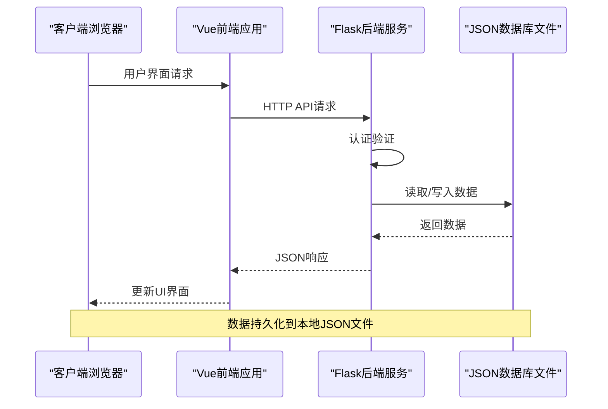
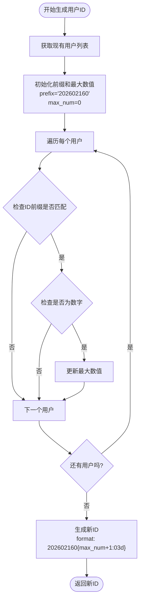
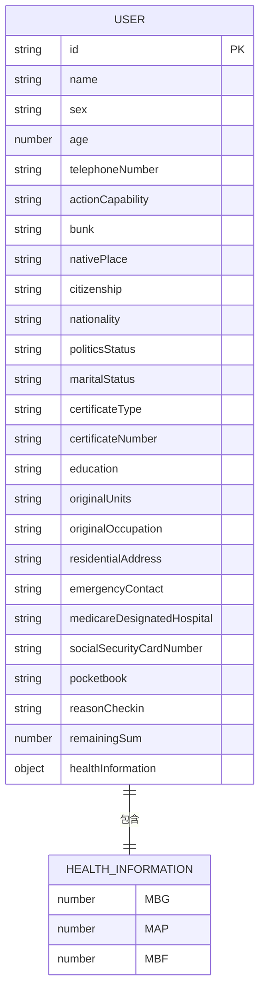
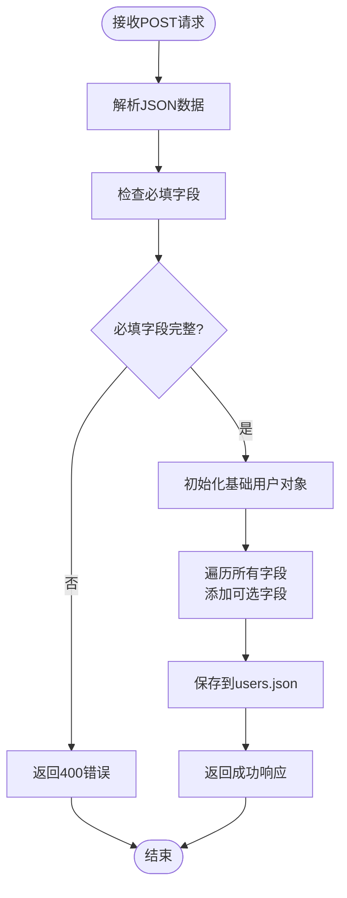
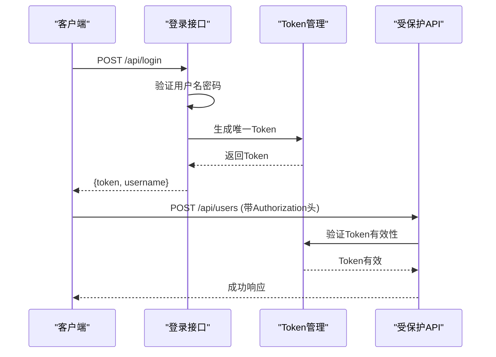
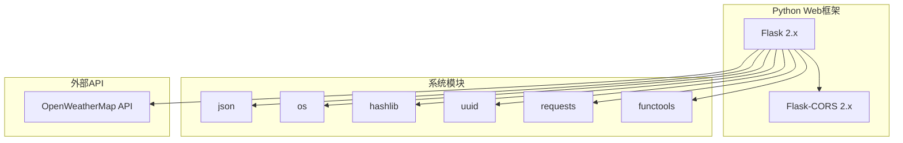

# 老人信息管理API

<cite>
**本文档引用的文件**
- [backend/app.py](file://backend/app.py)
- [database/users.json](file://database/users.json)
- [src/views/UserView.vue](file://src/views/UserView.vue)
- [database/accounts.json](file://database/accounts.json)
- [database/foods.json](file://database/foods.json)
- [package.json](file://package.json)
</cite>

## 目录
1. [简介](#简介)
2. [项目结构](#项目结构)
3. [核心组件](#核心组件)
4. [架构概览](#架构概览)
5. [详细组件分析](#详细组件分析)
6. [依赖关系分析](#依赖关系分析)
7. [性能考虑](#性能考虑)
8. [故障排除指南](#故障排除指南)
9. [结论](#结论)

## 简介

老人信息管理系统是一个基于Vue.js前端和Flask后端的综合性养老机构管理平台。该系统提供了完整的老人信息管理功能，包括用户CRUD操作、认证授权、数据持久化等功能。系统采用前后端分离架构，前端使用Vue 3进行界面展示，后端使用Python Flask提供RESTful API服务。

## 项目结构

系统采用模块化的项目结构，主要分为以下几个部分：



**图表来源**
- [backend/app.py:1-330](file://backend/app.py#L1-L330)
- [src/views/UserView.vue:1-520](file://src/views/UserView.vue#L1-L520)

**章节来源**
- [backend/app.py:1-330](file://backend/app.py#L1-L330)
- [src/views/UserView.vue:1-520](file://src/views/UserView.vue#L1-L520)

## 核心组件

### 后端服务组件

系统的核心后端服务位于`backend/app.py`文件中，主要包含以下功能模块：

1. **认证中间件** - 实现基于Bearer Token的认证机制
2. **用户管理API** - 提供完整的CRUD操作
3. **数据持久化** - 使用JSON文件进行数据存储
4. **ID生成器** - 实现特定格式的用户ID生成

### 前端展示组件

前端主要通过`UserView.vue`组件实现用户界面，包含：
- 用户信息展示卡片
- 搜索和筛选功能
- 表单验证和数据提交
- 弹窗交互界面

**章节来源**
- [backend/app.py:15-25](file://backend/app.py#L15-L25)
- [backend/app.py:184-192](file://backend/app.py#L184-L192)
- [src/views/UserView.vue:1-520](file://src/views/UserView.vue#L1-L520)

## 架构概览

系统采用经典的三层架构设计：



**图表来源**
- [backend/app.py:204-262](file://backend/app.py#L204-L262)
- [src/views/UserView.vue:34-43](file://src/views/UserView.vue#L34-L43)

系统架构特点：
- **前后端分离** - 前端Vue应用独立运行，后端提供RESTful API
- **无状态设计** - API设计遵循REST原则，无会话状态
- **本地数据存储** - 使用JSON文件进行数据持久化
- **简单认证** - 基于Bearer Token的简单认证机制

## 详细组件分析

### 用户管理API组件

#### 1. 用户ID生成规则

系统实现了特定格式的用户ID生成机制：



**图表来源**
- [backend/app.py:184-192](file://backend/app.py#L184-L192)

ID生成规则：
- **格式**：`202602160XXX`（其中XXX为3位递增数字）
- **前缀**：`202602160`
- **自增逻辑**：基于现有用户ID的最大数值+1
- **填充**：不足3位时前面补零

#### 2. 用户信息模型

用户信息采用灵活的数据结构，支持动态字段添加：



**图表来源**
- [database/users.json:1-582](file://database/users.json#L1-L582)
- [src/views/UserView.vue:18-26](file://src/views/UserView.vue#L18-L26)

#### 3. 必填字段验证规则

POST请求的必填字段验证机制：

| 字段名 | 类型 | 必填 | 验证规则 |
|--------|------|------|----------|
| name | string | 是 | 非空字符串，长度>=1 |
| sex | string | 是 | 必须为"男"或"女" |
| age | number | 是 | 数字类型，0-150范围内 |
| telephoneNumber | string | 是 | 11位数字，手机号格式 |
| actionCapability | string | 是 | 枚举值："完全失能","中度失能","轻度失能","能力完好" |
| bunk | string | 是 | 非空字符串，表示床位信息 |

**章节来源**
- [backend/app.py:212-215](file://backend/app.py#L212-L215)
- [src/views/UserView.vue:129-149](file://src/views/UserView.vue#L129-L149)

#### 4. 动态字段处理机制

系统支持可选字段的灵活添加，实现方式：



**图表来源**
- [backend/app.py:217-234](file://backend/app.py#L217-L234)

动态字段处理特点：
- 自动识别并添加非预定义字段
- 保持数据结构的灵活性
- 支持嵌套对象（如healthInformation）

### 认证授权组件

系统实现了基于Bearer Token的认证机制：



**图表来源**
- [backend/app.py:148-169](file://backend/app.py#L148-L169)
- [backend/app.py:15-25](file://backend/app.py#L15-L25)

**章节来源**
- [backend/app.py:13-25](file://backend/app.py#L13-L25)
- [backend/app.py:148-169](file://backend/app.py#L148-L169)

### 错误处理策略

系统实现了统一的错误处理机制：

| 错误类型 | HTTP状态码 | 错误消息 | 处理方式 |
|----------|------------|----------|----------|
| 缺少必填字段 | 400 | "缺少必填字段: field1, field2" | 返回具体缺失字段列表 |
| 用户不存在 | 404 | "用户不存在" | 返回标准错误响应 |
| 凭证无效 | 401 | "凭证无效或已过期" | 要求重新登录 |
| 未授权访问 | 401 | "未授权访问" | 检查Authorization头格式 |
| 服务器错误 | 500 | "内部服务器错误" | 记录日志并返回通用错误 |

**章节来源**
- [backend/app.py:214](file://backend/app.py#L214)
- [backend/app.py:242-243](file://backend/app.py#L242-L243)
- [backend/app.py:257-258](file://backend/app.py#L257-L258)
- [backend/app.py:20](file://backend/app.py#L20)

## 依赖关系分析

### 前端依赖关系

```mermaid
graph TB
subgraph "Vue生态系统"
A[Vue 3.5.25]
B[Vue Router 4.6.4]
C[Pinia 3.0.4]
D[@vueuse/core 14.2.1]
end
subgraph "可视化库"
E[ECharts 5.5.0]
F[Three.js 0.182.0]
G[@jiaminghi/data-view 2.10.0]
end
subgraph "构建工具"
H[Vite 7.3.1]
I[Vue Plugin 6.0.2]
end
A --> B
A --> C
A --> D
A --> E
A --> F
A --> G
H --> I
```

**图表来源**
- [package.json:11-26](file://package.json#L11-L26)

### 后端依赖关系



**图表来源**
- [backend/app.py:1-8](file://backend/app.py#L1-L8)

**章节来源**
- [package.json:1-28](file://package.json#L1-L28)
- [backend/app.py:1-8](file://backend/app.py#L1-L8)

## 性能考虑

### 数据存储优化

1. **内存缓存策略** - 当前实现每次请求都读取JSON文件，建议：
   - 实现内存缓存机制
   - 添加数据变更监听
   - 使用文件监控避免重复读取

2. **并发处理** - 当前JSON文件读写可能产生竞态条件：
   - 实现文件锁机制
   - 添加事务性操作
   - 考虑使用SQLite替代JSON

### API性能优化

1. **响应时间优化** - 当前实现简单直接，建议：
   - 添加API版本控制
   - 实现分页查询
   - 添加缓存层

2. **错误处理优化** - 建议：
   - 统一错误响应格式
   - 添加详细的错误日志
   - 实现重试机制

## 故障排除指南

### 常见问题及解决方案

#### 1. 认证相关问题

**问题**：登录后无法访问受保护API
**原因**：Authorization头格式不正确
**解决方案**：
- 确保Authorization头格式为"Bearer token"
- 检查token是否在有效期内
- 验证用户名密码是否正确

#### 2. 数据验证错误

**问题**：POST请求返回400错误
**原因**：缺少必填字段或数据格式不正确
**解决方案**：
- 检查必填字段是否完整
- 验证数据类型是否正确
- 确认字段格式符合要求

#### 3. 数据持久化问题

**问题**：数据修改后未保存
**原因**：JSON文件写入失败
**解决方案**：
- 检查文件权限
- 确认磁盘空间充足
- 验证JSON格式正确性

**章节来源**
- [backend/app.py:18-24](file://backend/app.py#L18-L24)
- [backend/app.py:214](file://backend/app.py#L214)
- [backend/app.py:56-59](file://backend/app.py#L56-L59)

### 调试技巧

1. **前端调试** - 使用浏览器开发者工具查看网络请求
2. **后端调试** - 检查Flask服务器日志输出
3. **数据验证** - 在API端添加详细的输入验证日志

## 结论

老人信息管理系统是一个功能完整、架构清晰的养老机构管理平台。系统的主要优势包括：

1. **简洁实用** - 采用前后端分离架构，实现清晰的职责划分
2. **数据灵活** - 支持动态字段添加，适应不同业务需求
3. **易于部署** - 基于Python和Vue.js，部署简单
4. **扩展性强** - 模块化设计便于功能扩展

**改进建议**：
1. 实现分页查询和批量操作
2. 添加数据验证和输入过滤
3. 考虑使用数据库替代JSON文件
4. 实现API版本管理和文档自动生成

该系统为养老机构提供了完整的数字化管理解决方案，具有良好的实用价值和发展前景。