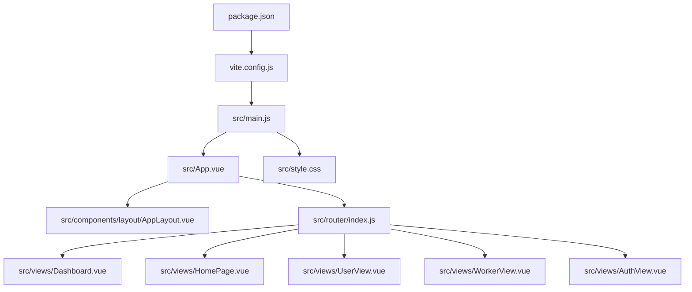
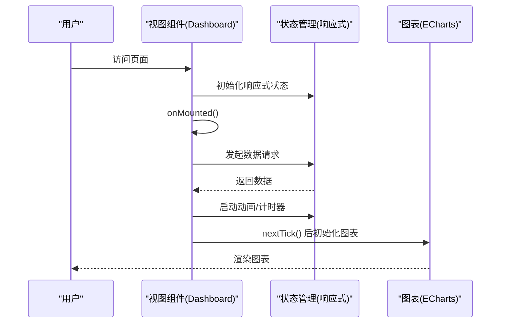
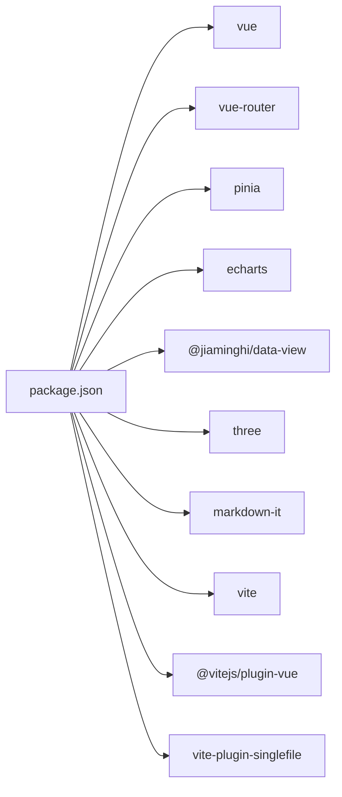

# 代码规范与质量

<cite>
**本文档引用的文件**
- [package.json](file://package.json)
- [vite.config.js](file://vite.config.js)
- [README.md](file://README.md)
- [.gitignore](file://.gitignore)
- [src/main.js](file://src/main.js)
- [src/App.vue](file://src/App.vue)
- [src/style.css](file://src/style.css)
- [src/components/layout/AppLayout.vue](file://src/components/layout/AppLayout.vue)
- [src/router/index.js](file://src/router/index.js)
- [src/views/Dashboard.vue](file://src/views/Dashboard.vue)
- [src/views/HomePage.vue](file://src/views/HomePage.vue)
- [src/views/UserView.vue](file://src/views/UserView.vue)
- [src/views/WorkerView.vue](file://src/views/WorkerView.vue)
- [src/views/AuthView.vue](file://src/views/AuthView.vue)
</cite>

## 目录
1. [引言](#引言)
2. [项目结构](#项目结构)
3. [核心组件](#核心组件)
4. [架构总览](#架构总览)
5. [详细组件分析](#详细组件分析)
6. [依赖关系分析](#依赖关系分析)
7. [性能考虑](#性能考虑)
8. [故障排查指南](#故障排查指南)
9. [结论](#结论)
10. [附录](#附录)

## 引言
本指南面向本项目的前端团队，提供统一的代码规范与质量保证方案，覆盖以下方面：
- JavaScript/Vue.js 编码规范（ES6+ 语法、命名约定、代码风格）
- Vue 组件开发规范（单文件组件结构、props 定义、事件处理）
- CSS 样式规范（BEM 命名法、样式组织原则）
- TypeScript 配置与 JSDoc 注释规范（如适用）
- 代码质量工具配置（ESLint 规则、Prettier 格式化）
- Git 提交规范（commit message 格式、分支命名规则）
- 代码审查流程与最佳实践（PR 模板、审查清单）

本指南基于现有代码库的实际实现进行提炼与扩展，确保规范可落地、易遵循。

## 项目结构
项目采用典型的 Vue 3 + Vite 前端工程结构，核心目录与职责如下：
- src/main.js：应用入口，注册根组件、路由与状态管理
- src/App.vue：根组件，负责布局切换与路由视图渲染
- src/style.css：全局样式与主题变量
- src/components/layout/AppLayout.vue：通用布局组件
- src/router/index.js：路由定义与全局守卫
- src/views/*：页面级视图组件（Dashboard、HomePage、UserView、WorkerView、AuthView）
- vite.config.js：构建与插件配置
- package.json：依赖与脚本
- README.md：项目说明与快速开始

**图表来源**
- [src/main.js:1-11](file://src/main.js#L1-L11)
- [src/App.vue:1-24](file://src/App.vue#L1-L24)
- [src/style.css:1-308](file://src/style.css#L1-L308)
- [src/components/layout/AppLayout.vue:1-340](file://src/components/layout/AppLayout.vue#L1-L340)
- [src/router/index.js:1-61](file://src/router/index.js#L1-L61)
- [src/views/Dashboard.vue:1-341](file://src/views/Dashboard.vue#L1-L341)
- [src/views/HomePage.vue:1-341](file://src/views/HomePage.vue#L1-L341)
- [src/views/UserView.vue:1-409](file://src/views/UserView.vue#L1-L409)
- [src/views/WorkerView.vue:1-733](file://src/views/WorkerView.vue#L1-L733)
- [src/views/AuthView.vue:1-161](file://src/views/AuthView.vue#L1-L161)
- [vite.config.js:1-27](file://vite.config.js#L1-L27)
- [package.json:1-28](file://package.json#L1-L28)

**章节来源**
- [README.md:42-62](file://README.md#L42-L62)
- [package.json:1-28](file://package.json#L1-L28)
- [vite.config.js:1-27](file://vite.config.js#L1-L27)

## 核心组件
- 应用入口与挂载：在入口文件中创建应用实例、注册路由与状态管理，并挂载根组件。
- 根组件：根据路由元信息决定是否渲染布局；通过 RouterView 渲染当前页面。
- 布局组件：提供统一的侧边栏、顶部栏、模态弹窗与响应式交互。
- 路由模块：集中定义路由与全局守卫，实现登录拦截与标题设置。
- 视图组件：按页面职责拆分，包含数据获取、状态管理、图表渲染与表单交互。

**章节来源**
- [src/main.js:1-11](file://src/main.js#L1-L11)
- [src/App.vue:1-24](file://src/App.vue#L1-L24)
- [src/components/layout/AppLayout.vue:1-340](file://src/components/layout/AppLayout.vue#L1-L340)
- [src/router/index.js:1-61](file://src/router/index.js#L1-L61)

## 架构总览
前端采用“入口 -> 根组件 -> 布局 -> 页面视图”的层次化结构，配合路由守卫实现安全控制。构建工具使用 Vite，插件启用 Vue 单文件组件支持与单文件打包。

```mermaid
graph TB
subgraph "构建与运行"
V["Vite 构建器"]
P1["@vitejs/plugin-vue"]
P2["vite-plugin-singlefile"]
end
subgraph "应用层"
M["src/main.js"]
R["src/router/index.js"]
A["src/App.vue"]
L["src/components/layout/AppLayout.vue"]
VIEWS["src/views/*"]
CSS["src/style.css"]
end
V --> P1
V --> P2
M --> A
A --> L
A --> R
R --> VIEWS
M --> CSS
```

**图表来源**
- [vite.config.js:1-27](file://vite.config.js#L1-L27)
- [src/main.js:1-11](file://src/main.js#L1-L11)
- [src/App.vue:1-24](file://src/App.vue#L1-L24)
- [src/components/layout/AppLayout.vue:1-340](file://src/components/layout/AppLayout.vue#L1-L340)
- [src/router/index.js:1-61](file://src/router/index.js#L1-L61)
- [src/style.css:1-308](file://src/style.css#L1-L308)

## 详细组件分析

### JavaScript/Vue.js 编码规范
- ES6+ 语法使用
  - 模块导入导出：统一使用 ES Module（import/export），入口文件使用 type: module。
  - 响应式与组合式 API：优先使用 Composition API（script setup），在组件中声明响应式状态与计算属性。
  - 解构赋值与展开运算符：在函数参数、对象/数组解构与拷贝中合理使用。
  - Promise 与 async/await：异步数据获取与错误处理统一使用 async/await。
- 命名约定
  - 文件命名：组件文件使用帕斯卡命名（如 AppLayout.vue），页面视图文件使用帕斯卡命名（如 Dashboard.vue）。
  - 变量与函数：采用小驼峰命名；常量使用大写下划线或全大写（如 API_BASE）。
  - 组件名称：单文件组件首字母大写，与目录结构一致。
- 代码风格
  - 缩进与空格：统一使用 2 空格缩进；逗号、冒号、分号后加空格。
  - 行长度：建议不超过 100 字符；过长表达式分行书写。
  - 注释：复杂逻辑添加简要注释；对外暴露的函数与组件补充用途说明。
  - 导入顺序：标准库 → 第三方库 → 项目内相对路径 → 样式文件。

**章节来源**
- [package.json:5](file://package.json#L5)
- [src/main.js:1-11](file://src/main.js#L1-L11)
- [src/App.vue:1-24](file://src/App.vue#L1-L24)
- [src/components/layout/AppLayout.vue:1-340](file://src/components/layout/AppLayout.vue#L1-L340)
- [src/router/index.js:1-61](file://src/router/index.js#L1-L61)

### Vue 组件开发规范
- 单文件组件结构
  - 顶层结构：script setup（含导入、响应式状态、计算属性、方法）、template（结构与事件绑定）、style（scoped 样式）。
  - 导入顺序：第三方库、路由与状态管理、内部组件与工具。
  - 模板结构：语义化标签与语义化类名；事件绑定使用 .stop/.prevent 等修饰符时明确其作用。
- props 定义与校验
  - 当前项目未广泛使用 props；若未来引入子组件，建议显式声明 props 类型与默认值。
- 事件处理
  - 事件命名：使用小驼峰；避免在模板中直接调用副作用函数。
  - 事件传递：通过 emits 明确向外抛出的事件，便于父组件监听与测试。
- 生命周期与副作用
  - 在 onMounted 中发起数据请求；在 onUnmounted 中清理定时器与事件监听，避免内存泄漏。
  - 使用 nextTick 确保 DOM 更新后再进行 DOM 操作（如图表初始化）。

**图表来源**
- [src/views/Dashboard.vue:172-204](file://src/views/Dashboard.vue#L172-L204)
- [src/views/HomePage.vue:172-204](file://src/views/HomePage.vue#L172-L204)

**章节来源**
- [src/views/Dashboard.vue:1-341](file://src/views/Dashboard.vue#L1-L341)
- [src/views/HomePage.vue:1-341](file://src/views/HomePage.vue#L1-L341)

### CSS 样式规范
- BEM 命名法
  - 块（Block）：独立的功能单元（如 .glass-card、.filter-section）。
  - 元素（Element）：块内的组成部分（如 .glass-card__header、.filter-section__search-input）。
  - 修饰符（Modifier）：状态或变体（如 .glass-card--highlight、.filter-section--expanded）。
- 样式组织原则
  - 全局样式：在全局样式文件中定义变量、重置与基础样式，组件样式使用 scoped 避免污染。
  - 组件样式：在组件的 style 标签中编写 scoped 样式，保持样式与组件耦合。
  - 响应式：在组件样式中使用媒体查询，避免在全局样式中过度碎片化。
- 变量与主题
  - 使用 CSS 变量统一管理颜色、字体与间距，便于主题切换与维护。
  - 在全局样式中集中定义变量，在组件中按需使用。

**章节来源**
- [src/style.css:1-308](file://src/style.css#L1-L308)
- [src/views/UserView.vue:411-519](file://src/views/UserView.vue#L411-L519)
- [src/views/WorkerView.vue:735-800](file://src/views/WorkerView.vue#L735-L800)

### TypeScript 配置与 JSDoc 注释规范
- TypeScript 配置
  - 当前项目未启用 TypeScript；若后续引入 TS，建议在项目根目录添加 tsconfig.json，开启严格模式与合适的编译目标。
  - 在 Vue 单文件组件中使用 tsx 或在 script lang="ts" 中编写类型定义。
- JSDoc 注释规范
  - 函数/方法：说明参数类型、返回值与异常；复杂逻辑补充算法说明。
  - 组件：说明 props、emits、slots 与行为。
  - 导出模块：为公共 API 添加简要说明，便于 IDE 自动补全与文档生成。

[本节为通用规范说明，不直接分析具体文件，故无“章节来源”]

### 代码质量工具配置
- ESLint 规则
  - 推荐规则集：eslint:recommended 或 airbnb-base/airbnb-typescript-prettier（按项目需求选择）。
  - 重点规则：no-unused-vars、no-console、prefer-const、eqeqeq、indent、quotes、semi。
  - Vue 特定规则：vue/multi-word-component-names、vue/no-unused-vars、vue/max-len。
- Prettier 格式化
  - 统一缩进（2 空格）、单引号、尾随逗号、分号可选。
  - 与 ESLint 冲突时以 Prettier 为准（使用 eslint-config-prettier）。
- 集成方式
  - 在提交前通过 lint-staged 与 husky 执行 ESLint 与 Prettier，避免污染历史记录。
  - CI 中增加 lint 与格式化检查步骤，失败即阻断合并。

[本节为通用规范说明，不直接分析具体文件，故无“章节来源”]

### Git 提交规范
- commit message 格式
  - 类型: 简要描述（空一行）正文（可选）+ 关联 Issue
  - 类型：feat、fix、docs、style、refactor、perf、test、build、ci、chore、revert
  - 示例：feat(router): 添加登录路由守卫
- 分支命名规则
  - develop、feature/*、fix/*、docs/*、refactor/*
  - 避免使用大写与特殊字符，使用短横线分隔单词
- 提交与合并
  - 小步提交，清晰描述变更；合并前确保通过 CI 与代码审查

[本节为通用规范说明，不直接分析具体文件，故无“章节来源”]

### 代码审查流程与最佳实践
- PR 模板
  - 标题：简述变更类型与目的
  - 概述：变更背景、动机与影响范围
  - 测试：自测步骤与边界条件
  - 截图/录屏：UI 变更提供截图或录屏
  - 关联：关闭/关联 Issue
- 审查清单
  - 代码可读性：命名是否清晰、注释是否充分
  - 安全性：是否处理了输入校验与权限控制
  - 性能：是否存在不必要的重渲染或重复请求
  - 兼容性：是否考虑了跨浏览器与响应式
  - 可测试性：是否易于单元测试与集成测试

[本节为通用规范说明，不直接分析具体文件，故无“章节来源”]

## 依赖关系分析
- 运行时依赖
  - Vue 3、Vue Router、Pinia、ECharts、@jiaminghi/data-view、markdown-it、three 等
- 开发依赖
  - Vite、@vitejs/plugin-vue、vite-plugin-singlefile
- 构建配置
  - Vite 插件链路：Vue 单文件组件解析与单文件打包
  - 输出策略：入口文件名、资源目录与 Rollup 输出配置

**图表来源**
- [package.json:11-26](file://package.json#L11-L26)

**章节来源**
- [package.json:1-28](file://package.json#L1-L28)
- [vite.config.js:1-27](file://vite.config.js#L1-L27)

## 性能考虑
- 资源加载
  - 图表初始化延迟：在 nextTick 后执行，避免 DOM 未就绪导致的尺寸异常。
  - 定时器管理：在组件卸载时清理，防止内存泄漏与后台任务持续执行。
- 样式与渲染
  - 使用 scoped 样式减少选择器层级，提升渲染性能。
  - 合理使用 CSS 变量与预设类名，避免内联样式的频繁重排。
- 构建优化
  - 使用 Vite 的按需加载与 Tree Shaking；生产环境启用压缩与资源内联策略。

[本节提供通用指导，不直接分析具体文件，故无“章节来源”]

## 故障排查指南
- 路由与鉴权
  - 登录拦截：未登录访问受保护路由将跳转至登录页；已登录访问登录页将跳转至仪表盘。
  - 标题设置：路由守卫中根据 meta.title 动态设置页面标题。
- 数据加载
  - 视图组件在 mounted 中发起请求；若失败，控制台会打印错误信息。
  - 图表初始化需等待 DOM 就绪，使用 nextTick 与 resize 监听。
- 样式问题
  - scoped 样式未生效：检查类名拼写与选择器优先级；确认未被全局样式覆盖。
  - 响应式布局异常：检查媒体查询断点与网格列数配置。

**章节来源**
- [src/router/index.js:42-59](file://src/router/index.js#L42-L59)
- [src/views/Dashboard.vue:172-204](file://src/views/Dashboard.vue#L172-L204)
- [src/views/HomePage.vue:172-204](file://src/views/HomePage.vue#L172-L204)

## 结论
本指南总结了项目当前的代码风格与架构实践，并提供了可落地的质量保障方案。建议团队在日常开发中：
- 严格遵循 ES6+/Vue 组件规范与 CSS 命名约定
- 在引入新特性时补充 ESLint/Prettier 规则与测试
- 通过 Git 提交规范与代码审查流程提升协作效率与代码质量

[本节为总结性内容，不直接分析具体文件，故无“章节来源”]

## 附录
- 快速开始与构建命令参考
  - 安装依赖：npm install 或 pnpm install
  - 开发模式：npm run dev
  - 构建部署：npm run build
  - 预览构建：npm run preview

**章节来源**
- [README.md:64-99](file://README.md#L64-L99)