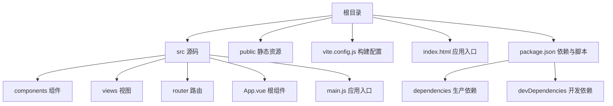
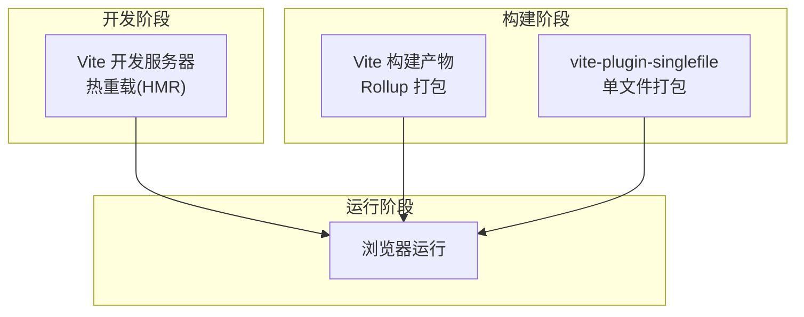
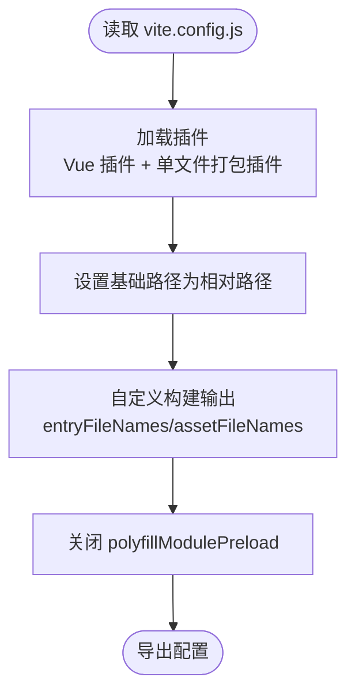
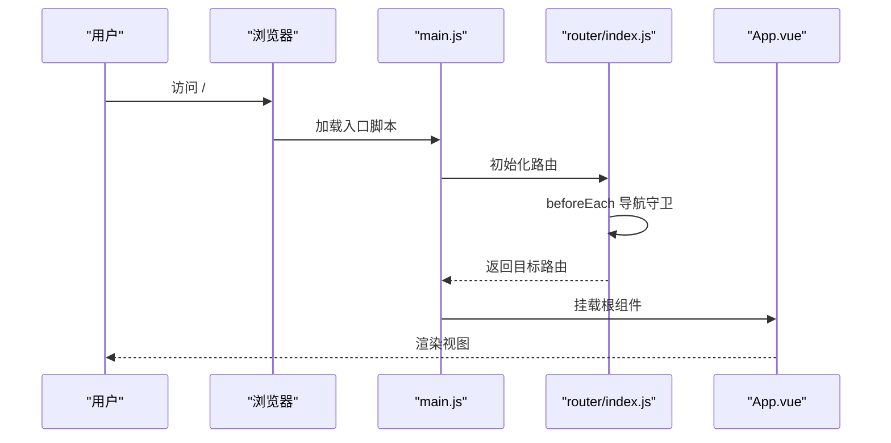
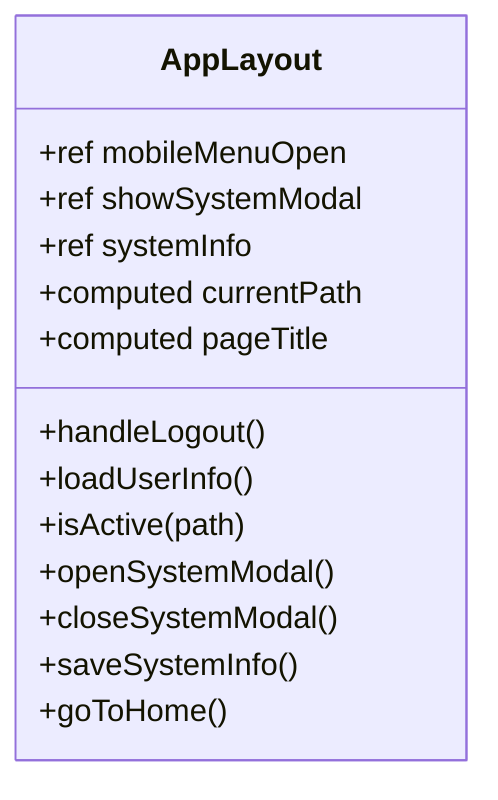
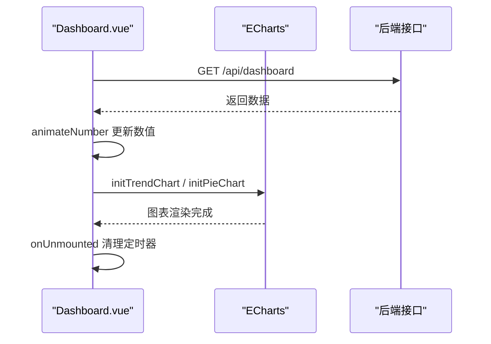
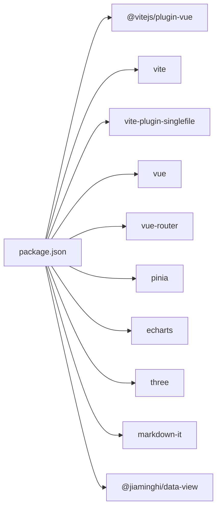

# 开发指南

<cite>
**本文档引用的文件**
- [package.json](file://package.json)
- [vite.config.js](file://vite.config.js)
- [index.html](file://index.html)
- [src/main.js](file://src/main.js)
- [src/App.vue](file://src/App.vue)
- [src/router/index.js](file://src/router/index.js)
- [src/components/layout/AppLayout.vue](file://src/components/layout/AppLayout.vue)
- [src/views/Dashboard.vue](file://src/views/Dashboard.vue)
- [src/style.css](file://src/style.css)
- [README.md](file://README.md)
- [.gitignore](file://.gitignore)
</cite>

## 目录
1. [引言](#引言)
2. [项目结构](#项目结构)
3. [核心组件](#核心组件)
4. [架构总览](#架构总览)
5. [详细组件分析](#详细组件分析)
6. [依赖关系分析](#依赖关系分析)
7. [性能考虑](#性能考虑)
8. [故障排查指南](#故障排查指南)
9. [结论](#结论)
10. [附录](#附录)

## 引言
本指南面向参与“养老机构数据管理平台”项目的前端开发人员，提供从开发环境搭建、构建与部署到团队协作的全流程文档。项目采用 Vue 3 + Vite 技术栈，配合单文件打包插件实现便捷的本地预览与部署。

## 项目结构
项目采用典型的 Vue 3 单页应用结构，前端源码集中在 src 目录，构建配置位于根目录的 vite.config.js，入口 HTML 位于根目录 index.html，包管理与脚本定义在 package.json。

**图表来源**
- [package.json:1-28](file://package.json#L1-L28)
- [vite.config.js:1-27](file://vite.config.js#L1-L27)
- [index.html:1-14](file://index.html#L1-L14)
- [src/main.js:1-11](file://src/main.js#L1-L11)
- [src/App.vue:1-24](file://src/App.vue#L1-L24)

**章节来源**
- [README.md:42-62](file://README.md#L42-L62)
- [package.json:1-28](file://package.json#L1-L28)
- [vite.config.js:1-27](file://vite.config.js#L1-L27)
- [index.html:1-14](file://index.html#L1-L14)

## 核心组件
- 应用入口与状态管理：在入口文件中创建 Vue 应用实例，注册 Pinia 状态管理和路由，挂载到 DOM。
- 根组件与布局：根组件根据路由元信息决定是否渲染全局布局；布局组件负责导航、标题与用户会话管理。
- 路由与守卫：基于 Hash 模式的路由，全局前置守卫进行登录校验与标题设置。
- 视图与数据：仪表盘视图集成 ECharts 实现数据可视化，包含趋势图、饼图与滚动榜单等模块。

**章节来源**
- [src/main.js:1-11](file://src/main.js#L1-L11)
- [src/App.vue:1-24](file://src/App.vue#L1-L24)
- [src/components/layout/AppLayout.vue:1-167](file://src/components/layout/AppLayout.vue#L1-L167)
- [src/router/index.js:1-61](file://src/router/index.js#L1-L61)
- [src/views/Dashboard.vue:1-210](file://src/views/Dashboard.vue#L1-L210)

## 架构总览
前端采用单页应用架构，Vite 提供开发服务器与构建能力；单文件打包插件用于生成可直接打开的单文件 HTML，便于本地演示与快速交付。

**图表来源**
- [vite.config.js:1-27](file://vite.config.js#L1-L27)
- [package.json:6-10](file://package.json#L6-L10)

## 详细组件分析

### Vite 构建配置与自定义
- 插件系统：启用 Vue 插件与单文件打包插件，后者提供推荐的构建配置、移除模块加载器与内联样式/脚本策略。
- 基础路径与输出：基础路径设置为相对路径，构建输出目录与命名策略自定义，禁用 polyfill 预加载以简化产物。
- 开发服务器：默认端口为 5173，可通过命令行或环境变量调整（参考脚本与配置文件）。

**图表来源**
- [vite.config.js:5-26](file://vite.config.js#L5-L26)

**章节来源**
- [vite.config.js:1-27](file://vite.config.js#L1-L27)
- [package.json:6-10](file://package.json#L6-L10)

### 应用入口与路由
- 入口文件：创建应用实例，注册 Pinia 与路由，挂载根组件。
- 根组件：根据路由元信息判断是否隐藏布局，统一注入全局样式。
- 路由：Hash 模式，包含登录、仪表盘、首页、用户与工人视图；全局守卫负责登录拦截与标题设置。

**图表来源**
- [src/main.js:1-11](file://src/main.js#L1-L11)
- [src/router/index.js:37-61](file://src/router/index.js#L37-L61)
- [src/App.vue:1-24](file://src/App.vue#L1-L24)

**章节来源**
- [src/main.js:1-11](file://src/main.js#L1-L11)
- [src/router/index.js:1-61](file://src/router/index.js#L1-L61)
- [src/App.vue:1-24](file://src/App.vue#L1-L24)

### 布局组件与用户交互
- 布局组件：提供侧边栏导航、顶部栏、移动端菜单、系统信息弹窗与登出逻辑。
- 用户会话：从本地存储读取用户信息，若缺失则触发登出流程。
- 标题与激活状态：根据菜单项与当前路由计算页面标题与导航高亮。

**图表来源**
- [src/components/layout/AppLayout.vue:1-167](file://src/components/layout/AppLayout.vue#L1-L167)

**章节来源**
- [src/components/layout/AppLayout.vue:1-167](file://src/components/layout/AppLayout.vue#L1-L167)

### 仪表盘视图与数据可视化
- 数据获取：在挂载后调用后端接口获取数据，包含天气统计、评分列表与膳食信息。
- 动画与图表：使用纯 JS 补间动画更新数值，ECharts 初始化趋势图与饼图，并处理窗口尺寸变化。
- 生命周期：在卸载时清理定时器，避免内存泄漏与资源浪费。

**图表来源**
- [src/views/Dashboard.vue:173-204](file://src/views/Dashboard.vue#L173-L204)

**章节来源**
- [src/views/Dashboard.vue:1-210](file://src/views/Dashboard.vue#L1-L210)

### 样式与主题
- 设计系统：通过 CSS 变量定义主色、辅助色、文本与背景色，统一字体族与动画效果。
- 响应式网格：提供多种栅格布局类，适配不同屏幕尺寸。
- 组件样式：玻璃卡片、模态框、滚动条等通用样式封装。

**章节来源**
- [src/style.css:1-308](file://src/style.css#L1-L308)

## 依赖关系分析
- 包管理与脚本：使用 npm 脚本启动开发、构建与预览；支持 pnpm 安装依赖。
- 生产依赖：Vue 3、Vue Router、Pinia、ECharts、Three.js、Markdown-it、@jiaminghi/data-view 等。
- 开发依赖：Vite、@vitejs/plugin-vue、vite-plugin-singlefile。

**图表来源**
- [package.json:11-26](file://package.json#L11-L26)

**章节来源**
- [package.json:1-28](file://package.json#L1-L28)

## 性能考虑
- 单文件打包：通过单文件插件生成独立 HTML，减少资源拆分带来的加载复杂度，适合本地演示与快速交付。
- 构建输出：自定义入口与资源命名，避免 Rollup 自动生成的 chunk 导致的额外网络往返。
- 图表性能：ECharts 图表在窗口 resize 时进行重绘，需在组件卸载时清理事件监听，避免重复绑定导致的性能问题。
- 资源优化：建议在生产构建前对图片与字体进行压缩与格式优化，减少首屏加载时间。

**章节来源**
- [vite.config.js:15-25](file://vite.config.js#L15-L25)
- [src/views/Dashboard.vue:111-112](file://src/views/Dashboard.vue#L111-L112)

## 故障排查指南
- CORS 与跨域：单文件 HTML 直接打开可能遇到跨域限制，建议使用 Vite 预览或本地 HTTP 服务器。
- 路由与登录：若出现循环跳转或无法进入仪表盘，请检查本地存储中的 Token 是否存在以及守卫逻辑。
- 图表不显示：确认 ECharts 初始化时机与容器尺寸，确保在 nextTick 后再执行初始化。
- 依赖安装：优先使用 pnpm 或 npm 安装，若遇到权限或缓存问题，清理 node_modules 与锁文件后重试。

**章节来源**
- [README.md:101-116](file://README.md#L101-L116)
- [src/router/index.js:42-61](file://src/router/index.js#L42-L61)
- [src/views/Dashboard.vue:196-200](file://src/views/Dashboard.vue#L196-L200)

## 结论
本指南提供了从开发环境到构建部署的完整路径，结合 Vite 的高效开发体验与单文件打包能力，能够快速迭代并稳定交付。建议团队在日常开发中遵循统一的代码风格与提交规范，配合版本控制与 CI/CD 流程，提升协作效率与发布质量。

## 附录

### 开发环境搭建
- Node.js 版本：建议使用 LTS 版本（如 18.x 或 20.x），以获得更稳定的包管理与构建体验。
- 包管理器：推荐使用 pnpm，具备更快的安装速度与更强的依赖隔离能力；也可使用 npm。
- 依赖安装：在项目根目录执行安装命令，等待依赖安装完成。
- 启动开发：执行开发脚本，浏览器自动打开开发服务器地址。

**章节来源**
- [README.md:64-80](file://README.md#L64-L80)
- [package.json:6-10](file://package.json#L6-L10)

### Vite 配置与自定义
- 开发服务器：默认端口为 5173，可通过环境变量或命令行参数调整。
- 插件系统：启用 Vue 插件与单文件打包插件，后者提供推荐的构建配置与内联策略。
- 构建输出：自定义入口与资源命名，禁用 polyfill 预加载以简化产物。
- 基础路径：设置为相对路径，便于在子目录或单文件场景下正确加载资源。

**章节来源**
- [vite.config.js:5-26](file://vite.config.js#L5-L26)

### 代码规范与最佳实践
- ESLint：建议在项目中集成 ESLint，统一代码风格与错误检查规则。
- Prettier：与 ESLint 协同使用，保证格式一致性。
- Git 提交规范：建议采用约定式提交（如 feat/fix/docs 等），便于生成变更日志与自动化发布。

[本节为通用实践建议，不直接分析具体文件，故无章节来源]

### 调试技巧与开发工具
- 浏览器开发者工具：利用 Elements、Console、Network 面板定位样式、脚本与资源加载问题。
- Vue DevTools：安装 Vue DevTools 扩展，查看组件树、状态与路由信息，辅助定位状态与生命周期问题。

[本节为通用实践建议，不直接分析具体文件，故无章节来源]

### 生产构建与单文件打包
- 标准构建：生成多文件产物，适合部署到传统 Web 服务器。
- 单文件构建：使用单文件插件生成独立 HTML，便于本地直接打开与快速交付。
- 预览构建：使用预览脚本在本地验证构建产物。

**章节来源**
- [README.md:82-112](file://README.md#L82-L112)
- [package.json:6-10](file://package.json#L6-L10)

### 部署指南
- Web 服务器：将 dist 目录内容部署至 Nginx/Apache/IIS 等静态服务器。
- 单文件 HTML：直接打开 dist/index.html（需 HTTP 服务器避免 CORS 问题）。
- 静态托管平台：可部署至 Vercel、Netlify、GitHub Pages 等平台。

**章节来源**
- [README.md:101-116](file://README.md#L101-L116)

### 团队协作与 CI/CD 建议
- 版本控制：使用 Git 进行版本管理，分支策略建议采用 Git Flow 或 GitHub Flow。
- CI/CD：在 CI 中执行依赖安装、构建与测试，成功后自动部署到目标环境。
- 代码审查：引入 Pull Request 审查流程，确保代码质量与规范执行。

[本节为通用实践建议，不直接分析具体文件，故无章节来源]