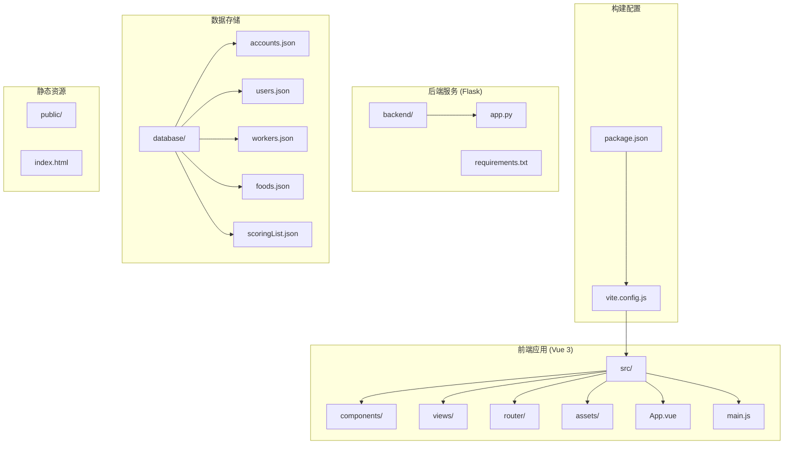
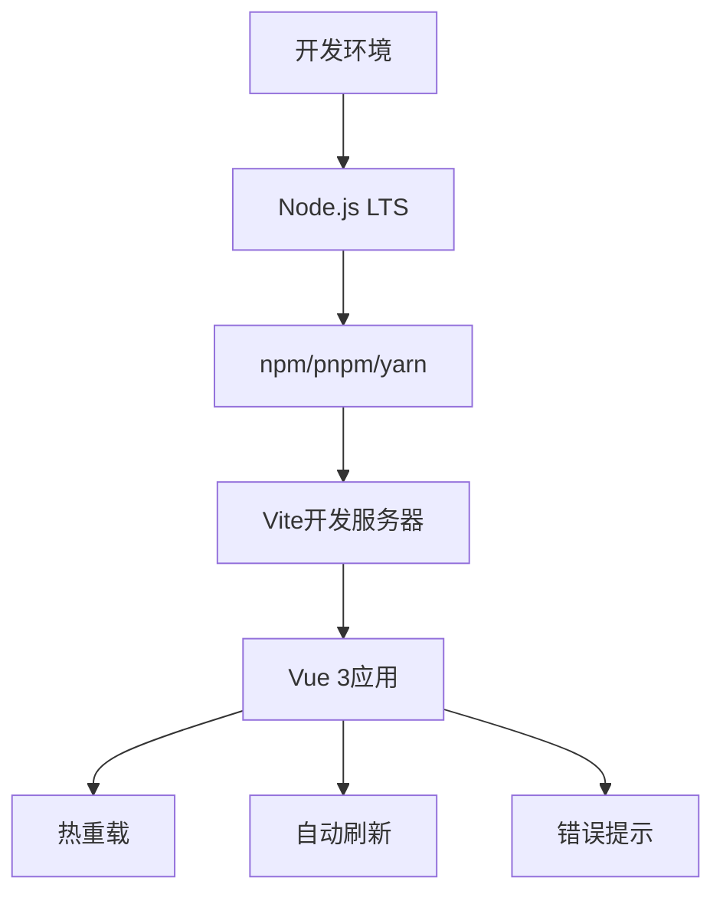
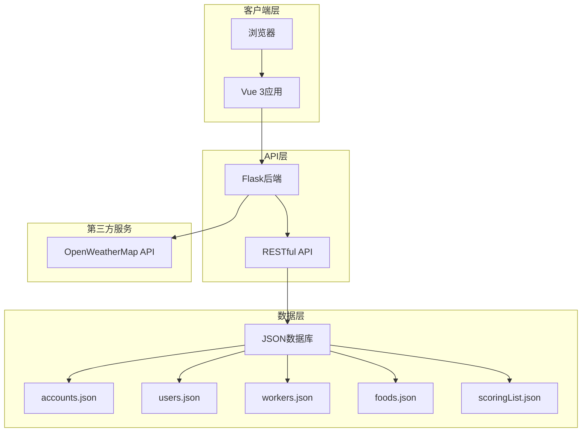
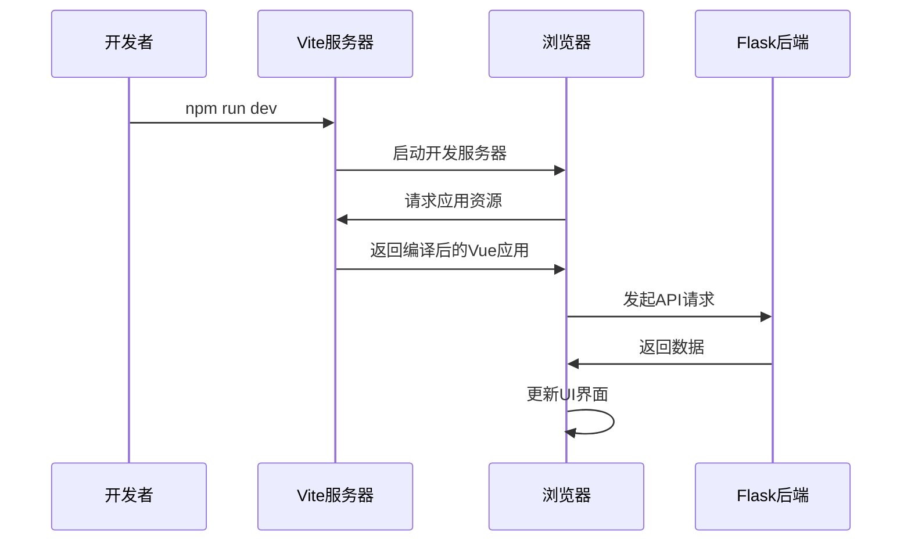
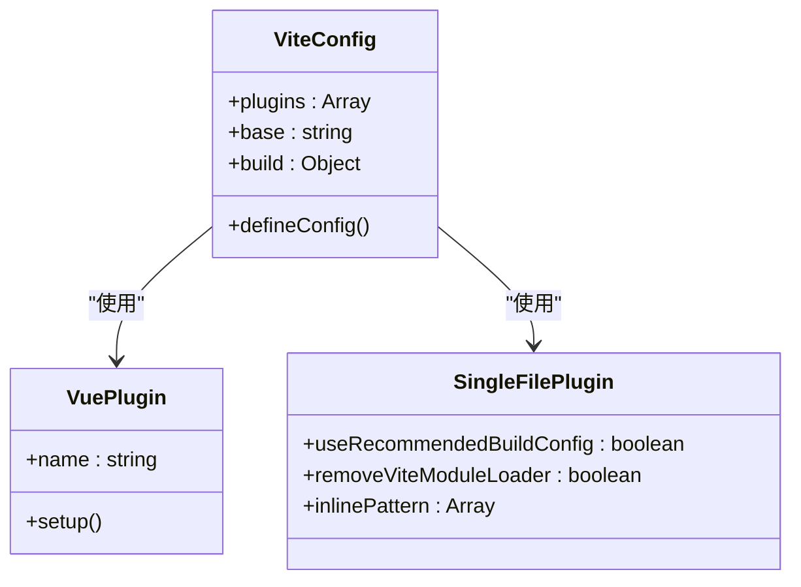
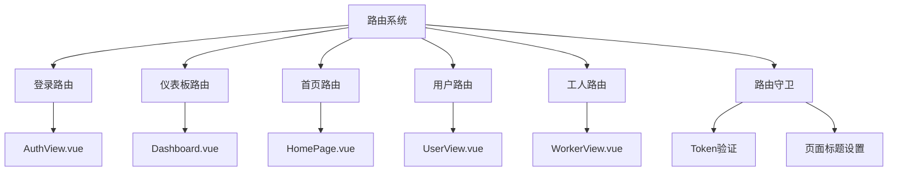
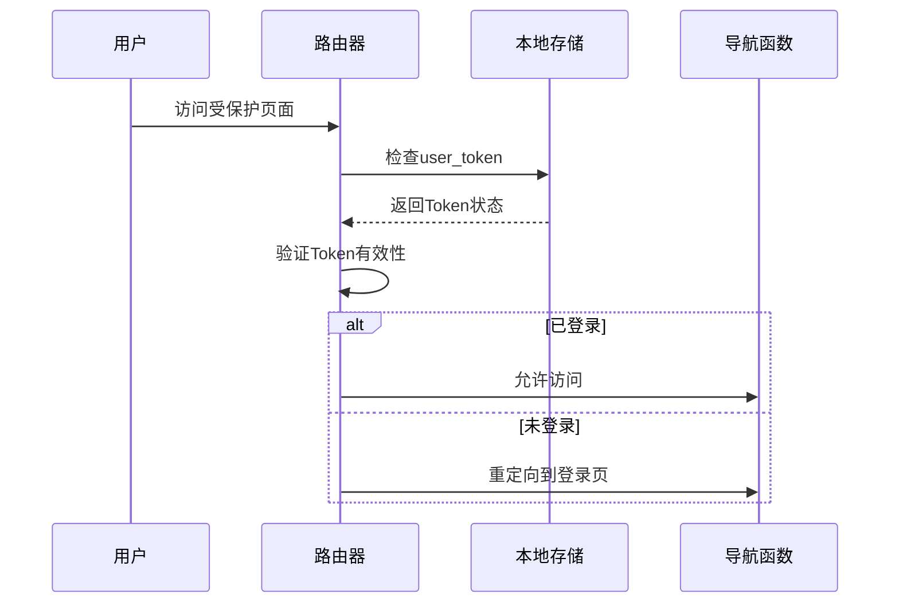

# 开发环境搭建

<cite>
**本文档中引用的文件**
- [package.json](file://package.json)
- [vite.config.js](file://vite.config.js)
- [.gitignore](file://.gitignore)
- [README.md](file://README.md)
- [src/main.js](file://src/main.js)
- [index.html](file://index.html)
- [src/App.vue](file://src/App.vue)
- [src/router/index.js](file://src/router/index.js)
- [backend/requirements.txt](file://backend/requirements.txt)
</cite>

## 目录
1. [简介](#简介)
2. [项目结构](#项目结构)
3. [核心组件](#核心组件)
4. [架构概览](#架构概览)
5. [详细组件分析](#详细组件分析)
6. [依赖分析](#依赖分析)
7. [性能考虑](#性能考虑)
8. [故障排除指南](#故障排除指南)
9. [结论](#结论)
10. [附录](#附录)

## 简介

这是一个专为现代养老机构设计的数据管理平台，采用Vue 3 + Vite + ECharts技术栈构建的可视化后台管理系统。平台具有赛博朋克视觉风格，结合实时数据分析，为管理人员提供直观、高效的决策支持。

该平台包含多个核心功能模块：
- 数据大屏展示：实时天气数据、老人健康信息、护工评分系统
- 身份验证系统：基于SHA-256哈希加密的账户体系
- 路由守卫：全局Token校验拦截
- 响应式布局：完美适配大屏监控、桌面办公及移动端访问

## 项目结构

该项目采用前后端分离的架构设计，主要分为以下层次：



**图表来源**
- [package.json:1-28](file://package.json#L1-L28)
- [vite.config.js:1-27](file://vite.config.js#L1-L27)
- [README.md:42-62](file://README.md#L42-L62)

**章节来源**
- [README.md:42-62](file://README.md#L42-L62)
- [package.json:1-28](file://package.json#L1-L28)

## 核心组件

### 前端技术栈

项目采用现代化的前端技术栈，确保开发效率和运行性能：

| 组件 | 版本 | 用途 |
|------|------|------|
| Vue 3 | ^3.5.25 | 渐进式前端框架，采用Composition API |
| Vite | ^7.3.1 | 下一代前端构建工具 |
| Pinia | ^3.0.4 | Vue 3的状态管理解决方案 |
| Vue Router | ^4.6.4 | Vue.js官方路由管理器 |
| ECharts | ^5.5.0 | 强大的数据可视化图表库 |
| @jiaminghi/data-view | ^2.10.0 | 数据大屏可视化组件库 |

### 开发工具链



**图表来源**
- [package.json:6-10](file://package.json#L6-L10)
- [vite.config.js:5-13](file://vite.config.js#L5-L13)

**章节来源**
- [package.json:11-26](file://package.json#L11-L26)
- [README.md:28-41](file://README.md#L28-L41)

## 架构概览

### 整体架构设计



**图表来源**
- [src/router/index.js:42-59](file://src/router/index.js#L42-L59)
- [src/views/Dashboard.vue:176-178](file://src/views/Dashboard.vue#L176-L178)

### 开发服务器架构



**图表来源**
- [package.json:7](file://package.json#L7)
- [vite.config.js:14-25](file://vite.config.js#L14-L25)

## 详细组件分析

### 依赖管理系统

#### 包管理器选择

项目支持多种包管理器，开发者可以根据个人偏好选择：

| 包管理器 | 命令 | 特点 |
|----------|------|------|
| npm | `npm install` | Node.js默认包管理器，生态最广泛 |
| pnpm | `pnpm install` | 速度快，节省磁盘空间 |
| yarn | `yarn install` | 早期流行的选择，功能稳定 |

#### 依赖分类

```mermaid
graph LR
subgraph "运行时依赖"
A[vue ^3.5.25]
B[vue-router ^4.6.4]
C[pinia ^3.0.4]
D[echarts ^5.5.0]
E[@jiaminghi/data-view ^2.10.0]
F[three ^0.182.0]
G[markdown-it ^14.1.1]
H[@vueuse/core ^14.2.1]
end
subgraph "开发依赖"
I[@vitejs/plugin-vue ^6.0.2]
J[vite ^7.3.1]
K[vite-plugin-singlefile ^2.3.0]
end
```

**图表来源**
- [package.json:11-26](file://package.json#L11-L26)

**章节来源**
- [package.json:11-26](file://package.json#L11-L26)

### Vite开发服务器配置

#### 核心配置解析

Vite配置文件定义了开发服务器的核心行为：

| 配置项 | 值 | 说明 |
|--------|-----|------|
| base | './' | 相对路径基础设置 |
| build.assetsDir | '' | 资源目录设置为空 |
| rollupOptions.output.entryFileNames | 'index.js' | 入口文件命名 |
| polyfillModulePreload | false | 禁用polyfill预加载 |

#### 插件配置



**图表来源**
- [vite.config.js:5-13](file://vite.config.js#L5-L13)

**章节来源**
- [vite.config.js:1-27](file://vite.config.js#L1-L27)

### 路由系统

#### 路由配置分析



**图表来源**
- [src/router/index.js:3-35](file://src/router/index.js#L3-L35)

#### 路由守卫实现

路由守卫提供了完整的身份验证机制：



**图表来源**
- [src/router/index.js:42-59](file://src/router/index.js#L42-L59)

**章节来源**
- [src/router/index.js:1-61](file://src/router/index.js#L1-L61)

### 数据可视化组件

#### ECharts集成

项目集成了丰富的数据可视化功能：

| 组件 | 功能 | 技术特点 |
|------|------|----------|
| 折线图 | 温度趋势展示 | 平滑曲线，区域填充 |
| 饼图 | 行动能力分布 | 圆环样式，动态标签 |
| 实时数据流 | 护工评分滚动 | 无限循环动画 |
| 三餐情况 | 营养分析展示 | 分组网格布局 |

**章节来源**
- [src/views/Dashboard.vue:48-169](file://src/views/Dashboard.vue#L48-L169)

## 依赖分析

### 依赖关系图

```mermaid
graph TB
subgraph "Vue生态系统"
A[vue] --> B[vue-router]
A --> C[pinia]
A --> D[@vueuse/core]
end
subgraph "可视化库"
E[echarts] --> F[echarts-gl]
G[@jiaminghi/data-view] --> E
end
subgraph "构建工具"
H[vite] --> I[@vitejs/plugin-vue]
H --> J[vite-plugin-singlefile]
end
subgraph "辅助工具"
K[three]
L[markdown-it]
end
```

**图表来源**
- [package.json:11-26](file://package.json#L11-L26)

### 开发依赖分析

| 类别 | 包名 | 版本范围 | 作用 |
|------|------|----------|------|
| 构建工具 | vite | ^7.3.1 | 前端构建和开发服务器 |
| Vue插件 | @vitejs/plugin-vue | ^6.0.2 | Vue单文件组件支持 |
| 单文件打包 | vite-plugin-singlefile | ^2.3.0 | 生成单文件HTML |
| Vue开发 | @vitejs/plugin-vue | ^6.0.2 | Vue语法高亮和热重载 |

**章节来源**
- [package.json:22-26](file://package.json#L22-L26)

## 性能考虑

### 开发服务器优化

Vite作为开发服务器提供了多项性能优化：

1. **快速冷启动**：基于ES模块的原生支持
2. **热重载**：毫秒级的模块热替换
3. **并行构建**：多线程构建提升速度
4. **智能缓存**：减少重复构建时间

### 生产环境优化


**图表来源**
- [vite.config.js:15-25](file://vite.config.js#L15-L25)

## 故障排除指南

### 常见问题解决

#### 依赖安装问题

**问题**：npm install失败
**解决方案**：
1. 清理缓存：`npm cache clean --force`
2. 删除node_modules：`rm -rf node_modules`
3. 重新安装：`npm install`

**问题**：pnpm安装缓慢
**解决方案**：
1. 使用国内镜像源：`pnpm config set registry https://registry.npmmirror.com/`
2. 启用缓存：`pnpm config set store-dir ~/.pnpm-store`

#### 开发服务器问题

**问题**：端口占用
**解决方案**：
1. 查找占用进程：`netstat -ano | findstr :5173`
2. 结束进程：`taskkill /PID <进程号> /F`
3. 更改端口：在vite.config.js中修改port配置

#### 路由导航问题

**问题**：登录后无法跳转
**解决方案**：
1. 检查localStorage中user_token是否存在
2. 清除浏览器缓存和Cookie
3. 重新登录系统

**章节来源**
- [src/router/index.js:42-59](file://src/router/index.js#L42-L59)

## 结论

本开发环境搭建指南涵盖了从Node.js版本要求到IDE配置的完整流程。项目采用现代化的技术栈，提供了良好的开发体验和性能表现。

关键要点总结：
- 推荐使用Node.js LTS版本确保稳定性
- 支持多种包管理器，可根据团队偏好选择
- Vite提供快速的开发体验和热重载功能
- 完整的路由守卫确保应用安全性
- 丰富的数据可视化组件提升用户体验

## 附录

### 系统要求

| 系统 | 最低要求 | 推荐配置 |
|------|----------|----------|
| Windows | Windows 10+ | Windows 11 |
| macOS | macOS 10.15+ | macOS 12+ |
| Linux | Ubuntu 18.04+ | Ubuntu 20.04+ |

### 开发工具推荐

#### VS Code扩展

| 扩展名称 | 功能描述 | 安装建议 |
|----------|----------|----------|
| Vue Language Features | Vue 3语法支持 | ✅ 必装 |
| ESLint | 代码质量检查 | ✅ 必装 |
| Prettier | 代码格式化 | ✅ 必装 |
| Auto Rename Tag | HTML标签自动重命名 | ✅ 推荐 |
| Bracket Pair Colorizer | 括号配色 | ✅ 推荐 |

#### Git配置

```bash
# 用户信息配置
git config --global user.name "Your Name"
git config --global user.email "your.email@example.com"

# Git别名设置
git config --global alias.st status
git config --global alias.co checkout
git config --global alias.br branch
git config --global alias.ci commit
```

### 环境变量配置

#### 开发环境变量

```bash
# 设置Node.js内存限制
export NODE_OPTIONS="--max-old-space-size=4096"

# 设置代理（如需）
export HTTP_PROXY=http://proxy.example.com:8080
export HTTPS_PROXY=https://proxy.example.com:8080
```

#### 生产环境变量

```bash
# 设置NODE_ENV
export NODE_ENV=production
export VITE_API_BASE_URL="https://api.yourdomain.com"
```