# 前端构建配置

<cite>
**本文档引用的文件**
- [vite.config.js](file://vite.config.js)
- [package.json](file://package.json)
- [src/main.js](file://src/main.js)
- [index.html](file://index.html)
- [src/App.vue](file://src/App.vue)
- [src/router/index.js](file://src/router/index.js)
- [src/style.css](file://src/style.css)
</cite>

## 目录
1. [简介](#简介)
2. [项目结构](#项目结构)
3. [核心构建配置](#核心构建配置)
4. [架构概览](#架构概览)
5. [详细组件分析](#详细组件分析)
6. [依赖关系分析](#依赖关系分析)
7. [性能考虑](#性能考虑)
8. [故障排除指南](#故障排除指南)
9. [结论](#结论)

## 简介

本项目采用Vite作为前端构建工具，结合Vue 3框架构建现代化的单页应用。项目配置专注于单文件打包策略，通过vite-plugin-singlefile插件实现最终产物的单文件化，便于部署和分发。本文档将深入解析Vite构建配置的各项参数，包括插件配置、构建输出设置和资源处理策略，并提供详细的使用指南和优化建议。

## 项目结构

该项目采用标准的Vue 3单页应用结构，主要目录和文件组织如下：

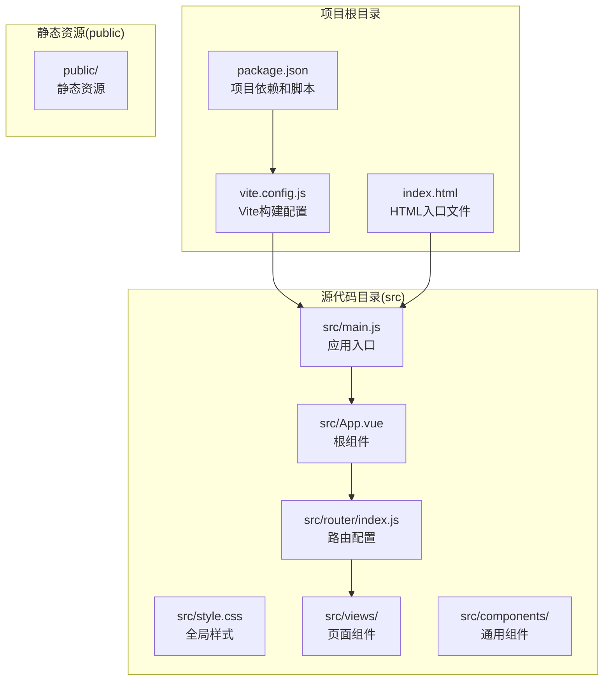

**图表来源**
- [vite.config.js:1-27](file://vite.config.js#L1-L27)
- [package.json:1-28](file://package.json#L1-L28)
- [src/main.js:1-11](file://src/main.js#L1-L11)

**章节来源**
- [vite.config.js:1-27](file://vite.config.js#L1-L27)
- [package.json:1-28](file://package.json#L1-L28)
- [src/main.js:1-11](file://src/main.js#L1-L11)

## 核心构建配置

### 插件配置

项目使用两个核心插件来增强构建功能：

#### Vue插件配置
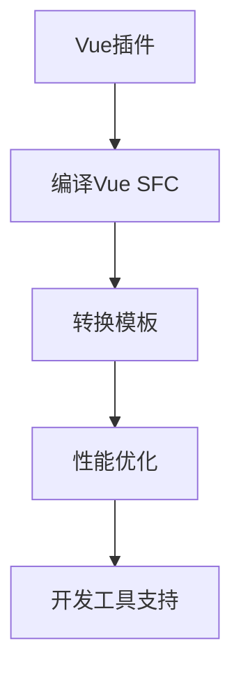

**图表来源**
- [vite.config.js:6-8](file://vite.config.js#L6-L8)

#### vite-singlefile插件配置
该插件是单文件打包的核心组件，配置参数详解：

| 配置项 | 值 | 作用 |
|--------|-----|------|
| useRecommendedBuildConfig | true | 启用推荐的构建配置 |
| removeViteModuleLoader | true | 移除Vite模块加载器 |
| inlinePattern | ['*.js', '*.css'] | 内联匹配模式 |

**章节来源**
- [vite.config.js:8-12](file://vite.config.js#L8-L12)

### 构建输出设置

#### 基础路径配置


**图表来源**
- [vite.config.js:14](file://vite.config.js#L14)

#### 资源目录配置
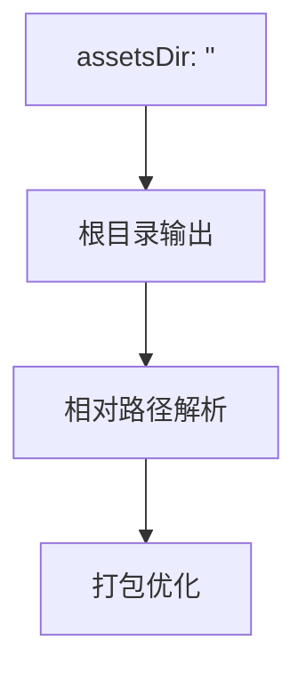

**图表来源**
- [vite.config.js:16](file://vite.config.js#L16)

#### Rollup输出配置
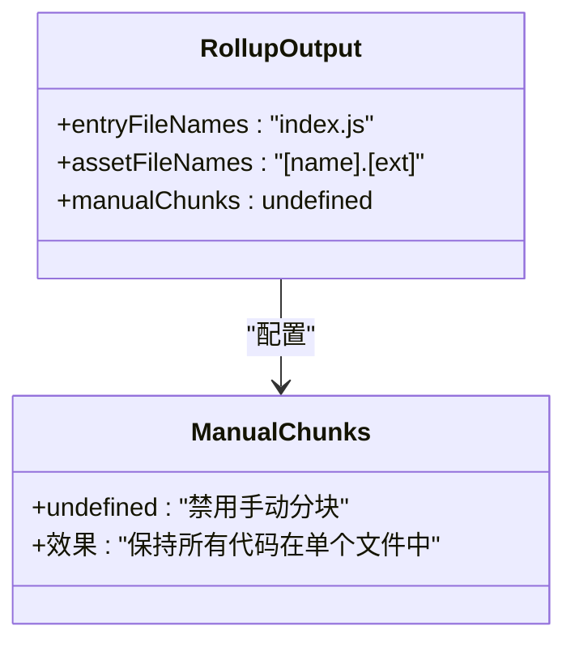

**图表来源**
- [vite.config.js:17-23](file://vite.config.js#L17-L23)

**章节来源**
- [vite.config.js:15-25](file://vite.config.js#L15-L25)

### 资源处理策略

#### 单文件打包策略
项目采用单文件打包策略，通过以下配置实现：

1. **移除模块加载器**：`removeViteModuleLoader: true`
2. **内联匹配模式**：`inlinePattern: ['*.js', '*.css']`
3. **推荐构建配置**：`useRecommendedBuildConfig: true`

**章节来源**
- [vite.config.js:8-12](file://vite.config.js#L8-L12)

## 架构概览

### 构建流程架构

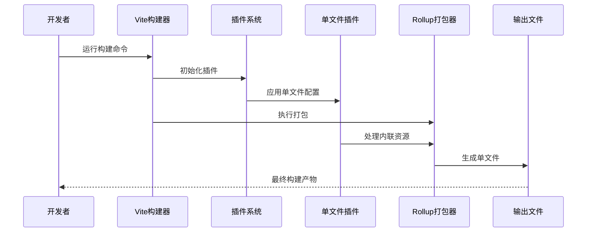

**图表来源**
- [vite.config.js:5-13](file://vite.config.js#L5-L13)

### 资源处理流程

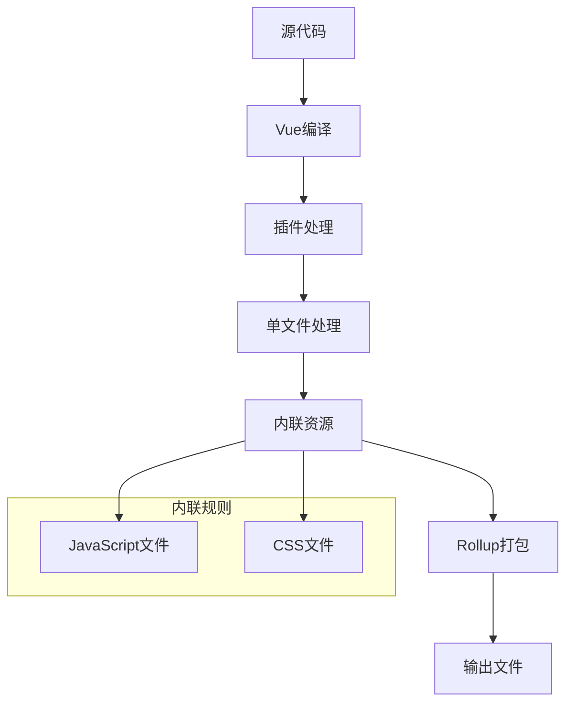

**图表来源**
- [vite.config.js:10-12](file://vite.config.js#L10-L12)

## 详细组件分析

### 应用入口配置

#### 主入口文件分析
应用入口文件负责初始化Vue应用和相关插件：

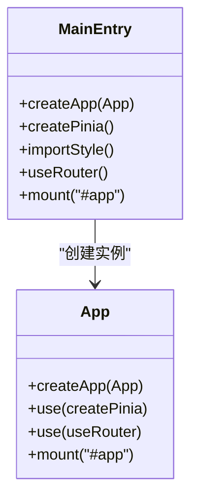

**图表来源**
- [src/main.js:1-11](file://src/main.js#L1-L11)

**章节来源**
- [src/main.js:1-11](file://src/main.js#L1-L11)

### 根组件配置

#### App.vue组件分析
根组件负责应用的整体布局和路由渲染：

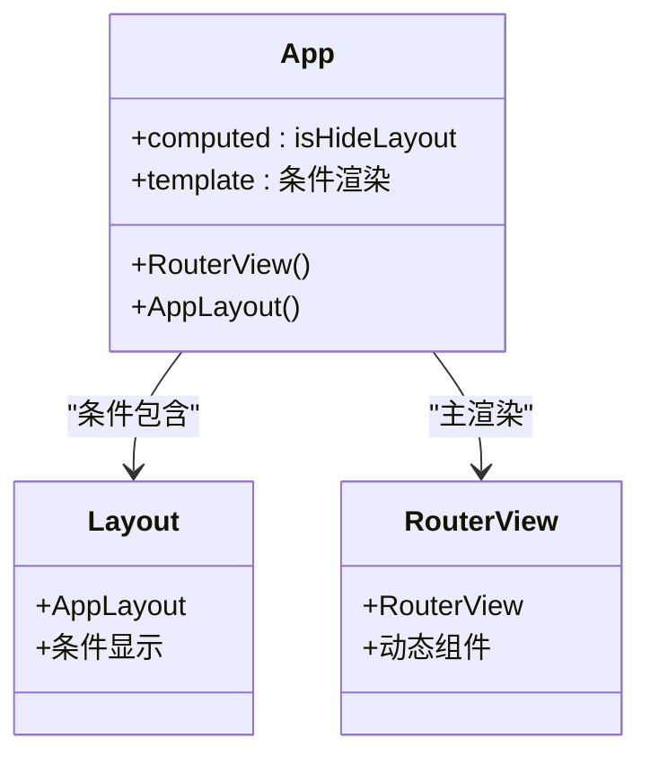

**图表来源**
- [src/App.vue:1-24](file://src/App.vue#L1-L24)

**章节来源**
- [src/App.vue:1-24](file://src/App.vue#L1-L24)

### 路由配置分析

#### 动态路由加载
项目使用动态导入实现路由懒加载：

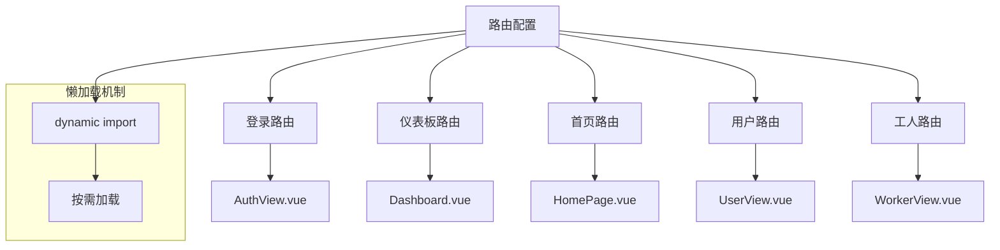

**图表来源**
- [src/router/index.js:3-35](file://src/router/index.js#L3-L35)

**章节来源**
- [src/router/index.js:1-61](file://src/router/index.js#L1-L61)

### 全局样式配置

#### 样式架构
项目采用CSS变量和模块化设计：

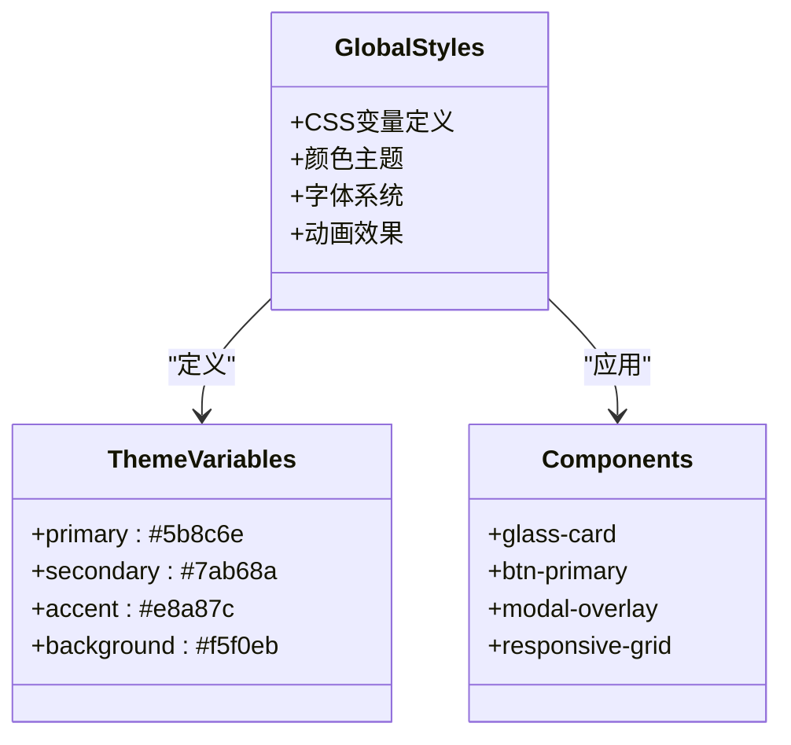

**图表来源**
- [src/style.css:3-30](file://src/style.css#L3-L30)

**章节来源**
- [src/style.css:1-308](file://src/style.css#L1-L308)

## 依赖关系分析

### 构建工具链

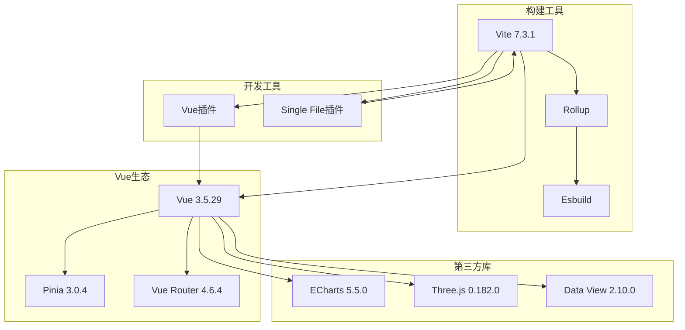

**图表来源**
- [package.json:11-26](file://package.json#L11-L26)

**章节来源**
- [package.json:1-28](file://package.json#L1-L28)

### 性能优化依赖

#### 关键性能相关依赖
- **Vite 7.3.1**：提供快速开发体验和优化的构建流程
- **Rollup 4.57.1**：高效的模块打包器
- **Esbuild 0.27.3**：超快的JavaScript编译器
- **vite-plugin-singlefile 2.3.0**：单文件打包解决方案

**章节来源**
- [package.json:22-26](file://package.json#L22-L26)

## 性能考虑

### 单文件打包的性能优势

#### 1. 减少HTTP请求数量
单文件打包将所有资源合并到一个文件中，显著减少网络请求次数：

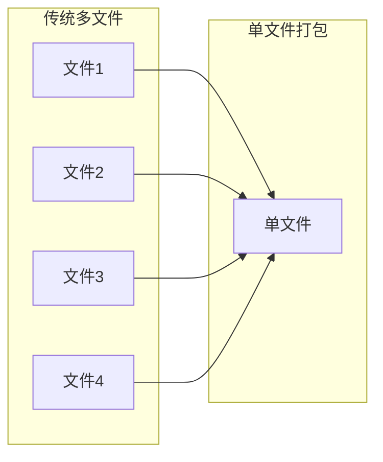

#### 2. 内联资源优化
通过`inlinePattern`配置，JavaScript和CSS文件被直接内联到HTML中：

**章节来源**
- [vite.config.js:11](file://vite.config.js#L11)

### 手动分块配置的性能考量

#### `manualChunks: undefined` 的影响
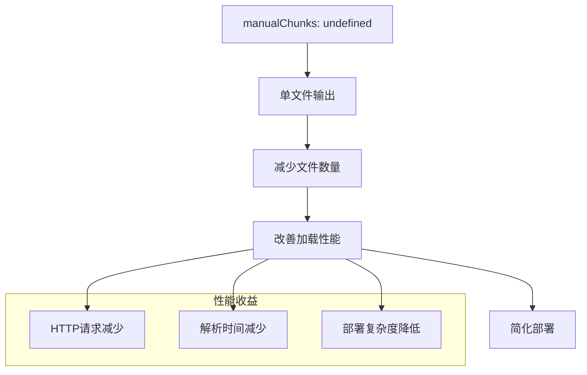

**图表来源**
- [vite.config.js:19](file://vite.config.js#L19)

### 资源路径处理优化

#### 相对路径配置的影响
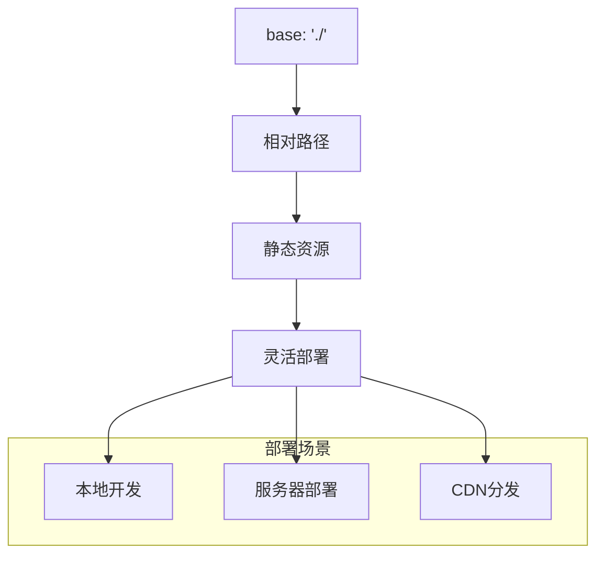

**图表来源**
- [vite.config.js:14](file://vite.config.js#L14)

**章节来源**
- [vite.config.js:14-16](file://vite.config.js#L14-L16)

## 故障排除指南

### 常见构建问题及解决方案

#### 1. 单文件打包相关问题

**问题**：单文件包过大
- **原因**：所有资源都被内联到单个文件
- **解决方案**：
  - 检查`inlinePattern`配置
  - 考虑移除不必要的依赖
  - 使用代码分割策略

**问题**：浏览器缓存问题
- **原因**：单文件更新时整个文件都需要重新下载
- **解决方案**：
  - 实施版本控制策略
  - 使用内容哈希命名

#### 2. 资源路径问题

**问题**：静态资源路径错误
- **原因**：`assetsDir`配置不当
- **解决方案**：
  - 确保`assetsDir: ''`配置正确
  - 检查`base`路径设置

#### 3. 插件兼容性问题

**问题**：vite-plugin-singlefile与某些插件冲突
- **原因**：插件间资源处理方式不一致
- **解决方案**：
  - 检查插件加载顺序
  - 调整插件配置优先级

### 构建命令使用指南

#### 开发环境配置
```bash
# 启动开发服务器
npm run dev

# 特点：
# - 热重载
# - 源码映射
# - 错误提示
```

#### 生产环境配置
```bash
# 构建生产版本
npm run build

# 特点：
# - 代码压缩
# - 资源内联
# - 性能优化
```

#### 预览模式
```bash
# 预览构建结果
npm run preview

# 特点：
# - 本地服务器预览
# - 接近真实环境
```

**章节来源**
- [package.json:6-10](file://package.json#L6-L10)

### 优化技巧

#### 1. 构建性能优化
- 使用`manualChunks: undefined`保持单文件输出
- 配置合适的`inlinePattern`避免过度内联
- 启用`polyfillModulePreload: false`减少polyfill体积

#### 2. 资源优化
- 合理使用动态导入实现懒加载
- 优化图片和媒体资源
- 启用代码压缩和Tree Shaking

#### 3. 部署优化
- 使用CDN加速静态资源
- 实施缓存策略
- 考虑渐进式Web应用(PWA)特性

## 结论

本项目的Vite构建配置展现了现代前端工程的最佳实践。通过精心配置的单文件打包策略，项目实现了：

1. **简化的部署流程**：单文件输出减少了部署复杂度
2. **优化的加载性能**：内联资源减少了HTTP请求
3. **灵活的开发体验**：保持了Vite的快速热重载特性
4. **良好的可维护性**：清晰的配置结构便于理解和修改

建议在实际项目中根据具体需求调整配置参数，如资源内联策略、代码分割策略等，以达到最佳的性能和用户体验平衡。