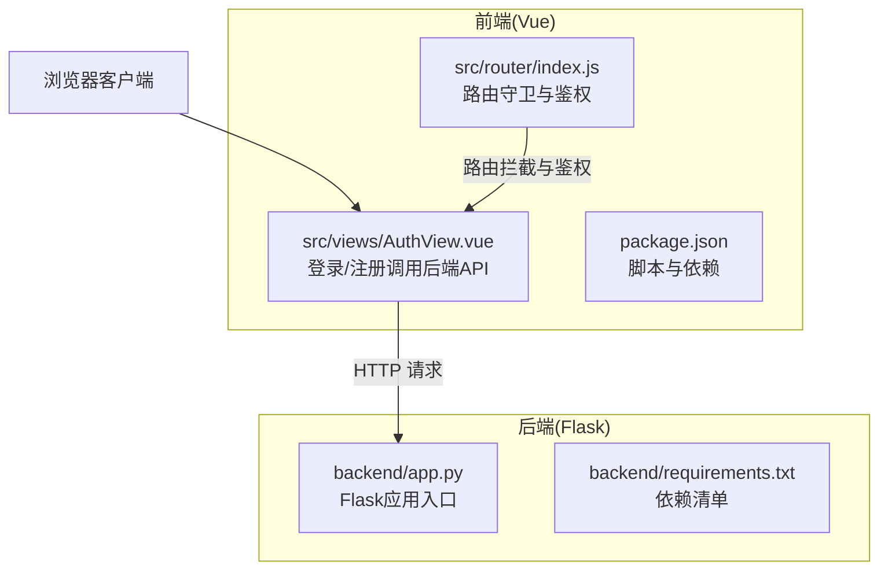
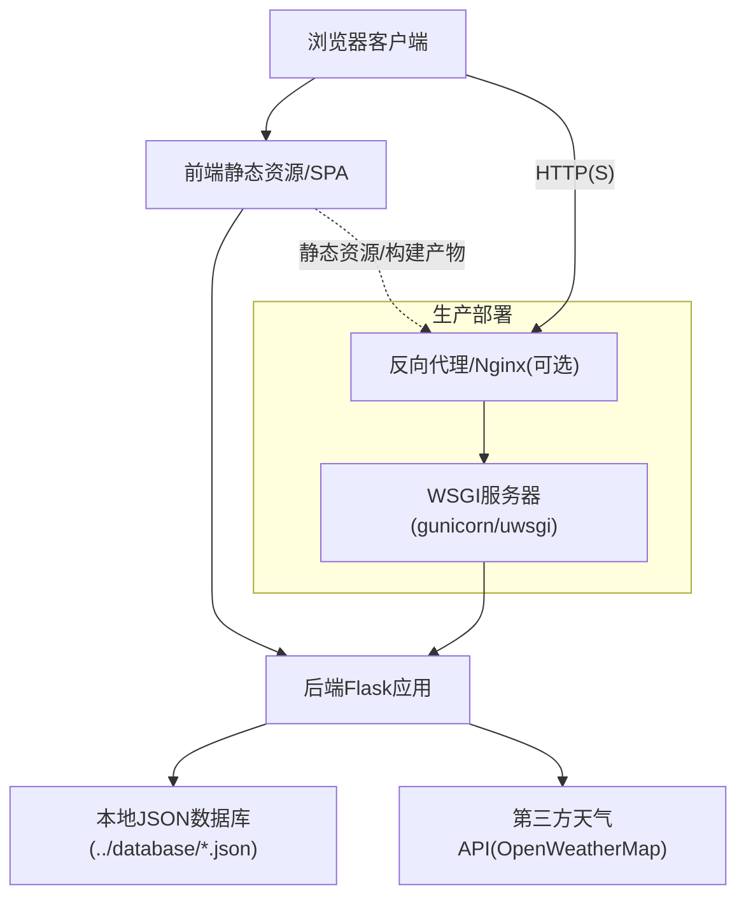
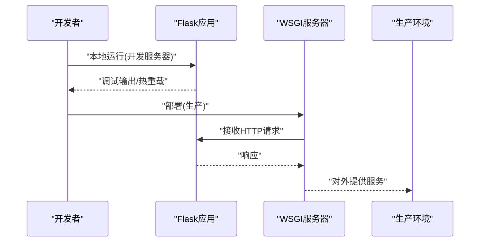
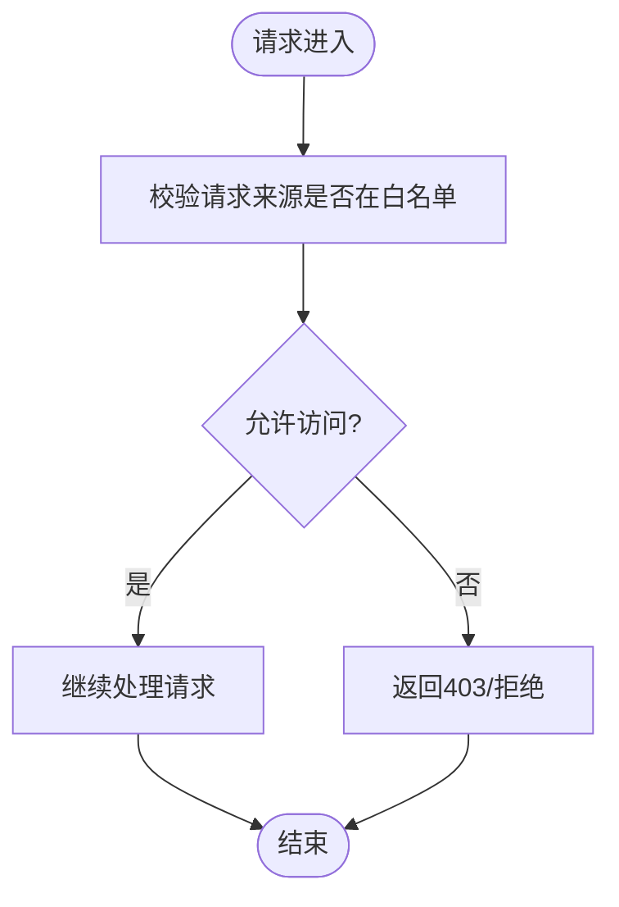
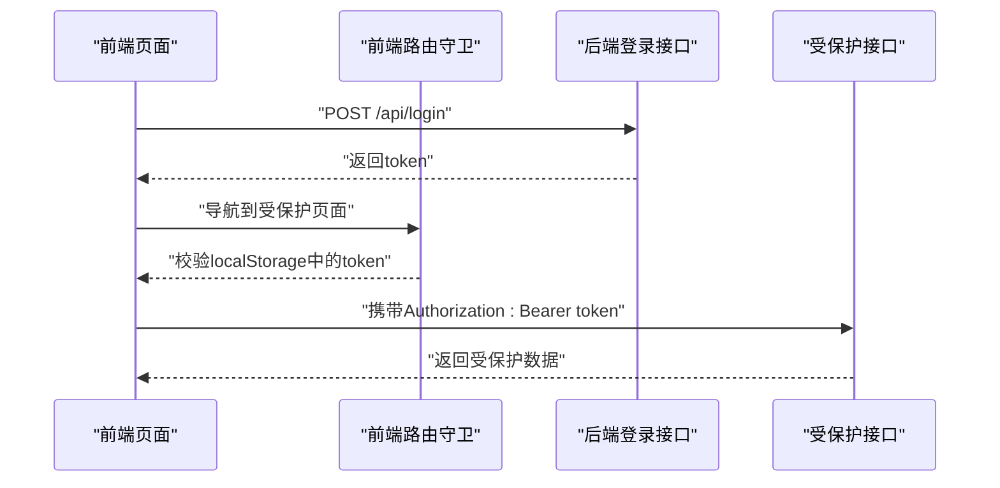
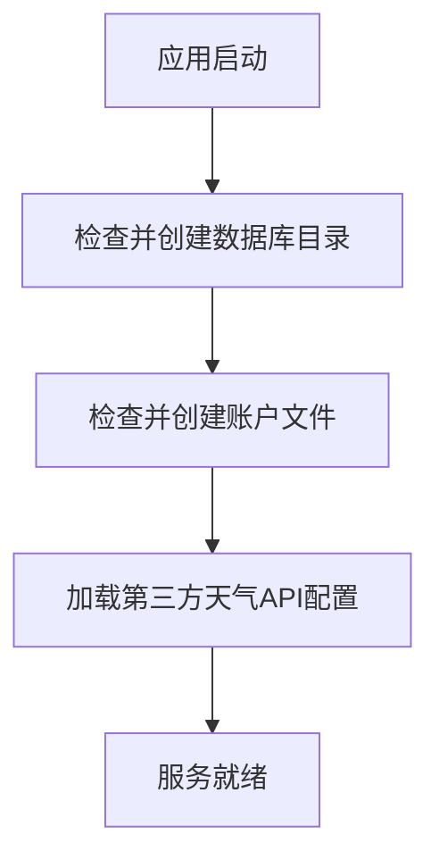
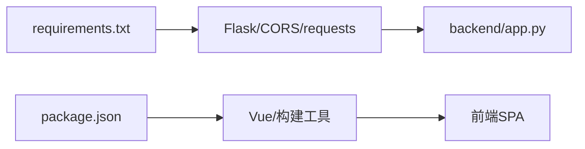

# 后端部署

<cite>
**本文引用的文件**
- [backend/app.py](file://backend/app.py)
- [backend/requirements.txt](file://backend/requirements.txt)
- [package.json](file://package.json)
- [src/router/index.js](file://src/router/index.js)
- [src/views/AuthView.vue](file://src/views/AuthView.vue)
</cite>

## 目录
1. [简介](#简介)
2. [项目结构](#项目结构)
3. [核心组件](#核心组件)
4. [架构总览](#架构总览)
5. [详细组件分析](#详细组件分析)
6. [依赖分析](#依赖分析)
7. [性能考量](#性能考量)
8. [故障排查指南](#故障排查指南)
9. [结论](#结论)
10. [附录](#附录)

## 简介
本指南面向Flask后端的完整部署流程，覆盖以下主题：
- Python虚拟环境的创建与激活、pip依赖安装与requirements.txt管理
- Flask应用的启动方式（开发服务器与生产服务器差异）
- WSGI服务器（如gunicorn/uwsgi）的配置与部署流程
- 环境变量与配置文件管理
- 生产环境CORS跨域配置的安全性与最佳实践
- 进程管理与日志记录
- 常见部署问题排查与性能优化建议
- 热重载与零停机部署策略

## 项目结构
后端位于仓库根目录下的backend子目录中，前端为Vue单页应用。后端使用Flask框架，前端通过浏览器直连后端API。

图表来源
- [backend/app.py:1-330](file://backend/app.py#L1-L330)
- [backend/requirements.txt:1-17](file://backend/requirements.txt#L1-L17)
- [src/router/index.js:1-61](file://src/router/index.js#L1-L61)
- [src/views/AuthView.vue:1-89](file://src/views/AuthView.vue#L1-L89)
- [package.json:1-28](file://package.json#L1-L28)

章节来源
- [backend/app.py:1-330](file://backend/app.py#L1-L330)
- [backend/requirements.txt:1-17](file://backend/requirements.txt#L1-L17)
- [package.json:1-28](file://package.json#L1-L28)

## 核心组件
- Flask应用与路由
  - 应用初始化与CORS启用
  - 认证装饰器与令牌校验
  - 用户注册/登录/仪表盘/护工/老人数据接口
  - 健康检查接口
- 前端路由与鉴权
  - 登录/注册页面向后端发起请求
  - 路由守卫基于本地存储的Token进行拦截
- 依赖管理
  - requirements.txt声明Flask生态依赖
  - package.json定义前端构建与运行脚本

章节来源
- [backend/app.py:10-11](file://backend/app.py#L10-L11)
- [backend/app.py:15-25](file://backend/app.py#L15-L25)
- [backend/app.py:120-324](file://backend/app.py#L120-L324)
- [src/router/index.js:42-59](file://src/router/index.js#L42-L59)
- [src/views/AuthView.vue:1-89](file://src/views/AuthView.vue#L1-L89)
- [backend/requirements.txt:1-17](file://backend/requirements.txt#L1-L17)
- [package.json:6-10](file://package.json#L6-L10)

## 架构总览
下图展示了前后端交互与部署位置的关系。生产环境建议将Flask置于WSGI服务器之后，前端静态资源可由Nginx提供或打包后由后端统一托管。

图表来源
- [backend/app.py:28-45](file://backend/app.py#L28-L45)
- [backend/app.py:65-116](file://backend/app.py#L65-L116)
- [src/views/AuthView.vue:7](file://src/views/AuthView.vue#L7)

## 详细组件分析

### Flask应用启动与生产差异
- 开发服务器
  - 使用Flask内置开发服务器，自动热重载，适合本地调试
  - 在应用入口处提供本地启动逻辑
- 生产服务器
  - 推荐使用gunicorn/uwsgi等WSGI服务器承载Flask应用
  - 配置多进程/线程、超时、日志输出等参数
  - 结合反向代理（如Nginx）实现HTTPS、静态资源分发与负载均衡

图表来源
- [backend/app.py:326-330](file://backend/app.py#L326-L330)

章节来源
- [backend/app.py:326-330](file://backend/app.py#L326-L330)

### CORS跨域与生产安全
- 当前实现
  - 启用了CORS，允许跨域访问
- 生产建议
  - 明确配置允许的源、方法与头，避免通配符
  - 仅在必要时暴露凭证，谨慎设置允许源
  - 前端与后端域名需一致或在白名单内

图表来源
- [backend/app.py:10-11](file://backend/app.py#L10-L11)

章节来源
- [backend/app.py:10-11](file://backend/app.py#L10-L11)

### 认证与鉴权流程
- 前端
  - 登录/注册调用后端API，保存Token于本地存储
  - 路由守卫根据Token决定是否放行
- 后端
  - 登录成功生成临时令牌并加入有效集合
  - 保护路由通过装饰器校验Authorization头

图表来源
- [src/views/AuthView.vue:23-46](file://src/views/AuthView.vue#L23-L46)
- [src/router/index.js:42-59](file://src/router/index.js#L42-L59)
- [backend/app.py:148-169](file://backend/app.py#L148-L169)
- [backend/app.py:208-215](file://backend/app.py#L208-L215)

章节来源
- [src/views/AuthView.vue:1-89](file://src/views/AuthView.vue#L1-L89)
- [src/router/index.js:1-61](file://src/router/index.js#L1-L61)
- [backend/app.py:148-169](file://backend/app.py#L148-L169)
- [backend/app.py:208-215](file://backend/app.py#L208-L215)

### 数据持久化与第三方API
- 本地数据库
  - 使用相对路径的JSON文件存放账户、用户、护工等数据
  - 启动时确保目录与初始文件存在
- 天气数据
  - 通过第三方API获取实时天气与空气质量，失败时回退到模拟数据

图表来源
- [backend/app.py:39-45](file://backend/app.py#L39-L45)
- [backend/app.py:31-36](file://backend/app.py#L31-L36)

章节来源
- [backend/app.py:28-45](file://backend/app.py#L28-L45)
- [backend/app.py:31-36](file://backend/app.py#L31-L36)

## 依赖分析
- 后端依赖
  - Flask、CORS、requests等
- 前端依赖
  - Vue、路由、状态管理等
- 关键点
  - requirements.txt中包含Flask与CORS，满足当前后端功能
  - 前端package.json提供开发与构建脚本

图表来源
- [backend/requirements.txt:1-17](file://backend/requirements.txt#L1-L17)
- [package.json:11-26](file://package.json#L11-L26)

章节来源
- [backend/requirements.txt:1-17](file://backend/requirements.txt#L1-L17)
- [package.json:1-28](file://package.json#L1-L28)

## 性能考量
- 并发与进程模型
  - 生产环境使用多进程/多线程WSGI服务器提升并发能力
- 超时与资源限制
  - 合理设置请求超时、连接池大小与内存上限
- 缓存与降级
  - 对第三方API增加缓存与熔断策略，避免雪崩
- 日志与监控
  - 统一输出访问日志与错误日志，接入指标采集

## 故障排查指南
- 本地无法访问后端
  - 确认Flask开发服务器已启动且监听0.0.0.0:5000
  - 检查CORS配置是否允许前端来源
- 登录/注册失败
  - 检查前端BASE_URL与后端端口是否一致
  - 查看后端返回的错误消息与状态码
- 第三方API异常
  - 观察天气接口调用是否超时或返回错误
  - 确认API密钥与城市配置正确
- 生产部署后白屏或跨域失败
  - 检查CORS允许源、凭证与预检请求
  - 确认反向代理与静态资源路径配置

章节来源
- [backend/app.py:326-330](file://backend/app.py#L326-L330)
- [src/views/AuthView.vue:7](file://src/views/AuthView.vue#L7)
- [backend/app.py:65-116](file://backend/app.py#L65-L116)

## 结论
本指南提供了从虚拟环境、依赖安装、开发与生产服务器、WSGI部署、CORS安全、进程与日志、常见问题排查到性能优化与零停机策略的完整路径。建议在生产环境中严格控制CORS范围、使用稳定WSGI服务器与反向代理，并建立完善的日志与监控体系。

## 附录

### A. Python虚拟环境与依赖安装
- 创建虚拟环境
  - Windows: python -m venv backend/.venv 或使用项目根目录的 venv
- 激活虚拟环境
  - Windows: backend\.venv\Scripts\activate 或 venv\Scripts\activate
- 安装依赖
  - pip install -r backend/requirements.txt

章节来源
- [backend/requirements.txt:1-17](file://backend/requirements.txt#L1-L17)

### B. Flask启动方式
- 开发服务器
  - 在应用入口处提供本地启动逻辑，便于快速迭代
- 生产服务器
  - 使用gunicorn/uwsgi承载Flask应用，配置进程数、绑定地址与端口

章节来源
- [backend/app.py:326-330](file://backend/app.py#L326-L330)

### C. WSGI服务器配置与部署流程
- gunicorn示例
  - 绑定地址与端口、工作进程数、超时时间、日志级别
- uwsgi示例
  - 配置模块入口、进程/线程、socket与日志
- 反向代理(Nginx)
  - 转发HTTP(S)、静态资源、健康检查与SSL终止

章节来源
- [backend/app.py:326-330](file://backend/app.py#L326-L330)

### D. 环境变量与配置文件管理
- 将敏感配置（如第三方API密钥、数据库路径）移出硬编码
- 使用环境变量注入，结合配置文件或容器编排工具管理

章节来源
- [backend/app.py:31-36](file://backend/app.py#L31-L36)

### E. CORS跨域配置在生产环境中的重要性与安全考虑
- 明确允许的源、方法、头与凭证
- 避免使用通配符，防止跨站风险

章节来源
- [backend/app.py:10-11](file://backend/app.py#L10-L11)

### F. 进程管理与日志记录最佳实践
- 使用systemd或Supervisor管理进程，自动重启与资源限制
- 输出统一访问日志与错误日志，接入集中式日志系统

### G. 常见部署问题排查
- 端口占用与权限
- CORS与反代配置
- 第三方API限流与超时
- 前后端联调与Token传递

章节来源
- [src/router/index.js:42-59](file://src/router/index.js#L42-L59)
- [src/views/AuthView.vue:23-46](file://src/views/AuthView.vue#L23-L46)

### H. 热重载与零停机部署
- 热重载
  - 开发阶段使用Flask内置服务器自动重载
- 零停机
  - 使用多实例滚动重启、健康检查与蓝绿发布策略

章节来源
- [backend/app.py:326-330](file://backend/app.py#L326-L330)