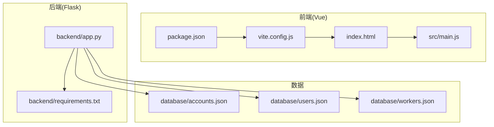
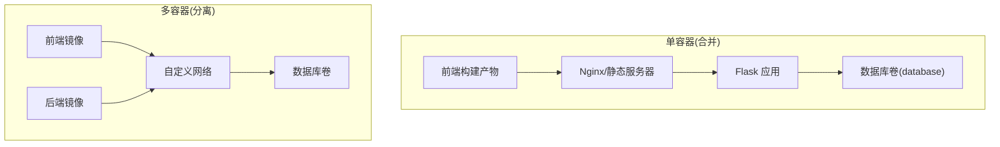
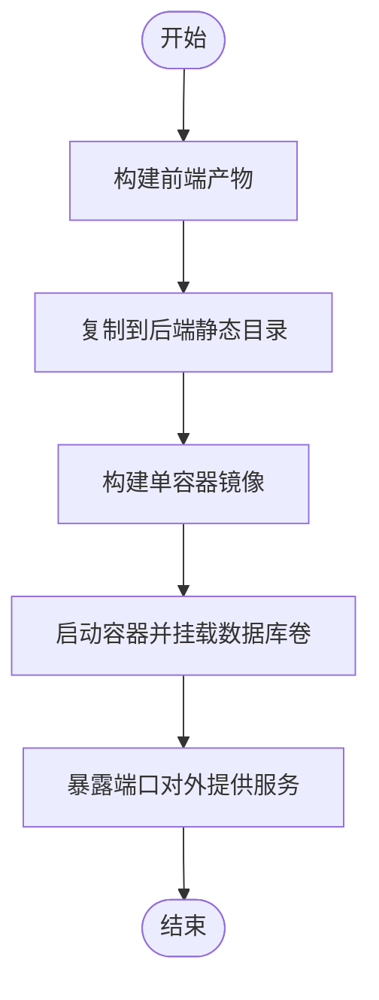
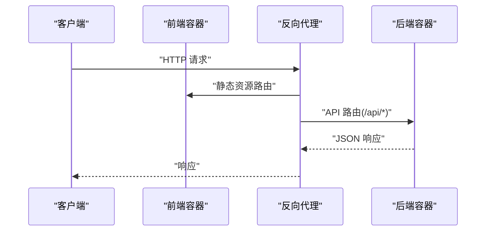
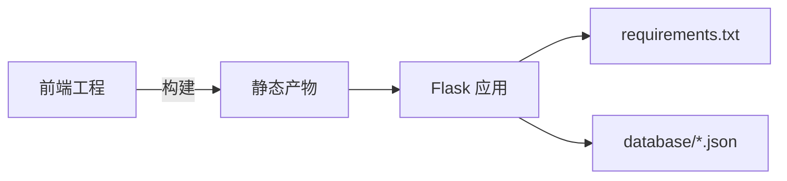

# 容器化部署

<cite>
**本文引用的文件**
- [package.json](file://package.json)
- [vite.config.js](file://vite.config.js)
- [index.html](file://index.html)
- [src/main.js](file://src/main.js)
- [backend/app.py](file://backend/app.py)
- [backend/requirements.txt](file://backend/requirements.txt)
- [database/accounts.json](file://database/accounts.json)
- [database/users.json](file://database/users.json)
- [database/workers.json](file://database/workers.json)
</cite>

## 目录
1. [简介](#简介)
2. [项目结构](#项目结构)
3. [核心组件](#核心组件)
4. [架构总览](#架构总览)
5. [详细组件分析](#详细组件分析)
6. [依赖分析](#依赖分析)
7. [性能考虑](#性能考虑)
8. [故障排查指南](#故障排查指南)
9. [结论](#结论)
10. [附录](#附录)

## 简介
本文件面向 Vue.js 前端与 Flask 后端的单仓项目，提供一套完整的容器化部署方案。内容涵盖：
- Dockerfile 编写指南：基础镜像选择、多阶段构建策略、依赖安装顺序
- 前后端打包策略：单容器合并部署与独立容器分离部署
- docker-compose.yml 示例：服务编排、网络与卷挂载
- 环境变量与配置文件管理
- 容器间通信与数据持久化
- 监控与日志收集
- 安全最佳实践与性能优化
- Kubernetes 部署与集群管理要点

## 项目结构
该项目采用前后端同仓库组织方式，前端基于 Vite 构建，后端基于 Flask 运行时。数据库以本地 JSON 文件形式存放于 database 目录。

图表来源
- [package.json:1-28](file://package.json#L1-L28)
- [vite.config.js:1-27](file://vite.config.js#L1-L27)
- [index.html:1-14](file://index.html#L1-L14)
- [src/main.js:1-11](file://src/main.js#L1-L11)
- [backend/app.py:1-330](file://backend/app.py#L1-L330)
- [backend/requirements.txt:1-17](file://backend/requirements.txt#L1-L17)
- [database/accounts.json:1-14](file://database/accounts.json#L1-L14)
- [database/users.json:1-582](file://database/users.json#L1-L582)
- [database/workers.json:1-442](file://database/workers.json#L1-L442)

章节来源
- [package.json:1-28](file://package.json#L1-L28)
- [vite.config.js:1-27](file://vite.config.js#L1-L27)
- [index.html:1-14](file://index.html#L1-L14)
- [src/main.js:1-11](file://src/main.js#L1-L11)
- [backend/app.py:1-330](file://backend/app.py#L1-L330)
- [backend/requirements.txt:1-17](file://backend/requirements.txt#L1-L17)
- [database/accounts.json:1-14](file://database/accounts.json#L1-L14)
- [database/users.json:1-582](file://database/users.json#L1-L582)
- [database/workers.json:1-442](file://database/workers.json#L1-L442)

## 核心组件
- 前端工程
  - 使用 Vite 构建，插件启用单文件打包，输出静态资源
  - 入口 HTML 与应用入口位于根目录与 src 目录
- 后端服务
  - Flask 应用，启用跨域支持；提供认证、仪表盘、用户与护工等接口
  - 依赖通过 requirements.txt 管理
  - 数据库存放在 database 目录下的 JSON 文件
- 数据模型
  - accounts：账户列表
  - users：入住老人信息
  - workers：护工信息

章节来源
- [package.json:1-28](file://package.json#L1-L28)
- [vite.config.js:1-27](file://vite.config.js#L1-L27)
- [index.html:1-14](file://index.html#L1-L14)
- [src/main.js:1-11](file://src/main.js#L1-L11)
- [backend/app.py:1-330](file://backend/app.py#L1-L330)
- [backend/requirements.txt:1-17](file://backend/requirements.txt#L1-L17)
- [database/accounts.json:1-14](file://database/accounts.json#L1-L14)
- [database/users.json:1-582](file://database/users.json#L1-L582)
- [database/workers.json:1-442](file://database/workers.json#L1-L442)

## 架构总览
本项目可采用两种容器化架构：
- 单容器方案：将前端构建产物复制至 Flask 的静态目录，统一暴露端口
- 多容器方案：前端与后端分别构建独立镜像，通过反向代理或同网桥通信

图表来源
- [backend/app.py:1-330](file://backend/app.py#L1-L330)
- [vite.config.js:1-27](file://vite.config.js#L1-L27)

## 详细组件分析

### 前端构建与打包策略
- 构建工具链
  - Vite 插件启用单文件打包，减少运行时加载开销
  - 输出目录与入口文件名可按需调整，确保与后端静态资源映射一致
- 静态资源定位
  - 基础路径与资源目录在配置中明确，避免生产环境相对路径问题
- 打包产物
  - 建议在 CI 中生成 dist 或单文件产物，供后端容器复用

章节来源
- [vite.config.js:1-27](file://vite.config.js#L1-L27)
- [package.json:1-28](file://package.json#L1-L28)
- [index.html:1-14](file://index.html#L1-L14)
- [src/main.js:1-11](file://src/main.js#L1-L11)

### 后端服务与依赖管理
- 运行时
  - Flask 应用监听 0.0.0.0:5000，默认开启调试模式
- 认证机制
  - 基于请求头 Authorization 的 Bearer Token 校验
- 数据访问
  - 通过相对路径访问 database 目录下的 JSON 文件
- 天气接口
  - 调用第三方天气 API 获取实时与预报数据，失败时回退模拟数据

章节来源
- [backend/app.py:1-330](file://backend/app.py#L1-L330)
- [backend/requirements.txt:1-17](file://backend/requirements.txt#L1-L17)

### 数据持久化与配置
- 数据文件
  - accounts.json、users.json、workers.json 作为轻量级数据存储
- 持久化建议
  - 在容器编排中将 database 目录映射为持久卷，避免重启丢失
- 配置项
  - 天气 API 密钥与城市名称在代码中硬编码，建议迁移到环境变量并在运行时注入

章节来源
- [database/accounts.json:1-14](file://database/accounts.json#L1-L14)
- [database/users.json:1-582](file://database/users.json#L1-L582)
- [database/workers.json:1-442](file://database/workers.json#L1-L442)
- [backend/app.py:31-36](file://backend/app.py#L31-L36)

### 容器化部署策略

#### 方案一：单容器合并部署
- 思路
  - 在构建阶段将前端产物复制到 Flask 的静态目录
  - 使用单一容器对外提供服务，简化网络与运维
- 关键点
  - 前端构建产物与后端静态资源路径一致
  - 将 database 目录映射为持久卷
  - 通过环境变量替换硬编码配置

图表来源
- [vite.config.js:1-27](file://vite.config.js#L1-L27)
- [backend/app.py:1-330](file://backend/app.py#L1-L330)

#### 方案二：多容器分离部署
- 思路
  - 前端与后端分别构建镜像，通过自定义网络通信
  - 使用反向代理统一入口或直接暴露后端 API
- 关键点
  - 前端容器仅提供静态资源
  - 后端容器提供 API 并挂载数据库卷
  - 通过环境变量注入配置，避免镜像内硬编码

图表来源
- [backend/app.py:1-330](file://backend/app.py#L1-L330)

### docker-compose.yml 配置要点
- 服务编排
  - 前端镜像与后端镜像分别声明
  - 自定义网络隔离服务
- 网络配置
  - 前端通过反向代理访问后端 API
- 卷挂载
  - 将 database 目录映射为持久卷
- 环境变量
  - 通过 env_file 或 environment 注入配置（如天气 API 密钥）

章节来源
- [backend/app.py:31-36](file://backend/app.py#L31-L36)

### 环境变量与配置文件管理
- 当前状态
  - 天气 API 密钥与城市名称在代码中硬编码
- 建议
  - 将敏感配置移至环境变量
  - 使用 .env 文件在本地开发，使用密文管理工具在生产

章节来源
- [backend/app.py:31-36](file://backend/app.py#L31-L36)

### 容器间通信与数据持久化
- 通信
  - 多容器场景下通过服务名与端口访问
- 数据持久化
  - 将 database 目录映射为命名卷或主机目录
  - 避免将数据文件放入镜像层

章节来源
- [backend/app.py:28-46](file://backend/app.py#L28-L46)
- [database/accounts.json:1-14](file://database/accounts.json#L1-L14)
- [database/users.json:1-582](file://database/users.json#L1-L582)
- [database/workers.json:1-442](file://database/workers.json#L1-L442)

### 监控与日志收集
- 日志
  - 前端静态日志由反向代理记录；后端可通过标准输出输出访问与错误日志
- 监控
  - 对外暴露健康检查端点，结合探针进行存活/就绪探测
  - 结合外部监控系统采集指标

章节来源
- [backend/app.py:322-324](file://backend/app.py#L322-L324)

### 安全最佳实践
- 最小权限
  - 使用非 root 用户运行容器
- 只读根文件系统
  - 仅将必要目录挂载为读写
- 依赖审计
  - 定期更新依赖，扫描漏洞
- 网络隔离
  - 使用自定义网络，限制不必要的端口暴露
- 凭证管理
  - 将敏感配置放入环境变量或密文管理

章节来源
- [backend/requirements.txt:1-17](file://backend/requirements.txt#L1-L17)

### 性能优化建议
- 前端
  - 启用压缩与缓存策略，合理拆分与懒加载
- 后端
  - 使用 WSGI 服务器替代 Flask 内置开发服务器
  - 合理设置并发与超时参数
- 镜像
  - 使用多阶段构建减小镜像体积
  - 缓存 npm/pip 依赖层

章节来源
- [vite.config.js:15-25](file://vite.config.js#L15-L25)
- [backend/app.py:326-330](file://backend/app.py#L326-L330)

## 依赖分析
- 前端依赖
  - Vue 生态与构建工具链
- 后端依赖
  - Flask、CORS、requests 等
- 数据依赖
  - JSON 文件作为数据源，需持久化

图表来源
- [package.json:1-28](file://package.json#L1-L28)
- [backend/requirements.txt:1-17](file://backend/requirements.txt#L1-L17)
- [backend/app.py:1-330](file://backend/app.py#L1-L330)
- [database/accounts.json:1-14](file://database/accounts.json#L1-L14)
- [database/users.json:1-582](file://database/users.json#L1-L582)
- [database/workers.json:1-442](file://database/workers.json#L1-L442)

章节来源
- [package.json:1-28](file://package.json#L1-L28)
- [backend/requirements.txt:1-17](file://backend/requirements.txt#L1-L17)
- [backend/app.py:1-330](file://backend/app.py#L1-L330)
- [database/accounts.json:1-14](file://database/accounts.json#L1-L14)
- [database/users.json:1-582](file://database/users.json#L1-L582)
- [database/workers.json:1-442](file://database/workers.json#L1-L442)

## 性能考虑
- 构建阶段
  - 使用多阶段构建，减少最终镜像大小
- 运行阶段
  - 前端静态资源由反向代理高效分发
  - 后端使用生产级 WSGI 服务器承载请求
- 存储
  - 将数据库目录映射为高性能持久卷

## 故障排查指南
- 健康检查
  - 访问健康端点确认后端可用性
- 日志定位
  - 查看容器标准输出与反向代理访问日志
- 权限问题
  - 确认数据库目录在容器内的读写权限
- 网络连通
  - 多容器场景下检查服务名解析与端口映射

章节来源
- [backend/app.py:322-324](file://backend/app.py#L322-L324)

## 结论
本方案提供了从单容器到多容器的完整容器化路径，兼顾易用性与可扩展性。通过合理的镜像分层、环境变量注入与持久化策略，可在保证安全性的同时获得良好的性能与可观测性。

## 附录
- Kubernetes 部署要点
  - 使用 Deployment 管理副本，Service 暴露服务
  - ConfigMap 管理非敏感配置，Secret 管理敏感配置
  - PersistentVolumeClaim 绑定数据库目录
  - Ingress 控制外部流量
  - HPA/VPAs 实现弹性伸缩