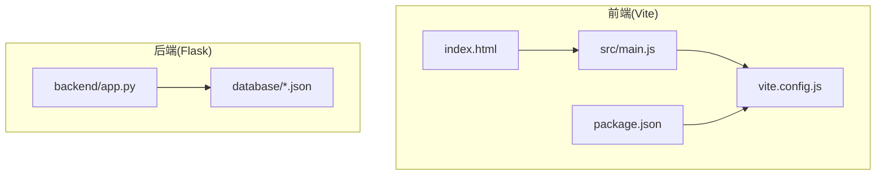
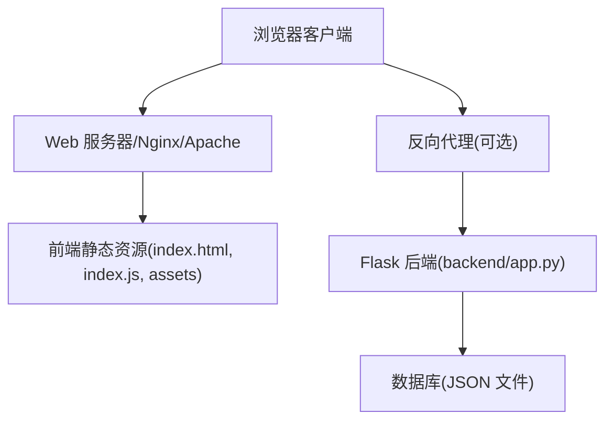
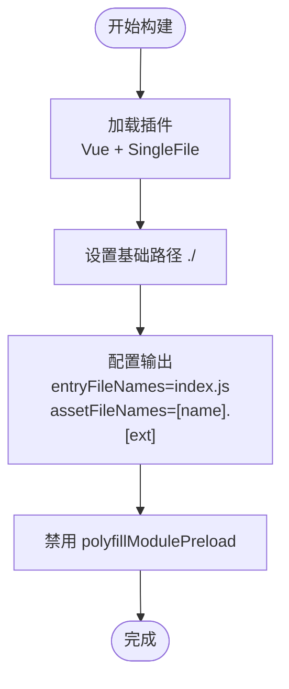
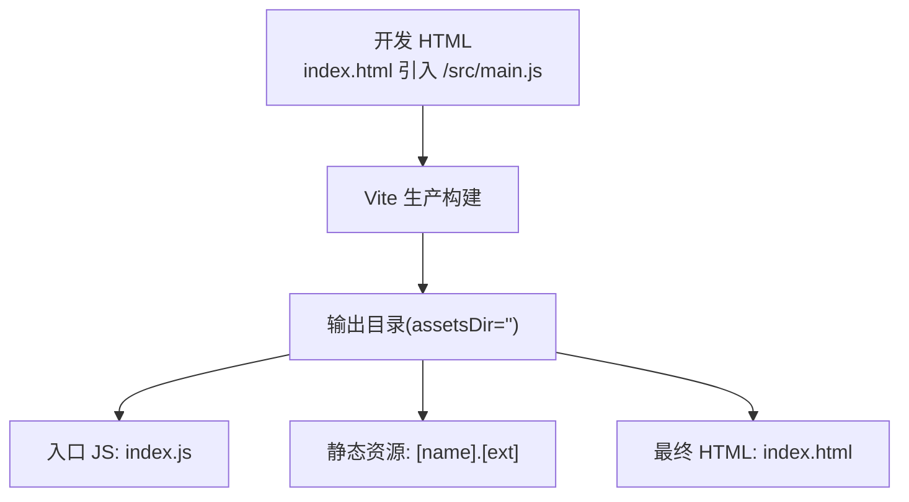
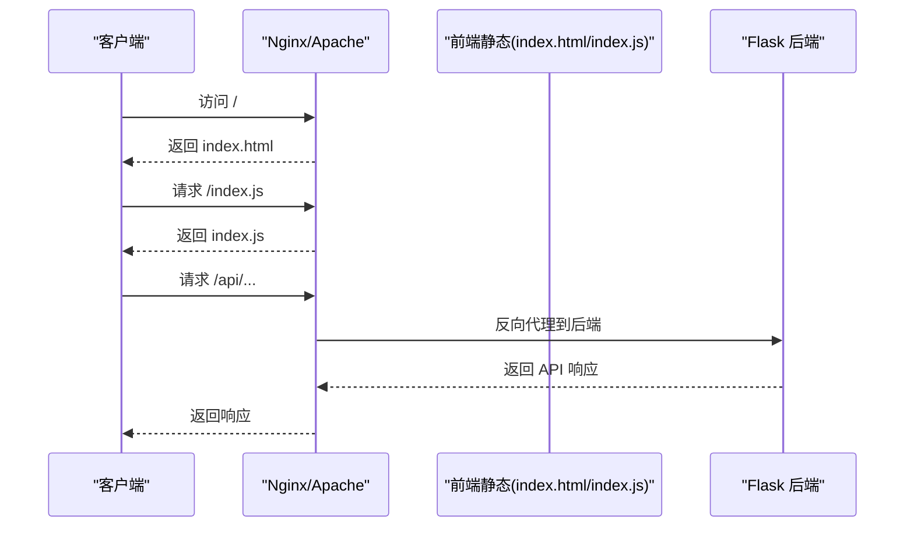
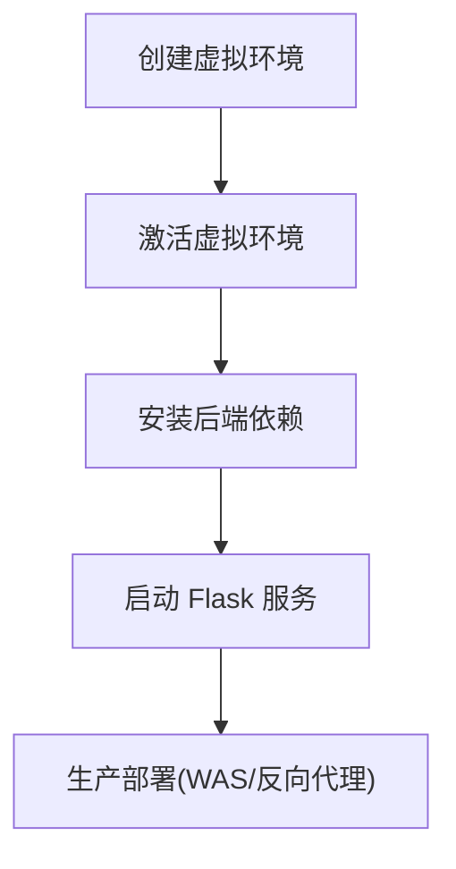
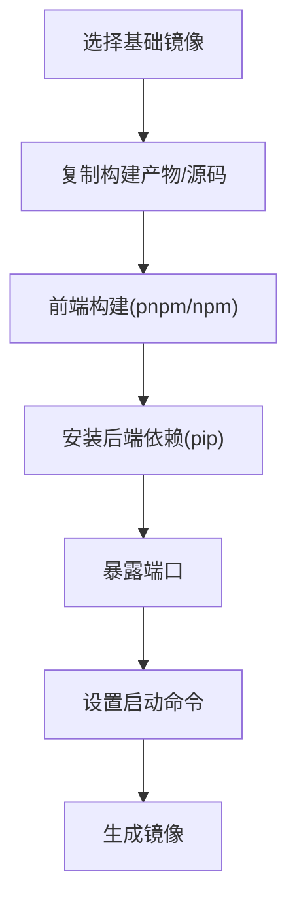
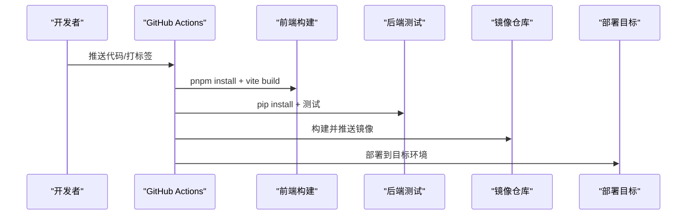
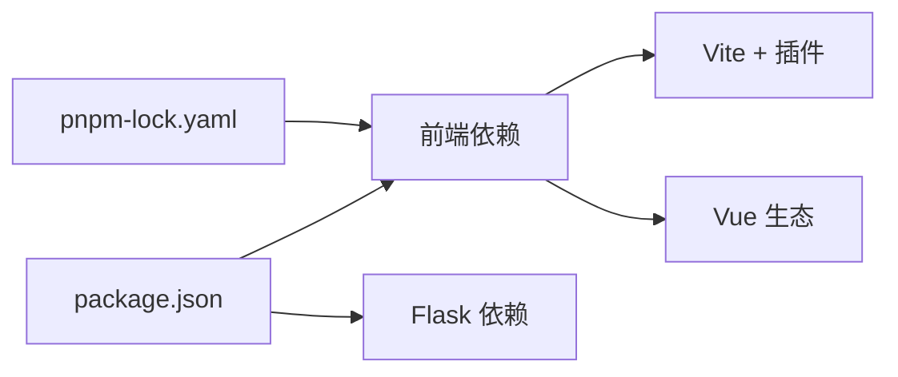

# 构建与部署

<cite>
**本文引用的文件**
- [package.json](file://package.json)
- [vite.config.js](file://vite.config.js)
- [index.html](file://index.html)
- [src/main.js](file://src/main.js)
- [backend/app.py](file://backend/app.py)
- [database/accounts.json](file://database/accounts.json)
- [database/foods.json](file://database/foods.json)
- [pnpm-lock.yaml](file://pnpm-lock.yaml)
</cite>

## 目录
1. [简介](#简介)
2. [项目结构](#项目结构)
3. [核心组件](#核心组件)
4. [架构总览](#架构总览)
5. [详细组件分析](#详细组件分析)
6. [依赖分析](#依赖分析)
7. [性能考虑](#性能考虑)
8. [故障排除指南](#故障排除指南)
9. [结论](#结论)
10. [附录](#附录)

## 简介
本指南面向部署 Vue 3 前端与 Flask 后端的完整流程，覆盖以下主题：
- Vite 构建配置与单文件打包策略
- 生产环境构建命令与输出文件结构
- 静态文件部署（Apache/Nginx）与反向代理
- Flask 后端部署（Python 虚拟环境、依赖安装）
- Docker 容器化部署（Dockerfile 编写与镜像构建）
- CI/CD 自动化部署（GitHub Actions 示例）

## 项目结构
前端采用 Vite + Vue 3 单页应用，后端采用 Flask 提供 REST API。数据库为本地 JSON 文件，位于 database 目录。

图表来源
- [index.html](file://index.html)
- [src/main.js](file://src/main.js)
- [vite.config.js](file://vite.config.js)
- [package.json](file://package.json)
- [backend/app.py](file://backend/app.py)
- [database/accounts.json](file://database/accounts.json)
- [database/foods.json](file://database/foods.json)

章节来源
- [package.json](file://package.json)
- [vite.config.js](file://vite.config.js)
- [index.html](file://index.html)
- [src/main.js](file://src/main.js)
- [backend/app.py](file://backend/app.py)
- [database/accounts.json](file://database/accounts.json)
- [database/foods.json](file://database/foods.json)

## 核心组件
- 构建工具链：Vite 7 + Vue 插件 + 单文件打包插件
- 前端框架：Vue 3 + Vue Router + Pinia
- 后端框架：Flask + CORS 支持
- 数据存储：JSON 文件（accounts.json、foods.json 等）

章节来源
- [package.json](file://package.json)
- [vite.config.js](file://vite.config.js)
- [backend/app.py](file://backend/app.py)

## 架构总览
前端通过 Vite 构建为单文件产物，后端提供 REST 接口。生产部署时，建议将前端静态资源托管于 Web 服务器或 CDN，后端运行在独立服务上，二者通过反向代理或同域 API 调用交互。

图表来源
- [backend/app.py](file://backend/app.py)
- [database/accounts.json](file://database/accounts.json)
- [database/foods.json](file://database/foods.json)

## 详细组件分析

### Vite 构建配置与单文件打包策略
- 插件组合：Vue 插件 + 单文件打包插件，启用推荐构建配置与模块加载器内联
- 基础路径：相对路径 base: "./"
- 输出目录与命名：
  - assetsDir: ""（将静态资源置于根目录）
  - 手动分块关闭（manualChunks: undefined）
  - 入口文件名：entryFileNames: "index.js"
  - 资源文件名：assetFileNames: "[name].[ext]"
- Polyfill 预加载：polyfillModulePreload: false

图表来源
- [vite.config.js](file://vite.config.js)

章节来源
- [vite.config.js](file://vite.config.js)

### 生产环境构建命令与输出文件结构
- 生产构建命令：使用 Vite 的构建脚本
- 输出结构（基于配置）：
  - 入口文件：index.js
  - 静态资源：与入口同目录下的同名资源文件（如图片、字体等）
  - HTML：index.html（开发时由 Vite 注入入口脚本；生产需确保入口指向 index.js）

图表来源
- [index.html](file://index.html)
- [vite.config.js](file://vite.config.js)

章节来源
- [index.html](file://index.html)
- [vite.config.js](file://vite.config.js)

### 静态文件部署（Apache/Nginx）与反向代理
- Apache 部署要点
  - 将构建产物放置在站点根目录
  - 确保 index.html 能正确加载 index.js
  - 若后端与前端不在同一域名，需配置跨域（CORS）
- Nginx 部署要点
  - 静态资源根目录指向构建输出目录
  - 对后端 API 设置反向代理（例如 /api -> http://localhost:5000）
  - 配置缓存与 gzip 压缩提升性能
- 反向代理
  - 前端：静态资源直出
  - 后端：/api 请求转发至 Flask 应用

图表来源
- [backend/app.py](file://backend/app.py)

章节来源
- [backend/app.py](file://backend/app.py)

### Flask 后端部署流程
- Python 虚拟环境
  - 创建虚拟环境（如 venv 或 .venv）
  - 激活环境
- 依赖安装
  - 使用 pip 安装后端依赖（Flask、flask-cors 等）
- 运行
  - 在本地运行后端服务（默认监听 0.0.0.0:5000）
  - 如需生产部署，建议使用 WSGI 服务器（如 Gunicorn）+ 反向代理

图表来源
- [backend/app.py](file://backend/app.py)

章节来源
- [backend/app.py](file://backend/app.py)

### Docker 容器化部署方案
- Dockerfile 编写思路
  - 基础镜像：官方 Python 或 Node 镜像
  - 前端构建：在镜像内执行 npm/pnpm 安装与构建
  - 后端依赖：pip 安装 Flask、flask-cors 等
  - 暴露端口：5000（Flask），Nginx 反代可暴露 80/443
  - 入口命令：启动 Nginx 或直接运行 Flask
- 镜像构建
  - 使用 docker build 命令构建镜像
  - 运行容器并映射端口

图表来源
- [package.json](file://package.json)
- [pnpm-lock.yaml](file://pnpm-lock.yaml)
- [backend/app.py](file://backend/app.py)

章节来源
- [package.json](file://package.json)
- [pnpm-lock.yaml](file://pnpm-lock.yaml)
- [backend/app.py](file://backend/app.py)

### CI/CD 自动化部署（GitHub Actions 示例）
- 工作流目标
  - 触发条件：push 到主分支或发布标签
  - 步骤：检出代码、安装 pnpm、构建前端、安装后端依赖、运行测试、构建镜像、推送镜像、部署到目标环境
- 关键步骤
  - 前端构建：使用 pnpm install 与 vite build
  - 后端测试：pip install -r requirements.txt（如存在）并运行 pytest/flask 测试
  - Docker 构建与推送：使用 docker buildx 与 ghcr.io 或 Docker Hub
  - 部署：通过 kubectl、Ansible、Docker Compose 或云平台部署

图表来源
- [package.json](file://package.json)
- [pnpm-lock.yaml](file://pnpm-lock.yaml)
- [backend/app.py](file://backend/app.py)

章节来源
- [package.json](file://package.json)
- [pnpm-lock.yaml](file://pnpm-lock.yaml)
- [backend/app.py](file://backend/app.py)

## 依赖分析
- 前端依赖
  - Vue 3、Vue Router、Pinia、ECharts、Three.js、Markdown-it、@jiaminghi/data-view 等
  - Vite 7、@vitejs/plugin-vue、vite-plugin-singlefile
- 后端依赖
  - Flask、flask-cors
- 锁定文件
  - pnpm-lock.yaml 记录了前端依赖版本

图表来源
- [package.json](file://package.json)
- [pnpm-lock.yaml](file://pnpm-lock.yaml)
- [backend/app.py](file://backend/app.py)

章节来源
- [package.json](file://package.json)
- [pnpm-lock.yaml](file://pnpm-lock.yaml)
- [backend/app.py](file://backend/app.py)

## 性能考虑
- 单文件打包：减少请求数量，提升首屏加载速度
- 资源内联：CSS/JS 内联可降低请求次数，但需权衡缓存策略
- 基础路径：使用相对路径 base: "./"，便于多级目录部署
- 静态资源命名：统一的 assetFileNames 便于缓存控制
- 后端跨域：生产环境建议明确允许来源，避免通配符带来的安全风险

## 故障排除指南
- 前端资源 404
  - 检查 index.html 是否正确引入 index.js
  - 确认构建输出目录与 Web 服务器根目录一致
- CORS 问题
  - Flask 已启用 CORS，若仍失败，检查请求头与来源是否匹配
- Flask 500 错误
  - 检查数据库文件是否存在与权限
  - 确认端口 5000 未被占用
- Docker 镜像启动失败
  - 确认前端构建产物已复制进镜像
  - 检查依赖安装与端口暴露
- CI/CD 失败
  - 查看日志中的 pnpm/vite 构建错误
  - 确认镜像构建与推送步骤顺序正确

章节来源
- [backend/app.py](file://backend/app.py)
- [database/accounts.json](file://database/accounts.json)
- [database/foods.json](file://database/foods.json)

## 结论
本项目采用 Vite 单文件打包与 Flask 后端分离的架构，具备良好的可部署性。通过合理的静态资源托管、反向代理与容器化策略，可在不同环境中稳定运行。建议在生产环境中完善 CORS、缓存与安全配置，并结合 CI/CD 实现自动化交付。

## 附录
- 开发与预览
  - 开发：npm run dev
  - 预览：npm run preview
- 生产构建
  - 生产构建：npm run build
- 数据库文件
  - accounts.json、foods.json 等位于 database 目录，首次运行会自动创建

章节来源
- [package.json](file://package.json)
- [backend/app.py](file://backend/app.py)
- [database/accounts.json](file://database/accounts.json)
- [database/foods.json](file://database/foods.json)