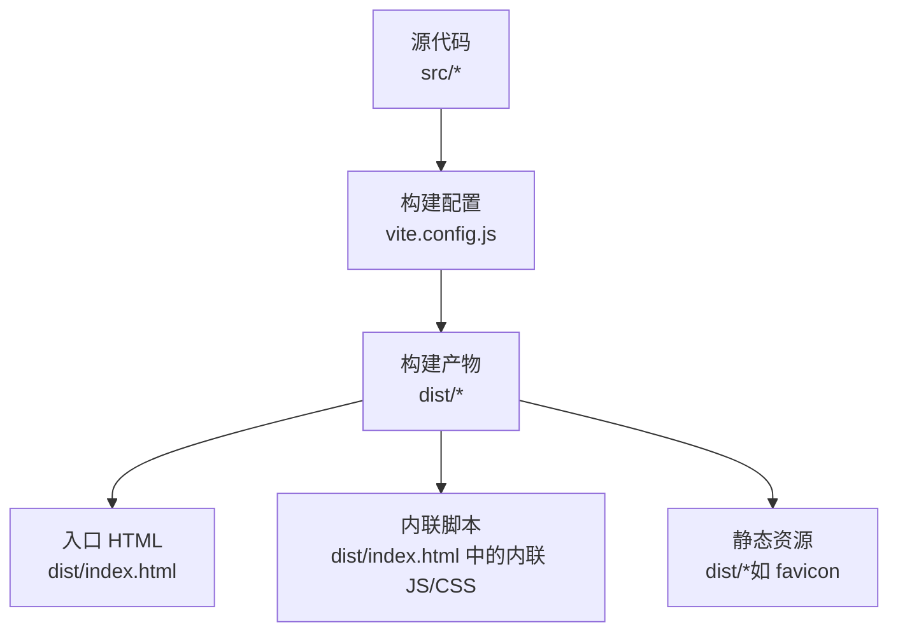
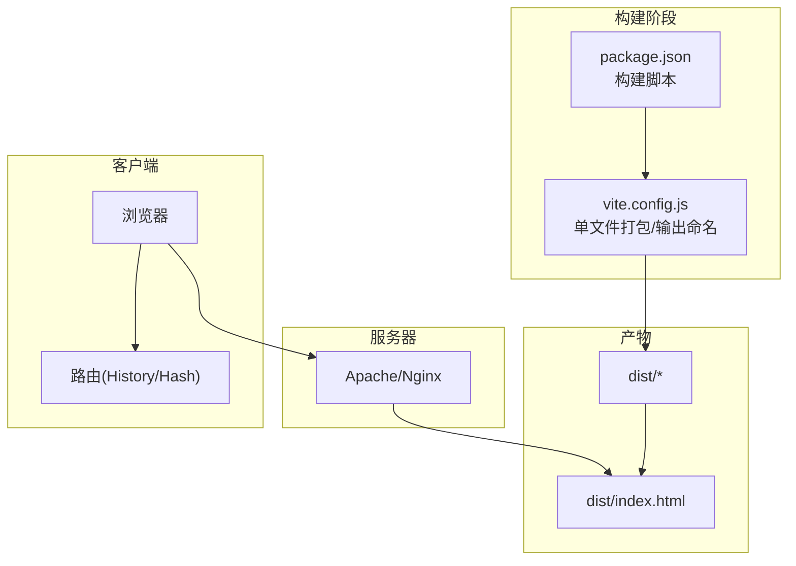
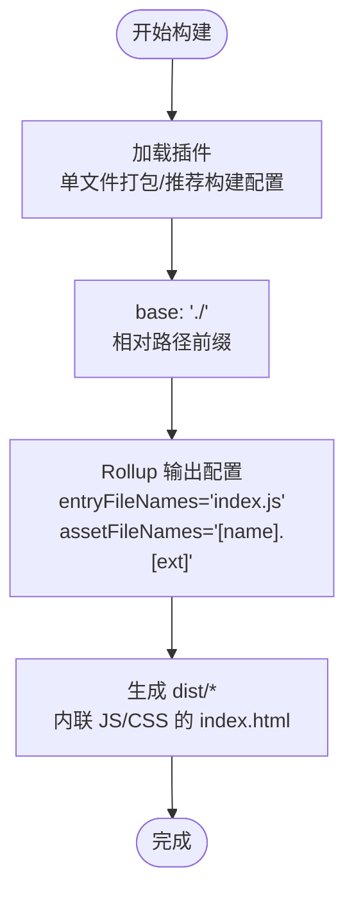
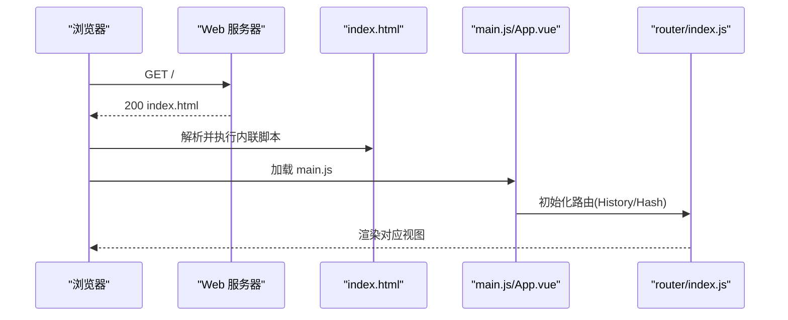
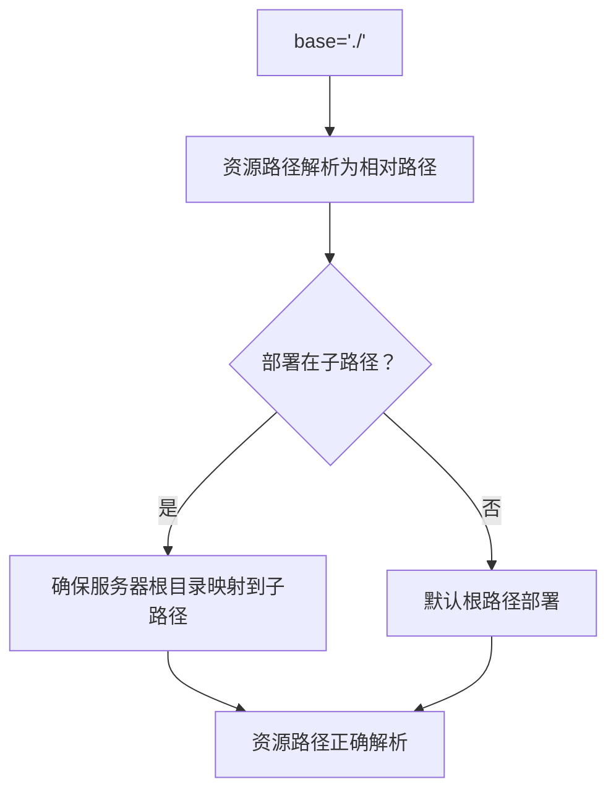
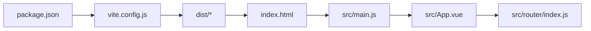

# 静态文件部署

<cite>
**本文引用的文件**   
- [package.json](file://package.json)
- [vite.config.js](file://vite.config.js)
- [index.html](file://index.html)
- [src/main.js](file://src/main.js)
- [src/App.vue](file://src/App.vue)
- [src/style.css](file://src/style.css)
- [src/router/index.js](file://src/router/index.js)
</cite>

## 目录
1. [简介](#简介)
2. [项目结构](#项目结构)
3. [核心组件](#核心组件)
4. [架构总览](#架构总览)
5. [详细组件分析](#详细组件分析)
6. [依赖分析](#依赖分析)
7. [性能考虑](#性能考虑)
8. [故障排除指南](#故障排除指南)
9. [结论](#结论)
10. [附录](#附录)

## 简介
本指南面向部署 Vue 3 + Vite 构建产物的运维与开发人员，聚焦于静态文件的组织结构、Web 服务器配置（Apache/Nginx）、base 配置对资源路径的影响、相对路径处理、CDN 集成与缓存策略、浏览器缓存与版本控制、以及部署验证与故障排除流程。文档基于仓库中的构建配置与入口文件进行分析，并提供可操作的部署建议。

## 项目结构
该工程采用 Vite 作为构建工具，使用单文件打包插件以生成单一 HTML 包含内联 JS/CSS 的静态站点。构建后产物位于 dist 目录，入口 HTML 与资源通过相对路径引用，base 配置为相对路径前缀。

图表来源
- [vite.config.js:1-27](file://vite.config.js#L1-L27)
- [index.html:1-14](file://index.html#L1-L14)

章节来源
- [package.json:1-28](file://package.json#L1-L28)
- [vite.config.js:1-27](file://vite.config.js#L1-L27)
- [index.html:1-14](file://index.html#L1-L14)

## 核心组件
- 构建配置与输出命名
  - 使用单文件打包插件，生成内联 JS/CSS 的 HTML 文件。
  - 输出文件名固定为主入口文件名与资源同名策略，便于 CDN 缓存与版本管理。
- 入口与路由
  - 入口 HTML 引入模块脚本，应用在运行时挂载。
  - 路由使用哈希历史，利于静态部署与无后端重写。
- 样式与字体
  - 主样式通过入口引入，包含外部字体链接，需确保网络可达或本地化。

章节来源
- [vite.config.js:8-13](file://vite.config.js#L8-L13)
- [vite.config.js:14-25](file://vite.config.js#L14-L25)
- [src/main.js:1-11](file://src/main.js#L1-L11)
- [src/router/index.js:1-61](file://src/router/index.js#L1-L61)
- [src/style.css:1-308](file://src/style.css#L1-L308)

## 架构总览
下图展示了从构建到部署的关键路径：构建器生成内联 HTML，Web 服务器提供静态文件，浏览器加载并执行内联脚本，路由与视图按需渲染。

图表来源
- [package.json:6-10](file://package.json#L6-L10)
- [vite.config.js:1-27](file://vite.config.js#L1-L27)
- [index.html:1-14](file://index.html#L1-L14)
- [src/router/index.js:37-40](file://src/router/index.js#L37-L40)

## 详细组件分析

### 构建与输出命名策略
- 单文件打包：启用单文件插件，将 JS/CSS 内联进 HTML，减少请求数量，适合静态托管。
- 输出命名：
  - 入口文件名固定为主入口文件名，便于缓存命中与替换。
  - 资源文件名保留原扩展名，利于浏览器缓存与 CDN 分发。
- base 配置：设置为相对路径前缀，保证在子路径部署时资源路径正确解析。

图表来源
- [vite.config.js:5-13](file://vite.config.js#L5-L13)
- [vite.config.js:14-25](file://vite.config.js#L14-L25)

章节来源
- [vite.config.js:5-13](file://vite.config.js#L5-L13)
- [vite.config.js:14-25](file://vite.config.js#L14-L25)

### 入口与资源加载
- 入口 HTML 引入模块脚本，应用在运行时挂载。
- 样式通过入口引入，包含外部字体链接，需确保网络可达或本地化。
- 路由使用哈希历史，避免对服务器重写规则的强依赖。

图表来源
- [index.html:10-11](file://index.html#L10-L11)
- [src/main.js:1-11](file://src/main.js#L1-L11)
- [src/router/index.js:37-40](file://src/router/index.js#L37-L40)

章节来源
- [index.html:1-14](file://index.html#L1-L14)
- [src/main.js:1-11](file://src/main.js#L1-L11)
- [src/router/index.js:1-61](file://src/router/index.js#L1-L61)

### base 配置与相对路径处理
- base: "./" 表示资源路径相对于当前页面路径解析，适合子路径部署。
- 在子路径部署时，确保服务器根目录映射到正确的子路径，避免资源 404。
- 外部字体等资源需确保网络可达，或将其内嵌/本地化以降低依赖。

图表来源
- [vite.config.js:14](file://vite.config.js#L14)
- [index.html:5](file://index.html#L5)

章节来源
- [vite.config.js:14](file://vite.config.js#L14)
- [index.html:5](file://index.html#L5)

### CDN 集成与静态资源优化
- CDN 适配：由于资源文件名保持原扩展名，可直接将 dist 目录上传至 CDN 对应路径，实现缓存与加速。
- 优化建议：
  - 启用压缩与缓存头（见“性能考虑”）。
  - 将外部字体与第三方资源本地化，减少跨域与依赖风险。
  - 使用内容指纹（如文件名带哈希）实现长期缓存与更新隔离（见“性能考虑”）。

章节来源
- [vite.config.js:20-22](file://vite.config.js#L20-L22)

### 浏览器缓存与版本控制
- 缓存策略：静态资源按扩展名分发，可结合 CDN/服务器设置长缓存。
- 版本控制：可通过在文件名中加入内容指纹实现强缓存与失效控制；当前配置未启用自动指纹，建议在生产环境增加指纹策略。

章节来源
- [vite.config.js:20-22](file://vite.config.js#L20-L22)

## 依赖分析
- 构建链路：package.json 中的构建脚本驱动 Vite，Vite 根据配置生成 dist。
- 运行链路：index.html 引入模块脚本，main.js 初始化应用与路由，App.vue 组织视图与样式。

图表来源
- [package.json:6-10](file://package.json#L6-L10)
- [vite.config.js:1-27](file://vite.config.js#L1-27)
- [index.html:10-11](file://index.html#L10-L11)
- [src/main.js:1-11](file://src/main.js#L1-L11)
- [src/App.vue:12-24](file://src/App.vue#L12-L24)
- [src/router/index.js:1-61](file://src/router/index.js#L1-L61)

章节来源
- [package.json:1-28](file://package.json#L1-L28)
- [vite.config.js:1-27](file://vite.config.js#L1-L27)
- [index.html:1-14](file://index.html#L1-L14)
- [src/main.js:1-11](file://src/main.js#L1-L11)
- [src/App.vue:1-24](file://src/App.vue#L1-L24)
- [src/router/index.js:1-61](file://src/router/index.js#L1-L61)

## 性能考虑
- 减少请求数：单文件打包将 JS/CSS 内联进 HTML，降低首屏网络往返。
- 缓存策略：对静态资源设置长缓存，结合 CDN 提升访问速度。
- 字体与第三方资源：建议本地化外部字体，避免跨域与不可达风险。
- 版本控制：建议在生产环境启用内容指纹，实现强缓存与精准失效。

## 故障排除指南
- 访问 404 或资源缺失
  - 检查服务器根目录是否指向 dist 目录。
  - 确认 base 配置与部署路径一致，避免相对路径解析错误。
- 路由无法匹配或刷新后空白
  - 当前路由使用哈希历史，通常无需服务器重写；若改为 History 模式，需在服务器配置重写规则。
- 字体或外部资源加载失败
  - 确保网络可达或本地化资源；检查资源路径与 base 前缀组合。
- 缓存导致更新不生效
  - 通过内容指纹或版本号更新文件名，或清理浏览器缓存。

章节来源
- [vite.config.js:14](file://vite.config.js#L14)
- [src/router/index.js:37-40](file://src/router/index.js#L37-L40)
- [src/style.css:1](file://src/style.css#L1)

## 结论
本项目采用单文件打包与相对 base 前缀，适合静态托管与 CDN 分发。部署时重点关注服务器根目录映射、资源路径解析、缓存与版本控制策略。通过合理的服务器配置与缓存策略，可显著提升首屏性能与稳定性。

## 附录

### Apache 部署要点
- 根目录映射：确保站点根目录指向 dist 目录。
- 重写规则：若使用 History 模式，需将所有非静态资源请求重写到 index.html。
- 缓存头：为静态资源设置长缓存与合适的 MIME 类型。

### Nginx 部署要点
- 根目录映射：root 指向 dist 目录。
- 重写规则：若使用 History 模式，需将所有非文件请求重写到 index.html。
- 缓存头：为静态资源设置长缓存与合适的 MIME 类型。

### 部署验证清单
- 访问首页，确认资源路径正确解析。
- 刷新页面，确认路由正常工作（哈希模式无需重写）。
- 打开开发者工具，检查静态资源缓存状态与网络请求。
- 在不同路径下验证资源加载（如子路径部署）。