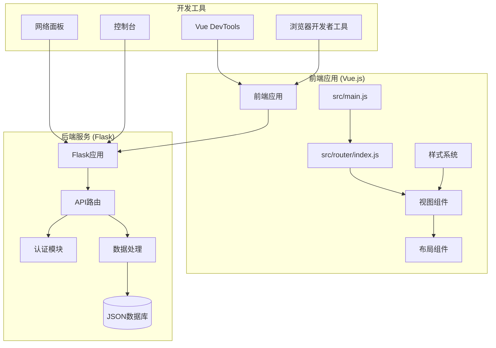
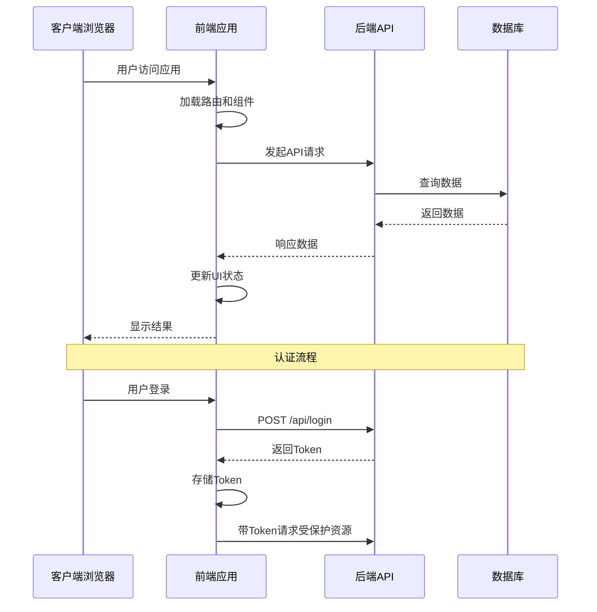
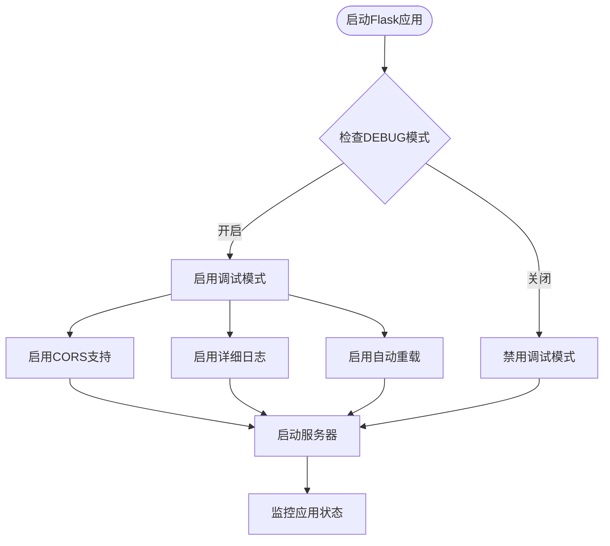

# 调试与测试

<cite>
**本文档引用的文件**
- [package.json](file://package.json)
- [vite.config.js](file://vite.config.js)
- [backend/app.py](file://backend/app.py)
- [src/main.js](file://src/main.js)
- [src/router/index.js](file://src/router/index.js)
- [src/App.vue](file://src/App.vue)
- [src/components/layout/AppLayout.vue](file://src/components/layout/AppLayout.vue)
- [src/views/AuthView.vue](file://src/views/AuthView.vue)
- [src/views/Dashboard.vue](file://src/views/Dashboard.vue)
- [src/style.css](file://src/style.css)
- [index.html](file://index.html)
- [database/accounts.json](file://database/accounts.json)
</cite>

## 目录
1. [简介](#简介)
2. [项目结构](#项目结构)
3. [核心组件](#核心组件)
4. [架构概览](#架构概览)
5. [详细组件分析](#详细组件分析)
6. [依赖分析](#依赖分析)
7. [性能考虑](#性能考虑)
8. [故障排除指南](#故障排除指南)
9. [结论](#结论)
10. [附录](#附录)

## 简介

本指南为智慧康养养老院管理系统提供了全面的调试技巧和测试策略。该系统采用Vue.js前端框架配合Flask后端API，实现了用户认证、数据展示和实时监控功能。本文档涵盖了从开发环境搭建到生产部署的完整调试流程，包括Vue DevTools使用、浏览器开发者工具分析、后端API调试、单元测试、集成测试、端到端测试以及性能优化等各个方面。

## 项目结构

该项目采用前后端分离的架构设计，前端使用Vue.js 3.x + Vite构建，后端使用Python Flask框架。整体项目结构清晰，模块职责明确。



**图表来源**
- [src/main.js:1-11](file://src/main.js#L1-L11)
- [src/router/index.js:1-61](file://src/router/index.js#L1-L61)
- [backend/app.py:1-330](file://backend/app.py#L1-L330)

**章节来源**
- [package.json:1-28](file://package.json#L1-L28)
- [vite.config.js:1-27](file://vite.config.js#L1-L27)
- [index.html:1-14](file://index.html#L1-L14)

## 核心组件

### 前端核心组件

系统的核心组件包括应用入口、路由系统、布局组件和视图组件。每个组件都有明确的职责分工和交互逻辑。

#### 应用入口组件
应用入口负责初始化Vue应用、注册插件和挂载根组件。主要功能包括：
- 创建Vue应用实例
- 注册Pinia状态管理
- 配置Vue Router路由
- 挂载到DOM元素

#### 路由系统
路由系统采用Vue Router 4.x实现，支持动态导入和路由守卫。核心特性包括：
- 基于哈希的历史模式
- 动态组件导入
- 全局路由守卫
- 标题动态设置

#### 布局组件
AppLayout组件提供统一的页面布局，包含侧边导航、顶部栏和模态对话框。主要功能：
- 侧边导航菜单
- 用户信息管理
- 响应式设计
- 系统信息弹窗

#### 视图组件
系统包含多个专门的视图组件，每个组件负责特定的功能领域：
- 认证视图：用户登录和注册
- 仪表板视图：数据可视化展示
- 用户视图：老人信息管理
- 护工视图：护工信息管理

**章节来源**
- [src/main.js:1-11](file://src/main.js#L1-L11)
- [src/router/index.js:1-61](file://src/router/index.js#L1-L61)
- [src/App.vue:1-24](file://src/App.vue#L1-L24)
- [src/components/layout/AppLayout.vue:1-800](file://src/components/layout/AppLayout.vue#L1-L800)

## 架构概览

系统采用客户端-服务器架构，前端通过HTTP API与后端进行通信。整体架构具有良好的可扩展性和维护性。



**图表来源**
- [src/views/AuthView.vue:22-71](file://src/views/AuthView.vue#L22-L71)
- [backend/app.py:148-170](file://backend/app.py#L148-L170)
- [src/router/index.js:42-59](file://src/router/index.js#L42-L59)

## 详细组件分析

### Vue DevTools使用指南

Vue DevTools是调试Vue.js应用最强大的工具之一，提供了组件树查看、状态检查、事件追踪等功能。

#### 组件树分析
- **组件层次结构**：通过Vue DevTools可以清晰看到组件的父子关系
- **响应式数据**：实时查看组件的响应式属性和计算属性
- **生命周期钩子**：观察组件的创建、更新和销毁过程

#### 状态管理调试
- **Pinia Store**：检查全局状态的变化和持久化
- **组件状态**：验证局部状态的正确性
- **响应式更新**：观察数据变化如何触发UI更新

#### 性能分析
- **渲染性能**：识别渲染开销大的组件
- **重渲染分析**：找出不必要的组件重渲染
- **内存泄漏检测**：监控组件实例的生命周期

### 浏览器开发者工具深度分析

#### 控制台调试
- **错误追踪**：使用Source Maps定位错误源码位置
- **断点调试**：在异步代码中设置断点
- **网络请求**：分析API调用的详细信息

#### 元素检查器
- **CSS样式**：实时修改样式属性
- **布局分析**：检查Flexbox和Grid布局
- **响应式设计**：测试不同屏幕尺寸下的表现

#### 性能分析工具
- **Performance面板**：记录和分析页面加载性能
- **Memory面板**：检测内存泄漏和垃圾回收
- **Coverage面板**：分析JavaScript和CSS的使用情况

### 网络面板分析

网络面板是调试API调用和网络问题的关键工具。

#### 请求分析
- **请求头检查**：验证Authorization头和Content-Type
- **响应状态码**：识别4xx和5xx错误
- **请求体分析**：检查POST和PUT的数据格式

#### 缓存策略
- **缓存头分析**：检查Cache-Control和ETag
- **预加载优化**：分析preload和prefetch资源
- **CDN性能**：监控静态资源的加载时间

#### WebSocket调试
- **实时通信**：监控WebSocket连接状态
- **消息格式**：验证消息的JSON结构
- **连接重试**：分析连接失败的原因

### 后端API调试流程

#### Flask调试模式启用
后端应用已经启用了调试模式，便于开发和测试。



**图表来源**
- [backend/app.py:326-330](file://backend/app.py#L326-L330)

#### 日志配置和输出
- **错误日志**：捕获和记录异常信息
- **访问日志**：记录API请求的详细信息
- **调试日志**：输出开发阶段的调试信息

#### API路由调试
- **路由验证**：确认URL模式和参数匹配
- **中间件检查**：验证认证和CORS中间件
- **响应格式**：确保JSON响应的正确性

**章节来源**
- [backend/app.py:1-330](file://backend/app.py#L1-L330)

### 单元测试和集成测试策略

#### 测试环境配置
虽然项目中没有现成的测试文件，但可以基于现有的组件结构建立测试体系。

#### Vue组件测试
- **组件渲染测试**：验证组件的基本渲染功能
- **Props验证**：测试props的传递和验证
- **事件处理**：测试用户交互的响应
- **生命周期**：验证组件的生命周期钩子

#### Pinia Store测试
- **状态管理**：测试store的状态变更
- **Actions调用**：验证异步操作的执行
- **Getters计算**：检查计算属性的正确性

#### API集成测试
- **Mock数据**：使用模拟数据测试API集成
- **错误处理**：验证错误场景的处理
- **认证测试**：测试Token验证机制

### 端到端测试方法

#### Cypress测试框架
Cypress提供了强大的端到端测试能力，适合测试用户工作流。

##### 测试场景设计
- **用户认证流程**：登录、登出、注册
- **数据管理**：CRUD操作和数据验证
- **导航测试**：路由跳转和页面加载
- **响应式测试**：不同设备尺寸下的表现

##### 自动化测试流程
- **测试环境准备**：启动前后端服务
- **测试执行**：运行Cypress测试套件
- **报告生成**：生成详细的测试报告
- **持续集成**：集成到CI/CD流水线

#### Playwright测试框架
Playwright提供了跨浏览器的自动化测试解决方案。

##### 多浏览器支持
- **Chrome/Firefox**：测试主流浏览器兼容性
- **移动设备模拟**：测试移动端用户体验
- **网络条件模拟**：测试不同网络环境

### 性能调试技巧

#### 内存泄漏检测
- **内存快照**：使用浏览器的Memory面板进行内存分析
- **事件监听器**：检查组件卸载时的清理
- **定时器管理**：确保所有定时器都被清除

#### 性能瓶颈分析
- **渲染性能**：识别重渲染频繁的组件
- **网络延迟**：分析API调用的响应时间
- **资源加载**：优化图片和字体的加载

#### 优化策略
- **懒加载**：实现组件和路由的懒加载
- **虚拟滚动**：处理大量数据的列表渲染
- **缓存策略**：合理使用浏览器缓存

## 依赖分析

系统的依赖关系相对简单，主要依赖于Vue生态系统和Flask框架。

```mermaid
graph TB
subgraph "前端依赖"
Vue[Vue.js 3.5.25]
Router[Vue Router 4.6.4]
Pinia[Pinia 3.0.4]
ECharts[ECharts 5.5.0]
ThreeJS[Three.js 0.182.0]
end
subgraph "开发依赖"
Vite[Vite 7.3.1]
VuePlugin[@vitejs/plugin-vue]
SingleFile[vite-plugin-singlefile]
end
subgraph "后端依赖"
Flask[Flask 2.x]
FlaskCORS[flask-cors]
Requests[requests]
end
Vue --> Router
Vue --> Pinia
Vue --> ECharts
Vue --> ThreeJS
Vite --> VuePlugin
Vite --> SingleFile
Flask --> FlaskCORS
Flask --> Requests
```

**图表来源**
- [package.json:11-26](file://package.json#L11-L26)
- [backend/app.py:1-11](file://backend/app.py#L1-L11)

**章节来源**
- [package.json:1-28](file://package.json#L1-L28)
- [backend/app.py:1-330](file://backend/app.py#L1-L330)

## 性能考虑

### 前端性能优化

#### 构建优化
- **代码分割**：利用Vue Router的懒加载特性
- **Tree Shaking**：移除未使用的代码
- **资源压缩**：启用Vite的压缩功能

#### 运行时优化
- **响应式数据**：避免不必要的响应式转换
- **组件缓存**：合理使用keep-alive
- **事件防抖**：优化高频事件的处理

### 后端性能优化

#### API优化
- **数据缓存**：实现适当的缓存策略
- **批量查询**：减少数据库查询次数
- **异步处理**：使用异步任务处理耗时操作

#### 资源管理
- **连接池**：管理数据库连接
- **内存管理**：及时释放临时资源
- **日志轮转**：避免日志文件过大

## 故障排除指南

### 路由问题排查

#### 路由守卫问题
- **Token验证**：检查localStorage中的user_token
- **路由重定向**：验证beforeEach守卫的逻辑
- **页面标题**：确认meta.title的设置

#### 导航问题
- **History模式**：检查服务器配置
- **Hash模式**：确认createWebHashHistory的使用
- **动态导入**：验证组件的懒加载

#### 调试步骤
1. 打开浏览器开发者工具
2. 检查Network面板中的路由请求
3. 查看Console中的错误信息
4. 使用Vue DevTools检查路由状态

### API调用失败排查

#### 认证问题
- **Token过期**：检查Token的有效期
- **CORS配置**：验证跨域设置
- **请求头**：确认Authorization头的格式

#### 数据获取问题
- **网络连接**：检查后端服务的可用性
- **数据格式**：验证JSON响应的结构
- **错误处理**：查看后端的日志信息

#### 调试方法
1. 使用浏览器的Network面板监控请求
2. 检查API响应的状态码和数据
3. 验证前后端的数据格式一致性
4. 使用Postman或curl测试API

### 样式冲突排查

#### CSS优先级问题
- **作用域样式**：检查scoped样式的应用范围
- **全局样式**：验证全局CSS的覆盖规则
- **第三方库**：确认外部库的样式影响

#### 响应式设计问题
- **媒体查询**：检查断点设置
- **Flexbox/Grid**：验证布局算法
- **移动端适配**：测试不同设备的表现

#### 调试技巧
1. 使用浏览器的Elements面板检查样式
2. 使用CSS Grid/Flexbox调试工具
3. 检查CSS变量的继承和覆盖
4. 验证CSS模块化导入

### 常见问题解决方案

#### 开发环境问题
- **热重载失效**：检查Vite配置和文件监听
- **代理配置**：验证API代理的设置
- **端口占用**：确认开发服务器端口的可用性

#### 生产环境问题
- **构建失败**：检查依赖版本和构建配置
- **资源加载**：验证静态资源的路径
- **缓存问题**：清除浏览器缓存和Service Worker

## 结论

本调试与测试指南为智慧康养养老院管理系统提供了完整的开发和运维支持。通过合理使用Vue DevTools、浏览器开发者工具和网络面板，结合Flask的调试模式和日志配置，可以有效提升开发效率和应用质量。

建议团队在日常开发中：
1. 建立标准化的调试流程和测试策略
2. 定期进行性能分析和优化
3. 完善错误监控和日志记录
4. 建立持续集成和自动化测试流程

通过这些实践，可以确保系统的稳定性、可维护性和用户体验。

## 附录

### 调试工具推荐

#### 前端开发工具
- **Vue DevTools**：Vue.js应用调试必备
- **浏览器开发者工具**：原生调试功能
- **ESLint**：代码质量和风格检查
- **Prettier**：代码格式化工具

#### 后端开发工具
- **Flask调试器**：Python应用调试
- **Postman**：API测试和调试
- **curl**：命令行API测试
- **PyCharm**：Python IDE（可选）

#### 性能监控工具
- **Lighthouse**：Web性能和SEO分析
- **WebPageTest**：页面加载性能测试
- **New Relic**：应用性能监控
- **Sentry**：错误追踪和日志管理

### 最佳实践建议

#### 代码规范
- **组件命名**：使用语义化的组件名称
- **状态管理**：合理使用Pinia进行状态管理
- **API设计**：遵循RESTful API设计原则
- **错误处理**：统一的错误处理和用户反馈

#### 开发流程
- **版本控制**：使用Git进行版本管理
- **分支策略**：采用Git Flow或GitHub Flow
- **代码审查**：实施代码审查制度
- **持续集成**：建立CI/CD流水线

#### 测试策略
- **单元测试**：为关键逻辑编写单元测试
- **集成测试**：测试组件间的交互
- **端到端测试**：验证完整的用户流程
- **性能测试**：定期进行性能基准测试