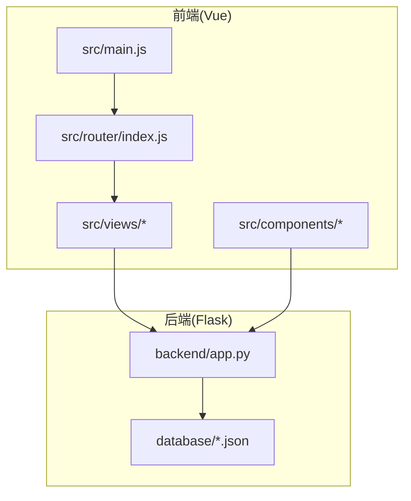
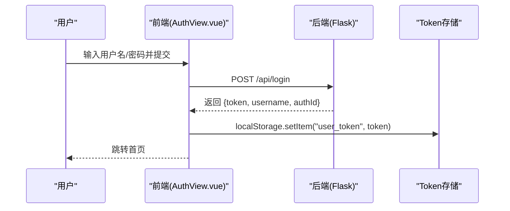
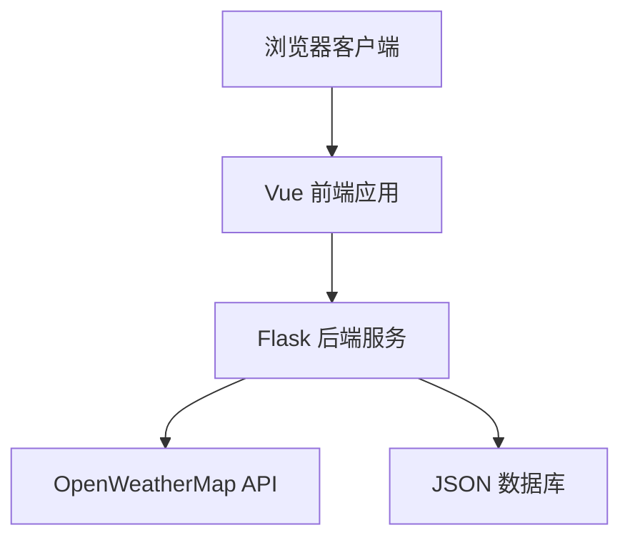

# 快速开始

<cite>
**本文档引用的文件**
- [package.json](file://package.json)
- [vite.config.js](file://vite.config.js)
- [backend/app.py](file://backend/app.py)
- [src/main.js](file://src/main.js)
- [src/router/index.js](file://src/router/index.js)
- [src/views/AuthView.vue](file://src/views/AuthView.vue)
- [src/views/Dashboard.vue](file://src/views/Dashboard.vue)
- [src/components/layout/AppLayout.vue](file://src/components/layout/AppLayout.vue)
- [database/accounts.json](file://database/accounts.json)
- [database/users.json](file://database/users.json)
- [database/workers.json](file://database/workers.json)
- [README.md](file://README.md)
</cite>

## 目录
1. [简介](#简介)
2. [项目结构](#项目结构)
3. [环境准备](#环境准备)
4. [安装与启动](#安装与启动)
5. [核心功能与API接口](#核心功能与api接口)
6. [常见问题与解决方案](#常见问题与解决方案)
7. [架构概览](#架构概览)
8. [性能与优化建议](#性能与优化建议)
9. [故障排查指南](#故障排查指南)
10. [结论](#结论)

## 简介
本项目是一套面向智慧康养养老院的可视化管理平台，采用前后端分离架构：前端基于 Vue 3 + Vite，后端基于 Flask，数据持久化使用 JSON 文件。系统提供实时天气数据展示、老人与护工信息管理、身份认证与路由守卫等功能，帮助养老机构实现高效的数据驱动管理。

## 项目结构
项目采用模块化组织方式，主要目录与文件如下：
- backend：Flask 后端服务，提供 RESTful API
- database：JSON 数据仓库，存放账户、老人、护工、膳食等数据
- src：Vue 前端源码，包含组件、视图、路由与入口文件
- vite.config.js：Vite 构建配置，支持单文件打包
- package.json：前端依赖与脚本配置

**图表来源**
- [src/main.js:1-11](file://src/main.js#L1-L11)
- [src/router/index.js:1-61](file://src/router/index.js#L1-L61)
- [backend/app.py:1-330](file://backend/app.py#L1-L330)
- [database/accounts.json:1-14](file://database/accounts.json#L1-L14)

**章节来源**
- [README.md:42-62](file://README.md#L42-L62)

## 环境准备
为确保项目顺利运行，需要准备以下环境与工具：

- Node.js 与包管理器
  - 推荐使用 Node.js LTS 版本
  - 包管理器可选择 npm 或 pnpm（项目脚本同时支持）
- Python 运行环境
  - Python 3.x（推荐 3.8+）
  - 用于运行 Flask 后端服务
- 开发工具
  - 现代浏览器（Chrome/Firefox/Edge）
  - 代码编辑器（VSCode/IntelliJ IDEA）

操作系统差异
- Windows
  - 使用 PowerShell 或 CMD
  - 注意路径分隔符使用反斜杠 \
- macOS/Linux
  - 使用终端
  - 注意权限与路径分隔符使用正斜杠 /

**章节来源**
- [README.md:64-91](file://README.md#L64-L91)

## 安装与启动
本节提供从零开始的安装与启动步骤，涵盖前端、后端与数据库初始化。

- 步骤1：克隆项目并进入根目录
  - 使用 Git 克隆仓库到本地
  - 进入项目根目录
- 步骤2：安装前端依赖
  - 使用 npm 或 pnpm 安装依赖
  - 参考脚本：[package.json:6-10](file://package.json#L6-L10)
- 步骤3：启动前端开发服务器
  - 运行开发命令
  - 访问 http://localhost:5173
- 步骤4：安装后端依赖并启动 Flask 服务
  - 进入 backend 目录
  - 安装 Python 依赖（如存在 requirements.txt）
  - 运行 Python 应用
  - 默认监听端口 5000
- 步骤5：首次访问与数据准备
  - 前端默认连接后端 http://localhost:5000
  - 首次运行会自动创建数据库目录与空文件（如 accounts.json）

注意
- 若后端未启动，前端部分接口会提示连接失败
- 如需单文件部署，可使用 Vite 单文件插件构建

**章节来源**
- [README.md:64-91](file://README.md#L64-L91)
- [package.json:6-10](file://package.json#L6-L10)
- [backend/app.py:39-46](file://backend/app.py#L39-L46)

## 核心功能与API接口
系统提供以下核心功能与接口，满足日常管理需求。

- 身份认证
  - 注册：POST /api/register
  - 登录：POST /api/login
  - 登出：前端清除本地 Token，跳转登录页
- 数据查询
  - 仪表盘：GET /api/dashboard（天气、评分、用户、食物）
  - 老人信息：GET /api/users
  - 护工信息：GET /api/workers
- 数据管理（需认证）
  - 新增老人：POST /api/users
  - 更新老人：PUT /api/users/:id
  - 删除老人：DELETE /api/users/:id
  - 新增护工：POST /api/workers
  - 更新护工：PUT /api/workers/:id
  - 删除护工：DELETE /api/workers/:id
- 健康检查
  - GET /api/health（后端存活检测）

认证机制
- 登录成功后返回 Bearer Token，前端将其存储于本地存储
- 路由守卫会校验 Token，未登录用户会被重定向至登录页
- 后端通过装饰器校验 Authorization 头中的 Bearer Token

前端集成
- 登录/注册表单组件：[src/views/AuthView.vue:1-380](file://src/views/AuthView.vue#L1-L380)
- 仪表盘数据拉取：[src/views/Dashboard.vue:173-204](file://src/views/Dashboard.vue#L173-L204)
- 路由守卫与拦截：[src/router/index.js:42-59](file://src/router/index.js#L42-L59)

示例流程：登录认证

**图表来源**
- [src/views/AuthView.vue:23-46](file://src/views/AuthView.vue#L23-L46)
- [backend/app.py:148-170](file://backend/app.py#L148-L170)

**章节来源**
- [backend/app.py:120-325](file://backend/app.py#L120-L325)
- [src/views/AuthView.vue:1-380](file://src/views/AuthView.vue#L1-L380)
- [src/views/Dashboard.vue:173-204](file://src/views/Dashboard.vue#L173-L204)
- [src/router/index.js:42-59](file://src/router/index.js#L42-L59)

## 常见问题与解决方案
- 前端无法连接后端
  - 检查后端是否在 http://localhost:5000 启动
  - 确认跨域设置（Flask 已启用 CORS）
- 登录后仍被重定向到登录页
  - 检查浏览器本地存储是否存在 user_token
  - 确认路由守卫逻辑与 meta.hideLayout 配置
- 图表或数据未显示
  - 确认 /api/dashboard 能正常返回数据
  - 检查网络面板与控制台错误
- 构建后单文件无法打开
  - 使用本地 HTTP 服务器预览，避免文件协议导致的 CORS 限制
- 天气数据异常
  - 检查 OpenWeatherMap API Key 与网络连通性
  - 后端会降级使用模拟数据

**章节来源**
- [backend/app.py:11-11](file://backend/app.py#L11-L11)
- [src/router/index.js:42-59](file://src/router/index.js#L42-L59)
- [README.md:101-116](file://README.md#L101-L116)

## 架构概览
系统采用前后端分离架构，前端负责交互与可视化，后端提供数据与业务逻辑，数据库以 JSON 文件形式存储。

**图表来源**
- [backend/app.py:65-117](file://backend/app.py#L65-L117)
- [src/views/Dashboard.vue:173-204](file://src/views/Dashboard.vue#L173-L204)

**章节来源**
- [README.md:28-41](file://README.md#L28-L41)

## 性能与优化建议
- 前端
  - 使用 Vite 单文件插件减少请求数量，适合本地快速预览
  - 合理拆分路由组件，利用异步导入提升首屏加载速度
- 后端
  - 将 JSON 文件读写封装为统一工具函数，避免重复 IO
  - 对频繁请求的接口增加缓存策略（如内存缓存）
- 数据
  - 控制一次性加载的数据量，分页或懒加载展示大量列表
  - 对图表渲染使用防抖与 resize 监听，避免频繁重绘

[本节为通用建议，无需特定文件引用]

## 故障排查指南
- 启动顺序
  - 先启动后端，再启动前端，确保端口未被占用
- 端口冲突
  - 前端默认端口 5173，后端默认端口 5000
  - 如冲突，可在配置中修改对应端口
- CORS 问题
  - Flask 已启用 CORS，若仍出现跨域，检查代理与网络环境
- 数据库文件
  - 首次运行会自动生成 database 目录与空文件
  - 确保运行用户对目录具有读写权限

**章节来源**
- [backend/app.py:11-11](file://backend/app.py#L11-L11)
- [README.md:118-129](file://README.md#L118-L129)

## 结论
通过以上步骤，您可以在本地快速搭建并运行智慧康养养老院管理系统。项目提供了完整的认证、数据查询与管理接口，配合可视化仪表盘，能够有效支撑养老机构的日常管理工作。如需扩展功能，可在此基础上增加权限控制、审计日志与更丰富的数据可视化组件。