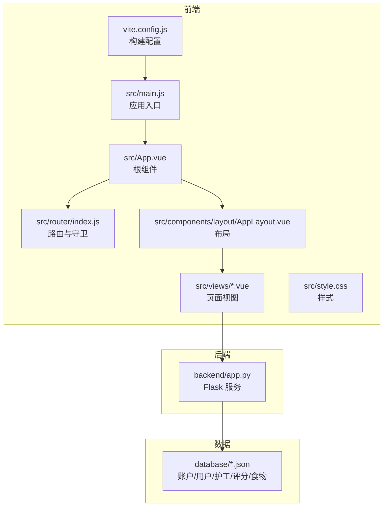
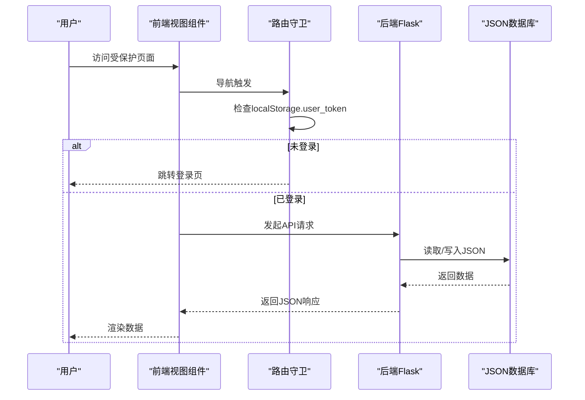
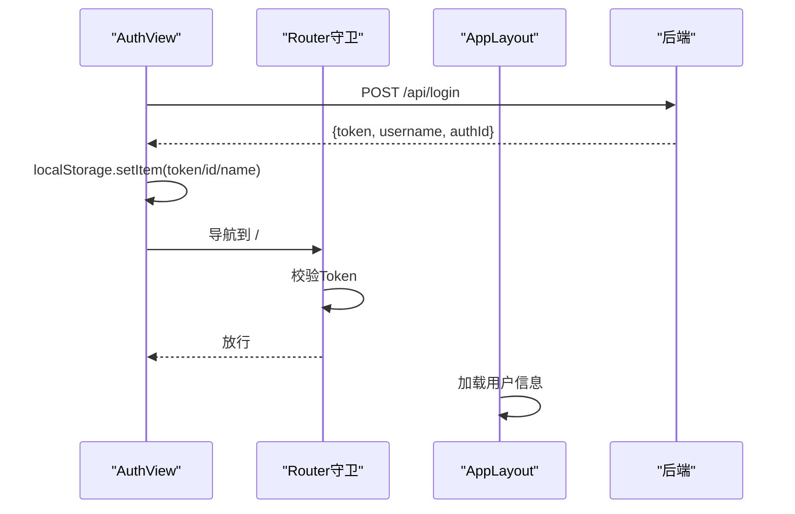
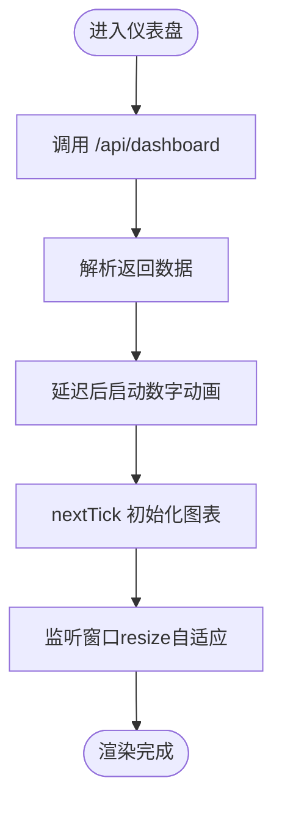
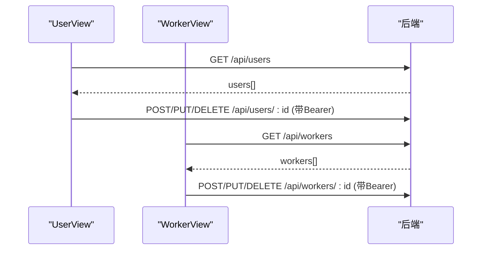
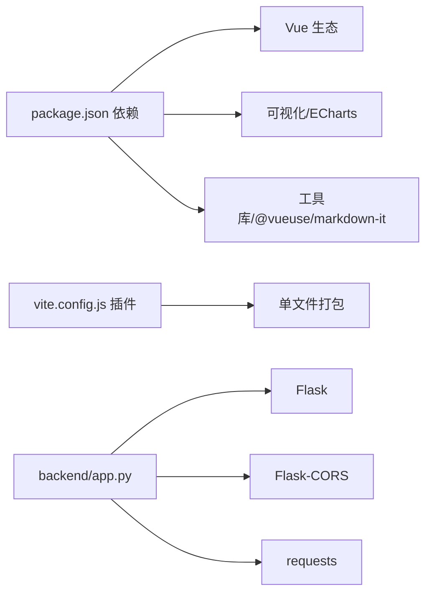

# 故障排除

<cite>
**本文档引用的文件**
- [src/main.js](file://src/main.js)
- [src/App.vue](file://src/App.vue)
- [src/router/index.js](file://src/router/index.js)
- [src/components/layout/AppLayout.vue](file://src/components/layout/AppLayout.vue)
- [src/views/AuthView.vue](file://src/views/AuthView.vue)
- [src/views/Dashboard.vue](file://src/views/Dashboard.vue)
- [src/views/UserView.vue](file://src/views/UserView.vue)
- [src/views/WorkerView.vue](file://src/views/WorkerView.vue)
- [src/style.css](file://src/style.css)
- [vite.config.js](file://vite.config.js)
- [backend/app.py](file://backend/app.py)
- [database/accounts.json](file://database/accounts.json)
- [database/users.json](file://database/users.json)
- [database/workers.json](file://database/workers.json)
- [package.json](file://package.json)
</cite>

## 目录
1. [简介](#简介)
2. [项目结构](#项目结构)
3. [核心组件](#核心组件)
4. [架构总览](#架构总览)
5. [详细组件分析](#详细组件分析)
6. [依赖分析](#依赖分析)
7. [性能考虑](#性能考虑)
8. [故障排除指南](#故障排除指南)
9. [结论](#结论)
10. [附录](#附录)

## 简介
本指南面向开发与运维人员，聚焦于本项目的常见问题与系统性调试方法，覆盖认证失败、数据加载异常、图表渲染问题、性能诊断、API 调试、跨浏览器与移动端适配、以及监控与日志管理。文档基于仓库中的实际源码进行分析，并提供可操作的定位步骤与修复建议。

## 项目结构
前端采用 Vue 3 + Vite 构建，后端使用 Python Flask 提供 REST 接口；数据以 JSON 文件形式存放于 database 目录。路由与全局状态通过 Vue Router 与 Pinia 管理，样式统一在 style.css 中定义。

**图表来源**
- [src/main.js:1-11](file://src/main.js#L1-L11)
- [src/App.vue:1-24](file://src/App.vue#L1-L24)
- [src/router/index.js:1-61](file://src/router/index.js#L1-L61)
- [src/components/layout/AppLayout.vue:1-1094](file://src/components/layout/AppLayout.vue#L1-L1094)
- [src/views/Dashboard.vue:1-967](file://src/views/Dashboard.vue#L1-L967)
- [backend/app.py:1-330](file://backend/app.py#L1-L330)
- [database/users.json:1-582](file://database/users.json#L1-L582)
- [database/workers.json:1-442](file://database/workers.json#L1-L442)
- [vite.config.js:1-27](file://vite.config.js#L1-L27)

**章节来源**
- [src/main.js:1-11](file://src/main.js#L1-L11)
- [src/App.vue:1-24](file://src/App.vue#L1-L24)
- [src/router/index.js:1-61](file://src/router/index.js#L1-L61)
- [src/components/layout/AppLayout.vue:1-1094](file://src/components/layout/AppLayout.vue#L1-L1094)
- [src/views/Dashboard.vue:1-967](file://src/views/Dashboard.vue#L1-L967)
- [backend/app.py:1-330](file://backend/app.py#L1-L330)
- [database/users.json:1-582](file://database/users.json#L1-L582)
- [database/workers.json:1-442](file://database/workers.json#L1-L442)
- [vite.config.js:1-27](file://vite.config.js#L1-L27)

## 核心组件
- 应用入口与插件：创建 Vue 应用、安装 Pinia、安装路由、挂载根组件。
- 根组件：根据路由元信息决定是否包裹布局，控制页面标题。
- 路由与守卫：全局前置守卫校验 Token，未登录跳转登录，已登录访问登录页则跳转仪表盘。
- 布局组件：提供侧边栏、顶部栏、移动端菜单、系统信息弹窗与登出流程。
- 视图组件：
  - 认证视图：登录/注册表单，调用后端 /api/login 与 /api/register。
  - 仪表盘：拉取 /api/dashboard，渲染天气统计与 ECharts 图表。
  - 用户视图：拉取 /api/users，支持新增/编辑/删除（需 Bearer Token）。
  - 护工视图：拉取 /api/workers，支持新增/编辑/删除（需 Bearer Token）。
- 样式：统一主题色、字体、卡片与滚动条样式，响应式网格布局。
- 构建配置：单文件打包、资源输出与基址配置。

**章节来源**
- [src/main.js:1-11](file://src/main.js#L1-L11)
- [src/App.vue:1-24](file://src/App.vue#L1-L24)
- [src/router/index.js:42-59](file://src/router/index.js#L42-L59)
- [src/components/layout/AppLayout.vue:19-29](file://src/components/layout/AppLayout.vue#L19-L29)
- [src/views/AuthView.vue:23-69](file://src/views/AuthView.vue#L23-L69)
- [src/views/Dashboard.vue:173-204](file://src/views/Dashboard.vue#L173-L204)
- [src/views/UserView.vue:34-43](file://src/views/UserView.vue#L34-L43)
- [src/views/WorkerView.vue:97-106](file://src/views/WorkerView.vue#L97-L106)
- [src/style.css:1-308](file://src/style.css#L1-L308)
- [vite.config.js:1-27](file://vite.config.js#L1-L27)

## 架构总览
前后端分离，前端通过 fetch 请求后端 API，后端提供认证、数据查询与增删改接口，并通过 CORS 放通跨域。数据持久化依赖本地 JSON 文件。

**图表来源**
- [src/router/index.js:42-59](file://src/router/index.js#L42-L59)
- [src/views/AuthView.vue:23-69](file://src/views/AuthView.vue#L23-L69)
- [src/views/Dashboard.vue:173-204](file://src/views/Dashboard.vue#L173-L204)
- [backend/app.py:120-182](file://backend/app.py#L120-L182)
- [database/users.json:1-582](file://database/users.json#L1-L582)
- [database/workers.json:1-442](file://database/workers.json#L1-L442)

## 详细组件分析

### 认证与路由守卫
- 登录/注册：前端调用后端 /api/login 与 /api/register，成功后写入 localStorage.user_token 与用户信息。
- 路由守卫：未登录访问非登录页跳转登录；已登录访问登录页跳转仪表盘；动态设置 document.title。
- 退出登录：清除 localStorage.user_token 并跳转登录页。

**图表来源**
- [src/views/AuthView.vue:23-69](file://src/views/AuthView.vue#L23-L69)
- [src/router/index.js:42-59](file://src/router/index.js#L42-L59)
- [src/components/layout/AppLayout.vue:59-73](file://src/components/layout/AppLayout.vue#L59-L73)

**章节来源**
- [src/views/AuthView.vue:23-69](file://src/views/AuthView.vue#L23-L69)
- [src/router/index.js:42-59](file://src/router/index.js#L42-L59)
- [src/components/layout/AppLayout.vue:59-73](file://src/components/layout/AppLayout.vue#L59-L73)

### 仪表盘数据加载与图表渲染
- 数据加载：onMounted 中调用 /api/dashboard，解析 stats、scoringList、foods。
- 数字动画：animateNumber 使用 requestAnimationFrame 实现缓动动画。
- 图表初始化：ECharts 折线图与饼图，监听窗口 resize 自适应。
- 生命周期：onUnmounted 清理定时器，避免内存泄漏。

**图表来源**
- [src/views/Dashboard.vue:173-204](file://src/views/Dashboard.vue#L173-L204)
- [src/views/Dashboard.vue:47-112](file://src/views/Dashboard.vue#L47-L112)
- [src/views/Dashboard.vue:113-169](file://src/views/Dashboard.vue#L113-L169)

**章节来源**
- [src/views/Dashboard.vue:1-967](file://src/views/Dashboard.vue#L1-L967)

### 用户与护工数据管理
- 用户视图：拉取 /api/users，支持搜索与多维筛选；新增/编辑/删除均携带 Authorization: Bearer token。
- 护工视图：拉取 /api/workers，支持搜索与筛选；新增/编辑/删除均携带 Authorization: Bearer token。
- 错误处理：网络异常与后端错误统一通过 Toast 提示。

**图表来源**
- [src/views/UserView.vue:34-43](file://src/views/UserView.vue#L34-L43)
- [src/views/UserView.vue:165-190](file://src/views/UserView.vue#L165-L190)
- [src/views/WorkerView.vue:97-106](file://src/views/WorkerView.vue#L97-L106)
- [src/views/WorkerView.vue:276-323](file://src/views/WorkerView.vue#L276-L323)

**章节来源**
- [src/views/UserView.vue:1-520](file://src/views/UserView.vue#L1-L520)
- [src/views/WorkerView.vue:1-1384](file://src/views/WorkerView.vue#L1-L1384)

### 样式与响应式
- 统一主题色与字体，卡片、滚动条、按钮、模态框等组件样式集中管理。
- 响应式网格：在不同断点下自动调整列数与布局。

**章节来源**
- [src/style.css:1-308](file://src/style.css#L1-L308)

## 依赖分析
- 前端依赖：Vue 3、Vue Router、Pinia、ECharts、@jiaminghi/data-view、Three.js、@vueuse/core、markdown-it。
- 构建工具：Vite、单文件打包插件。
- 后端依赖：Flask、Flask-CORS、requests（调用第三方天气 API）。

**图表来源**
- [package.json:11-21](file://package.json#L11-L21)
- [vite.config.js:6-13](file://vite.config.js#L6-L13)
- [backend/app.py:7-8](file://backend/app.py#L7-L8)

**章节来源**
- [package.json:1-28](file://package.json#L1-L28)
- [vite.config.js:1-27](file://vite.config.js#L1-L27)
- [backend/app.py:1-330](file://backend/app.py#L1-L330)

## 性能考虑
- 图表性能：ECharts 初始化与 resize 监听需在 nextTick 后执行，避免 DOM 尺寸未就绪导致渲染异常。
- 动画性能：数字动画使用 requestAnimationFrame，建议避免在高频事件中创建过多动画实例。
- 资源加载：单文件打包减少请求数，但需关注首屏体积；按需引入第三方库。
- 内存泄漏：确保在组件卸载时清理定时器与事件监听器（已在仪表盘组件中体现）。
- 数据量：用户/护工列表数据量较大时，建议启用虚拟滚动或分页加载。

[本节为通用性能建议，无需特定文件引用]

## 故障排除指南

### 一、认证失败
常见症状
- 登录后仍被重定向到登录页
- 访问受保护页面出现 401
- 退出登录后仍显示用户信息

排查步骤
1. 检查浏览器本地存储
   - 确认 localStorage 中是否存在 user_token、user_name、user_id
   - 若缺失，重新登录并观察网络请求头是否包含 Authorization: Bearer ...
2. 检查路由守卫逻辑
   - 访问非登录页时是否正确读取 localStorage 并放行
   - 已登录访问登录页是否跳转仪表盘
3. 检查后端登录接口
   - /api/login 是否返回 token 与用户信息
   - 后端是否正确校验用户名/密码
4. 检查后端鉴权装饰器
   - /api/users 与 /api/workers 的 PUT/POST/DELETE 是否携带有效 Bearer token

定位参考
- [src/views/AuthView.vue:23-69](file://src/views/AuthView.vue#L23-L69)
- [src/router/index.js:42-59](file://src/router/index.js#L42-L59)
- [backend/app.py:148-169](file://backend/app.py#L148-L169)
- [backend/app.py:15-25](file://backend/app.py#L15-L25)

**章节来源**
- [src/views/AuthView.vue:23-69](file://src/views/AuthView.vue#L23-L69)
- [src/router/index.js:42-59](file://src/router/index.js#L42-L59)
- [backend/app.py:148-169](file://backend/app.py#L148-L169)
- [backend/app.py:15-25](file://backend/app.py#L15-L25)

### 二、数据加载异常
常见症状
- 仪表盘空白或仅显示骨架
- 用户/护工列表为空
- 控制台出现网络错误

排查步骤
1. 打开浏览器开发者工具 Network 面板
   - 观察 /api/dashboard、/api/users、/api/workers 请求状态码与响应体
   - 检查请求头是否包含正确的 Content-Type 与 Authorization
2. 检查后端接口
   - /api/dashboard 是否能读取 database 下的 JSON 文件
   - /api/users 与 /api/workers 是否返回预期数据
3. 检查前端数据解析
   - 确认 response.json() 成功解析
   - 检查空数据场景下的容错处理（如空数组）

定位参考
- [src/views/Dashboard.vue:173-204](file://src/views/Dashboard.vue#L173-L204)
- [src/views/UserView.vue:34-43](file://src/views/UserView.vue#L34-L43)
- [src/views/WorkerView.vue:97-106](file://src/views/WorkerView.vue#L97-L106)
- [backend/app.py:171-182](file://backend/app.py#L171-L182)
- [database/users.json:1-582](file://database/users.json#L1-L582)
- [database/workers.json:1-442](file://database/workers.json#L1-L442)

**章节来源**
- [src/views/Dashboard.vue:173-204](file://src/views/Dashboard.vue#L173-L204)
- [src/views/UserView.vue:34-43](file://src/views/UserView.vue#L34-L43)
- [src/views/WorkerView.vue:97-106](file://src/views/WorkerView.vue#L97-L106)
- [backend/app.py:171-182](file://backend/app.py#L171-L182)

### 三、图表渲染问题
常见症状
- 图表空白或尺寸异常
- 浏览器缩放后图表不自适应
- 动画不生效或闪烁

排查步骤
1. 确认 DOM 引用已就绪
   - ECharts 初始化前，确保 ref 容器已渲染（使用 nextTick）
2. 检查 resize 监听
   - 窗口 resize 时是否调用 chart.resize()
3. 检查数据格式
   - 折线图与饼图的数据结构是否符合 ECharts 配置
4. 检查动画
   - requestAnimationFrame 是否被中断或重复创建

定位参考
- [src/views/Dashboard.vue:196-200](file://src/views/Dashboard.vue#L196-L200)
- [src/views/Dashboard.vue:110-112](file://src/views/Dashboard.vue#L110-L112)
- [src/views/Dashboard.vue:167-169](file://src/views/Dashboard.vue#L167-L169)

**章节来源**
- [src/views/Dashboard.vue:196-200](file://src/views/Dashboard.vue#L196-L200)
- [src/views/Dashboard.vue:110-112](file://src/views/Dashboard.vue#L110-L112)
- [src/views/Dashboard.vue:167-169](file://src/views/Dashboard.vue#L167-L169)

### 四、API 调试最佳实践
- 请求拦截与响应分析
  - 使用浏览器 Network 面板查看请求/响应头、状态码、耗时与响应体
  - 关注 401/400/500 等错误码与后端返回的消息
- 错误处理
  - 前端对 response.ok 进行判断，统一弹窗提示
  - 后端对必填字段缺失、用户/护工不存在等情况返回明确消息
- 身份验证
  - 新增/编辑/删除接口需携带 Authorization: Bearer token
  - 后端装饰器 require_auth 校验 Bearer token 是否在有效集合中

定位参考
- [src/views/UserView.vue:165-190](file://src/views/UserView.vue#L165-L190)
- [src/views/WorkerView.vue:276-323](file://src/views/WorkerView.vue#L276-L323)
- [backend/app.py:15-25](file://backend/app.py#L15-L25)
- [backend/app.py:208-262](file://backend/app.py#L208-L262)
- [backend/app.py:268-320](file://backend/app.py#L268-L320)

**章节来源**
- [src/views/UserView.vue:165-190](file://src/views/UserView.vue#L165-L190)
- [src/views/WorkerView.vue:276-323](file://src/views/WorkerView.vue#L276-L323)
- [backend/app.py:15-25](file://backend/app.py#L15-L25)
- [backend/app.py:208-262](file://backend/app.py#L208-L262)
- [backend/app.py:268-320](file://backend/app.py#L268-L320)

### 五、跨浏览器与移动端适配
- 移动端菜单
  - AppLayout 监听窗口宽度，小于阈值时显示移动端菜单与遮罩
  - 退出登录时重置菜单状态
- 响应式布局
  - style.css 中针对断点调整网格列数与表单栅格
- 字体与滚动条
  - 使用系统字体栈，保证跨平台一致性
  - 自定义滚动条样式，注意在不同浏览器中的表现差异

定位参考
- [src/components/layout/AppLayout.vue:116-129](file://src/components/layout/AppLayout.vue#L116-L129)
- [src/style.css:301-308](file://src/style.css#L301-L308)

**章节来源**
- [src/components/layout/AppLayout.vue:116-129](file://src/components/layout/AppLayout.vue#L116-L129)
- [src/style.css:301-308](file://src/style.css#L301-L308)

### 六、性能诊断与优化
- 内存泄漏检测
  - 确保 onUnmounted 中清理定时器与事件监听器（已在仪表盘中体现）
- 渲染性能
  - 避免在高频事件中频繁创建图表实例
  - 大列表建议虚拟滚动或分页
- 构建优化
  - 单文件打包减少请求数，注意首屏体积
  - 按需引入第三方库，避免引入未使用的模块

定位参考
- [src/views/Dashboard.vue:205-209](file://src/views/Dashboard.vue#L205-L209)
- [vite.config.js:8-13](file://vite.config.js#L8-L13)

**章节来源**
- [src/views/Dashboard.vue:205-209](file://src/views/Dashboard.vue#L205-L209)
- [vite.config.js:8-13](file://vite.config.js#L8-L13)

### 七、运维与日志管理
- 后端健康检查
  - /api/health 返回服务状态，便于监控探活
- 日志与错误
  - 后端在获取第三方天气 API 失败时打印错误信息
  - 前端在请求异常时记录 console.error 并弹窗提示
- 数据备份
  - database 目录下的 JSON 文件即为数据持久化介质，建议定期备份

定位参考
- [backend/app.py:322-324](file://backend/app.py#L322-L324)
- [backend/app.py:114-116](file://backend/app.py#L114-L116)
- [src/views/Dashboard.vue:201-203](file://src/views/Dashboard.vue#L201-L203)

**章节来源**
- [backend/app.py:322-324](file://backend/app.py#L322-L324)
- [backend/app.py:114-116](file://backend/app.py#L114-L116)
- [src/views/Dashboard.vue:201-203](file://src/views/Dashboard.vue#L201-L203)

## 结论
本项目采用前后端分离架构，前端通过路由守卫与本地存储实现认证流程，后端提供 REST 接口与 CORS 放通。通过浏览器开发者工具、Network 面板与 Vue DevTools，可快速定位认证失败、数据加载异常与图表渲染问题。结合性能优化与运维日志策略，可进一步提升稳定性与可观测性。

## 附录
- 快速检查清单
  - 登录后 localStorage 是否存在 token 与用户信息
  - 路由守卫是否正确校验并放行
  - Network 面板中 API 请求状态码与响应体
  - ECharts 初始化时机与 resize 监听
  - 大数据量场景下的虚拟滚动或分页
  - 后端 /api/health 健康检查可用性

[本节为总结性内容，无需特定文件引用]