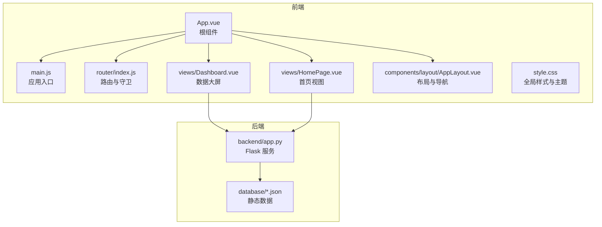
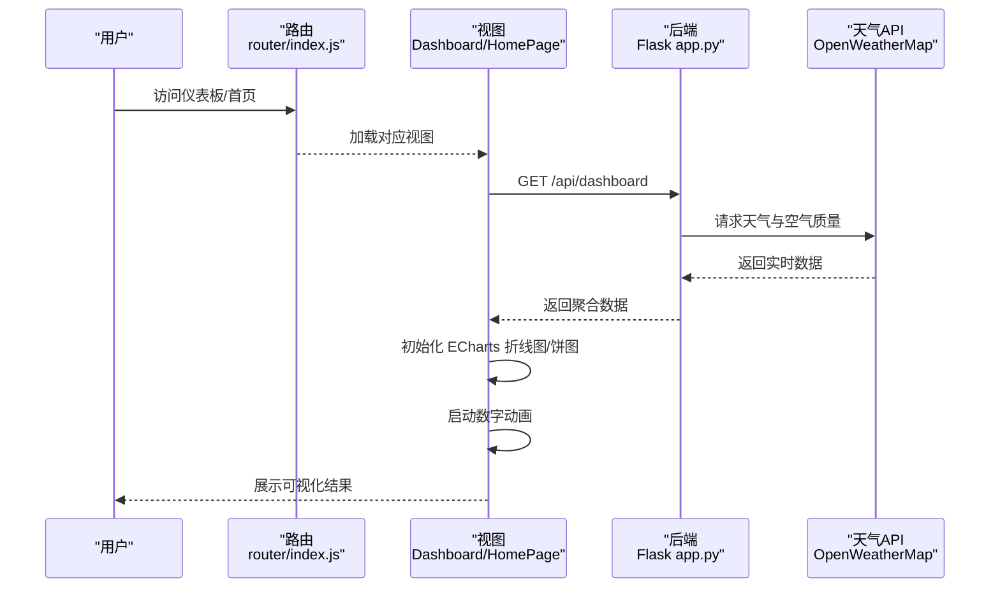
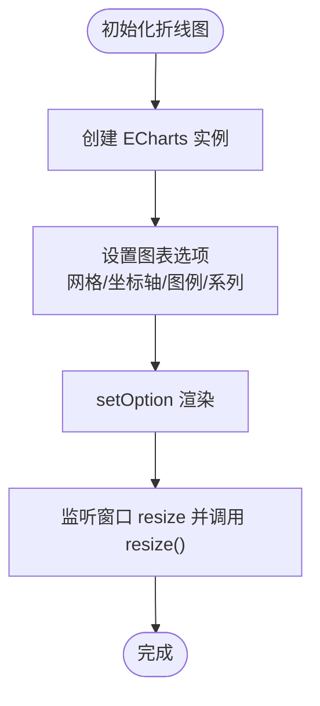
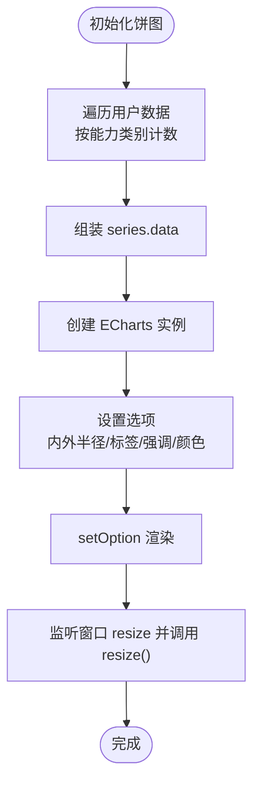
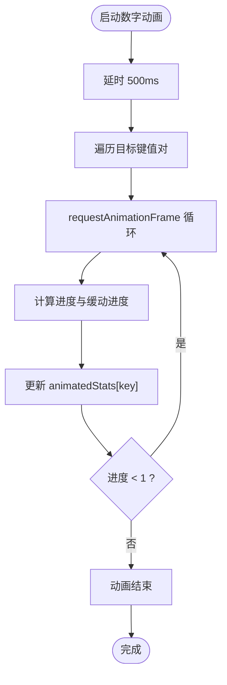
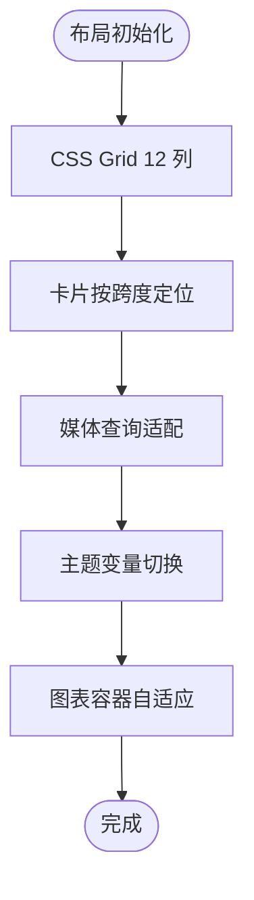
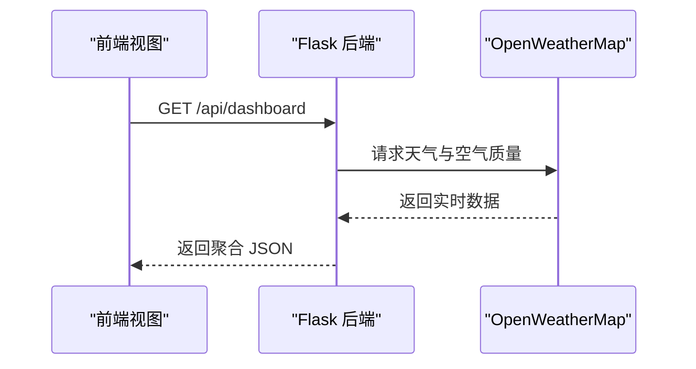
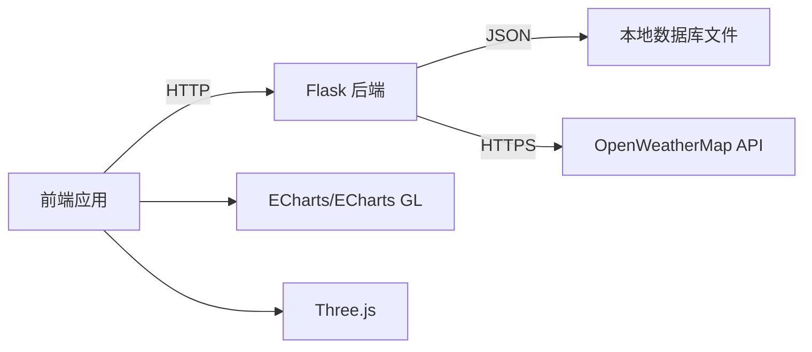

# 数据可视化

<cite>
**本文档引用的文件**
- [package.json](file://package.json)
- [main.js](file://src/main.js)
- [App.vue](file://src/App.vue)
- [router/index.js](file://src/router/index.js)
- [views/Dashboard.vue](file://src/views/Dashboard.vue)
- [views/HomePage.vue](file://src/views/HomePage.vue)
- [components/layout/AppLayout.vue](file://src/components/layout/AppLayout.vue)
- [style.css](file://src/style.css)
- [backend/app.py](file://backend/app.py)
- [database/accounts.json](file://database/accounts.json)
- [database/users.json](file://database/users.json)
</cite>

## 目录
1. [简介](#简介)
2. [项目结构](#项目结构)
3. [核心组件](#核心组件)
4. [架构总览](#架构总览)
5. [详细组件分析](#详细组件分析)
6. [依赖关系分析](#依赖关系分析)
7. [性能考量](#性能考量)
8. [故障排查指南](#故障排查指南)
9. [结论](#结论)
10. [附录](#附录)

## 简介
本项目围绕“智慧康养”养老院管理场景，构建了以数据可视化为核心的前端仪表板。系统采用 Vue 3 + Vite 技术栈，集成了 ECharts 图表库与 Three.js 3D 图形库，并通过本地 Flask 后端提供数据聚合与天气 API 调用。本文档聚焦于 ECharts 在项目中的集成与应用，涵盖图表配置、数据绑定、动态更新、数字动画、响应式设计、主题定制、交互与导出等完整方案；同时给出 Three.js 的集成思路与最佳实践，帮助设计师与开发者快速落地可视化解决方案。

## 项目结构
项目采用前后端分离架构，前端负责数据展示与交互，后端负责认证、数据聚合与第三方天气 API 调用。

**图表来源**
- [App.vue:1-24](file://src/App.vue#L1-L24)
- [main.js:1-11](file://src/main.js#L1-L11)
- [router/index.js:1-61](file://src/router/index.js#L1-L61)
- [views/Dashboard.vue:1-210](file://src/views/Dashboard.vue#L1-L210)
- [views/HomePage.vue:1-210](file://src/views/HomePage.vue#L1-L210)
- [components/layout/AppLayout.vue:1-167](file://src/components/layout/AppLayout.vue#L1-L167)
- [style.css:1-308](file://src/style.css#L1-L308)
- [backend/app.py:1-330](file://backend/app.py#L1-L330)

**章节来源**
- [package.json:1-27](file://package.json#L1-L27)
- [main.js:1-11](file://src/main.js#L1-L11)
- [router/index.js:1-61](file://src/router/index.js#L1-L61)

## 核心组件
- ECharts 图表集成：在数据大屏与首页视图中分别初始化折线图与饼图，支持响应式缩放与交互提示。
- 数字动画：自定义纯 JavaScript 补间动画，实现数值从初始值到目标值的平滑过渡。
- Three.js 集成：在 package.json 中声明依赖，结合 ECharts GL 支持 3D 场景扩展（具体使用可在后续视图中实现）。
- 响应式布局：基于 CSS Grid 与媒体查询，适配桌面与移动端显示。
- 主题系统：通过 CSS 变量统一管理色彩与字体，支持浅色卡片与玻璃拟态风格。

**章节来源**
- [views/Dashboard.vue:1-210](file://src/views/Dashboard.vue#L1-L210)
- [views/HomePage.vue:1-210](file://src/views/HomePage.vue#L1-L210)
- [style.css:1-308](file://src/style.css#L1-L308)
- [package.json:11-20](file://package.json#L11-L20)

## 架构总览
前端通过路由加载视图，视图内发起后端接口请求，后端聚合本地 JSON 数据与第三方天气 API，返回统一的数据结构供前端渲染图表与数字动画。

**图表来源**
- [router/index.js:3-35](file://src/router/index.js#L3-L35)
- [views/Dashboard.vue:173-204](file://src/views/Dashboard.vue#L173-L204)
- [views/HomePage.vue:173-204](file://src/views/HomePage.vue#L173-L204)
- [backend/app.py:171-182](file://backend/app.py#L171-L182)

## 详细组件分析

### ECharts 折线图（温度趋势）
- 初始化：在视图挂载完成后，通过 ECharts 初始化实例并设置选项。
- 配置要点：
  - 坐标轴：分类轴与数值轴，设置标签颜色与轴线样式。
  - 图例：触发方式为坐标轴，位置与文字颜色适配主题。
  - 区域填充：使用线性渐变实现面积图视觉层次。
  - 响应式：监听窗口 resize 事件，自动调整图表尺寸。
- 数据绑定：从后端返回的 stats 对象中读取最大/最小温度数组进行渲染。

**图表来源**
- [views/Dashboard.vue:48-112](file://src/views/Dashboard.vue#L48-L112)
- [views/HomePage.vue:48-112](file://src/views/HomePage.vue#L48-L112)

**章节来源**
- [views/Dashboard.vue:48-112](file://src/views/Dashboard.vue#L48-L112)
- [views/HomePage.vue:48-112](file://src/views/HomePage.vue#L48-L112)

### ECharts 饼图（行动能力分布）
- 初始化：在视图挂载完成后，对用户数据进行聚合统计，生成饼图数据。
- 配置要点：
  - 内外半径：环形饼图，便于放置图例与中心标签。
  - 标签与强调：普通与强调状态下标签样式区分。
  - 颜色体系：与主题色一致的多色环形配色。
  - 交互提示：工具箱与提示框按模板配置。
- 数据绑定：将聚合后的对象数组映射为 series.data。

**图表来源**
- [views/Dashboard.vue:114-169](file://src/views/Dashboard.vue#L114-L169)
- [views/HomePage.vue:114-169](file://src/views/HomePage.vue#L114-L169)

**章节来源**
- [views/Dashboard.vue:114-169](file://src/views/Dashboard.vue#L114-L169)
- [views/HomePage.vue:114-169](file://src/views/HomePage.vue#L114-L169)

### 数字动画（数值过渡）
- 实现原理：使用 requestAnimationFrame 驱动补间动画，缓动函数采用三次缓动，保证自然流畅。
- 更新策略：在视图 mounted 后延时启动，逐项将 animatedStats 的目标值平滑过渡到后端返回的真实值。
- 性能优化：单帧只更新一次数值，避免频繁重绘；动画结束后停止回调链。

**图表来源**
- [views/Dashboard.vue:29-45](file://src/views/Dashboard.vue#L29-L45)
- [views/Dashboard.vue:183-194](file://src/views/Dashboard.vue#L183-L194)
- [views/HomePage.vue:29-45](file://src/views/HomePage.vue#L29-L45)
- [views/HomePage.vue:183-194](file://src/views/HomePage.vue#L183-L194)

**章节来源**
- [views/Dashboard.vue:29-45](file://src/views/Dashboard.vue#L29-L45)
- [views/Dashboard.vue:183-194](file://src/views/Dashboard.vue#L183-L194)
- [views/HomePage.vue:29-45](file://src/views/HomePage.vue#L29-L45)
- [views/HomePage.vue:183-194](file://src/views/HomePage.vue#L183-L194)

### 响应式图表设计
- 视图容器：每个图表容器设置固定高度与宽度百分比，确保在网格布局下自适应。
- 网格系统：使用 CSS Grid 将仪表板划分为 12 列，卡片按跨度组合；在小屏设备上自动降级为单列。
- 主题适配：深色模式下坐标轴与提示框颜色调整，保持对比度与可读性。
- 移动端优化：侧边栏与顶部导航在窄屏下折叠，图表容器留出足够空间。

**图表来源**
- [views/Dashboard.vue:389-462](file://src/views/Dashboard.vue#L389-L462)
- [views/HomePage.vue:389-464](file://src/views/HomePage.vue#L389-L464)
- [style.css:301-308](file://src/style.css#L301-L308)

**章节来源**
- [views/Dashboard.vue:389-462](file://src/views/Dashboard.vue#L389-L462)
- [views/HomePage.vue:389-464](file://src/views/HomePage.vue#L389-L464)
- [style.css:301-308](file://src/style.css#L301-L308)

### 主题定制与交互
- 主题变量：通过 CSS 变量集中管理主色、辅色、背景与文本色，便于全局替换。
- 图表主题：坐标轴、图例、分割线颜色与透明度与主题一致，提升一致性。
- 交互功能：提示框、图例选择、缩放与拖拽（按需启用），增强用户体验。
- 导出建议：可通过 ECharts 提供的导出接口将图表保存为图片或 PDF（在业务需要时接入）。

**章节来源**
- [style.css:3-30](file://src/style.css#L3-L30)
- [views/Dashboard.vue:54-112](file://src/views/Dashboard.vue#L54-L112)
- [views/HomePage.vue:54-112](file://src/views/HomePage.vue#L54-L112)

### Three.js 3D 图形集成
- 依赖声明：在 package.json 中引入 three 与 echarts-gl，满足 3D 图表与三维场景需求。
- 集成思路：
  - 3D 场景：在需要的视图中引入 Three.js，创建场景、相机与渲染器，加载模型或几何体。
  - 与 ECharts 结合：使用 echarts-gl 渲染 3D 图表（如散点云、地形、飞线等），并与 2D 图表联动。
  - 性能优化：按需加载资源、降低多边形数量、使用实例化渲染与剔除优化。
- 应用场景：老年人健康指标的空间分布、区域热力图、人员流动轨迹等。

**章节来源**
- [package.json:14-16](file://package.json#L14-L16)

### 后端数据与接口
- 接口：/api/dashboard 返回天气统计、评分列表、用户与食物数据。
- 数据来源：本地 JSON 文件与 OpenWeatherMap 第三方 API。
- 认证：后端提供登录注册与令牌校验，前端路由守卫基于本地 Token 控制访问。

**图表来源**
- [views/Dashboard.vue:173-182](file://src/views/Dashboard.vue#L173-L182)
- [views/HomePage.vue:173-182](file://src/views/HomePage.vue#L173-L182)
- [backend/app.py:65-117](file://backend/app.py#L65-L117)
- [backend/app.py:171-182](file://backend/app.py#L171-L182)

**章节来源**
- [backend/app.py:171-182](file://backend/app.py#L171-L182)
- [database/users.json:1-582](file://database/users.json#L1-L582)
- [database/accounts.json:1-14](file://database/accounts.json#L1-L14)

## 依赖关系分析
- 前端依赖：Vue 3、Vue Router、Pinia、ECharts、ECharts GL、Three.js、@jiaminghi/data-view。
- 后端依赖：Flask、Flask-CORS、requests。
- 前后端通信：HTTP REST 接口，跨域支持开启。

**图表来源**
- [package.json:11-20](file://package.json#L11-L20)
- [backend/app.py:1-11](file://backend/app.py#L1-L11)
- [backend/app.py:76-117](file://backend/app.py#L76-L117)

**章节来源**
- [package.json:11-20](file://package.json#L11-L20)
- [backend/app.py:1-11](file://backend/app.py#L1-L11)

## 性能考量
- 图表渲染：
  - 使用 requestAnimationFrame 驱动动画，减少主线程阻塞。
  - 在 resize 事件中仅调用图表 resize，避免重复初始化。
- 数据更新：
  - 使用 nextTick 确保 DOM 已渲染后再初始化图表，避免尺寸异常。
  - 对定时器与轮询进行生命周期清理，防止内存泄漏。
- 资源加载：
  - 按需引入 ECharts 与 Three.js，避免首屏体积过大。
  - 合理拆分视图组件，延迟加载非首屏图表。
- 主题与样式：
  - CSS 变量集中管理，减少样式重排与重绘。
  - 使用媒体查询在小屏设备上简化图表复杂度。

[本节为通用指导，无需特定文件引用]

## 故障排查指南
- 图表不显示或尺寸异常
  - 检查容器元素是否已渲染（使用 nextTick）。
  - 确认 resize 监听是否正确绑定与解绑。
- 动画不生效
  - 确认目标值与起始值差异，检查 requestAnimationFrame 回调链。
  - 避免在动画过程中频繁修改目标值导致抖动。
- 跨域问题
  - 后端已启用 CORS，确认请求头 Authorization 与 Bearer Token 正确传递。
- 数据为空
  - 检查后端接口返回结构与键名是否与前端读取一致。
  - 确认本地 JSON 文件是否存在与格式正确。

**章节来源**
- [views/Dashboard.vue:196-209](file://src/views/Dashboard.vue#L196-L209)
- [views/HomePage.vue:196-209](file://src/views/HomePage.vue#L196-L209)
- [backend/app.py:15-25](file://backend/app.py#L15-L25)

## 结论
本项目在养老院管理场景中，通过 ECharts 与 Three.js 的协同，实现了从基础折线图、饼图到潜在 3D 场景的可视化能力。配合自定义数字动画与响应式布局，既满足了数据展示需求，也兼顾了交互体验与性能优化。后续可在现有基础上扩展更多图表类型与交互功能，并完善导出与主题切换能力，进一步提升系统的可用性与可维护性。

[本节为总结性内容，无需特定文件引用]

## 附录
- 常用图表类型建议
  - 折线图：温度趋势、能耗变化、入住率变化。
  - 饼图/环形图：行动能力分布、性别比例、房间占用率。
  - 柱状图：月度评分、费用构成、健康指标分布。
  - 热力图：区域密度、时段活跃度。
  - 3D 图：楼层平面图标注、人员分布、环境参数三维展示。
- 最佳实践清单
  - 统一主题变量与命名规范。
  - 图表选项模块化，便于复用与维护。
  - 动画时长与缓动函数与业务节奏匹配。
  - 移动端优先，简化交互与数据粒度。
  - 明确导出与打印适配策略。

[本节为概念性内容，无需特定文件引用]