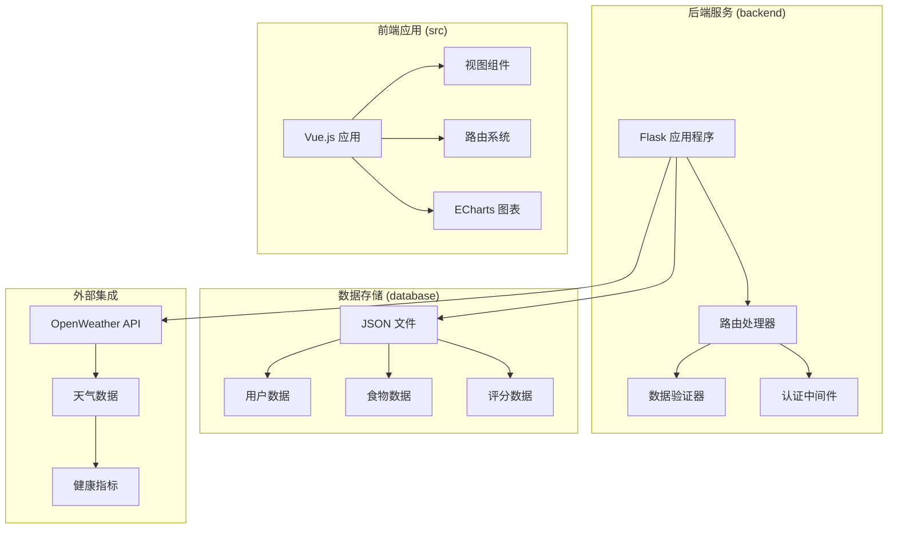
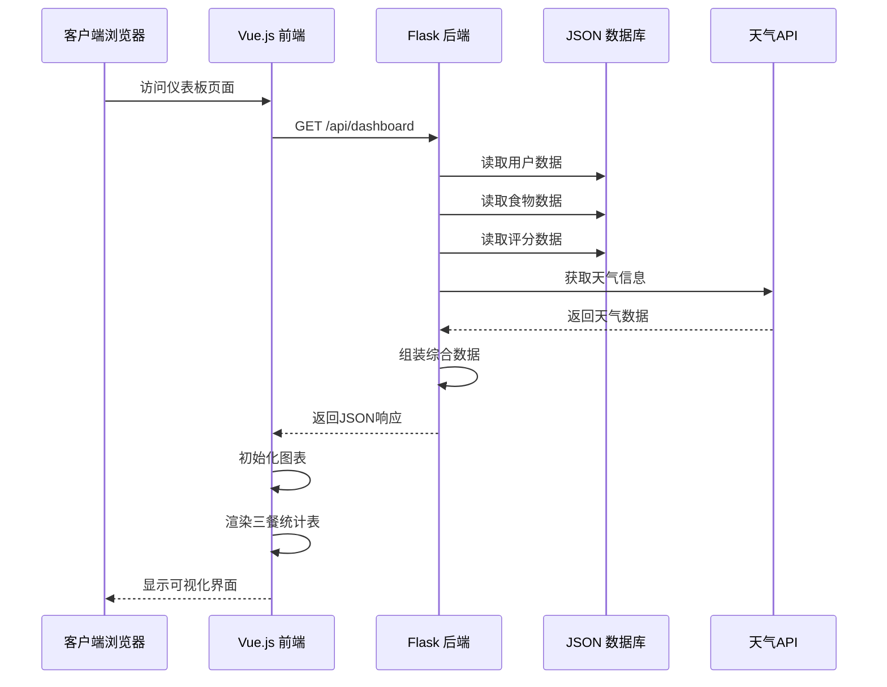
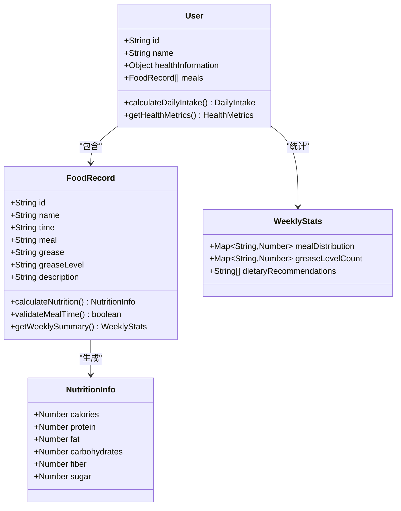
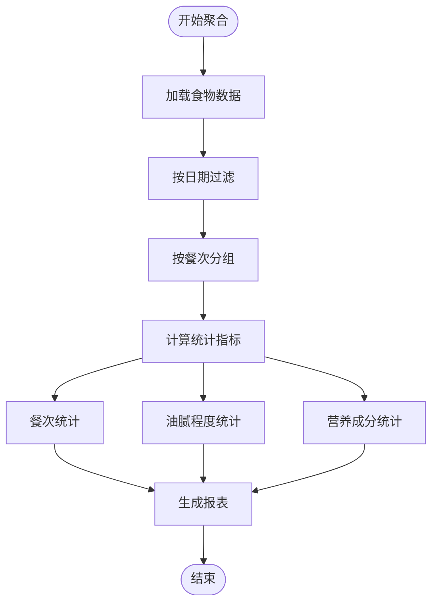
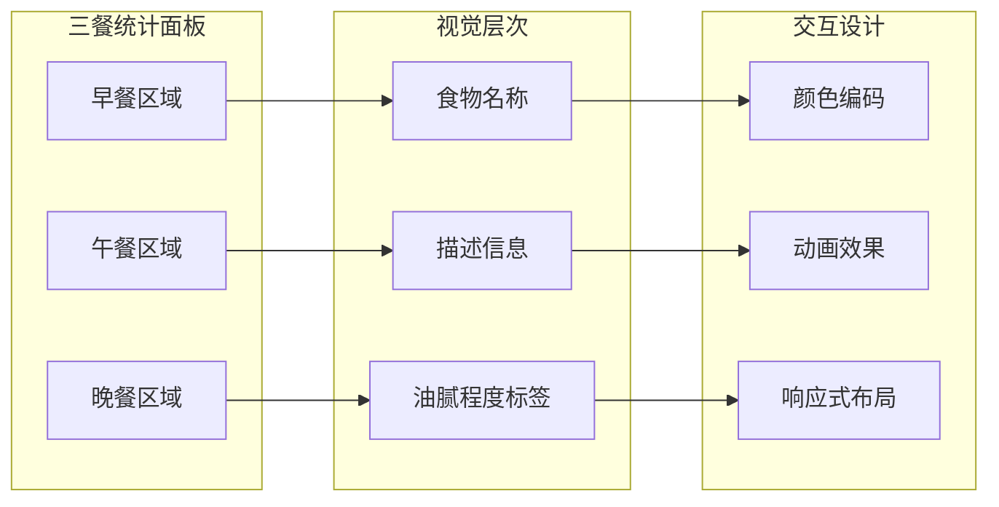
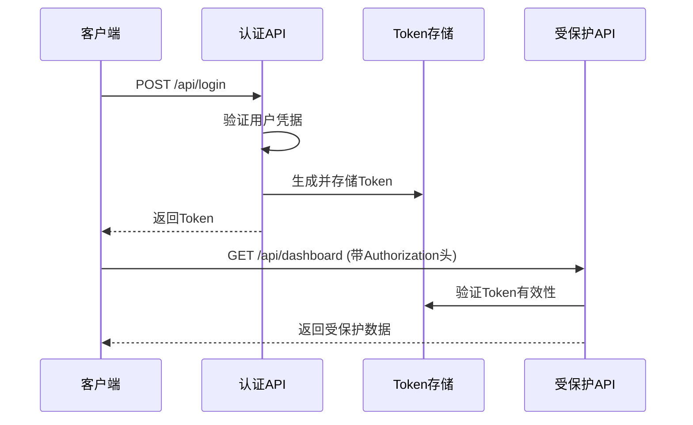
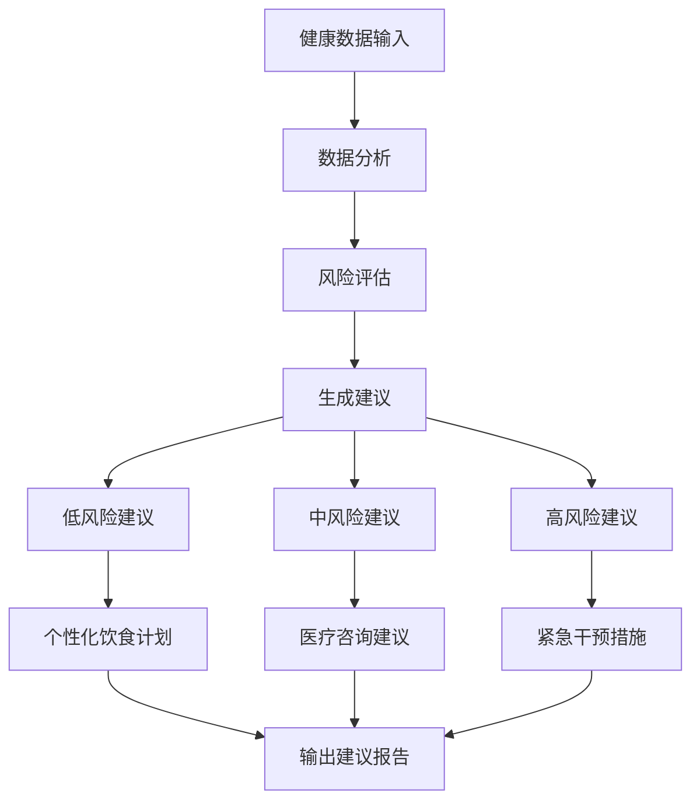
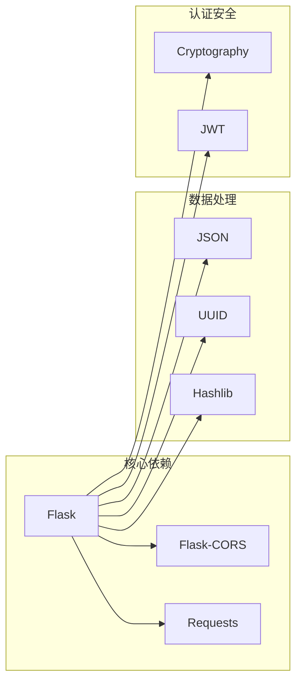
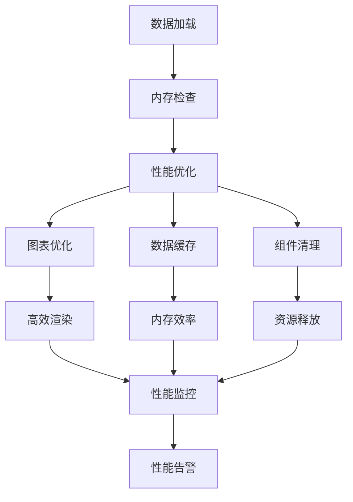

# 三餐统计表

<cite>
**本文档引用的文件**
- [backend/app.py](file://backend/app.py)
- [database/foods.json](file://database/foods.json)
- [database/users.json](file://database/users.json)
- [src/views/Dashboard.vue](file://src/views/Dashboard.vue)
- [src/views/HomePage.vue](file://src/views/HomePage.vue)
- [src/router/index.js](file://src/router/index.js)
- [package.json](file://package.json)
</cite>

## 目录
1. [简介](#简介)
2. [项目结构](#项目结构)
3. [核心组件](#核心组件)
4. [架构概览](#架构概览)
5. [详细组件分析](#详细组件分析)
6. [依赖分析](#依赖分析)
7. [性能考虑](#性能考虑)
8. [故障排除指南](#故障排除指南)
9. [结论](#结论)
10. [附录](#附录)

## 简介

本项目是一个智慧康养管理系统，专注于为养老机构提供全面的数据监控和分析功能。系统通过三餐统计表实现了对老年人营养摄入情况的精细化管理，包括三餐记录的数据结构设计、统计计算逻辑、数据聚合方式以及可视化展示。

系统采用前后端分离架构，后端基于Python Flask框架提供RESTful API服务，前端使用Vue.js框架构建响应式用户界面。通过ECharts图表库实现数据可视化，为管理人员提供直观的运营洞察。

## 项目结构

该项目采用模块化的文件组织结构，主要分为以下几个核心部分：



**图表来源**
- [backend/app.py:1-330](file://backend/app.py#L1-L330)
- [src/views/Dashboard.vue:1-967](file://src/views/Dashboard.vue#L1-L967)

**章节来源**
- [backend/app.py:1-330](file://backend/app.py#L1-L330)
- [src/views/Dashboard.vue:1-967](file://src/views/Dashboard.vue#L1-L967)

## 核心组件

### 数据模型设计

系统的核心数据模型围绕三餐统计展开，主要包括以下关键实体：

#### 食物记录模型 (Food Record Model)

| 字段名称 | 数据类型 | 必填 | 描述 | 示例值 |
|---------|---------|------|------|--------|
| id | String | 是 | 食物唯一标识符 | "20260225A0001" |
| name | String | 是 | 食物名称 | "皮蛋瘦肉粥" |
| time | String | 是 | 食物制作日期 | "2026/02/25" |
| meal | String | 是 | 餐次类型 | "早餐" |
| grease | String | 是 | 油腻程度描述 | "清淡" |
| greaseLevel | String | 是 | 油腻程度等级 | "low" |
| description | String | 否 | 食物描述信息 | "精选瘦肉与皮蛋慢火熬煮..." |

#### 用户健康模型 (User Health Model)

| 字段名称 | 数据类型 | 必填 | 描述 | 示例值 |
|---------|---------|------|------|--------|
| MBG | Number | 否 | 糖化血红蛋白 | 99 |
| MAP | Number | 否 | 平均动脉压 | 23 |
| MBF | Number | 否 | 脂肪质量指数 | 77 |

#### 护工评分模型 (Worker Score Model)

| 字段名称 | 数据类型 | 必填 | 描述 | 示例值 |
|---------|---------|------|------|--------|
| flag | String | 是 | 护工标识 | "➊" |
| text | String | 是 | 护工姓名 | "张阿姨" |
| score | String | 是 | 服务评价 | "服务态度极佳..." |

**章节来源**
- [database/foods.json:1-38](file://database/foods.json#L1-L38)
- [database/users.json:29](file://database/users.json#L29)
- [database/scoringList.json:1-7](file://database/scoringList.json#L1-L7)

## 架构概览

系统采用现代Web应用架构，实现了完整的前后端分离设计：



**图表来源**
- [backend/app.py:171-182](file://backend/app.py#L171-L182)
- [src/views/Dashboard.vue:173-204](file://src/views/Dashboard.vue#L173-L204)

系统架构特点：
- **前后端分离**：前端Vue.js应用与后端Flask服务完全独立
- **RESTful API**：标准化的HTTP接口设计
- **JSON数据存储**：轻量级数据持久化方案
- **实时数据更新**：支持动态数据刷新和图表更新

**章节来源**
- [backend/app.py:118-330](file://backend/app.py#L118-L330)
- [src/router/index.js:1-61](file://src/router/index.js#L1-L61)

## 详细组件分析

### 三餐统计表组件

#### 数据结构设计

三餐统计表采用了灵活的数据结构设计，支持多维度的数据分析：



**图表来源**
- [database/foods.json:1-38](file://database/foods.json#L1-L38)
- [database/users.json:29](file://database/users.json#L29)

#### 数据聚合算法

系统实现了高效的三餐数据聚合算法：



**图表来源**
- [src/views/Dashboard.vue:294-338](file://src/views/Dashboard.vue#L294-L338)

#### 可视化展示组件

三餐统计表采用了响应式的网格布局设计：



**图表来源**
- [src/views/Dashboard.vue:789-800](file://src/views/Dashboard.vue#L789-L800)

**章节来源**
- [src/views/Dashboard.vue:294-338](file://src/views/Dashboard.vue#L294-L338)
- [src/views/HomePage.vue:294-338](file://src/views/HomePage.vue#L294-L338)

### API接口设计

#### 数据获取接口

系统提供了标准化的API接口来支持三餐统计功能：

| 接口 | 方法 | 路径 | 功能 | 请求参数 | 响应数据 |
|------|------|------|------|----------|----------|
| 获取仪表板数据 | GET | `/api/dashboard` | 获取综合统计数据 | 无 | 包含天气、用户、食物、评分数据的JSON对象 |
| 获取用户列表 | GET | `/api/users` | 获取所有用户信息 | 无 | 用户数组JSON |
| 创建用户 | POST | `/api/users` | 新增用户记录 | 用户JSON对象 | 成功消息和用户数据 |
| 更新用户 | PUT | `/api/users/:id` | 更新用户信息 | 用户ID和更新数据 | 成功消息和更新后的用户数据 |
| 删除用户 | DELETE | `/api/users/:id` | 删除用户记录 | 用户ID | 成功消息 |

#### 认证机制

系统实现了基于Token的认证机制：



**图表来源**
- [backend/app.py:148-170](file://backend/app.py#L148-L170)
- [backend/app.py:15-25](file://backend/app.py#L15-L25)

**章节来源**
- [backend/app.py:118-330](file://backend/app.py#L118-L330)

### 健康数据分析

#### 营养成分分析

系统集成了健康数据分析功能，支持对老年人营养摄入的深度分析：

| 分析维度 | 指标类型 | 计算方法 | 正常范围 | 异常预警 |
|----------|----------|----------|----------|----------|
| 糖化血红蛋白 | 生化指标 | MBG | 4.0-6.0% | >6.5% 高风险 |
| 平均动脉压 | 血压指标 | MAP | 80-120mmHg | <80或>120 需关注 |
| 脂肪质量指数 | 体脂指标 | MBF | 20-30kg/m² | >30 需控制饮食 |

#### 健康建议生成

基于分析结果，系统能够自动生成个性化的健康建议：



**图表来源**
- [database/users.json:29](file://database/users.json#L29)

**章节来源**
- [database/users.json:29](file://database/users.json#L29)

## 依赖分析

### 前端依赖关系

系统前端依赖采用了现代化的包管理策略：

```mermaid
graph TB
subgraph "核心框架"
A[Vue.js 3.5.25]
B[Vue Router 4.6.4]
C[Pinia 3.0.4]
end
subgraph "可视化库"
D[ECharts 5.5.0]
E[ECharts GL 2.0.9]
end
subgraph "工具库"
F[@jiaminghi/data-view 2.10.0]
G[@vueuse/core 14.2.1]
H[Three.js 0.182.0]
end
subgraph "构建工具"
I[Vite 7.3.1]
J[Vue Plugin 6.0.2]
end
A --> B
A --> C
A --> D
A --> E
A --> F
A --> G
A --> H
I --> J
```

**图表来源**
- [package.json:11-26](file://package.json#L11-L26)

### 后端依赖关系

后端服务依赖简洁而高效：



**图表来源**
- [backend/app.py:1-11](file://backend/app.py#L1-L11)

**章节来源**
- [package.json:11-26](file://package.json#L11-L26)
- [backend/app.py:1-11](file://backend/app.py#L1-L11)

## 性能考虑

### 数据加载优化

系统采用了多种性能优化策略：

1. **懒加载机制**：路由组件采用动态导入，减少初始加载时间
2. **缓存策略**：前端实现数据缓存，避免重复请求
3. **图表优化**：ECharts图表使用虚拟DOM，提升渲染性能
4. **API优化**：后端合并多个数据源，减少网络往返

### 内存管理



## 故障排除指南

### 常见问题诊断

#### API连接问题

**症状**：前端无法获取数据
**可能原因**：
1. 后端服务未启动
2. CORS跨域配置错误
3. 网络连接问题

**解决方案**：
1. 检查后端服务状态
2. 验证CORS配置
3. 测试网络连通性

#### 数据显示异常

**症状**：三餐统计表显示空白或错误
**可能原因**：
1. JSON数据格式错误
2. 数据字段缺失
3. 前端渲染错误

**解决方案**：
1. 验证JSON数据完整性
2. 检查数据字段映射
3. 调试前端渲染逻辑

#### 认证失败

**症状**：用户登录后无法访问受保护资源
**可能原因**：
1. Token过期
2. 凭证验证失败
3. 本地存储问题

**解决方案**：
1. 重新登录获取新Token
2. 检查用户凭据
3. 清理浏览器缓存

**章节来源**
- [backend/app.py:148-170](file://backend/app.py#L148-L170)
- [src/router/index.js:42-59](file://src/router/index.js#L42-L59)

## 结论

本三餐统计表系统通过精心设计的数据模型和高效的算法实现，为智慧康养管理提供了强有力的技术支撑。系统具备以下优势：

1. **完整的数据模型**：涵盖了三餐记录、用户健康、护工评分等多个维度
2. **灵活的统计分析**：支持多维度的数据聚合和可视化展示
3. **可靠的架构设计**：前后端分离，易于维护和扩展
4. **良好的用户体验**：响应式设计，支持移动端访问

未来可以考虑的功能增强：
- 增加移动端专用界面
- 实现离线数据同步
- 集成更多健康监测设备
- 扩展营养分析算法

## 附录

### 数据模型扩展建议

为了进一步完善三餐统计功能，建议考虑以下扩展：

#### 三餐记录增强模型

| 字段名称 | 数据类型 | 描述 | 用途 |
|----------|----------|------|------|
| servingSize | Number | 分量大小 | 控制热量摄入 |
| servingUnit | String | 分量单位 | 标准化计量 |
| preparationMethod | String | 制作方式 | 营养保留分析 |
| allergenInfo | Array | 过敏原信息 | 安全饮食管理 |
| nutritionalValues | Object | 营养成分表 | 精细营养分析 |

#### 统计分析扩展

- **趋势分析**：支持长期健康指标跟踪
- **对比分析**：不同餐次间的营养对比
- **个性化推荐**：基于用户健康状况的饮食建议
- **预警机制**：异常指标自动提醒