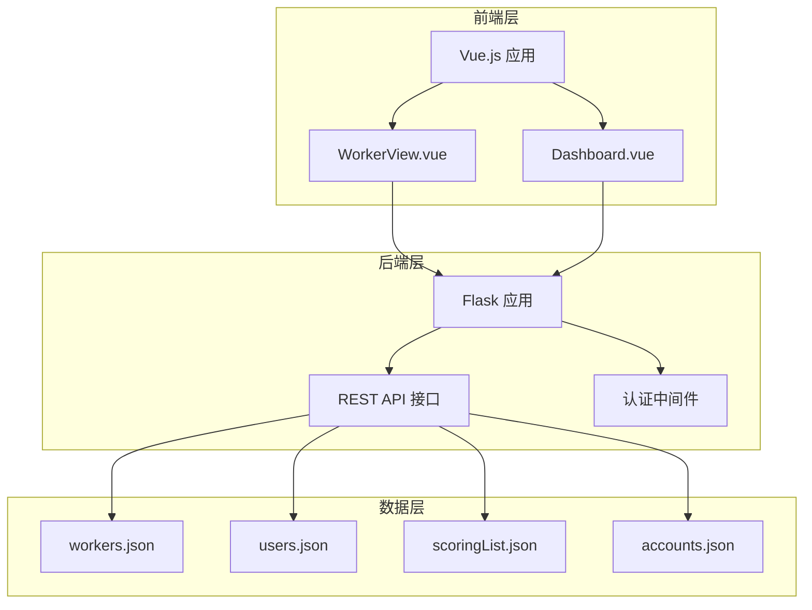
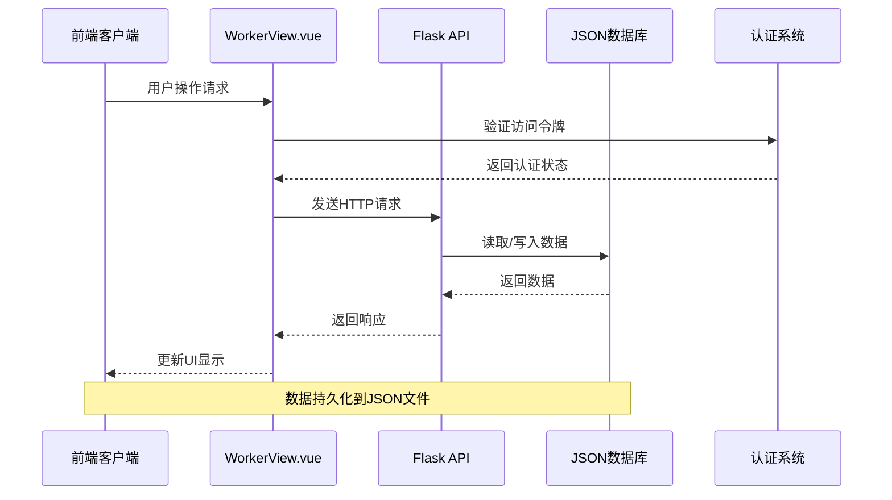
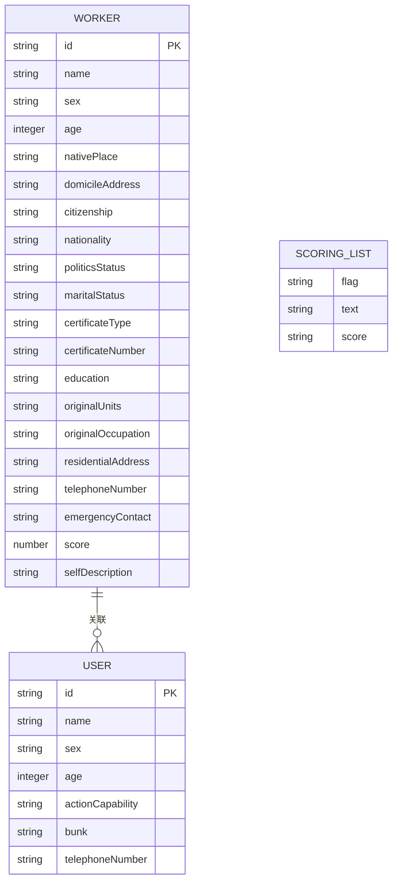
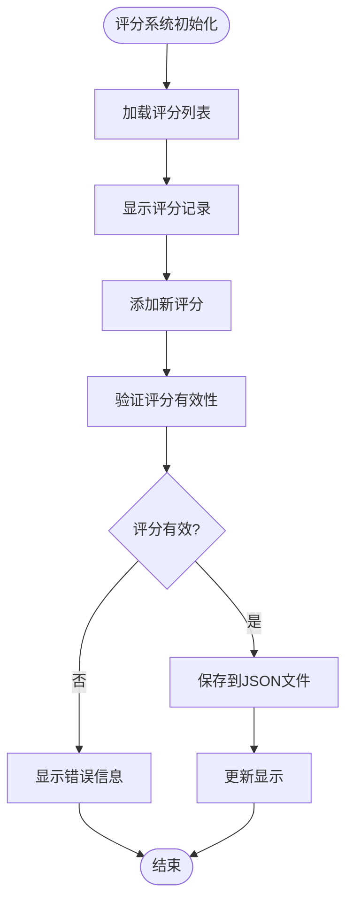
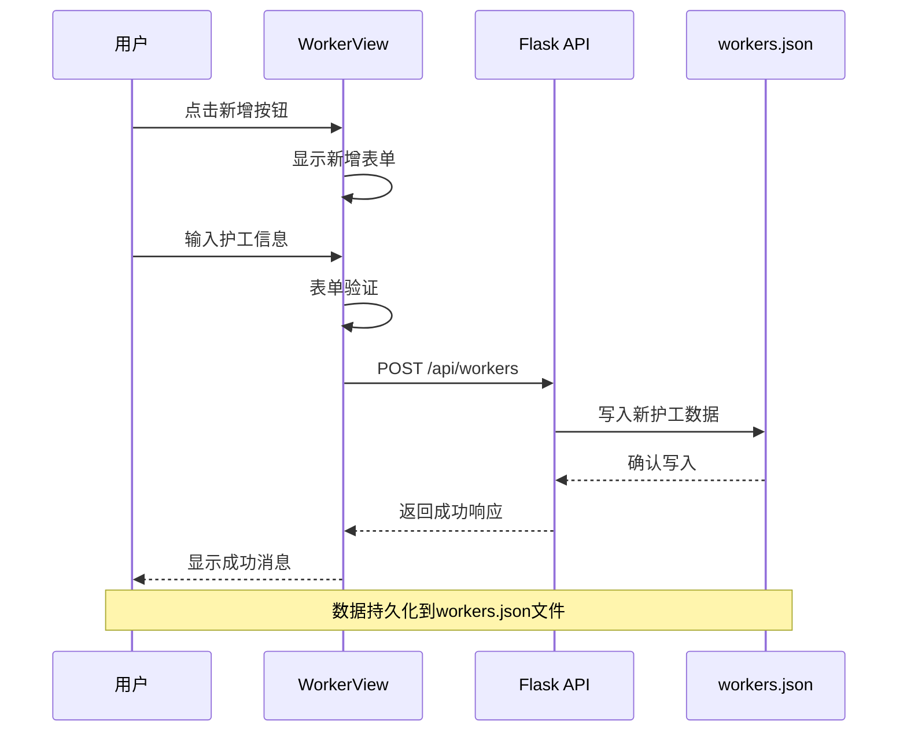
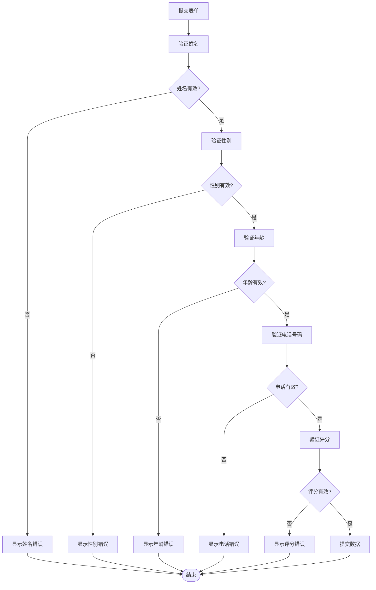
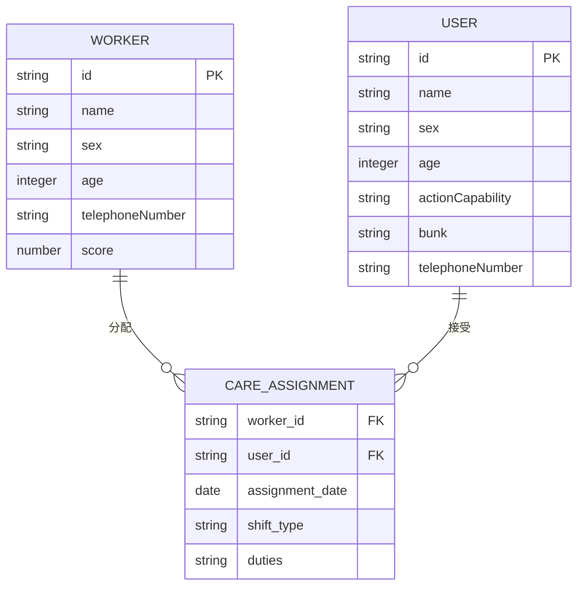
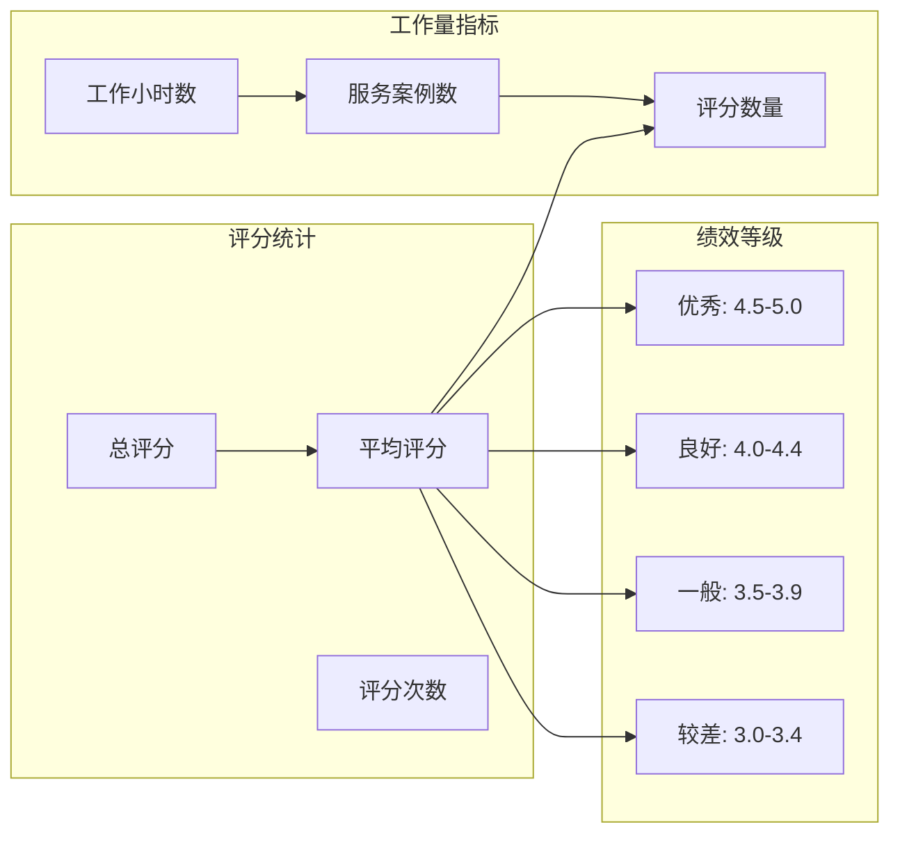
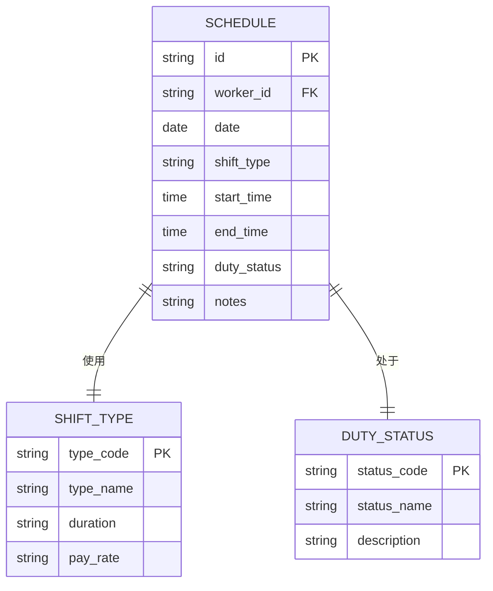
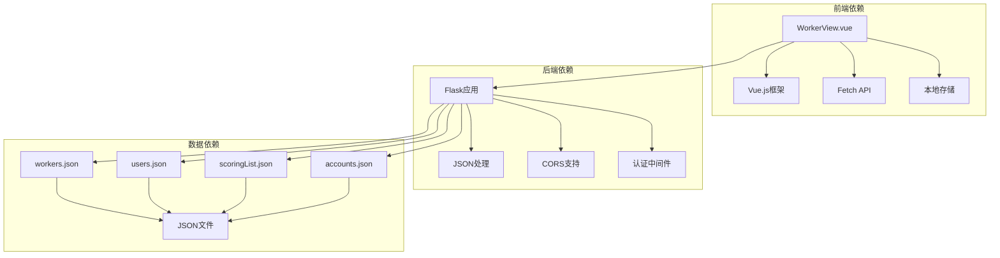

# 护工信息表

<cite>
**本文档引用的文件**
- [workers.json](file://database/workers.json)
- [WorkerView.vue](file://src/views/WorkerView.vue)
- [scoringList.json](file://database/scoringList.json)
- [users.json](file://database/users.json)
- [app.py](file://backend/app.py)
- [accounts.json](file://database/accounts.json)
</cite>

## 目录
1. [简介](#简介)
2. [项目结构](#项目结构)
3. [核心组件](#核心组件)
4. [架构概览](#架构概览)
5. [详细组件分析](#详细组件分析)
6. [依赖分析](#依赖分析)
7. [性能考虑](#性能考虑)
8. [故障排除指南](#故障排除指南)
9. [结论](#结论)
10. [附录](#附录)

## 简介
本文件为护工信息表的详细数据模型文档，涵盖护工基本信息结构、专业资质、工作时间安排、评分系统设计、护工信息管理实现细节以及护工与老人之间的关联关系设计。文档基于实际代码库中的数据文件和前端组件进行分析，提供完整的字段定义、数据存储设计和操作流程说明。

## 项目结构
该项目采用前后端分离架构，前端使用Vue.js框架，后端使用Flask框架，数据存储采用JSON文件格式。

**图表来源**
- [WorkerView.vue:1-800](file://src/views/WorkerView.vue#L1-L800)
- [app.py:1-330](file://backend/app.py#L1-L330)

**章节来源**
- [WorkerView.vue:1-800](file://src/views/WorkerView.vue#L1-L800)
- [app.py:1-330](file://backend/app.py#L1-L330)

## 核心组件
护工信息表系统由以下核心组件构成：

### 数据模型组件
- **护工基本信息表**: 存储护工个人基础信息
- **评分系统表**: 存储护工评分记录
- **用户关联表**: 存储护工与老人的关联关系
- **认证系统**: 管理用户登录和权限控制

### 前端交互组件
- **护工管理界面**: 提供护工信息的增删改查功能
- **搜索过滤系统**: 支持多维度搜索和筛选
- **表单验证系统**: 确保护工信息的完整性
- **模态对话框**: 处理新增、编辑、删除操作

**章节来源**
- [workers.json:1-442](file://database/workers.json#L1-L442)
- [WorkerView.vue:1-800](file://src/views/WorkerView.vue#L1-L800)

## 架构概览
系统采用三层架构设计，实现了清晰的职责分离和数据流管理。

**图表来源**
- [WorkerView.vue:97-106](file://src/views/WorkerView.vue#L97-L106)
- [app.py:15-25](file://backend/app.py#L15-L25)

## 详细组件分析

### 护工基本信息数据模型

#### 基本信息字段定义
护工基本信息采用JSON对象结构，包含以下字段类别：

**图表来源**
- [workers.json:1-442](file://database/workers.json#L1-L442)
- [scoringList.json:1-7](file://database/scoringList.json#L1-L7)
- [users.json:1-582](file://database/users.json#L1-L582)

#### 字段详细说明

| 字段类别 | 字段名 | 数据类型 | 必填 | 描述 |
|---------|--------|----------|------|------|
| 基本信息 | id | string | 是 | 护工唯一标识符，格式为A0XXX |
| 基本信息 | name | string | 是 | 护工姓名 |
| 基本信息 | sex | string | 是 | 性别，枚举值：男/女 |
| 基本信息 | age | integer | 是 | 年龄，范围1-150 |
| 身份信息 | nativePlace | string | 否 | 籍贯 |
| 身份信息 | domicileAddress | string | 否 | 户籍地址 |
| 身份信息 | citizenship | string | 否 | 国籍，默认为中国 |
| 身份信息 | nationality | string | 否 | 民族 |
| 政治面貌 | politicsStatus | string | 否 | 政治面貌，枚举值：群众/党员/其他 |
| 婚姻状况 | maritalStatus | string | 否 | 婚姻状况，枚举值：未婚/已婚/离异/丧偶 |
| 证件信息 | certificateType | string | 否 | 证件类型，枚举值：身份证/护照/驾驶证/其他 |
| 证件信息 | certificateNumber | string | 否 | 证件号码 |
| 教育背景 | education | string | 否 | 文化程度，枚举值：小学-博士 |
| 工作经历 | originalUnits | string | 否 | 原单位 |
| 工作经历 | originalOccupation | string | 否 | 原职业 |
| 联系方式 | residentialAddress | string | 否 | 现住址 |
| 联系方式 | telephoneNumber | string | 是 | 电话号码，11位数字 |
| 联系方式 | emergencyContact | string | 否 | 紧急联系人电话 |
| 综合评价 | score | number | 否 | 护工评分，范围0-5 |
| 个人描述 | selfDescription | string | 否 | 自我描述 |

**章节来源**
- [workers.json:1-442](file://database/workers.json#L1-L442)
- [WorkerView.vue:22-42](file://src/views/WorkerView.vue#L22-L42)

### 评分系统数据存储设计

#### 评分记录结构
评分系统采用独立的JSON文件存储，支持动态评分记录管理：

**图表来源**
- [scoringList.json:1-7](file://database/scoringList.json#L1-L7)

#### 评分字段定义

| 字段名 | 数据类型 | 描述 |
|--------|----------|------|
| flag | string | 评分标识符，使用特殊符号标记 |
| text | string | 评分对象名称 |
| score | string | 评分描述信息 |

**章节来源**
- [scoringList.json:1-7](file://database/scoringList.json#L1-L7)

### 护工信息管理实现细节

#### CRUD操作流程
系统实现了完整的护工信息管理功能，包括新增、查询、更新、删除操作：

**图表来源**
- [WorkerView.vue:276-323](file://src/views/WorkerView.vue#L276-L323)
- [app.py:268-292](file://backend/app.py#L268-L292)

#### 表单验证机制
前端实现了全面的表单验证，确保数据完整性：

**图表来源**
- [WorkerView.vue:237-273](file://src/views/WorkerView.vue#L237-L273)

**章节来源**
- [WorkerView.vue:237-323](file://src/views/WorkerView.vue#L237-L323)
- [app.py:268-320](file://backend/app.py#L268-L320)

### 护工与老人关联关系设计

#### 关联关系模型
护工与老人之间存在多对多的关联关系，通过独立的用户数据库实现：

**图表来源**
- [workers.json:1-442](file://database/workers.json#L1-L442)
- [users.json:1-582](file://database/users.json#L1-L582)

#### 关联字段说明

| 字段名 | 类型 | 描述 |
|--------|------|------|
| worker_id | string | 护工ID，外键关联workers.json |
| user_id | string | 老人ID，外键关联users.json |
| assignment_date | date | 分配日期 |
| shift_type | string | 班次类型 |
| duties | string | 护理职责 |

**章节来源**
- [users.json:1-582](file://database/users.json#L1-L582)
- [workers.json:1-442](file://database/workers.json#L1-L442)

### 护工工作量统计和绩效评估

#### 绩效评估数据结构
系统支持基于评分的绩效评估，评分范围0-5分：

**图表来源**
- [workers.json:21-131](file://database/workers.json#L21-L131)
- [scoringList.json:1-7](file://database/scoringList.json#L1-L7)

#### 绩效评估算法
基于护工评分计算综合绩效指标：

1. **基础评分**: 直接使用workers.json中的score字段
2. **加权评分**: 结合工作时长和服务质量
3. **客户满意度**: 基于评分列表中的反馈
4. **综合评级**: 通过加权算法得出最终等级

**章节来源**
- [workers.json:1-442](file://database/workers.json#L1-L442)
- [scoringList.json:1-7](file://database/scoringList.json#L1-L7)

### 护工调度和排班管理数据模型

#### 排班数据结构
系统支持灵活的排班管理，包含以下关键字段：

**图表来源**
- [workers.json:1-442](file://database/workers.json#L1-L442)

#### 排班字段定义

| 字段名 | 类型 | 描述 |
|--------|------|------|
| id | string | 排班记录ID |
| worker_id | string | 护工ID |
| date | date | 工作日期 |
| shift_type | string | 班次类型 |
| start_time | time | 开始时间 |
| end_time | time | 结束时间 |
| duty_status | string | 当前状态 |
| notes | string | 备注信息 |

**章节来源**
- [workers.json:1-442](file://database/workers.json#L1-L442)

## 依赖分析

### 组件间依赖关系
系统各组件之间存在明确的依赖关系：

**图表来源**
- [WorkerView.vue:1-800](file://src/views/WorkerView.vue#L1-L800)
- [app.py:1-330](file://backend/app.py#L1-L330)

### 外部依赖
- **Vue.js**: 前端框架，版本3.x
- **Flask**: Python Web框架
- **OpenWeatherMap API**: 天气数据获取
- **浏览器本地存储**: 令牌管理和用户状态

**章节来源**
- [WorkerView.vue:1-800](file://src/views/WorkerView.vue#L1-L800)
- [app.py:1-330](file://backend/app.py#L1-L330)

## 性能考虑
基于当前的JSON文件存储方案，系统具有以下性能特征：

### 存储性能
- **读取性能**: JSON文件读取速度快，适合小规模数据
- **写入性能**: 文件写入操作相对简单，但可能产生锁竞争
- **并发处理**: 单线程写入，避免数据损坏风险

### 前端性能
- **数据缓存**: 使用Vue响应式数据绑定减少DOM操作
- **虚拟滚动**: 大数据集时可考虑实现虚拟滚动优化
- **懒加载**: 图片和大数据内容可采用懒加载策略

### 后端性能
- **内存管理**: 小型应用适合全量加载到内存
- **API优化**: 可考虑实现缓存中间件
- **数据库迁移**: 大规模数据时建议迁移到关系型数据库

## 故障排除指南

### 常见问题及解决方案

#### 认证失败
**问题症状**: 401未授权访问
**可能原因**: 
- 令牌过期或无效
- 请求头格式不正确
- 用户不存在

**解决步骤**:
1. 检查Authorization头部格式
2. 重新登录获取新令牌
3. 验证用户账户状态

#### 数据加载失败
**问题症状**: 护工列表为空或加载超时
**可能原因**:
- JSON文件损坏
- 文件路径配置错误
- 服务器未启动

**解决步骤**:
1. 检查workers.json文件完整性
2. 验证文件路径配置
3. 确认Flask服务器运行状态

#### 表单验证错误
**问题症状**: 保存失败并显示验证错误
**可能原因**:
- 必填字段缺失
- 数据格式不正确
- 业务规则违反

**解决步骤**:
1. 检查必填字段是否填写
2. 验证数据格式符合要求
3. 查看具体的错误提示信息

**章节来源**
- [WorkerView.vue:102-105](file://src/views/WorkerView.vue#L102-L105)
- [app.py:18-25](file://backend/app.py#L18-L25)

## 结论
护工信息表系统基于简洁的JSON文件存储和Vue.js前端框架，实现了完整的护工信息管理功能。系统具有以下特点：

### 优势
- **架构简洁**: 前后端分离，职责清晰
- **易于部署**: 无需复杂数据库配置
- **开发效率高**: 前端组件化开发
- **数据透明**: JSON格式便于调试和维护

### 局限性
- **扩展性限制**: JSON文件不适合大规模并发访问
- **数据一致性**: 缺乏事务支持
- **查询能力**: 不支持复杂的SQL查询

### 改进建议
1. **数据库升级**: 迁移到MySQL或PostgreSQL
2. **缓存层**: 添加Redis缓存提升性能
3. **API增强**: 实现GraphQL支持复杂查询
4. **监控系统**: 添加日志和性能监控

## 附录

### API接口规范

#### 护工管理接口
| 方法 | 路径 | 功能 | 权限 |
|------|------|------|------|
| GET | /api/workers | 获取所有护工 | 无 |
| POST | /api/workers | 创建新护工 | 需要令牌 |
| PUT | /api/workers/{id} | 更新护工信息 | 需要令牌 |
| DELETE | /api/workers/{id} | 删除护工 | 需要令牌 |

#### 认证接口
| 方法 | 路径 | 功能 | 权限 |
|------|------|------|------|
| POST | /api/login | 用户登录 | 无 |
| POST | /api/register | 用户注册 | 无 |
| GET | /api/dashboard | 获取仪表板数据 | 需要令牌 |

### 数据迁移指南
当系统发展到一定规模时，建议进行以下数据迁移：

1. **数据库选择**: 从JSON文件迁移到关系型数据库
2. **索引优化**: 为常用查询字段建立索引
3. **分页查询**: 实现大数据集的分页查询
4. **备份策略**: 建立定期数据备份机制