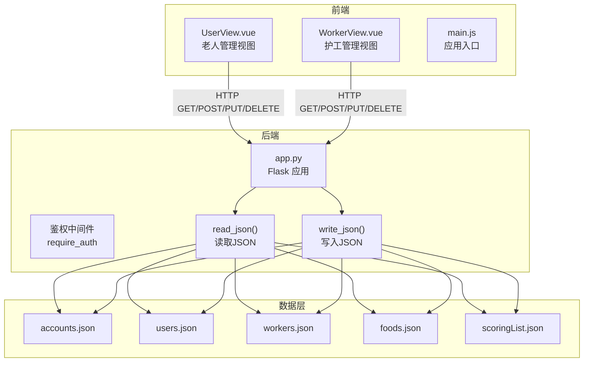
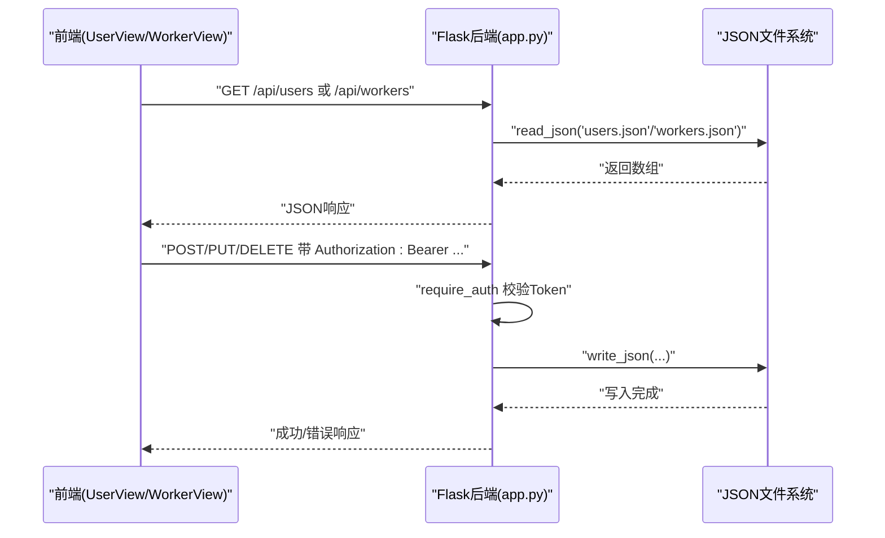
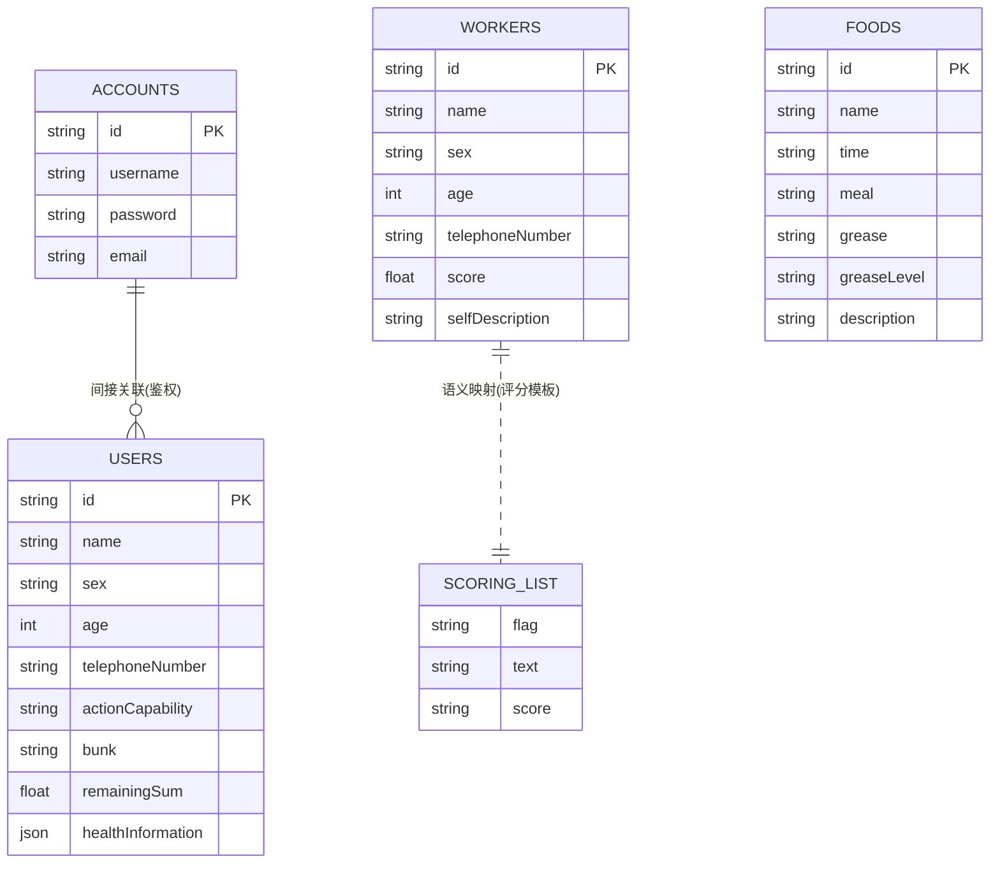
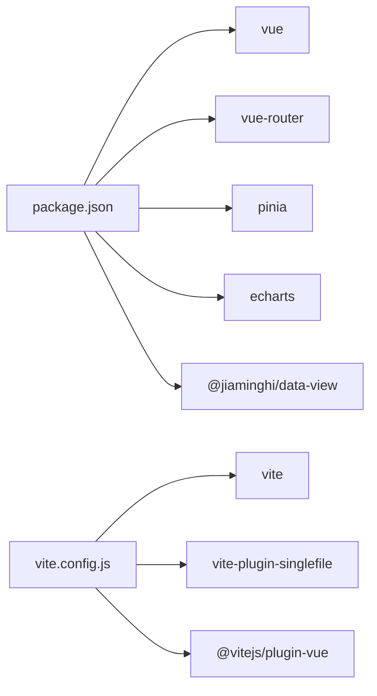
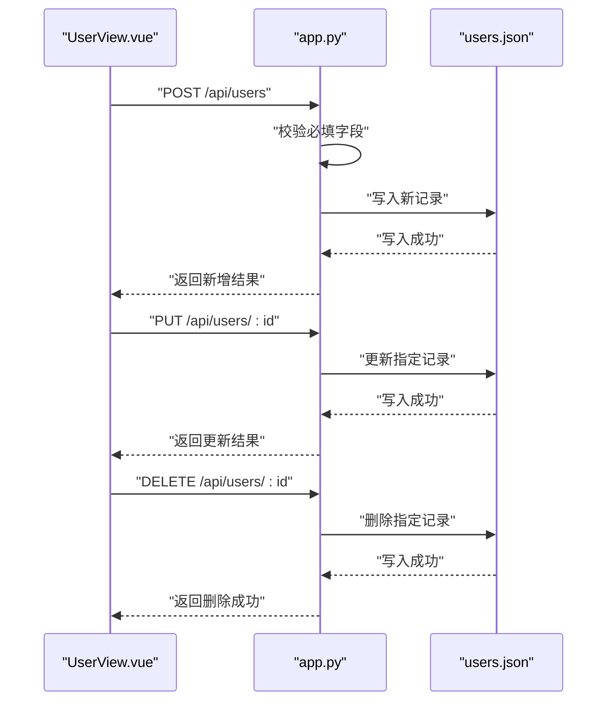
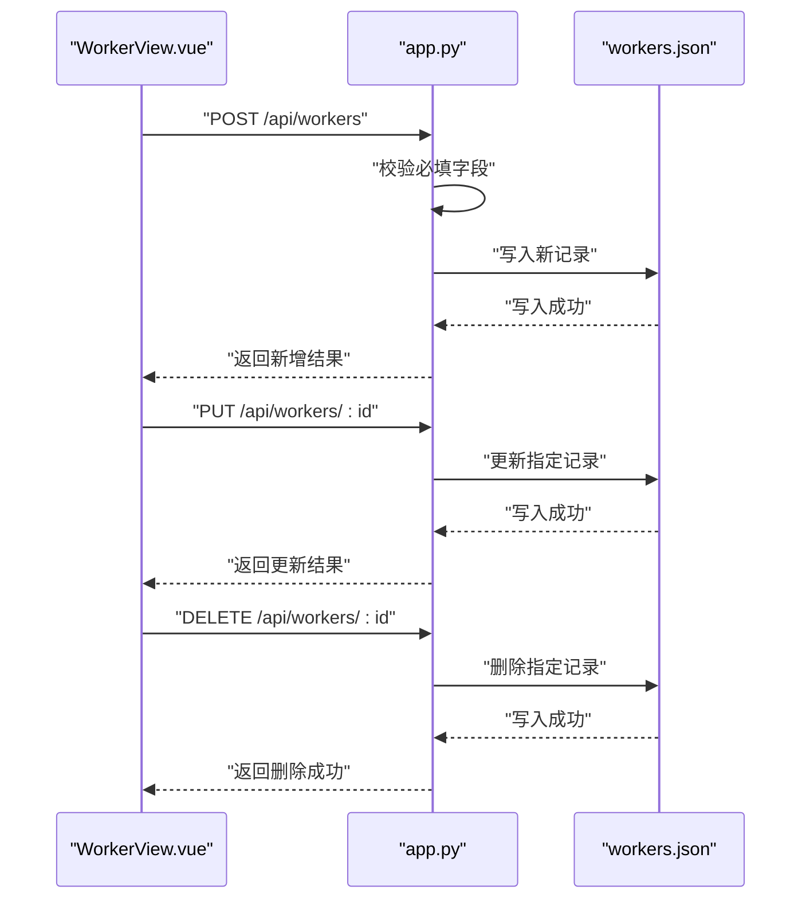

# 数据库设计

<cite>
**本文引用的文件**
- [backend/app.py](file://backend/app.py)
- [database/accounts.json](file://database/accounts.json)
- [database/users.json](file://database/users.json)
- [database/workers.json](file://database/workers.json)
- [database/foods.json](file://database/foods.json)
- [database/scoringList.json](file://database/scoringList.json)
- [src/views/UserView.vue](file://src/views/UserView.vue)
- [src/views/WorkerView.vue](file://src/views/WorkerView.vue)
- [src/main.js](file://src/main.js)
- [package.json](file://package.json)
- [vite.config.js](file://vite.config.js)
</cite>

## 目录
1. [简介](#简介)
2. [项目结构](#项目结构)
3. [核心组件](#核心组件)
4. [架构总览](#架构总览)
5. [详细组件分析](#详细组件分析)
6. [依赖分析](#依赖分析)
7. [性能考虑](#性能考虑)
8. [故障排查指南](#故障排查指南)
9. [结论](#结论)
10. [附录](#附录)

## 简介
本文件面向基于 JSON 的本地数据库，系统性梳理数据模型、实体关系、数据访问模式、验证规则、生命周期管理、迁移与版本控制、性能优化与维护扩展建议。目标读者既包括开发者，也包括非技术运营人员，力求以循序渐进的方式呈现复杂的技术细节。

## 项目结构
该项目采用前后端分离架构：
- 后端：Python Flask 提供 REST API，负责数据持久化（读写 JSON 文件）、鉴权与业务校验。
- 前端：Vue 3 + Vue Router + Pinia，负责用户界面、数据展示与交互。
- 数据层：以独立 JSON 文件形式存储，位于 database 目录下，包含账户、老人用户、护工、菜品与评分列表等。

图表来源
- [backend/app.py:47-59](file://backend/app.py#L47-L59)
- [src/views/UserView.vue:34-43](file://src/views/UserView.vue#L34-L43)
- [src/views/WorkerView.vue:97-106](file://src/views/WorkerView.vue#L97-L106)

章节来源
- [backend/app.py:118-324](file://backend/app.py#L118-L324)
- [src/views/UserView.vue:1-520](file://src/views/UserView.vue#L1-L520)
- [src/views/WorkerView.vue:1-800](file://src/views/WorkerView.vue#L1-L800)

## 核心组件
- 数据模型（JSON 文件）：accounts、users、workers、foods、scoringList。
- 数据访问层（后端）：统一的读写辅助函数、路由接口、鉴权中间件。
- 前端视图：UserView.vue 与 WorkerView.vue 分别承载老人与护工的增删改查与搜索过滤。
- 配置与构建：package.json 与 vite.config.js 管理依赖与打包策略。

章节来源
- [backend/app.py:47-59](file://backend/app.py#L47-L59)
- [src/views/UserView.vue:18-31](file://src/views/UserView.vue#L18-L31)
- [src/views/WorkerView.vue:22-53](file://src/views/WorkerView.vue#L22-L53)

## 架构总览
后端通过 Flask 路由暴露 REST 接口，前端通过 fetch 发起请求，后端以 JSON 文件作为数据源进行读写。鉴权通过 Bearer Token 实现，所有写操作均受 require_auth 保护。

图表来源
- [backend/app.py:148-170](file://backend/app.py#L148-L170)
- [backend/app.py:204-320](file://backend/app.py#L204-L320)
- [src/views/UserView.vue:165-190](file://src/views/UserView.vue#L165-L190)
- [src/views/WorkerView.vue:276-323](file://src/views/WorkerView.vue#L276-L323)

## 详细组件分析

### 数据模型总览
- accounts.json：账户信息（id、username、password、email），用于登录注册。
- users.json：老人用户信息，包含基础信息、联系信息、入院信息、经济来源、健康信息等。
- workers.json：护工信息，包含基础信息、工作信息、评分与自我描述。
- foods.json：菜品信息，按日期与餐次组织，含油脂等级与描述。
- scoringList.json：评分项模板（符号、文本、评分说明）。

章节来源
- [database/accounts.json:1-14](file://database/accounts.json#L1-L14)
- [database/users.json:1-582](file://database/users.json#L1-L582)
- [database/workers.json:1-442](file://database/workers.json#L1-L442)
- [database/foods.json:1-38](file://database/foods.json#L1-L38)
- [database/scoringList.json:1-7](file://database/scoringList.json#L1-L7)

### 用户（老人）数据模型
- 主键：id（字符串，自动生成，规则见后文）。
- 必填字段（写入校验）：name、sex、age、telephoneNumber、actionCapability、bunk。
- 关键字段：
  - 基础信息：name、sex、age、nativePlace、citizenship、nationality、politicsStatus、maritalStatus、education、originalUnits、originalOccupation、residentialAddress、domicileAddress。
  - 证件信息：certificateType、certificateNumber。
  - 联系信息：telephoneNumber、emergencyContact。
  - 入院信息：reasonCheckin、pocketbook、bunk、remainingSum。
  - 健康信息：healthInformation（包含 MBG、MAP、MBF 数值）。
  - 文档与备注：relevantDocuments（数组，文件名列表）。
- 约束与默认：
  - age、remainingSum、healthInformation 中数值字段在前端转换为数字；若为空则为 null。
  - 未显式提供的字段不会强制写入，保持灵活性。

章节来源
- [backend/app.py:212-234](file://backend/app.py#L212-L234)
- [src/views/UserView.vue:18-31](file://src/views/UserView.vue#L18-L31)
- [src/views/UserView.vue:129-149](file://src/views/UserView.vue#L129-L149)
- [src/views/UserView.vue:151-163](file://src/views/UserView.vue#L151-L163)

### 护工数据模型
- 主键：id（字符串，自动生成，规则见后文）。
- 必填字段（写入校验）：name、sex、age、telephoneNumber。
- 关键字段：
  - 基础信息：name、sex、age、nativePlace、citizenship、nationality、politicsStatus、maritalStatus、education、residentialAddress、domicileAddress。
  - 证件信息：certificateType、certificateNumber。
  - 联系信息：telephoneNumber、emergencyContact。
  - 工作信息：originalUnits、originalOccupation、score（0-5）、selfDescription。
- 约束与默认：
  - age 在前端转换为数字；score 若为空则为 0。
  - 未显式提供的字段不会强制写入。

章节来源
- [backend/app.py:272-292](file://backend/app.py#L272-L292)
- [src/views/WorkerView.vue:237-273](file://src/views/WorkerView.vue#L237-L273)
- [src/views/WorkerView.vue:281-285](file://src/views/WorkerView.vue#L281-L285)

### 菜品数据模型
- 主键：id（字符串，形如“YYYYMMDD[ABC]0001”）。
- 字段：name、time（日期字符串）、meal（早餐/午餐/晚餐）、grease（清淡/适中/重油）、greaseLevel（low/medium/high）、description。
- 用途：按日期与餐次组织菜品，便于前端展示与统计。

章节来源
- [database/foods.json:1-38](file://database/foods.json#L1-L38)

### 评分模板数据模型
- 主键：无（数组索引）。
- 字段：flag（符号标识）、text（名称）、score（评分说明）。
- 用途：为评分项提供标准化模板。

章节来源
- [database/scoringList.json:1-7](file://database/scoringList.json#L1-L7)

### 账户数据模型
- 主键：id（UUID 前缀，长度为 8）。
- 字段：username、password（SHA-256）、email。
- 用途：登录注册与鉴权。

章节来源
- [database/accounts.json:1-14](file://database/accounts.json#L1-L14)
- [backend/app.py:120-146](file://backend/app.py#L120-L146)
- [backend/app.py:148-169](file://backend/app.py#L148-L169)

### 实体关系模型
- users 与 workers：无直接外键关联，但可通过业务约定（如分配关系）在上层逻辑体现。
- users 与 foods：无直接关联，但可按日期与餐次在业务层进行匹配。
- scoringList：与 workers 的 score 字段形成语义映射（模板与评分值）。
- accounts：与后端鉴权流程耦合，间接影响 users/workers 的写操作权限。

图表来源
- [database/accounts.json:1-14](file://database/accounts.json#L1-L14)
- [database/users.json:1-582](file://database/users.json#L1-L582)
- [database/workers.json:1-442](file://database/workers.json#L1-L442)
- [database/foods.json:1-38](file://database/foods.json#L1-L38)
- [database/scoringList.json:1-7](file://database/scoringList.json#L1-L7)

## 依赖分析
- 后端依赖：Flask、flask_cors、requests（天气 API）、hashlib（密码哈希）、uuid（ID 生成）。
- 前端依赖：Vue 3、Vue Router、Pinia、echarts、@jiaminghi/data-view 等。
- 构建工具：Vite + vite-plugin-singlefile，输出单文件 HTML/JS/CSS。

图表来源
- [package.json:11-26](file://package.json#L11-L26)
- [vite.config.js:1-27](file://vite.config.js#L1-L27)

章节来源
- [package.json:11-26](file://package.json#L11-L26)
- [vite.config.js:1-27](file://vite.config.js#L1-L27)

## 性能考虑
- I/O 特性：所有数据读写均为同步文件 I/O，适合中小规模数据（当前 users 约 580 条，workers 约 440 条）。随着数据增长，建议：
  - 引入内存缓存（如 LRU 缓存）减少重复读取。
  - 对热点字段建立索引（如按 id、手机号、床位等）以加速前端过滤。
  - 将频繁更新的集合拆分为多个文件，降低锁竞争与写放大。
- 查询优化：
  - 前端搜索采用线性过滤，建议在后端提供分页与条件查询接口。
  - 对高频字段（如 name、id、bunk、telephoneNumber）在后端维护索引结构。
- 网络与并发：
  - 当前未启用数据库连接池与事务，写操作串行化，避免竞态。
  - 建议引入轻量级队列或批处理机制，合并短时间内的多次写操作。
- 存储与备份：
  - 建议定期导出 JSON 备份，支持增量备份与版本化存储。
  - 使用只追加写策略（如按日期分文件）降低单文件膨胀风险。

[本节为通用性能建议，无需特定文件引用]

## 故障排查指南
- 登录失败
  - 检查 accounts.json 是否存在且格式正确。
  - 确认密码经 SHA-256 哈希后与存储一致。
- 写操作失败
  - 确认请求头包含有效的 Bearer Token。
  - 检查必填字段是否缺失或为空字符串。
  - 查看后端日志与浏览器网络面板定位具体错误。
- 前端显示异常
  - 确认 API 地址与端口（默认 5000）正确。
  - 检查 CORS 配置与跨域策略。
- 数据一致性
  - 由于 JSON 文件为单点存储，避免多实例同时写入。
  - 如需扩展，建议迁移到关系型或文档型数据库。

章节来源
- [backend/app.py:15-25](file://backend/app.py#L15-L25)
- [backend/app.py:212-215](file://backend/app.py#L212-L215)
- [backend/app.py:272-275](file://backend/app.py#L272-L275)

## 结论
本项目以 JSON 文件为数据存储介质，结合 Flask 提供的轻量 API 与 Vue 前端，实现了老人与护工的基础管理能力。数据模型清晰、访问模式简洁，适合初期快速迭代。随着业务增长，建议引入缓存、索引、分页与备份策略，并逐步向更稳健的数据库方案演进。

[本节为总结性内容，无需特定文件引用]

## 附录

### 数据访问模式与流程

#### 老人数据访问（UserView）
- 读取：GET /api/users -> 返回 users.json。
- 新增：POST /api/users（需鉴权）-> 校验必填字段 -> 自动生成 id -> 写入 users.json。
- 更新：PUT /api/users/{id}（需鉴权）-> 校验存在性 -> 写入 users.json。
- 删除：DELETE /api/users/{id}（需鉴权）-> 校验存在性 -> 写入 users.json。

图表来源
- [backend/app.py:204-262](file://backend/app.py#L204-L262)
- [src/views/UserView.vue:165-214](file://src/views/UserView.vue#L165-L214)

章节来源
- [backend/app.py:204-262](file://backend/app.py#L204-L262)
- [src/views/UserView.vue:165-214](file://src/views/UserView.vue#L165-L214)

#### 护工数据访问（WorkerView）
- 读取：GET /api/workers -> 返回 workers.json。
- 新增/更新/删除：与老人类似，需鉴权，必填字段不同。

图表来源
- [backend/app.py:264-320](file://backend/app.py#L264-L320)
- [src/views/WorkerView.vue:276-364](file://src/views/WorkerView.vue#L276-L364)

章节来源
- [backend/app.py:264-320](file://backend/app.py#L264-L320)
- [src/views/WorkerView.vue:276-364](file://src/views/WorkerView.vue#L276-L364)

### ID 生成规则
- 老人用户：以固定前缀拼接递增序号，保证唯一性与可读性。
- 护工：以固定前缀拼接递增序号，保证唯一性与可读性。
- 账户：使用 UUID 前缀，保证全局唯一。

章节来源
- [backend/app.py:184-202](file://backend/app.py#L184-L202)

### 数据验证与业务约束
- 写入前校验：必填字段缺失返回 400。
- 前端校验：年龄范围、电话号码格式、评分范围等。
- 更新/删除：先查找再操作，不存在返回 404。

章节来源
- [backend/app.py:212-215](file://backend/app.py#L212-L215)
- [backend/app.py:272-275](file://backend/app.py#L272-L275)
- [src/views/UserView.vue:129-149](file://src/views/UserView.vue#L129-L149)
- [src/views/WorkerView.vue:237-273](file://src/views/WorkerView.vue#L237-L273)

### 数据生命周期管理
- 创建：注册/新增接口写入 JSON。
- 更新：PUT 接口覆盖字段。
- 删除：DELETE 接口移除记录。
- 归档：建议按日期或业务维度导出为备份文件，保留历史版本。

[本节为通用实践建议，无需特定文件引用]

### 数据迁移与版本管理
- 迁移策略：
  - 导出现有 JSON，解析为中间结构（如 CSV/TSV）。
  - 在新数据库中执行结构变更脚本。
  - 导入中间结构，校验完整性。
- 版本控制：
  - 为 JSON 文件添加版本号字段或文件名后缀。
  - 使用 Git 记录结构变更与数据变更，区分 schema 与 data。
  - 对敏感字段（如密码）迁移后立即重置。

[本节为通用迁移建议，无需特定文件引用]

### 维护与扩展参考
- 日常维护：监控磁盘空间、定期备份、检查文件权限。
- 扩展方向：引入 Redis 缓存、分页查询、全文检索、审计日志。
- 安全加固：限制写操作来源、启用 HTTPS、定期轮换密钥与 Token。

[本节为通用维护建议，无需特定文件引用]