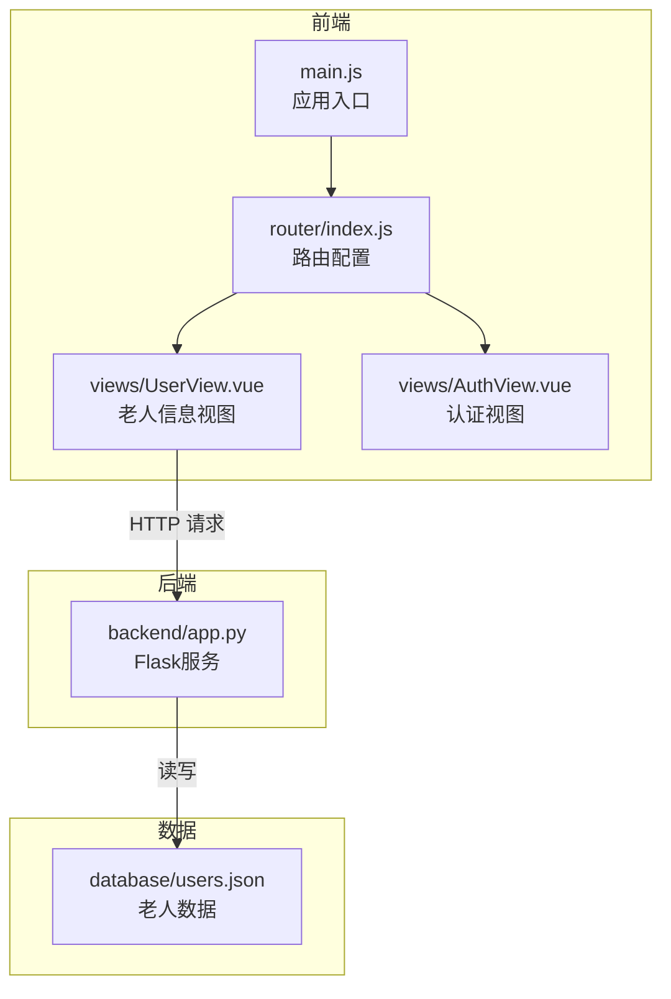
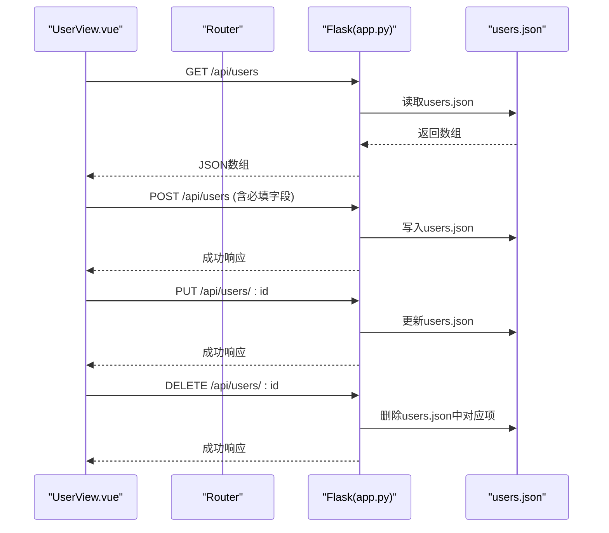
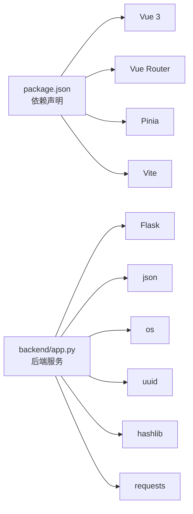
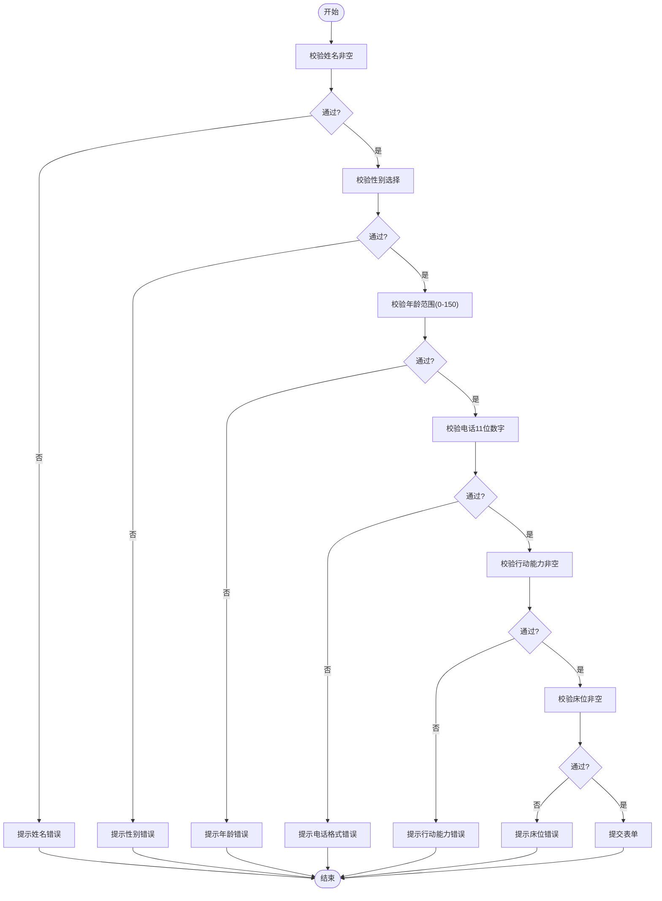

# 老人信息表

<cite>
**本文引用的文件**
- [backend/app.py](file://backend/app.py)
- [database/users.json](file://database/users.json)
- [src/views/UserView.vue](file://src/views/UserView.vue)
- [src/router/index.js](file://src/router/index.js)
- [src/views/AuthView.vue](file://src/views/AuthView.vue)
- [src/main.js](file://src/main.js)
- [package.json](file://package.json)
</cite>

## 目录
1. [简介](#简介)
2. [项目结构](#项目结构)
3. [核心组件](#核心组件)
4. [架构总览](#架构总览)
5. [详细组件分析](#详细组件分析)
6. [依赖分析](#依赖分析)
7. [性能考虑](#性能考虑)
8. [故障排查指南](#故障排查指南)
9. [结论](#结论)
10. [附录](#附录)

## 简介
本文件面向“老人信息表”的数据模型与业务实现，基于仓库中的前后端代码进行系统性梳理。内容涵盖：
- 老人的基本信息字段定义与含义
- 健康状况与护理需求的记录方式
- 增删改查（CRUD）操作的实现细节
- 数据验证规则（年龄范围、电话格式等）
- 搜索与筛选功能的实现
- 数据导入导出与迁移策略建议

## 项目结构
该项目采用前后端分离架构：
- 前端：Vue 3 + Vue Router + Pinia，负责用户界面、交互与状态管理
- 后端：Python Flask，提供REST接口与本地JSON数据库
- 数据库：以JSON文件形式存储，位于database目录

图表来源
- [src/main.js:1-11](file://src/main.js#L1-L11)
- [src/router/index.js:1-61](file://src/router/index.js#L1-L61)
- [src/views/UserView.vue:1-520](file://src/views/UserView.vue#L1-L520)
- [src/views/AuthView.vue:1-380](file://src/views/AuthView.vue#L1-L380)
- [backend/app.py:1-330](file://backend/app.py#L1-L330)
- [database/users.json:1-582](file://database/users.json#L1-L582)

章节来源
- [src/main.js:1-11](file://src/main.js#L1-L11)
- [src/router/index.js:1-61](file://src/router/index.js#L1-L61)
- [backend/app.py:1-330](file://backend/app.py#L1-L330)

## 核心组件
- 老人信息视图（UserView.vue）：负责展示、搜索、筛选、新增/编辑/删除老人信息，并进行前端表单校验
- 认证视图（AuthView.vue）：负责用户登录/注册，获取并持久化访问令牌
- 后端服务（app.py）：提供REST接口，读写users.json，实现基本的鉴权中间件
- 路由（router/index.js）：统一管理页面导航与登录拦截
- 数据源（database/users.json）：本地JSON文件，承载老人实体数据

章节来源
- [src/views/UserView.vue:1-520](file://src/views/UserView.vue#L1-L520)
- [src/views/AuthView.vue:1-380](file://src/views/AuthView.vue#L1-L380)
- [backend/app.py:1-330](file://backend/app.py#L1-L330)
- [src/router/index.js:1-61](file://src/router/index.js#L1-L61)
- [database/users.json:1-582](file://database/users.json#L1-L582)

## 架构总览
前后端交互流程如下：
- 用户在UserView.vue中进行搜索/筛选/增删改
- 前端通过fetch向后端发送HTTP请求
- 后端app.py根据路由处理请求，读写users.json
- 返回JSON响应，前端更新UI

图表来源
- [src/views/UserView.vue:34-43](file://src/views/UserView.vue#L34-L43)
- [backend/app.py:204-262](file://backend/app.py#L204-L262)
- [database/users.json:1-582](file://database/users.json#L1-L582)

## 详细组件分析

### 数据模型与字段定义
老人实体在users.json中以对象数组形式存储，典型字段包括但不限于：
- 基本信息：id、name、sex、age、nativePlace、domicileAddress、citizenship、nationality、politicsStatus、maritalStatus、education、originalUnits、originalOccupation
- 证件信息：certificateType、certificateNumber
- 联系信息：residentialAddress、telephoneNumber、emergencyContact、domicileAddress
- 入院信息：reasonCheckin、pocketbook、remainingSum、bunk、actionCapability
- 医疗信息：medicareDesignatedHospital、socialSecurityCardNumber
- 健康信息：healthInformation（包含MBG、MAP、MBF等指标）

字段来源
- [database/users.json:1-582](file://database/users.json#L1-L582)

### 健康状况与护理需求记录
- 健康信息healthInformation：以嵌套对象形式记录MBG、MAP、MBF等指标，便于前端展示与统计
- 护理需求actionCapability：枚举值（如“能力完好”、“轻度失能”、“中度失能”、“完全失能”），用于标识老人的行动能力等级
- 入院原因reasonCheckin与床位bunk：用于记录入住背景与分配资源

字段来源
- [database/users.json:29](file://database/users.json#L29)
- [src/views/UserView.vue:110-116](file://src/views/UserView.vue#L110-L116)
- [src/views/UserView.vue:352-359](file://src/views/UserView.vue#L352-L359)

### 增删改查（CRUD）实现细节
- 查询全部：GET /api/users，后端读取users.json并返回
- 新增：POST /api/users，前端传入必填字段（name、sex、age、telephoneNumber、actionCapability、bunk），后端生成自增ID并写入
- 更新：PUT /api/users/:id，按id定位并替换字段
- 删除：DELETE /api/users/:id，按id移除

必填字段校验
- 后端在新增时校验必填字段，缺失则返回错误
- 前端在提交前进行本地校验（见“数据验证规则”）

章节来源
- [backend/app.py:204-262](file://backend/app.py#L204-L262)
- [src/views/UserView.vue:129-149](file://src/views/UserView.vue#L129-L149)

### 数据验证规则
- 年龄范围：0-150（含边界）
- 电话格式：11位纯数字
- 必填字段：新增时要求name、sex、age、telephoneNumber、actionCapability、bunk
- 前端表单校验：在提交前即时反馈错误，避免无效请求

章节来源
- [backend/app.py:212-215](file://backend/app.py#L212-L215)
- [src/views/UserView.vue:129-149](file://src/views/UserView.vue#L129-L149)

### 搜索与筛选功能
- 前端搜索：支持关键词在多个字段范围内模糊匹配
- 前端筛选：支持按性别、文化程度、婚姻状况、行动能力进行过滤
- 结果计数：实时显示匹配数量

章节来源
- [src/views/UserView.vue:45-85](file://src/views/UserView.vue#L45-L85)

### 认证与鉴权
- 登录/注册：AuthView.vue发起POST请求，后端返回token并存入localStorage
- 鉴权中间件：require_auth装饰器要求Authorization头携带有效token
- 路由守卫：router/index.js拦截未登录访问，强制跳转登录页

章节来源
- [src/views/AuthView.vue:22-69](file://src/views/AuthView.vue#L22-L69)
- [backend/app.py:15-25](file://backend/app.py#L15-L25)
- [src/router/index.js:42-59](file://src/router/index.js#L42-L59)

### 数据导入导出与迁移策略
- 导入：将外部数据转换为users.json格式，覆盖写入或合并写入
- 导出：从users.json读取数据，按需转换为CSV/Excel/JSON等格式
- 迁移：版本升级时，先备份旧数据，再按字段映射规则进行转换，最后验证一致性

注意：本节为通用实践建议，不直接对应具体代码片段

## 依赖分析
- 前端依赖：Vue 3、Vue Router、Pinia、Vite等
- 后端依赖：Flask、Flask-CORS、requests（天气API）、json、os、uuid、hashlib等
- 前后端通信：HTTP REST API，使用JSON传输

图表来源
- [package.json:11-26](file://package.json#L11-L26)
- [backend/app.py:1-8](file://backend/app.py#L1-L8)

章节来源
- [package.json:1-28](file://package.json#L1-L28)
- [backend/app.py:1-330](file://backend/app.py#L1-L330)

## 性能考虑
- 前端：搜索与筛选在内存中进行，适合中小规模数据；大规模数据建议后端分页/排序/索引
- 后端：users.json为单文件，读写频繁时建议引入数据库或缓存层
- 网络：减少不必要的请求，合并批量更新

## 故障排查指南
- 401未授权：检查localStorage中user_token是否存在与格式是否正确
- 400参数错误：检查必填字段是否完整，年龄与电话格式是否符合要求
- 网络异常：确认后端服务运行状态与端口开放
- 数据不一致：核对users.json文件是否被外部修改，必要时回滚或重建

章节来源
- [src/views/AuthView.vue:22-69](file://src/views/AuthView.vue#L22-L69)
- [backend/app.py:15-25](file://backend/app.py#L15-L25)
- [backend/app.py:212-215](file://backend/app.py#L212-L215)

## 结论
本项目提供了完整的老人信息数据模型与前端交互体验，结合后端REST接口与本地JSON存储，实现了基本的CRUD与搜索筛选能力。建议后续在以下方面持续优化：
- 引入数据库与事务机制，提升并发与可靠性
- 后端增加更严格的字段校验与数据清理
- 前端增加分页、排序与复杂筛选条件
- 完善数据导入导出与版本迁移工具链

## 附录

### API定义（与实现对应）
- GET /api/users
  - 功能：查询所有老人信息
  - 实现：读取users.json并返回
  - 章节来源
    - [backend/app.py:204-206](file://backend/app.py#L204-L206)
    - [src/views/UserView.vue:34-43](file://src/views/UserView.vue#L34-L43)

- POST /api/users
  - 功能：新增老人信息
  - 参数：必填字段（name、sex、age、telephoneNumber、actionCapability、bunk）
  - 实现：生成ID并写入users.json
  - 章节来源
    - [backend/app.py:208-234](file://backend/app.py#L208-L234)
    - [src/views/UserView.vue:129-149](file://src/views/UserView.vue#L129-L149)

- PUT /api/users/:id
  - 功能：更新指定老人信息
  - 实现：按id定位并替换字段
  - 章节来源
    - [backend/app.py:236-250](file://backend/app.py#L236-L250)

- DELETE /api/users/:id
  - 功能：删除指定老人信息
  - 实现：按id移除
  - 章节来源
    - [backend/app.py:252-262](file://backend/app.py#L252-L262)

### 数据验证流程（前端）

图表来源
- [src/views/UserView.vue:129-149](file://src/views/UserView.vue#L129-L149)