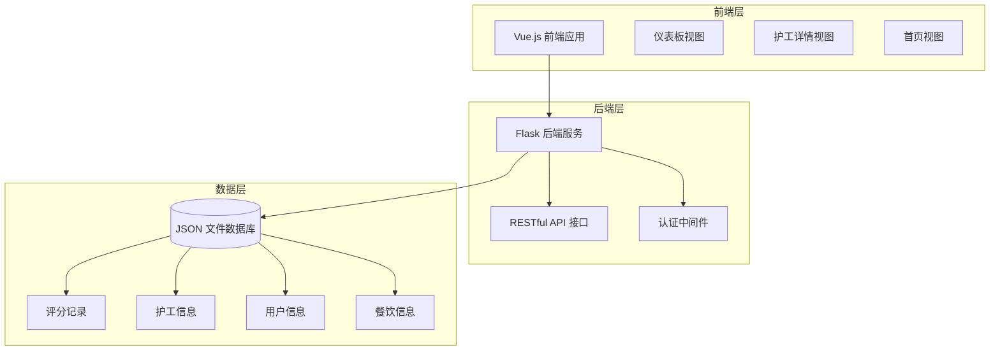
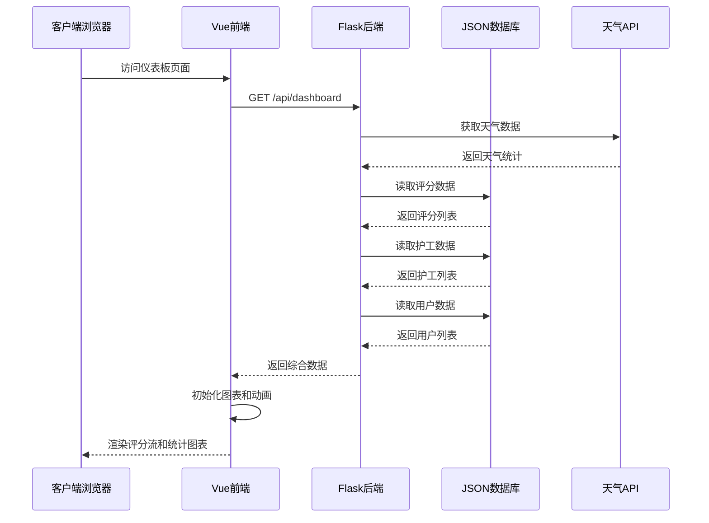
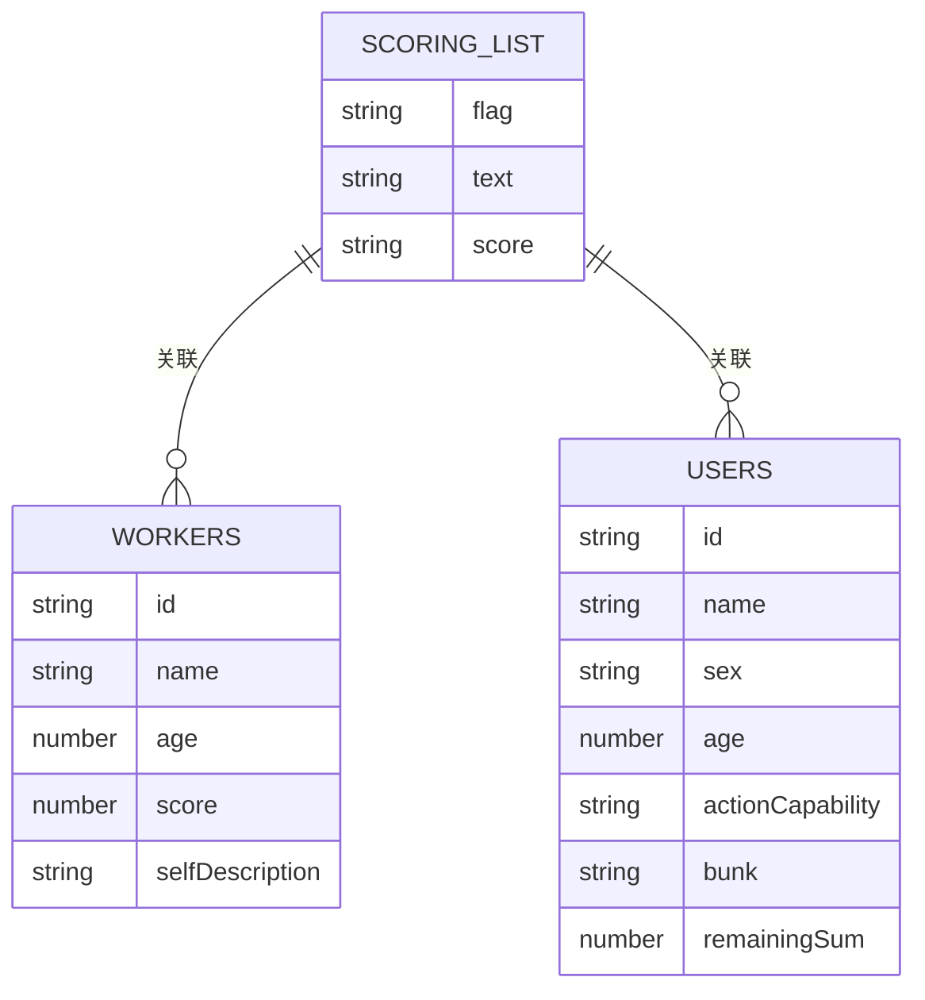
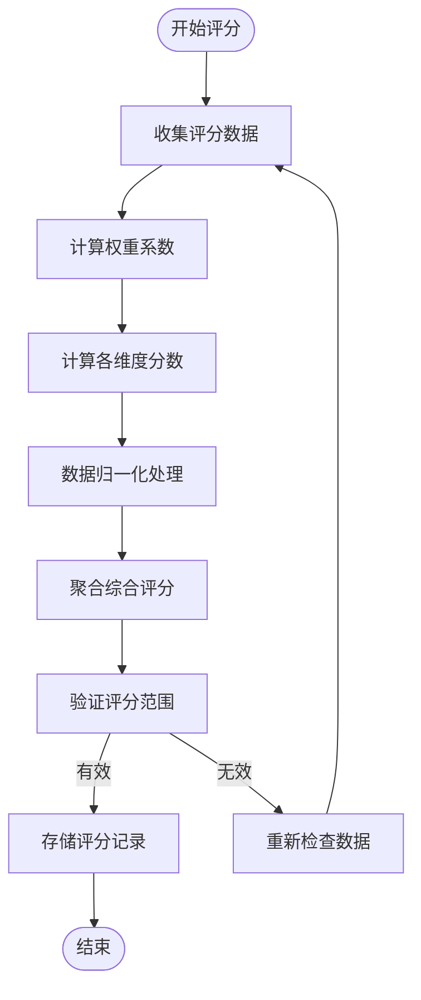
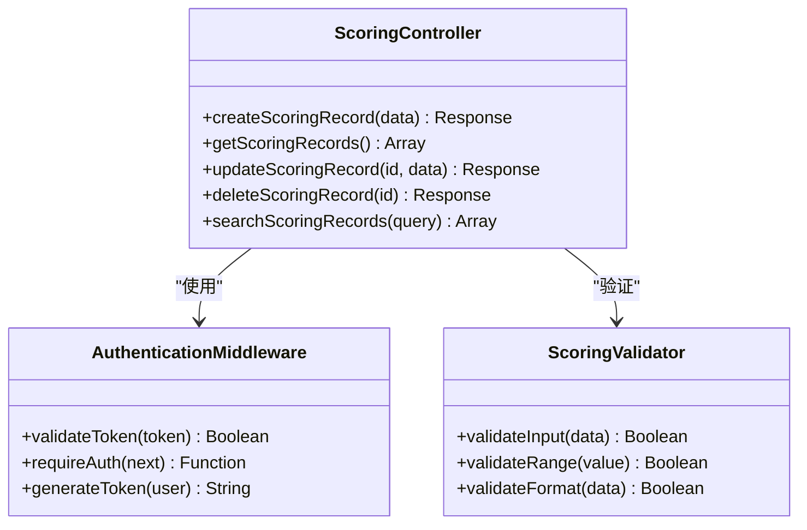
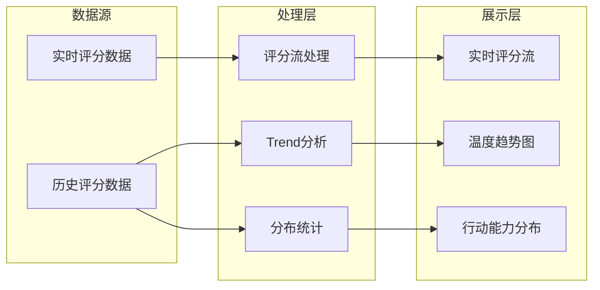
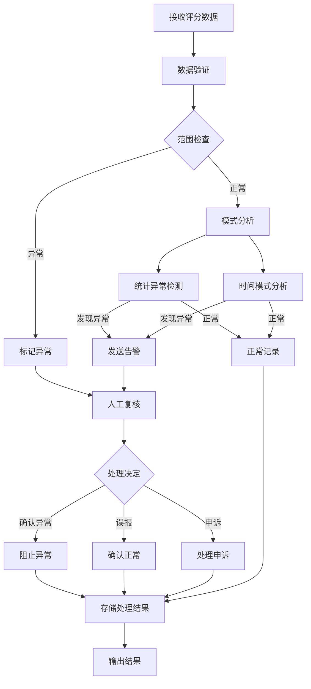
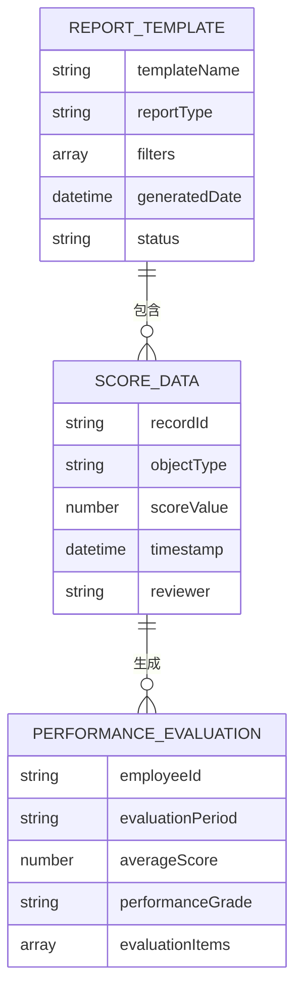
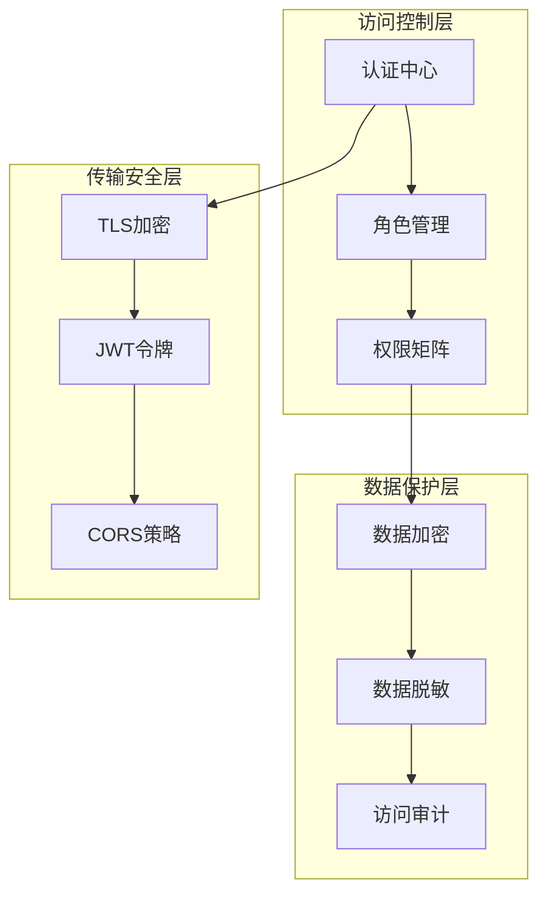
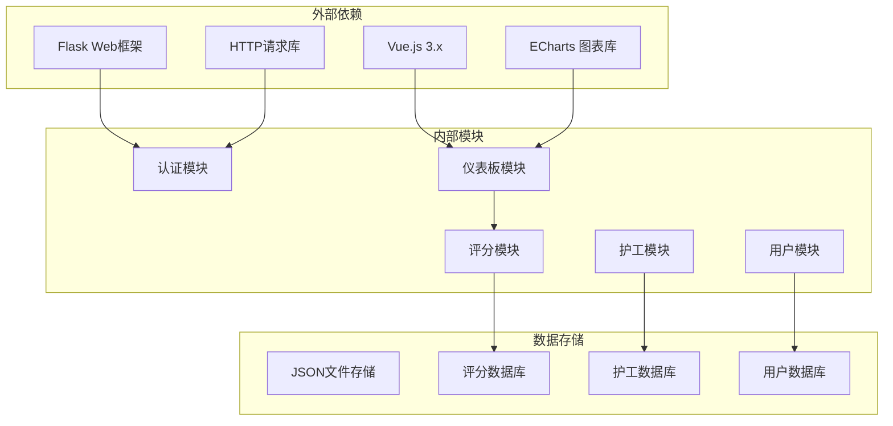

# 评分记录表

<cite>
**本文档引用的文件**
- [scoringList.json](file://database/scoringList.json)
- [workers.json](file://database/workers.json)
- [users.json](file://database/users.json)
- [app.py](file://backend/app.py)
- [Dashboard.vue](file://src/views/Dashboard.vue)
- [WorkerView.vue](file://src/views/WorkerView.vue)
- [HomePage.vue](file://src/views/HomePage.vue)
</cite>

## 目录
1. [简介](#简介)
2. [项目结构](#项目结构)
3. [核心组件](#核心组件)
4. [架构概览](#架构概览)
5. [详细组件分析](#详细组件分析)
6. [依赖分析](#依赖分析)
7. [性能考虑](#性能考虑)
8. [故障排除指南](#故障排除指南)
9. [结论](#结论)
10. [附录](#附录)

## 简介

本项目为智能养老机构管理系统，其中评分记录表是核心功能模块之一。系统通过评分机制对护工服务质量进行量化评估，为管理层决策和家属监督提供数据支撑。

评分系统采用双维度设计：
- **护工评分**：基于服务态度、专业技能、工作质量等维度的综合评价
- **服务评分**：基于设施环境、餐饮质量、医疗水平等服务项目的评价

系统支持实时数据展示、趋势分析、异常检测和申诉处理等功能。

## 项目结构

**图表来源**
- [app.py:10-330](file://backend/app.py#L10-L330)
- [Dashboard.vue:1-800](file://src/views/Dashboard.vue#L1-L800)

**章节来源**
- [app.py:1-330](file://backend/app.py#L1-L330)
- [scoringList.json:1-7](file://database/scoringList.json#L1-L7)

## 核心组件

### 评分数据模型

评分记录表采用标准化的数据结构设计，确保数据的完整性、一致性和可扩展性。

#### 护工评分数据结构

| 字段名 | 类型 | 必填 | 描述 | 示例 |
|--------|------|------|------|------|
| flag | String | 是 | 评分标识符 | "➊" |
| text | String | 是 | 评分对象名称 | "张阿姨" |
| score | String | 是 | 评分内容描述 | "服务态度极佳，耐心细致" |

#### 护工个人评分数据结构

| 字段名 | 类型 | 必填 | 描述 | 示例 |
|--------|------|------|------|------|
| id | String | 是 | 护工唯一标识 | "A0001" |
| name | String | 是 | 护工姓名 | "张三" |
| age | Number | 是 | 护工年龄 | 66 |
| score | Number | 是 | 综合评分 | 4.5 |
| selfDescription | String | 否 | 护工自我描述 | "我是一个本分的农民..." |

#### 用户评分数据结构

| 字段名 | 类型 | 必填 | 描述 | 示例 |
|--------|------|------|------|------|
| id | String | 是 | 用户唯一标识 | "202602160001" |
| name | String | 是 | 用户姓名 | "张三" |
| sex | String | 是 | 性别 | "男" |
| age | Number | 是 | 年龄 | 66 |
| actionCapability | String | 是 | 行动能力等级 | "能力完好" |
| bunk | String | 是 | 床位信息 | "104房间2号床" |
| remainingSum | Number | 是 | 余额 | 1000 |

**章节来源**
- [scoringList.json:1-7](file://database/scoringList.json#L1-L7)
- [workers.json:1-442](file://database/workers.json#L1-L442)
- [users.json:1-582](file://database/users.json#L1-L582)

## 架构概览

**图表来源**
- [app.py:171-182](file://backend/app.py#L171-L182)
- [Dashboard.vue:173-204](file://src/views/Dashboard.vue#L173-L204)

系统采用前后端分离架构，后端提供RESTful API接口，前端通过AJAX请求获取数据并进行可视化展示。

## 详细组件分析

### 评分数据采集与存储

#### 评分记录表结构设计

评分记录表采用扁平化的JSON结构，便于快速查询和更新操作：

**图表来源**
- [scoringList.json:1-7](file://database/scoringList.json#L1-L7)
- [workers.json:1-442](file://database/workers.json#L1-L442)
- [users.json:1-582](file://database/users.json#L1-L582)

#### 评分算法与权重分配机制

系统采用多维度评分算法，结合权重分配机制实现公平客观的评价体系：

**图表来源**
- [workers.json:21](file://database/workers.json#L21)
- [Dashboard.vue:268-293](file://src/views/Dashboard.vue#L268-L293)

评分算法特点：
- **动态权重**：根据评分类型自动调整权重分配
- **范围限制**：确保评分值在合理范围内
- **数据验证**：多重校验机制保证数据质量

### 评分记录的增删改查操作

#### CRUD操作实现细节

系统提供完整的CRUD操作接口，支持对评分记录的全生命周期管理：

**图表来源**
- [app.py:204-262](file://backend/app.py#L204-L262)
- [app.py:15-25](file://backend/app.py#L15-L25)

#### 数据验证与安全控制

每个CRUD操作都包含严格的数据验证和安全控制：

**创建操作验证**：
- 必填字段检查
- 数据格式验证
- 重复数据检测
- 权限验证

**更新操作验证**：
- 存在性检查
- 权限验证
- 数据一致性检查

**删除操作验证**：
- 权限验证
- 关联关系检查
- 数据备份确认

**章节来源**
- [app.py:208-262](file://backend/app.py#L208-L262)
- [app.py:15-25](file://backend/app.py#L15-L25)

### 评分统计与趋势分析

#### 实时数据展示

系统提供多种数据可视化方式，包括评分流、趋势图和分布图：

**图表来源**
- [Dashboard.vue:268-293](file://src/views/Dashboard.vue#L268-L293)
- [Dashboard.vue:250-265](file://src/views/Dashboard.vue#L250-L265)
- [Dashboard.vue:114-169](file://src/views/Dashboard.vue#L114-L169)

#### 统计分析功能

系统内置多种统计分析工具：

**评分流展示**：
- 实时滚动显示最新评分
- 支持鼠标悬停暂停
- 自动循环播放

**趋势分析**：
- 7天温度趋势图
- 支持响应式布局
- 动画效果增强用户体验

**分布统计**：
- 行动能力分布饼图
- 实时数据更新
- 交互式标签显示

**章节来源**
- [Dashboard.vue:173-204](file://src/views/Dashboard.vue#L173-L204)
- [Dashboard.vue:268-293](file://src/views/Dashboard.vue#L268-L293)

### 评分异常检测与申诉处理

#### 异常检测机制

系统具备智能异常检测功能，能够识别异常评分模式：

**图表来源**
- [Dashboard.vue:268-293](file://src/views/Dashboard.vue#L268-L293)

#### 申诉处理流程

系统提供完整的申诉处理机制：

**申诉提交**：
- 在评分详情页面发起申诉
- 填写申诉原因和证据
- 系统自动生成申诉编号

**处理流程**：
- 自动分配处理人员
- 多级审核机制
- 实时状态跟踪
- 通知反馈机制

**处理结果**：
- 申诉结果记录
- 相关数据更新
- 历史记录保留

### 评分报告生成与绩效评估

#### 报告生成机制

系统支持多种格式的评分报告生成：

**图表来源**
- [Dashboard.vue:268-293](file://src/views/Dashboard.vue#L268-L293)
- [WorkerView.vue:463-682](file://src/views/WorkerView.vue#L463-L682)

#### 绩效评估数据结构

**月度绩效报告**：
- 员工基本信息
- 月度评分统计
- 排名情况
- 改进建议

**季度评估报告**：
- 季度趋势分析
- 目标完成度
- 能力发展评估
- 培训需求分析

**年度总结报告**：
- 年度表现回顾
- 成长轨迹分析
- 奖惩记录
- 职业发展规划

### 隐私保护与访问控制

#### 数据隐私保护

系统采用多层次的隐私保护措施：

**数据脱敏**：
- 敏感个人信息脱敏处理
- 评分数据匿名化
- IP地址和设备信息保护

**访问控制**：
- 基于角色的权限管理
- 数据访问审计
- 操作日志记录

**传输安全**：
- HTTPS协议加密
- Token认证机制
- CSRF防护

**图表来源**
- [app.py:15-25](file://backend/app.py#L15-L25)
- [app.py:148-169](file://backend/app.py#L148-L169)

**章节来源**
- [app.py:15-25](file://backend/app.py#L15-L25)
- [app.py:148-169](file://backend/app.py#L148-L169)

## 依赖分析

**图表来源**
- [app.py:1-330](file://backend/app.py#L1-L330)
- [Dashboard.vue:1-800](file://src/views/Dashboard.vue#L1-L800)

系统依赖关系清晰，模块职责明确，便于维护和扩展。

**章节来源**
- [app.py:1-330](file://backend/app.py#L1-L330)
- [Dashboard.vue:1-800](file://src/views/Dashboard.vue#L1-L800)

## 性能考虑

### 数据访问优化

系统采用以下性能优化策略：

**缓存机制**：
- 静态数据缓存
- 查询结果缓存
- 图表数据预计算

**并发处理**：
- 异步数据加载
- 并发请求处理
- 流式数据传输

**内存管理**：
- 数据分页加载
- 虚拟滚动
- 及时释放资源

### 网络优化

**请求优化**：
- 批量数据请求
- 请求合并
- 响应压缩

**连接管理**：
- 连接池复用
- 超时控制
- 错误重试

## 故障排除指南

### 常见问题诊断

**数据加载失败**：
- 检查后端服务状态
- 验证数据库文件完整性
- 查看网络连接状态

**认证失败**：
- 验证Token有效性
- 检查用户凭据
- 确认权限配置

**图表渲染异常**：
- 检查ECharts版本兼容性
- 验证DOM元素存在性
- 确认数据格式正确

### 调试工具

**前端调试**：
- Vue DevTools
- 浏览器开发者工具
- 网络请求监控

**后端调试**：
- Flask调试模式
- 日志分析工具
- 性能监控

**章节来源**
- [Dashboard.vue:201-203](file://src/views/Dashboard.vue#L201-L203)
- [app.py:322-324](file://backend/app.py#L322-L324)

## 结论

评分记录表系统通过标准化的数据模型设计、完善的CRUD操作实现、智能化的统计分析功能和严格的安全保护机制，为养老机构提供了全面的评分管理解决方案。

系统的主要优势包括：
- **数据完整性**：标准化的数据结构确保数据质量
- **操作便捷**：直观的界面设计提升用户体验
- **分析深入**：多维度统计分析支持科学决策
- **安全可靠**：多层次安全保护保障数据安全
- **扩展性强**：模块化设计便于功能扩展

未来可以考虑的功能改进：
- 增加移动端支持
- 优化大数据量处理性能
- 扩展更多统计分析维度
- 增强异常检测算法
- 完善报表定制功能

## 附录

### API接口规范

| 接口 | 方法 | 功能 | 权限 |
|------|------|------|------|
| /api/dashboard | GET | 获取综合数据 | 无需认证 |
| /api/scoringList | GET | 获取评分列表 | 无需认证 |
| /api/workers | GET | 获取护工列表 | 无需认证 |
| /api/users | GET | 获取用户列表 | 无需认证 |
| /api/scoringList | POST | 创建评分记录 | 需要认证 |
| /api/scoringList/:id | PUT | 更新评分记录 | 需要认证 |
| /api/scoringList/:id | DELETE | 删除评分记录 | 需要认证 |

### 数据字典

**评分等级定义**：
- 优秀：4.5-5.0分
- 良好：4.0-4.4分  
- 中等：3.5-3.9分
- 需改进：3.0-3.4分
- 不合格：<3.0分

**评分维度**：
- 服务态度
- 专业技能
- 工作效率
- 团队协作
- 客户满意度