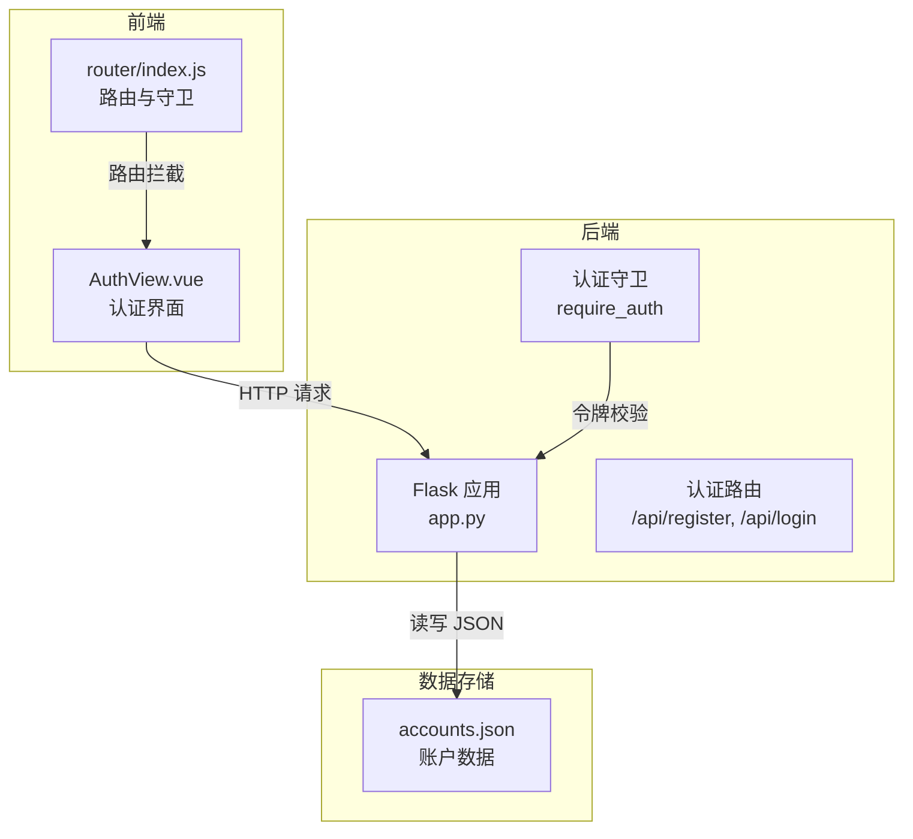
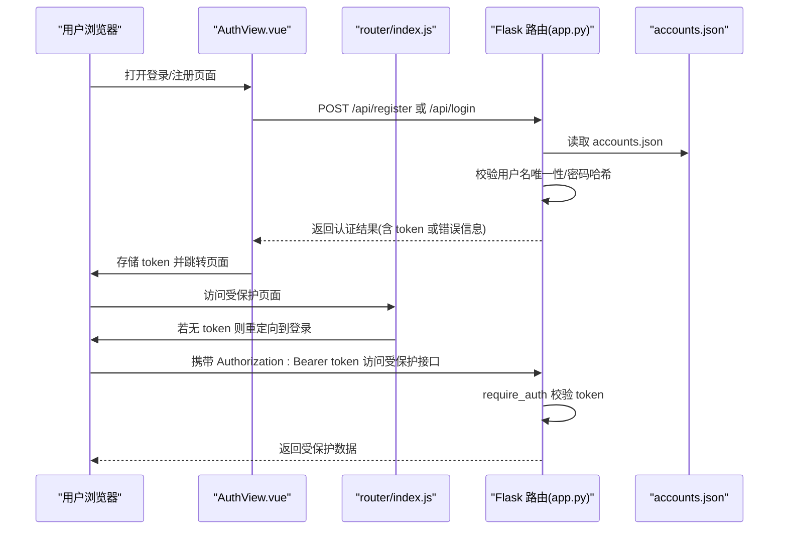
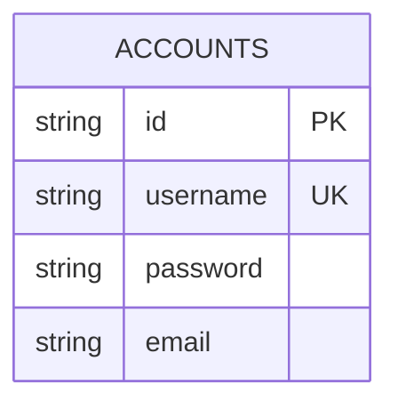
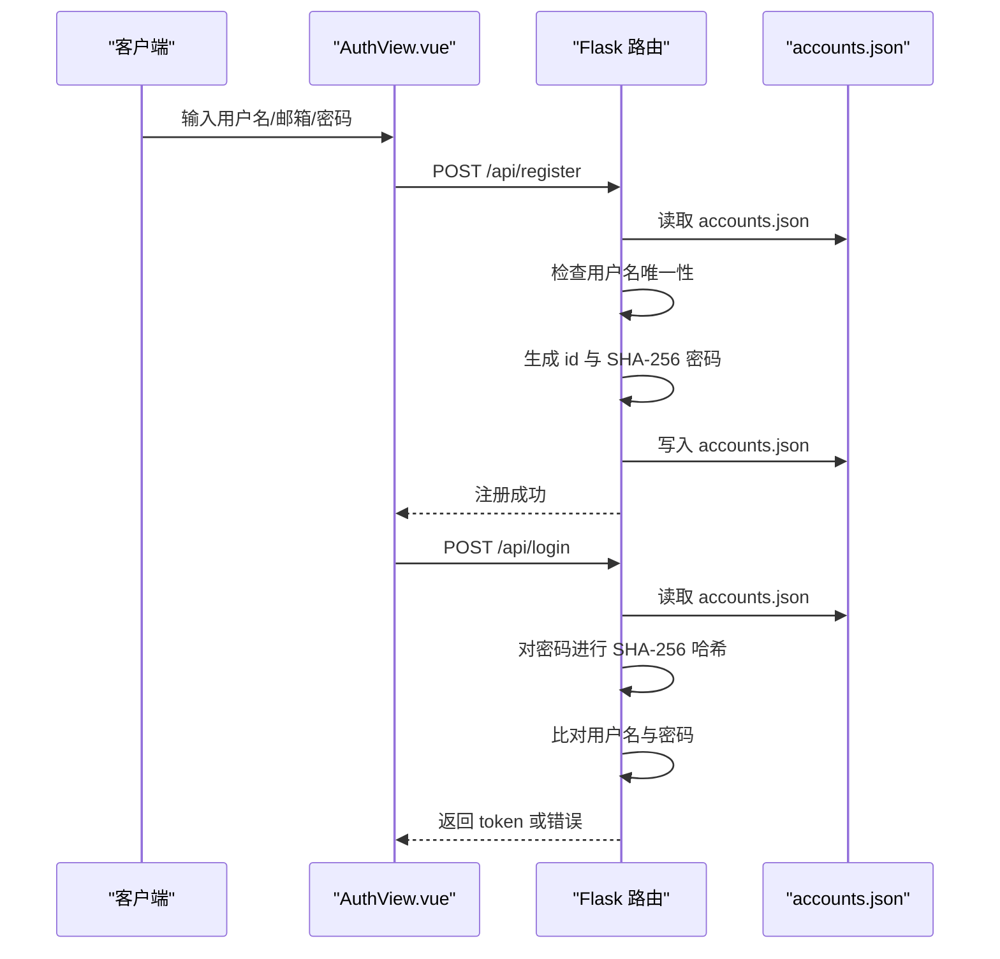
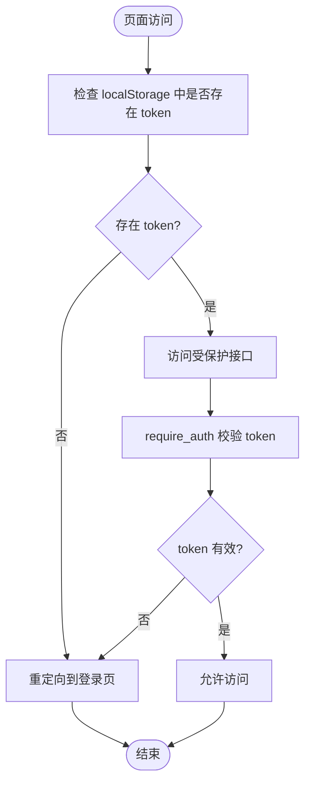
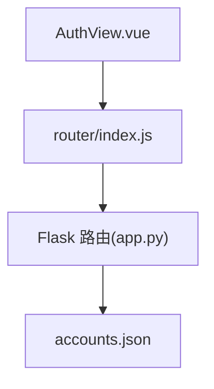

# 账户数据表

<cite>
**本文档引用的文件**
- [backend/app.py](file://backend/app.py)
- [database/accounts.json](file://database/accounts.json)
- [src/views/AuthView.vue](file://src/views/AuthView.vue)
- [src/router/index.js](file://src/router/index.js)
</cite>

## 目录
1. [简介](#简介)
2. [项目结构](#项目结构)
3. [核心组件](#核心组件)
4. [架构概览](#架构概览)
5. [详细组件分析](#详细组件分析)
6. [依赖关系分析](#依赖关系分析)
7. [性能考量](#性能考量)
8. [故障排除指南](#故障排除指南)
9. [结论](#结论)
10. [附录](#附录)

## 简介
本文件为账户数据表的详细数据模型文档，涵盖账户表的结构设计、字段定义与数据类型、密码加密存储机制与安全考虑、账户创建与验证流程、用户认证数据交互模式、数据验证规则与约束条件（用户名唯一性与邮箱格式）、以及账户数据的增删改查操作示例与最佳实践。项目采用前后端分离架构：前端使用 Vue 3 + Vue Router 构建用户界面与路由守卫，后端使用 Python Flask 提供 RESTful API，并以本地 JSON 文件作为数据存储。

## 项目结构
项目采用前后端分离结构：
- 前端位于 `src/` 目录，包含视图组件、路由配置与样式资源
- 后端位于 `backend/` 目录，包含 Flask 应用与路由逻辑
- 数据库存放于 `database/` 目录，使用 JSON 文件存储各类数据

**图表来源**
- [backend/app.py:118-170](file://backend/app.py#L118-L170)
- [src/views/AuthView.vue:23-69](file://src/views/AuthView.vue#L23-L69)
- [src/router/index.js:42-59](file://src/router/index.js#L42-L59)
- [database/accounts.json:1-14](file://database/accounts.json#L1-L14)

**章节来源**
- [backend/app.py:1-330](file://backend/app.py#L1-L330)
- [src/views/AuthView.vue:1-380](file://src/views/AuthView.vue#L1-L380)
- [src/router/index.js:1-61](file://src/router/index.js#L1-L61)
- [database/accounts.json:1-14](file://database/accounts.json#L1-L14)

## 核心组件
- 认证界面组件：负责用户输入用户名、邮箱、密码，发起注册与登录请求，并处理响应
- 路由守卫：拦截未登录用户的页面访问，强制跳转到登录页；已登录用户访问登录页则跳转到仪表盘
- Flask 认证路由：提供注册与登录接口，执行用户名唯一性检查、密码哈希比对与令牌签发
- 认证守卫装饰器：对受保护的 API 接口进行令牌有效性校验
- 账户数据存储：以 JSON 文件形式持久化账户信息

**章节来源**
- [src/views/AuthView.vue:1-380](file://src/views/AuthView.vue#L1-L380)
- [src/router/index.js:42-59](file://src/router/index.js#L42-L59)
- [backend/app.py:15-25](file://backend/app.py#L15-L25)
- [backend/app.py:120-169](file://backend/app.py#L120-L169)
- [database/accounts.json:1-14](file://database/accounts.json#L1-L14)

## 架构概览
认证流程涉及前端表单提交、后端路由处理、令牌签发与存储、以及后续受保护接口的访问控制。

**图表来源**
- [src/views/AuthView.vue:23-69](file://src/views/AuthView.vue#L23-L69)
- [src/router/index.js:42-59](file://src/router/index.js#L42-L59)
- [backend/app.py:15-25](file://backend/app.py#L15-L25)
- [backend/app.py:120-169](file://backend/app.py#L120-L169)
- [database/accounts.json:1-14](file://database/accounts.json#L1-L14)

## 详细组件分析

### 账户数据模型
账户表结构包含以下字段：
- id：字符串，账户唯一标识符，后端生成（UUID 前 8 位）
- username：字符串，用户名，注册时唯一性校验
- password：字符串，密码经 SHA-256 哈希后的十六进制摘要
- email：字符串，邮箱地址（前端使用 HTML5 type=email 进行基础格式提示）

数据类型与约束：
- id：字符串，长度为 8；唯一性由业务逻辑保证（UUID 前缀）
- username：字符串，非空；注册时检查重复
- password：字符串，非空；存储为 SHA-256 摘要
- email：字符串，可为空；前端使用 type=email 进行基础校验

**图表来源**
- [database/accounts.json:1-14](file://database/accounts.json#L1-L14)
- [backend/app.py:137-142](file://backend/app.py#L137-L142)

**章节来源**
- [database/accounts.json:1-14](file://database/accounts.json#L1-L14)
- [backend/app.py:137-142](file://backend/app.py#L137-L142)

### 密码加密存储机制与安全考虑
- 密码哈希：后端使用 SHA-256 对原始密码进行哈希，存储的是十六进制摘要
- 明文密码不落盘：仅在内存中进行哈希比较，不保存明文
- 令牌机制：登录成功后生成一次性访问令牌（token），存储在内存集合中，用于后续接口访问校验
- CORS 支持：允许跨域请求，便于前端开发调试

安全建议（基于现有实现的改进方向）：
- 使用更强的哈希算法（如 bcrypt、argon2）或 PBKDF2，并引入盐值
- 令牌应具备过期时间与刷新机制，避免长期有效
- 增加速率限制与防暴力破解策略
- HTTPS 传输与安全头配置

**章节来源**
- [backend/app.py:61-63](file://backend/app.py#L61-L63)
- [backend/app.py:148-169](file://backend/app.py#L148-L169)

### 账户创建与验证流程
注册流程：
- 前端收集用户名、邮箱、密码，发起 POST /api/register
- 后端校验必填字段，检查用户名是否已存在
- 生成 id（UUID 前 8 位），对密码进行 SHA-256 哈希，写入 accounts.json
- 返回注册成功消息

登录流程：
- 前端收集用户名、密码，发起 POST /api/login
- 后端读取 accounts.json，对密码进行 SHA-256 哈希后与存储值比对
- 成功则生成 token 并返回，失败则返回错误信息

**图表来源**
- [src/views/AuthView.vue:48-69](file://src/views/AuthView.vue#L48-L69)
- [backend/app.py:120-169](file://backend/app.py#L120-L169)
- [database/accounts.json:1-14](file://database/accounts.json#L1-L14)

**章节来源**
- [src/views/AuthView.vue:48-69](file://src/views/AuthView.vue#L48-L69)
- [backend/app.py:120-169](file://backend/app.py#L120-L169)

### 用户认证流程中的数据交互模式
- 认证状态：前端使用 localStorage 存储 token、用户名与用户 id
- 路由守卫：拦截非登录页面访问，若无 token 则重定向到登录页
- 受保护接口：通过 require_auth 装饰器校验 Authorization 头中的 Bearer token
- 令牌生命周期：当前实现为内存集合，未持久化与过期控制

**图表来源**
- [src/router/index.js:42-59](file://src/router/index.js#L42-L59)
- [backend/app.py:15-25](file://backend/app.py#L15-L25)

**章节来源**
- [src/router/index.js:42-59](file://src/router/index.js#L42-L59)
- [backend/app.py:15-25](file://backend/app.py#L15-L25)

### 数据验证规则与约束条件
- 注册必填字段：用户名与密码不能为空
- 用户名唯一性：注册前检查 accounts.json 中是否存在相同用户名
- 邮箱格式：前端使用 HTML5 type=email 进行基础格式提示
- 密码存储：仅存储 SHA-256 摘要，不保存明文
- 接口访问：受保护接口需携带有效的 Bearer token

注意：当前实现未对邮箱格式进行严格的正则校验，仅依赖 HTML5 类型提示。

**章节来源**
- [backend/app.py:127-134](file://backend/app.py#L127-L134)
- [src/views/AuthView.vue:120-147](file://src/views/AuthView.vue#L120-L147)
- [backend/app.py:148-169](file://backend/app.py#L148-L169)

### 账户数据的增删改查操作示例与最佳实践
- 查询账户：读取 accounts.json 文件内容
- 创建账户：POST /api/register，后端生成 id 并写入 accounts.json
- 更新账户：当前后端未提供账户资料更新接口；如需更新，可在前端表单中扩展 PUT /api/users 或新增对应路由
- 删除账户：当前后端未提供账户删除接口；如需删除，可在前端表单中扩展 DELETE /api/users 或新增对应路由

最佳实践：
- 在后端增加账户资料更新与删除接口，遵循 RESTful 设计
- 对邮箱格式进行严格正则校验（例如：`^[a-zA-Z0-9._%+-]+@[a-zA-Z0-9.-]+\.[a-zA-Z]{2,}$`）
- 引入数据库（如 SQLite、PostgreSQL）替代 JSON 文件，提升并发与一致性
- 实施密码强度策略与定期更换机制
- 为令牌添加过期时间与刷新流程

**章节来源**
- [backend/app.py:120-169](file://backend/app.py#L120-L169)
- [database/accounts.json:1-14](file://database/accounts.json#L1-L14)

## 依赖关系分析
- 前端依赖：Vue 3、Vue Router、本地存储（localStorage）
- 后端依赖：Flask、CORS、JSON 文件系统
- 数据依赖：accounts.json 作为账户数据源

**图表来源**
- [src/views/AuthView.vue:1-380](file://src/views/AuthView.vue#L1-L380)
- [src/router/index.js:1-61](file://src/router/index.js#L1-L61)
- [backend/app.py:1-330](file://backend/app.py#L1-L330)
- [database/accounts.json:1-14](file://database/accounts.json#L1-L14)

**章节来源**
- [src/views/AuthView.vue:1-380](file://src/views/AuthView.vue#L1-L380)
- [src/router/index.js:1-61](file://src/router/index.js#L1-L61)
- [backend/app.py:1-330](file://backend/app.py#L1-L330)
- [database/accounts.json:1-14](file://database/accounts.json#L1-L14)

## 性能考量
- 当前实现为单机 JSON 文件存储，适用于开发与演示场景
- 在生产环境中建议迁移到关系型数据库或 NoSQL 数据库，以支持高并发与事务一致性
- 对于大量用户数据，建议引入索引与分页查询，避免一次性读取整个 accounts.json
- 前端可缓存认证状态与常用数据，减少重复请求

## 故障排除指南
常见问题与排查步骤：
- 注册失败：检查用户名是否已存在；确认用户名与密码非空
- 登录失败：确认用户名与密码正确；检查 accounts.json 是否存在且格式正确
- 访问受保护接口报 401：确认 Authorization 头是否包含正确的 Bearer token；检查 token 是否在内存集合中
- 路由跳转异常：确认 localStorage 中是否存在 token；检查路由守卫逻辑

**章节来源**
- [backend/app.py:127-134](file://backend/app.py#L127-L134)
- [backend/app.py:148-169](file://backend/app.py#L148-L169)
- [backend/app.py:15-25](file://backend/app.py#L15-L25)
- [src/router/index.js:42-59](file://src/router/index.js#L42-L59)

## 结论
本项目提供了完整的账户认证与数据存储方案，采用前后端分离架构与本地 JSON 文件存储。账户表结构简洁明确，密码采用 SHA-256 哈希存储，登录后通过令牌进行访问控制。建议在生产环境中增强密码哈希强度、令牌有效期与刷新机制、数据库迁移与邮箱格式严格校验，以提升安全性与可维护性。

## 附录
- 开发与运行：前端使用 Vite，后端使用 Flask，数据库文件位于 database/ 目录
- 路由守卫：拦截未登录访问，自动重定向到登录页；已登录访问登录页则跳转到仪表盘
- 认证接口：/api/register（注册）、/api/login（登录）

**章节来源**
- [package.json:1-28](file://package.json#L1-L28)
- [src/router/index.js:42-59](file://src/router/index.js#L42-L59)
- [backend/app.py:120-169](file://backend/app.py#L120-L169)