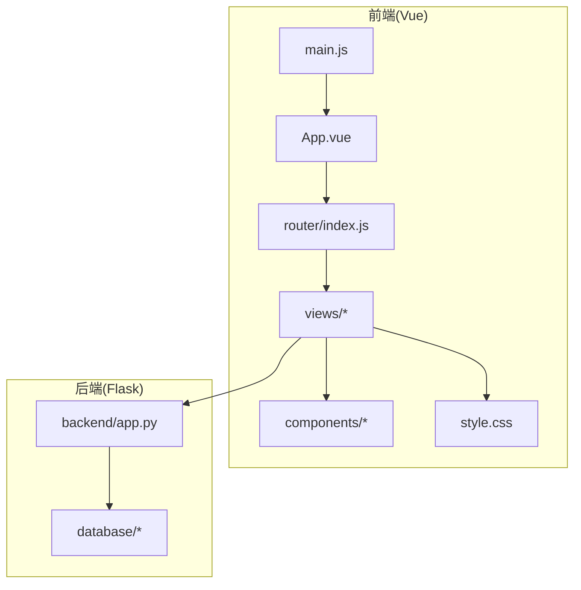
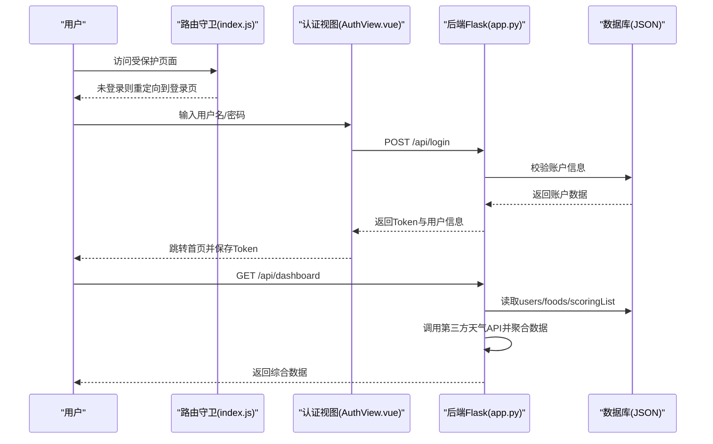
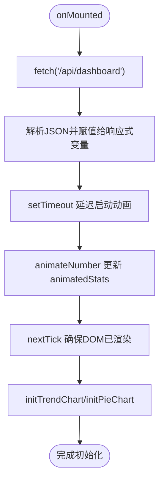
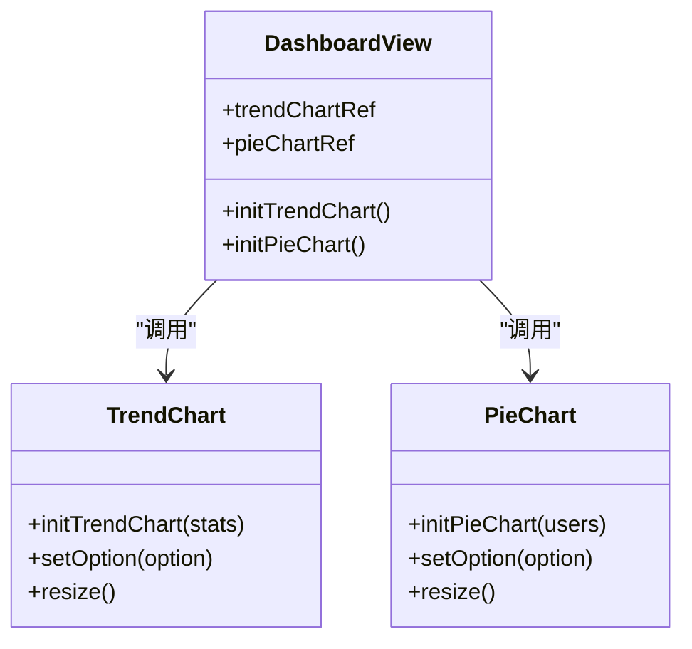
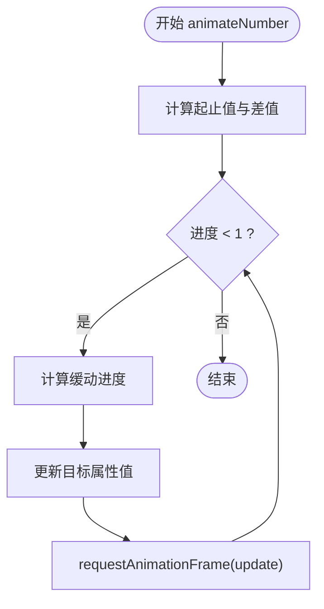
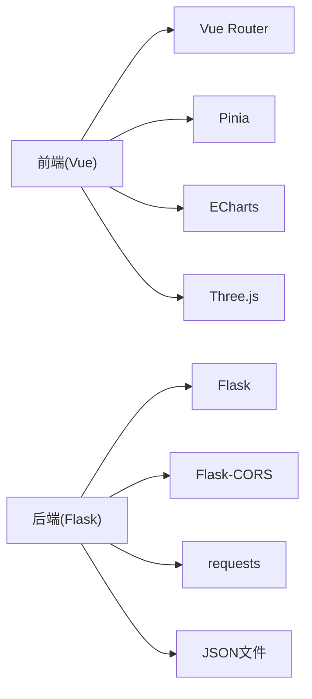

# 仪表板监控系统

<cite>
**本文引用的文件**
- [App.vue](file://src/App.vue)
- [main.js](file://src/main.js)
- [Dashboard.vue](file://src/views/Dashboard.vue)
- [AuthView.vue](file://src/views/AuthView.vue)
- [AppLayout.vue](file://src/components/layout/AppLayout.vue)
- [index.js](file://src/router/index.js)
- [app.py](file://backend/app.py)
- [package.json](file://package.json)
- [accounts.json](file://database/accounts.json)
- [users.json](file://database/users.json)
- [workers.json](file://database/workers.json)
- [foods.json](file://database/foods.json)
- [scoringList.json](file://database/scoringList.json)
- [style.css](file://src/style.css)
</cite>

## 目录
1. [简介](#简介)
2. [项目结构](#项目结构)
3. [核心组件](#核心组件)
4. [架构总览](#架构总览)
5. [详细组件分析](#详细组件分析)
6. [依赖分析](#依赖分析)
7. [性能考虑](#性能考虑)
8. [故障排查指南](#故障排查指南)
9. [结论](#结论)
10. [附录](#附录)

## 简介
本项目为智慧康养养老院仪表板监控系统，采用前后端分离架构：
- 前端基于 Vue 3 + Vite，使用 ECharts 进行数据可视化，实现折线图、饼图等图表渲染与交互。
- 后端基于 Flask，提供 REST API 接口，负责认证、数据聚合与第三方天气 API 调用。
- 数据源来自本地 JSON 文件，支持用户、护工、菜品与评分等数据的展示与管理。

系统目标是为养老院管理者提供实时数据概览与可视化面板，涵盖天气状况、老人行动能力分布、护工评分滚动流以及三餐情况等关键指标。

## 项目结构
前端采用模块化组织，按功能拆分为视图、组件与路由；后端以 Flask 路由为中心，统一管理数据读写与第三方 API 调用。

**图表来源**
- [main.js:1-11](file://src/main.js#L1-L11)
- [App.vue:1-24](file://src/App.vue#L1-L24)
- [index.js:1-61](file://src/router/index.js#L1-L61)
- [Dashboard.vue:1-800](file://src/views/Dashboard.vue#L1-L800)
- [app.py:1-330](file://backend/app.py#L1-L330)

**章节来源**
- [main.js:1-11](file://src/main.js#L1-L11)
- [App.vue:1-24](file://src/App.vue#L1-L24)
- [index.js:1-61](file://src/router/index.js#L1-L61)
- [Dashboard.vue:1-800](file://src/views/Dashboard.vue#L1-L800)
- [app.py:1-330](file://backend/app.py#L1-L330)

## 核心组件
- 路由与认证：登录/注册流程、路由守卫与本地 Token 管理。
- 仪表板视图：实时天气数据获取、ECharts 图表初始化、数字动画与滚动流。
- 布局组件：侧边栏导航、顶部工具栏与模态弹窗。
- 后端 API：认证、数据聚合、第三方天气 API 调用与本地 JSON 数据读写。

**章节来源**
- [AuthView.vue:1-380](file://src/views/AuthView.vue#L1-L380)
- [index.js:1-61](file://src/router/index.js#L1-L61)
- [Dashboard.vue:1-800](file://src/views/Dashboard.vue#L1-L800)
- [AppLayout.vue:1-800](file://src/components/layout/AppLayout.vue#L1-L800)
- [app.py:1-330](file://backend/app.py#L1-L330)

## 架构总览
系统采用前后端分离架构，前端通过 fetch 请求后端接口，后端负责业务逻辑与数据聚合，最终以 JSON 形式返回给前端进行渲染。

**图表来源**
- [index.js:42-59](file://src/router/index.js#L42-L59)
- [AuthView.vue:22-69](file://src/views/AuthView.vue#L22-L69)
- [app.py:148-182](file://backend/app.py#L148-L182)

## 详细组件分析

### 实时数据获取与状态管理
- 前端在仪表板视图中通过 fetch 获取后端接口数据，使用响应式 ref 保存服务端返回的综合数据，并将其拆分为不同模块（天气统计、护工评分、菜品信息等）。
- 使用 setTimeout 延迟触发数字动画，animateNumber 函数通过 requestAnimationFrame 实现补间动画，确保流畅性与性能。
- 生命周期钩子 onMounted 中进行数据拉取与图表初始化，onUnmounted 中清理定时器，防止内存泄漏。

**图表来源**
- [Dashboard.vue:173-204](file://src/views/Dashboard.vue#L173-L204)
- [Dashboard.vue:28-45](file://src/views/Dashboard.vue#L28-L45)
- [Dashboard.vue:48-112](file://src/views/Dashboard.vue#L48-L112)
- [Dashboard.vue:114-169](file://src/views/Dashboard.vue#L114-L169)

**章节来源**
- [Dashboard.vue:1-800](file://src/views/Dashboard.vue#L1-L800)

### ECharts 图表集成
- 折线图：初始化时设置 tooltip、legend、grid、xAxis、yAxis 与 series，使用平滑曲线与渐变填充增强视觉效果；监听窗口 resize 事件以适配响应式。
- 饼图：统计 users 的 actionCapability 分布，生成数据数组并配置饼图系列、标签、强调样式与颜色主题；同样监听 resize 事件。
- 图表引用：通过 ref 绑定 DOM 容器，确保在 nextTick 后初始化，避免空节点导致初始化失败。

**图表来源**
- [Dashboard.vue:48-112](file://src/views/Dashboard.vue#L48-L112)
- [Dashboard.vue:114-169](file://src/views/Dashboard.vue#L114-L169)

**章节来源**
- [Dashboard.vue:1-800](file://src/views/Dashboard.vue#L1-L800)

### 数字动画效果实现
- 补间动画算法：animateNumber 使用起始值、结束值与持续时间，计算进度并应用三次缓动函数，最后通过 requestAnimationFrame 递归更新。
- 性能优化：仅在必要时启动动画，避免频繁重绘；在组件卸载时清理动画循环，防止资源浪费。

**图表来源**
- [Dashboard.vue:28-45](file://src/views/Dashboard.vue#L28-L45)

**章节来源**
- [Dashboard.vue:1-800](file://src/views/Dashboard.vue#L1-L800)

### 数据可视化组件架构设计
- 图表初始化：在 onMounted 中拉取数据后，通过 nextTick 确保 DOM 就绪再初始化图表，避免初始化失败。
- 事件监听：为窗口添加 resize 监听，图表自动调用 resize 以适配容器尺寸变化。
- 内存清理：在 onUnmounted 中清理定时器与图表实例引用，防止内存泄漏与重复渲染。

**章节来源**
- [Dashboard.vue:1-800](file://src/views/Dashboard.vue#L1-L800)

### 错误处理与调试技巧
- 前端：在 fetch 请求中捕获异常并打印错误日志，提示用户网络或服务端问题；在图表初始化前检查 DOM 引用是否存在。
- 后端：对第三方天气 API 调用设置超时与异常捕获，出现异常时返回模拟数据保证系统可用性；对认证接口进行 Bearer Token 校验。
- 调试建议：打开浏览器开发者工具查看网络请求与响应；在控制台输出关键变量值；检查 ECharts 是否正确初始化与 resize。

**章节来源**
- [Dashboard.vue:201-203](file://src/views/Dashboard.vue#L201-L203)
- [app.py:114-116](file://backend/app.py#L114-L116)
- [AuthView.vue:42-46](file://src/views/AuthView.vue#L42-L46)

### 扩展与自定义
- 扩展图表类型：在 initTrendChart 或 initPieChart 中修改 series 类型与配置，例如添加柱状图、散点图或 3D 图表。
- 自定义动画效果：调整 animateNumber 的缓动函数与持续时间，或引入外部动画库以实现更丰富的过渡效果。
- 数据绑定：在 Dashboard.vue 中扩展响应式变量与模板绑定，以支持更多维度的数据展示。

**章节来源**
- [Dashboard.vue:1-800](file://src/views/Dashboard.vue#L1-L800)

## 依赖分析
- 前端依赖：Vue 3、Vue Router、Pinia、ECharts、Three.js、@jiaminghi/data-view 等。
- 后端依赖：Flask、Flask-CORS、requests（用于调用第三方天气 API）。
- 数据库：本地 JSON 文件，便于开发与演示阶段的数据持久化。

**图表来源**
- [package.json:11-26](file://package.json#L11-L26)
- [app.py:1-11](file://backend/app.py#L1-L11)

**章节来源**
- [package.json:1-28](file://package.json#L1-L28)
- [app.py:1-330](file://backend/app.py#L1-L330)

## 性能考虑
- 动画性能：使用 requestAnimationFrame 替代 setInterval，减少主线程阻塞；合理设置动画持续时间与缓动函数，避免过度重绘。
- 图表性能：在窗口 resize 时仅调用图表 resize，避免重复初始化；在大数据量场景下考虑分页或采样策略。
- 网络性能：对第三方 API 调用设置超时与重试机制；在前端缓存近期数据，减少重复请求。
- 内存管理：在组件卸载时清理定时器与图表实例，避免内存泄漏。

[本节为通用指导，无需特定文件引用]

## 故障排查指南
- 登录失败：检查用户名/密码是否正确，确认后端返回的 Token 是否写入 localStorage；查看路由守卫是否正确拦截未登录请求。
- 图表不显示：确认 DOM 引用是否正确绑定，确保在 nextTick 后初始化；检查浏览器控制台是否有 ECharts 初始化错误。
- 数据未更新：检查后端接口是否正常返回数据，确认 fetch 请求是否抛出异常；查看浏览器网络面板中的响应状态码。
- 第三方 API 失败：后端已提供兜底逻辑，若出现异常会返回模拟数据；可在后端日志中查看具体错误原因。

**章节来源**
- [AuthView.vue:22-69](file://src/views/AuthView.vue#L22-L69)
- [Dashboard.vue:173-204](file://src/views/Dashboard.vue#L173-L204)
- [app.py:114-116](file://backend/app.py#L114-L116)

## 结论
本系统通过前后端分离架构实现了智慧康养养老院的仪表板监控功能，前端以 Vue 3 与 ECharts 为核心，后端以 Flask 提供 REST API 与数据聚合。系统具备良好的扩展性与可维护性，能够满足日常运营中的数据可视化与实时监控需求。后续可进一步引入 WebSocket 实现实时推送、优化图表渲染性能与增强用户体验。

[本节为总结性内容，无需特定文件引用]

## 附录
- 数据模型概览：users、workers、foods、scoringList、accounts 等 JSON 文件构成系统数据源，支撑仪表板展示与管理功能。
- 样式与主题：全局样式采用柔和的绿色系主题，结合玻璃卡片与动画效果提升视觉体验。

**章节来源**
- [users.json:1-582](file://database/users.json#L1-L582)
- [workers.json:1-442](file://database/workers.json#L1-L442)
- [foods.json:1-38](file://database/foods.json#L1-L38)
- [scoringList.json:1-7](file://database/scoringList.json#L1-L7)
- [accounts.json:1-14](file://database/accounts.json#L1-L14)
- [style.css:1-308](file://src/style.css#L1-L308)