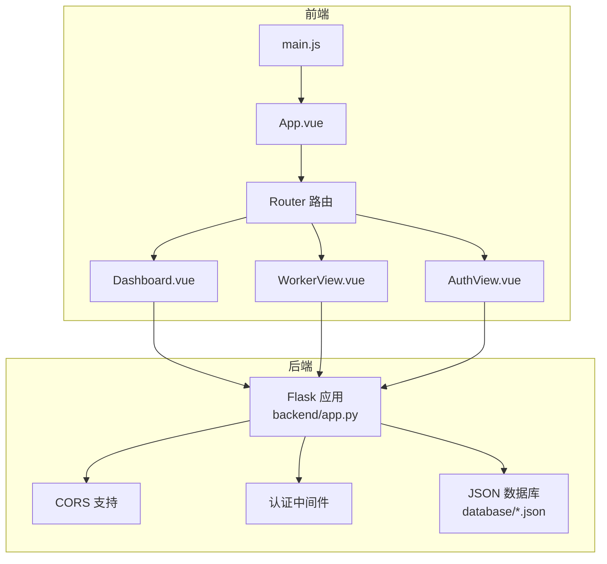
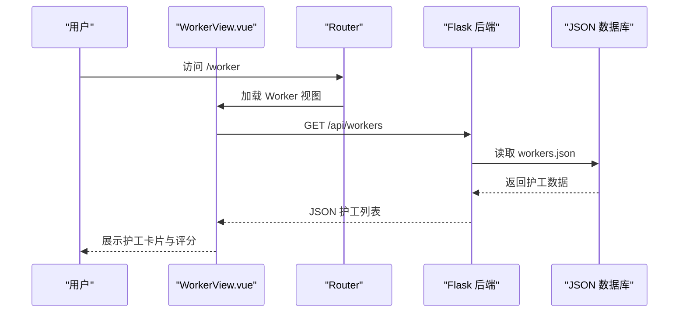
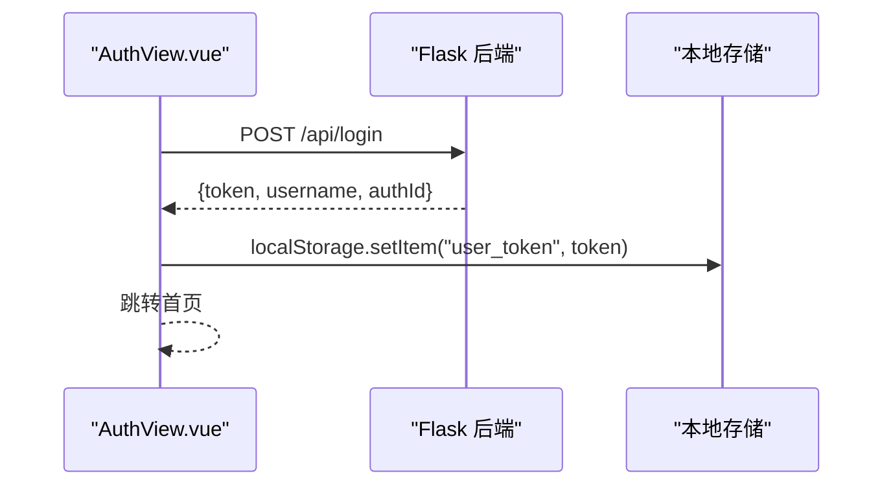
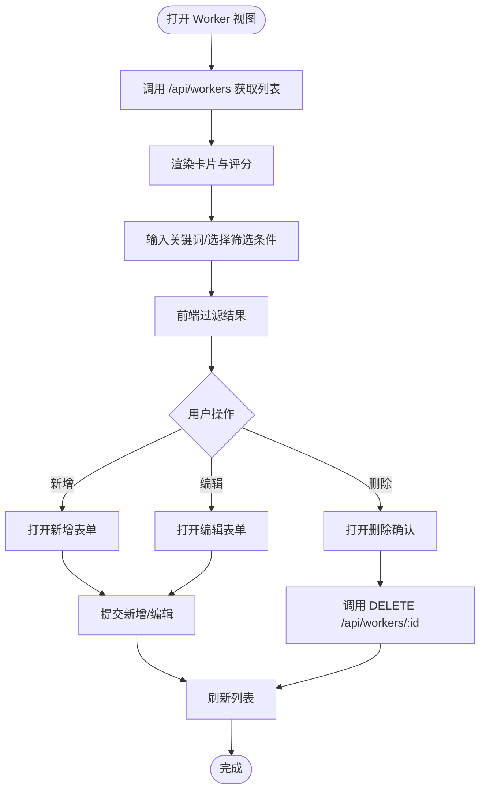
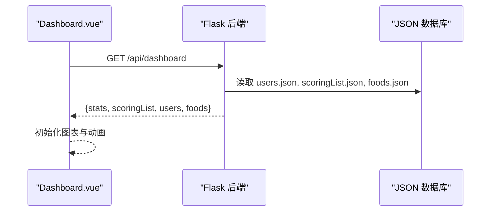
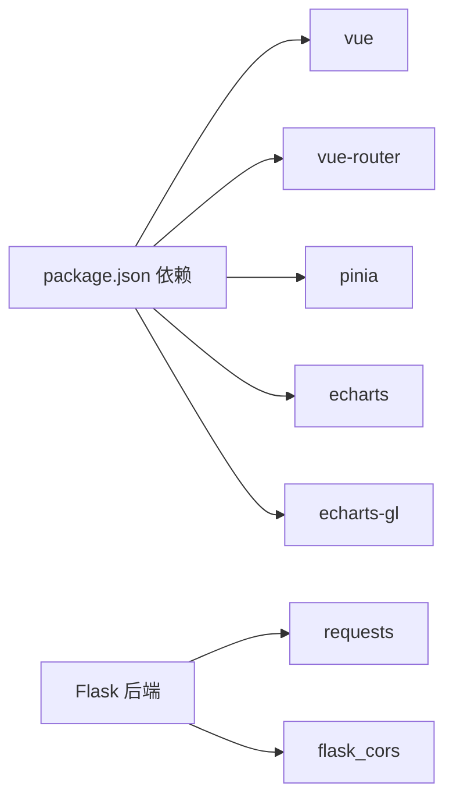

# 护工信息管理系统

<cite>
**本文档引用的文件**
- [backend/app.py](file://backend/app.py)
- [database/workers.json](file://database/workers.json)
- [database/users.json](file://database/users.json)
- [database/accounts.json](file://database/accounts.json)
- [database/scoringList.json](file://database/scoringList.json)
- [database/foods.json](file://database/foods.json)
- [src/views/WorkerView.vue](file://src/views/WorkerView.vue)
- [src/views/Dashboard.vue](file://src/views/Dashboard.vue)
- [src/views/AuthView.vue](file://src/views/AuthView.vue)
- [src/router/index.js](file://src/router/index.js)
- [src/main.js](file://src/main.js)
- [src/App.vue](file://src/App.vue)
- [package.json](file://package.json)
</cite>

## 目录
1. [简介](#简介)
2. [项目结构](#项目结构)
3. [核心组件](#核心组件)
4. [架构总览](#架构总览)
5. [详细组件分析](#详细组件分析)
6. [依赖关系分析](#依赖关系分析)
7. [性能考虑](#性能考虑)
8. [故障排查指南](#故障排查指南)
9. [结论](#结论)
10. [附录](#附录)

## 简介
本系统为智慧康养养老院护工信息管理系统，围绕护工信息管理、评分与历史记录、工作安排与状态跟踪、护工与老人照护分配等核心业务展开。前端采用 Vue 3 + Vue Router + Pinia，后端基于 Flask 提供 REST 接口，数据持久化采用本地 JSON 文件。系统支持用户认证、护工信息维护、评分展示与滚动流、老人行动能力分布可视化、三餐菜品展示等功能。

## 项目结构
系统采用前后端分离架构：
- 前端：Vue 3 应用，路由控制页面跳转与鉴权，组件负责视图渲染与交互。
- 后端：Flask 提供 REST API，负责认证、数据读写与天气数据聚合。
- 数据库：本地 JSON 文件，包含护工、老人、账户、评分记录、菜品等。

**图表来源**
- [src/App.vue:1-24](file://src/App.vue#L1-L24)
- [src/router/index.js:1-61](file://src/router/index.js#L1-L61)
- [src/main.js:1-11](file://src/main.js#L1-L11)
- [src/views/Dashboard.vue:1-210](file://src/views/Dashboard.vue#L1-L210)
- [src/views/WorkerView.vue:1-120](file://src/views/WorkerView.vue#L1-L120)
- [src/views/AuthView.vue:1-72](file://src/views/AuthView.vue#L1-L72)
- [backend/app.py:1-120](file://backend/app.py#L1-L120)
- [database/workers.json:1-442](file://database/workers.json#L1-L442)
- [database/users.json:1-582](file://database/users.json#L1-L582)
- [database/accounts.json:1-14](file://database/accounts.json#L1-L14)
- [database/scoringList.json:1-7](file://database/scoringList.json#L1-L7)
- [database/foods.json:1-38](file://database/foods.json#L1-L38)

**章节来源**
- [src/App.vue:1-24](file://src/App.vue#L1-L24)
- [src/router/index.js:1-61](file://src/router/index.js#L1-L61)
- [src/main.js:1-11](file://src/main.js#L1-L11)
- [backend/app.py:1-120](file://backend/app.py#L1-L120)

## 核心组件
- 认证与路由
  - 路由守卫：未登录访问受保护页面自动跳转登录；已登录访问登录页自动跳转仪表盘。
  - 登录/注册：前端发起请求，后端返回令牌并存入本地存储。
- 护工信息管理
  - 列表展示：支持搜索与多维筛选（性别、教育、婚姻、政治面貌）。
  - 新增/编辑/删除：表单校验、提交后刷新列表。
  - 评分字段：支持 0-5 分范围校验与显示。
- 仪表盘
  - 天气数据：从第三方 API 获取并转换，前端动画展示。
  - 护工评分滚动流：从后端拉取评分列表，实现无限滚动。
  - 老人行动能力分布：基于用户数据生成饼图。
  - 三餐菜品：按早餐/午餐/晚餐分组展示。
- 数据持久化
  - 护工、老人、账户、评分记录、菜品等数据以 JSON 文件形式存储。

**章节来源**
- [src/router/index.js:42-61](file://src/router/index.js#L42-L61)
- [src/views/AuthView.vue:23-71](file://src/views/AuthView.vue#L23-L71)
- [src/views/WorkerView.vue:96-380](file://src/views/WorkerView.vue#L96-L380)
- [src/views/Dashboard.vue:1-210](file://src/views/Dashboard.vue#L1-L210)
- [backend/app.py:120-330](file://backend/app.py#L120-L330)
- [database/workers.json:1-442](file://database/workers.json#L1-L442)
- [database/users.json:1-582](file://database/users.json#L1-L582)
- [database/scoringList.json:1-7](file://database/scoringList.json#L1-L7)
- [database/foods.json:1-38](file://database/foods.json#L1-L38)

## 架构总览
系统采用前后端分离模式，后端提供 REST 接口，前端通过 fetch 请求与后端交互。认证采用 Bearer Token，路由守卫确保访问控制。数据通过本地 JSON 文件持久化，后端提供统一的数据读写接口。

**图表来源**
- [src/views/WorkerView.vue:96-106](file://src/views/WorkerView.vue#L96-L106)
- [backend/app.py:264-266](file://backend/app.py#L264-L266)
- [database/workers.json:1-442](file://database/workers.json#L1-L442)

**章节来源**
- [src/views/WorkerView.vue:96-106](file://src/views/WorkerView.vue#L96-L106)
- [backend/app.py:264-266](file://backend/app.py#L264-L266)

## 详细组件分析

### 认证与会话管理
- 登录流程
  - 前端提交用户名/密码到后端登录接口。
  - 后端验证成功后生成临时 Token 并返回。
  - 前端将 Token 存入 localStorage，后续请求携带 Authorization: Bearer。
- 路由守卫
  - 未登录访问受保护路由自动跳转登录页。
  - 已登录访问登录页自动跳转仪表盘。
- 会话有效期
  - 当前实现为内存级 Token 集合，重启后失效；生产环境建议引入 JWT 或数据库持久化。

**图表来源**
- [src/views/AuthView.vue:23-46](file://src/views/AuthView.vue#L23-L46)
- [backend/app.py:148-170](file://backend/app.py#L148-L170)
- [src/router/index.js:42-61](file://src/router/index.js#L42-L61)

**章节来源**
- [src/views/AuthView.vue:23-71](file://src/views/AuthView.vue#L23-L71)
- [src/router/index.js:42-61](file://src/router/index.js#L42-L61)
- [backend/app.py:15-25](file://backend/app.py#L15-L25)

### 护工信息管理（WorkerView）
- 数据加载
  - 组件挂载时调用后端 /api/workers 获取护工列表。
- 搜索与筛选
  - 支持关键词在姓名、性别、籍贯、现住址、民族、政治面貌、婚姻状况、证件号、文化程度、原单位、原职业、现住址、电话、自我描述等字段中模糊匹配。
  - 下拉筛选支持性别、教育、婚姻、政治面貌。
- 表单与校验
  - 必填项：姓名、性别、年龄、电话。
  - 年龄范围：1-150；电话长度为 11 位数字；评分范围 0-5。
  - 编辑模式下保留已有数据并允许修改。
- CRUD 操作
  - 新增/编辑：提交表单，携带 Authorization 头。
  - 删除：二次确认后调用 DELETE /api/workers/:id。
- 状态提示
  - 成功/失败 Toast 提示，3 秒自动消失。

**图表来源**
- [src/views/WorkerView.vue:96-380](file://src/views/WorkerView.vue#L96-L380)
- [backend/app.py:268-321](file://backend/app.py#L268-L321)

**章节来源**
- [src/views/WorkerView.vue:96-380](file://src/views/WorkerView.vue#L96-L380)
- [backend/app.py:268-321](file://backend/app.py#L268-L321)

### 仪表盘（Dashboard）
- 数据聚合
  - 调用 /api/dashboard 获取天气、评分列表、老人数据、菜品数据。
- 天气动画
  - 前端补间动画展示温度、湿度、AQI、能见度、气压等指标。
- 护工评分滚动流
  - 从 scoringList.json 拉取评分记录，实现无限滚动效果。
- 老人行动能力分布
  - 统计 users.json 中 actionCapability 字段分布，生成饼图。
- 三餐菜品
  - 按 meal 分组展示菜品名称、描述与油脂等级。

**图表来源**
- [src/views/Dashboard.vue:173-204](file://src/views/Dashboard.vue#L173-L204)
- [backend/app.py:171-182](file://backend/app.py#L171-L182)
- [database/scoringList.json:1-7](file://database/scoringList.json#L1-L7)
- [database/users.json:1-582](file://database/users.json#L1-L582)
- [database/foods.json:1-38](file://database/foods.json#L1-L38)

**章节来源**
- [src/views/Dashboard.vue:1-210](file://src/views/Dashboard.vue#L1-L210)
- [backend/app.py:171-182](file://backend/app.py#L171-L182)

### 评分系统设计
- 数据来源
  - 护工评分字段存在于 workers.json 的每个护工对象中。
  - 仪表盘评分滚动流来源于 scoringList.json。
- 功能要点
  - 护工评分字段支持 0-5 分范围校验与显示。
  - 仪表盘展示评分滚动流，便于监控与回顾。
- 扩展建议
  - 可在 workers.json 中增加评分维度字段（如服务态度、专业技能、沟通能力），并在前端展示多维评分。
  - 可引入评分历史记录表，记录每次评分的时间、评分人、评分维度与备注，便于追溯与分析。

**章节来源**
- [database/workers.json:1-442](file://database/workers.json#L1-L442)
- [database/scoringList.json:1-7](file://database/scoringList.json#L1-L7)
- [src/views/WorkerView.vue:264-269](file://src/views/WorkerView.vue#L264-L269)
- [src/views/Dashboard.vue:268-293](file://src/views/Dashboard.vue#L268-L293)

### 护工与老人照护分配
- 现状
  - 数据库包含护工与老人两类实体，但未发现直接的照护分配关系字段。
- 建议
  - 在 users.json 中增加字段如 assignedWorkerId，建立护工与老人的关联。
  - 在 workers.json 中增加字段如 assignedOldPeopleIds，记录护工负责的老人列表。
  - 引入轮班排班表，记录日期、时间段、护工与老人的对应关系，支持查询与统计。

**章节来源**
- [database/users.json:1-582](file://database/users.json#L1-L582)
- [database/workers.json:1-442](file://database/workers.json#L1-L442)

### 工作状态跟踪与实时性
- 在线状态
  - 当前未实现在线状态跟踪，可通过引入 WebSocket 或轮询机制实现。
- 任务分配与完成情况
  - 建议引入任务表，包含任务类型、分配时间、完成状态、评分等字段，结合轮班排班表进行统计。
- 实时性建议
  - 使用轮询或 SSE（Server-Sent Events）推送任务变更。
  - 前端定时刷新或监听本地存储中的 Token 变化以触发重新拉取数据。

**章节来源**
- [backend/app.py:1-120](file://backend/app.py#L1-L120)

### 工作量统计与团队协作优化
- 工作量统计
  - 可基于轮班排班表统计每位护工的照护人数、服务时长、评分平均值等指标。
- 团队协作优化
  - 引入任务看板，支持拖拽式排班与任务分配。
  - 增加护工互评与团队评分模块，提升协作质量。
  - 提供绩效报表，支持导出与打印。

**章节来源**
- [src/views/Dashboard.vue:114-169](file://src/views/Dashboard.vue#L114-L169)

## 依赖关系分析
- 前端依赖
  - Vue 3、Vue Router、Pinia、ECharts、ECharts-GL 等。
- 后端依赖
  - Flask、Flask-CORS、requests（第三方天气 API）。
- 数据依赖
  - JSON 文件作为轻量级数据库，无需外部数据库服务。

**图表来源**
- [package.json:11-26](file://package.json#L11-L26)
- [backend/app.py:1-11](file://backend/app.py#L1-L11)

**章节来源**
- [package.json:11-26](file://package.json#L11-L26)
- [backend/app.py:1-11](file://backend/app.py#L1-L11)

## 性能考虑
- 前端性能
  - 图表渲染使用 ECharts，建议在大数据量时启用懒加载与节流。
  - 护工评分滚动流使用 CSS 动画，注意在低端设备上的性能表现。
- 后端性能
  - JSON 文件读写为同步操作，建议在高并发场景引入缓存或数据库。
  - 天气 API 请求设置超时与降级策略，避免阻塞主流程。
- 网络与安全
  - 生产环境建议启用 HTTPS、CORS 白名单与 Token 有效期控制。
  - 对敏感字段（如紧急联系人）在前端进行最小化展示与必要脱敏。

[本节为通用指导，无需特定文件来源]

## 故障排查指南
- 登录失败
  - 检查用户名/密码是否正确；确认后端返回消息；查看浏览器控制台网络请求。
- 无法加载护工列表
  - 检查后端 /api/workers 是否正常；确认 workers.json 是否存在且格式正确。
- 评分显示异常
  - 检查 workers.json 中 score 字段是否在 0-5 范围内；确认前端表单校验逻辑。
- 仪表盘数据为空
  - 检查 /api/dashboard 返回的数据结构；确认 users.json、scoringList.json、foods.json 是否存在。
- 路由跳转问题
  - 检查 localStorage 中 user_token 是否存在；确认路由守卫逻辑。

**章节来源**
- [src/views/AuthView.vue:23-71](file://src/views/AuthView.vue#L23-L71)
- [src/views/WorkerView.vue:96-380](file://src/views/WorkerView.vue#L96-L380)
- [src/views/Dashboard.vue:173-204](file://src/views/Dashboard.vue#L173-L204)
- [src/router/index.js:42-61](file://src/router/index.js#L42-L61)

## 结论
本系统以轻量级方式实现了护工信息管理与可视化展示，具备良好的扩展性。建议在后续版本中引入照护分配关系、评分历史与多维评分、工作状态跟踪与实时推送、任务看板与绩效报表等模块，以满足智慧康养养老院的实际运营需求。

[本节为总结性内容，无需特定文件来源]

## 附录

### 代码示例路径（扩展评分维度与自定义工作流程）
- 扩展护工评分维度
  - 在 workers.json 的护工对象中添加新的评分维度字段，例如：serviceAttitude、professionalSkill、communication。
  - 在 WorkerView 表单中新增对应输入项，并在后端接口中接收与持久化。
  - 在 Dashboard 中展示多维评分图表或表格。
  - 示例参考路径：
    - [database/workers.json:1-442](file://database/workers.json#L1-L442)
    - [src/views/WorkerView.vue:664-686](file://src/views/WorkerView.vue#L664-L686)
    - [backend/app.py:268-321](file://backend/app.py#L268-L321)
- 自定义工作流程
  - 引入任务表与轮班排班表，记录任务类型、分配时间、完成状态与评分。
  - 在前端增加任务看板与排班面板，支持拖拽式排班与任务分配。
  - 在后端新增任务与排班相关接口，提供查询与统计功能。
  - 示例参考路径：
    - [src/views/Dashboard.vue:114-169](file://src/views/Dashboard.vue#L114-L169)

**章节来源**
- [database/workers.json:1-442](file://database/workers.json#L1-L442)
- [src/views/WorkerView.vue:664-686](file://src/views/WorkerView.vue#L664-L686)
- [backend/app.py:268-321](file://backend/app.py#L268-L321)
- [src/views/Dashboard.vue:114-169](file://src/views/Dashboard.vue#L114-L169)