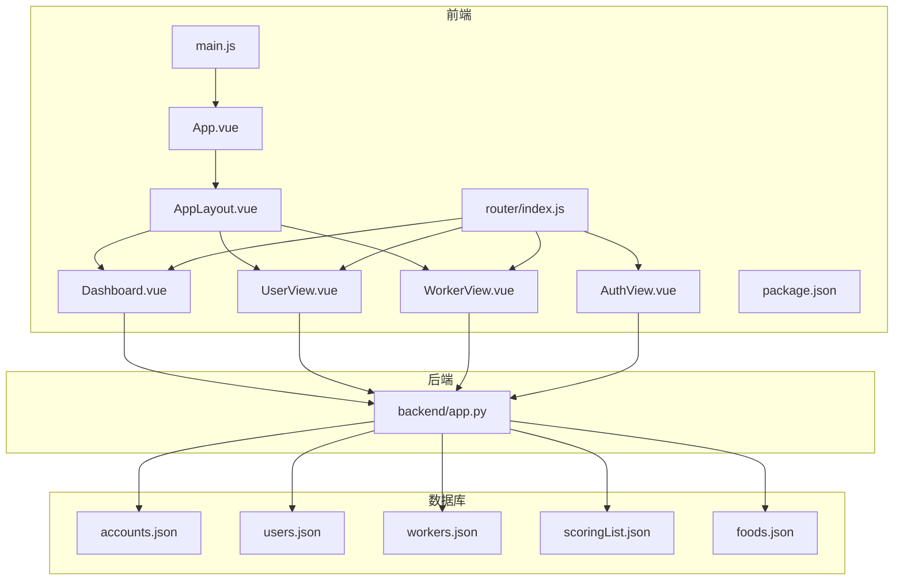
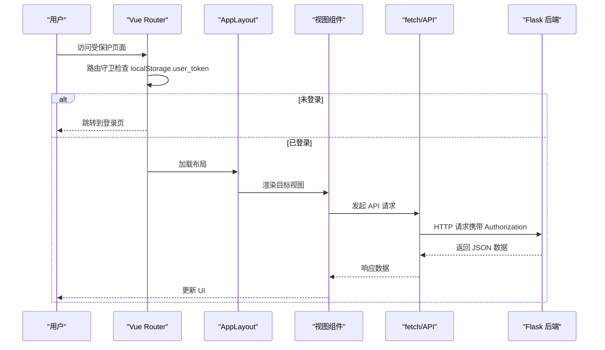
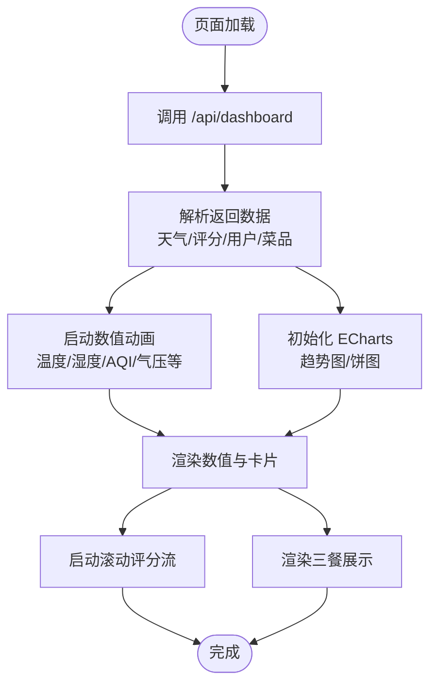
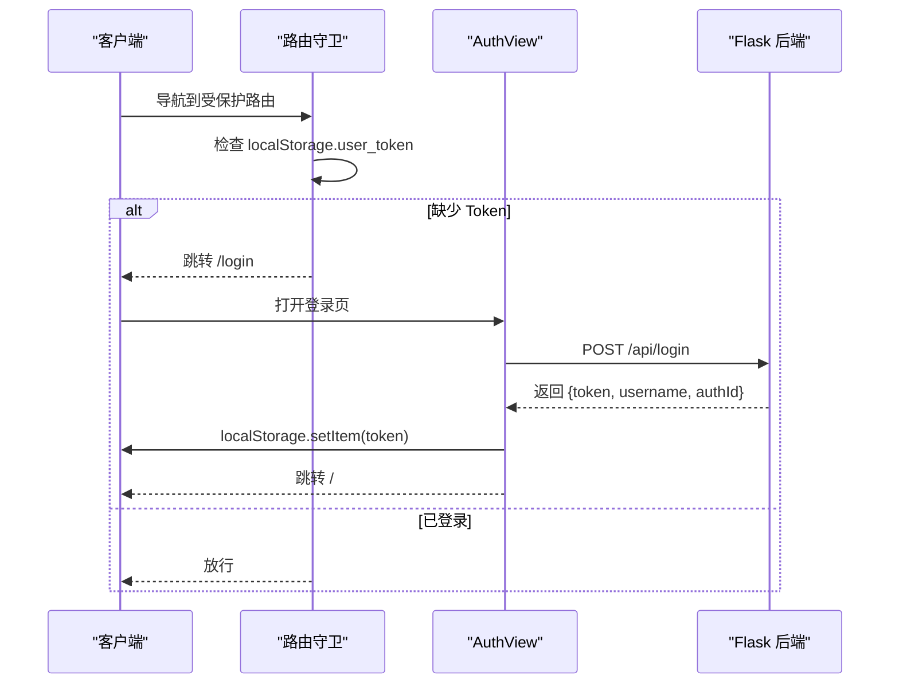
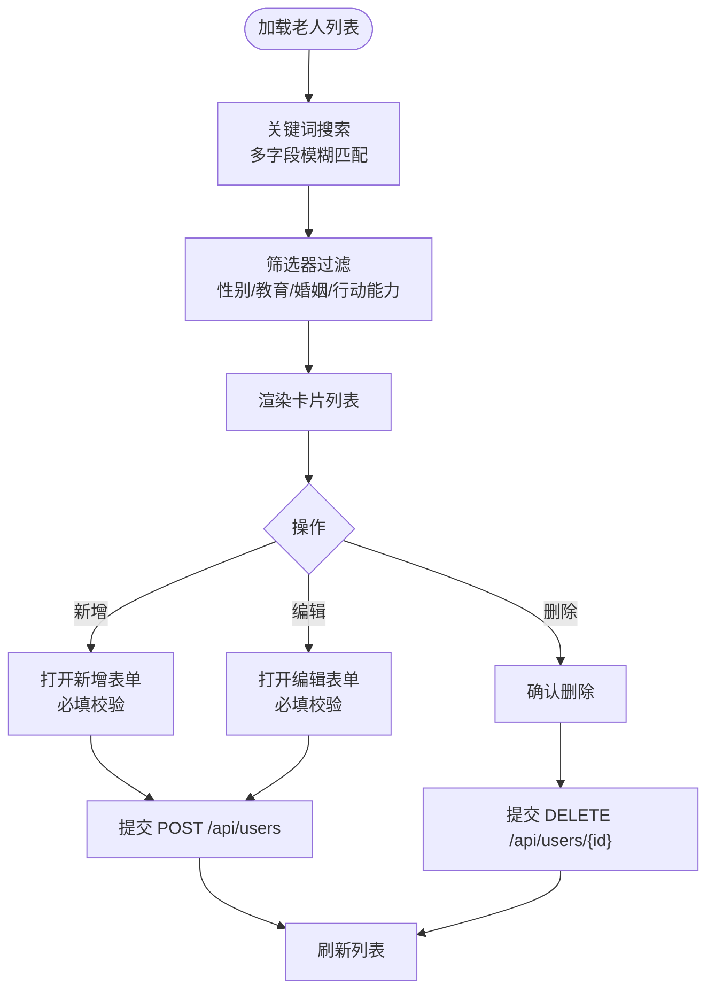
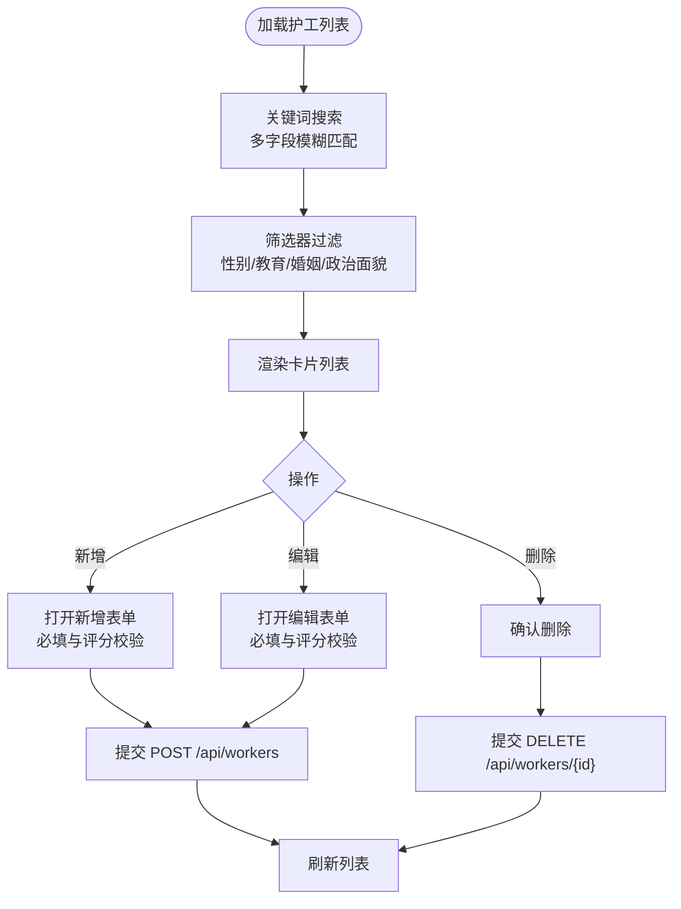
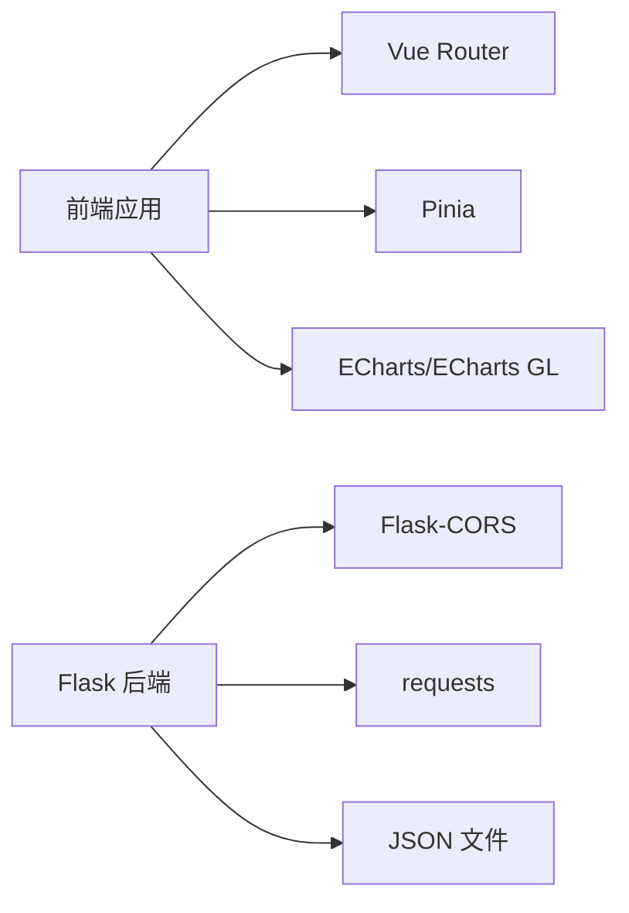

# 核心功能模块

<cite>
**本文档引用的文件**
- [App.vue](file://src/App.vue)
- [main.js](file://src/main.js)
- [AppLayout.vue](file://src/components/layout/AppLayout.vue)
- [AuthView.vue](file://src/views/AuthView.vue)
- [Dashboard.vue](file://src/views/Dashboard.vue)
- [UserView.vue](file://src/views/UserView.vue)
- [WorkerView.vue](file://src/views/WorkerView.vue)
- [index.js](file://src/router/index.js)
- [app.py](file://backend/app.py)
- [package.json](file://package.json)
- [accounts.json](file://database/accounts.json)
- [users.json](file://database/users.json)
- [workers.json](file://database/workers.json)
- [scoringList.json](file://database/scoringList.json)
- [foods.json](file://database/foods.json)
</cite>

## 目录
1. [简介](#简介)
2. [项目结构](#项目结构)
3. [核心组件](#核心组件)
4. [架构总览](#架构总览)
5. [详细组件分析](#详细组件分析)
6. [依赖分析](#依赖分析)
7. [性能考虑](#性能考虑)
8. [故障排查指南](#故障排查指南)
9. [结论](#结论)
10. [附录](#附录)

## 简介
本项目为智慧康养养老院管理系统，围绕三大核心功能模块展开：
- 仪表板监控系统：实时天气与环境指标、趋势与分布可视化、滚动评分流与三餐展示。
- 用户认证系统：登录注册、Token 管理、路由守卫与权限拦截。
- 老人信息与护工信息管理：CRUD 操作、数据校验、搜索与筛选。

系统采用前后端分离架构：前端基于 Vue 3 + Vue Router + Pinia，后端基于 Python Flask，数据以本地 JSON 文件形式持久化。ECharts 用于数据可视化，第三方 OpenWeatherMap API 提供天气数据。

## 项目结构
项目采用典型的前端工程化组织方式，按功能模块划分视图与布局组件；后端以单一应用入口提供 REST 接口；数据库以 JSON 文件存放用户、老人、护工、评分与菜品等数据。

**图表来源**
- [App.vue:1-24](file://src/App.vue#L1-L24)
- [main.js:1-11](file://src/main.js#L1-L11)
- [AppLayout.vue:1-1094](file://src/components/layout/AppLayout.vue#L1-L1094)
- [index.js:1-61](file://src/router/index.js#L1-L61)
- [AuthView.vue:1-380](file://src/views/AuthView.vue#L1-L380)
- [Dashboard.vue:1-967](file://src/views/Dashboard.vue#L1-L967)
- [UserView.vue:1-520](file://src/views/UserView.vue#L1-L520)
- [WorkerView.vue:1-1384](file://src/views/WorkerView.vue#L1-L1384)
- [app.py:1-330](file://backend/app.py#L1-L330)
- [package.json:1-28](file://package.json#L1-L28)

**章节来源**
- [App.vue:1-24](file://src/App.vue#L1-L24)
- [main.js:1-11](file://src/main.js#L1-L11)
- [index.js:1-61](file://src/router/index.js#L1-L61)
- [package.json:1-28](file://package.json#L1-L28)

## 核心组件
- 认证与路由守卫：登录注册、Token 存储与校验、未登录自动跳转登录页。
- 仪表板：天气与环境指标、趋势图、分布图、滚动评分流、三餐展示。
- 老人信息管理：列表、搜索、筛选、新增/编辑/删除、表单校验。
- 护工信息管理：列表、搜索、筛选、新增/编辑/删除、表单校验。
- 布局与导航：侧边栏、面包屑、当前登录信息、退出登录。

**章节来源**
- [AuthView.vue:1-380](file://src/views/AuthView.vue#L1-L380)
- [Dashboard.vue:1-967](file://src/views/Dashboard.vue#L1-L967)
- [UserView.vue:1-520](file://src/views/UserView.vue#L1-L520)
- [WorkerView.vue:1-1384](file://src/views/WorkerView.vue#L1-L1384)
- [AppLayout.vue:1-1094](file://src/components/layout/AppLayout.vue#L1-L1094)
- [index.js:1-61](file://src/router/index.js#L1-L61)

## 架构总览
系统采用前后端分离设计，前端负责 UI 与交互，后端提供 REST 接口与数据持久化。认证采用 Bearer Token 方案，路由守卫拦截未登录访问。

**图表来源**
- [index.js:42-59](file://src/router/index.js#L42-L59)
- [AppLayout.vue:19-29](file://src/components/layout/AppLayout.vue#L19-L29)
- [AuthView.vue:22-69](file://src/views/AuthView.vue#L22-L69)
- [UserView.vue:34-43](file://src/views/UserView.vue#L34-L43)
- [WorkerView.vue:96-106](file://src/views/WorkerView.vue#L96-L106)
- [Dashboard.vue:173-204](file://src/views/Dashboard.vue#L173-L204)
- [app.py:15-25](file://backend/app.py#L15-L25)

## 详细组件分析

### 仪表板监控系统
- 实时数据获取：组件挂载时调用后端 /api/dashboard 获取天气、评分、用户与菜品数据。
- ECharts 图表集成：折线图展示一周温度趋势，饼图展示老人行动能力分布。
- 数值动画：使用 requestAnimationFrame 实现平滑补间动画，提升观感。
- 滚动评分流：双列复制滚动，鼠标悬停暂停，营造动态信息流。
- 三餐展示：按早餐/午餐/晚餐分组展示菜品名称、描述与油脂等级。

**图表来源**
- [Dashboard.vue:173-204](file://src/views/Dashboard.vue#L173-L204)
- [Dashboard.vue:28-45](file://src/views/Dashboard.vue#L28-L45)
- [Dashboard.vue:47-112](file://src/views/Dashboard.vue#L47-L112)
- [Dashboard.vue:113-169](file://src/views/Dashboard.vue#L113-L169)
- [Dashboard.vue:172-209](file://src/views/Dashboard.vue#L172-L209)

**章节来源**
- [Dashboard.vue:1-967](file://src/views/Dashboard.vue#L1-L967)
- [app.py:171-182](file://backend/app.py#L171-L182)

### 用户认证系统
- 登录注册：前端向 /api/login 与 /api/register 发送 JSON，成功后将 token 与用户信息存入 localStorage。
- 路由守卫：未登录访问受保护路由自动跳转登录；已登录访问登录页自动跳转仪表板。
- 权限拦截：后端 /api/users 与 /api/workers 的新增/修改/删除接口使用装饰器 require_auth 校验 Authorization 头中的 Bearer Token。

**图表来源**
- [index.js:42-59](file://src/router/index.js#L42-L59)
- [AuthView.vue:22-69](file://src/views/AuthView.vue#L22-L69)
- [app.py:15-25](file://backend/app.py#L15-L25)
- [app.py:148-169](file://backend/app.py#L148-L169)

**章节来源**
- [AuthView.vue:1-380](file://src/views/AuthView.vue#L1-L380)
- [index.js:1-61](file://src/router/index.js#L1-L61)
- [app.py:1-330](file://backend/app.py#L1-L330)

### 老人信息管理
- CRUD 操作：支持 GET/POST/PUT/DELETE，新增/编辑/删除均需携带 Authorization: Bearer token。
- 数据校验：必填字段校验、年龄范围校验、电话长度与格式校验、行动能力必填、床位必填。
- 搜索与筛选：关键词模糊匹配多字段，支持性别、教育、婚姻、行动能力筛选。
- 健康信息：支持嵌套对象 MBG/MAP/MBF 的数值转换与空值处理。

**图表来源**
- [UserView.vue:34-43](file://src/views/UserView.vue#L34-L43)
- [UserView.vue:45-78](file://src/views/UserView.vue#L45-L78)
- [UserView.vue:129-149](file://src/views/UserView.vue#L129-L149)
- [UserView.vue:165-190](file://src/views/UserView.vue#L165-L190)
- [UserView.vue:192-214](file://src/views/UserView.vue#L192-L214)
- [app.py:204-262](file://backend/app.py#L204-L262)

**章节来源**
- [UserView.vue:1-520](file://src/views/UserView.vue#L1-L520)
- [app.py:204-262](file://backend/app.py#L204-L262)

### 护工信息管理
- CRUD 操作：支持 GET/POST/PUT/DELETE，新增/编辑/删除均需携带 Authorization: Bearer token。
- 数据校验：必填字段校验、年龄范围校验、电话长度与格式校验、评分范围校验。
- 搜索与筛选：关键词模糊匹配多字段，支持性别、教育、婚姻、政治面貌筛选。
- 评分展示：支持 0-5 分评分字段，用于排序与统计。

**图表来源**
- [WorkerView.vue:96-106](file://src/views/WorkerView.vue#L96-L106)
- [WorkerView.vue:108-147](file://src/views/WorkerView.vue#L108-L147)
- [WorkerView.vue:236-273](file://src/views/WorkerView.vue#L236-L273)
- [WorkerView.vue:275-323](file://src/views/WorkerView.vue#L275-L323)
- [WorkerView.vue:325-364](file://src/views/WorkerView.vue#L325-L364)
- [app.py:264-321](file://backend/app.py#L264-L321)

**章节来源**
- [WorkerView.vue:1-1384](file://src/views/WorkerView.vue#L1-L1384)
- [app.py:264-321](file://backend/app.py#L264-L321)

### 布局与导航
- 侧边栏菜单：首页、老人信息、护工信息，图标与文案清晰。
- 当前登录信息：从 localStorage 读取 user_name 与 user_id，支持退出登录。
- 移动端适配：侧边栏抽屉与移动端菜单按钮。
- 数据大屏快捷入口：顶部栏点击进入仪表板。

**章节来源**
- [AppLayout.vue:75-113](file://src/components/layout/AppLayout.vue#L75-L113)
- [AppLayout.vue:60-73](file://src/components/layout/AppLayout.vue#L60-L73)
- [AppLayout.vue:19-29](file://src/components/layout/AppLayout.vue#L19-L29)

## 依赖分析
- 前端依赖：Vue 3、Vue Router、Pinia、ECharts、ECharts GL、@vueuse/core、markdown-it、three。
- 后端依赖：Flask、Flask-CORS、requests（调用第三方天气 API）。
- 数据库：JSON 文件，包含账户、老人、护工、评分列表、菜品等。

**图表来源**
- [package.json:11-26](file://package.json#L11-L26)
- [app.py:1-8](file://backend/app.py#L1-L8)
- [app.py:5-8](file://backend/app.py#L5-L8)

**章节来源**
- [package.json:1-28](file://package.json#L1-L28)
- [app.py:1-330](file://backend/app.py#L1-L330)

## 性能考虑
- 前端
  - 避免在组件销毁时未清理定时器导致内存泄漏（已在仪表板与视图组件中清理）。
  - ECharts 图表在窗口 resize 时自动调整尺寸，减少手动监听。
  - 使用 nextTick 确保 DOM 就绪后再初始化图表，避免初始化失败。
  - 表单提交与删除操作使用 loading 状态，防止重复提交。
- 后端
  - 第三方天气 API 请求设置超时，异常时回退模拟数据，保证可用性。
  - JSON 文件读写使用统一辅助函数，避免重复逻辑。
  - 路由装饰器集中处理鉴权，减少重复代码。
- 数据层
  - 老人与护工 ID 生成策略确保唯一性与可读性。
  - 健康信息与评分字段在提交时进行数值转换与边界校验。

[本节为通用指导，无需特定文件引用]

## 故障排查指南
- 登录失败
  - 检查后端返回消息与网络连通性；确认用户名与密码正确。
  - 前端会将 token 与用户信息写入 localStorage，若失效需重新登录。
- 未登录访问受保护页面
  - 路由守卫会自动跳转登录页；确保 localStorage 中存在 user_token。
- CRUD 操作失败
  - 检查 Authorization 头是否携带 Bearer token。
  - 查看后端返回的错误消息，确认必填字段与格式。
- 图表不显示或空白
  - 确认 DOM 已渲染再初始化图表；检查容器尺寸与 resize 事件。
  - 若数据为空，检查后端 /api/dashboard 返回的数据结构。
- 天气数据异常
  - 第三方 API 超时或限流时会回退模拟数据；检查网络与 API Key 配置。

**章节来源**
- [AuthView.vue:22-69](file://src/views/AuthView.vue#L22-L69)
- [index.js:42-59](file://src/router/index.js#L42-L59)
- [Dashboard.vue:173-204](file://src/views/Dashboard.vue#L173-L204)
- [app.py:65-117](file://backend/app.py#L65-L117)

## 结论
本系统通过清晰的模块划分与前后端协作，实现了从认证到数据可视化的完整闭环。仪表板以 ECharts 展示关键指标，老人与护工管理提供完善的 CRUD 与校验能力，路由守卫与后端装饰器保障了访问安全。后续可在以下方面持续优化：引入分页与缓存、增强错误提示与国际化、扩展权限模型与审计日志、完善测试覆盖与部署流水线。

[本节为总结性内容，无需特定文件引用]

## 附录
- 数据模型概览
  - 账户：id、username、password、email
  - 老人：id、name、sex、age、actionCapability、bunk 等，嵌套 healthInformation
  - 护工：id、name、sex、age、score、selfDescription 等
  - 评分列表：flag、text、score
  - 菜品：id、name、time、meal、grease、greaseLevel、description

**章节来源**
- [accounts.json:1-14](file://database/accounts.json#L1-L14)
- [users.json:1-582](file://database/users.json#L1-L582)
- [workers.json:1-442](file://database/workers.json#L1-L442)
- [scoringList.json:1-7](file://database/scoringList.json#L1-L7)
- [foods.json:1-38](file://database/foods.json#L1-L38)