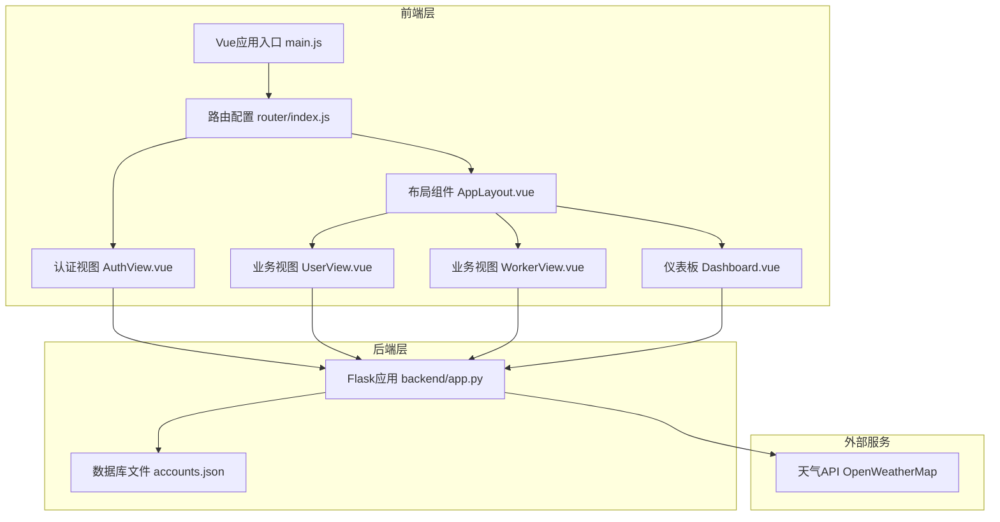
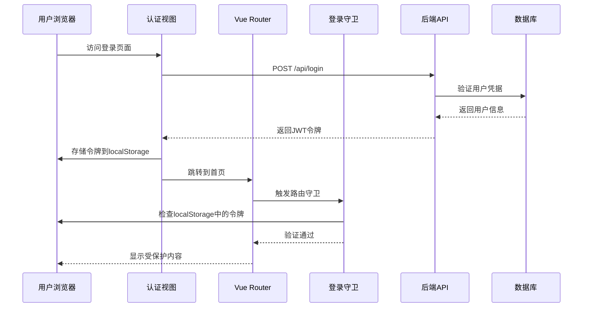
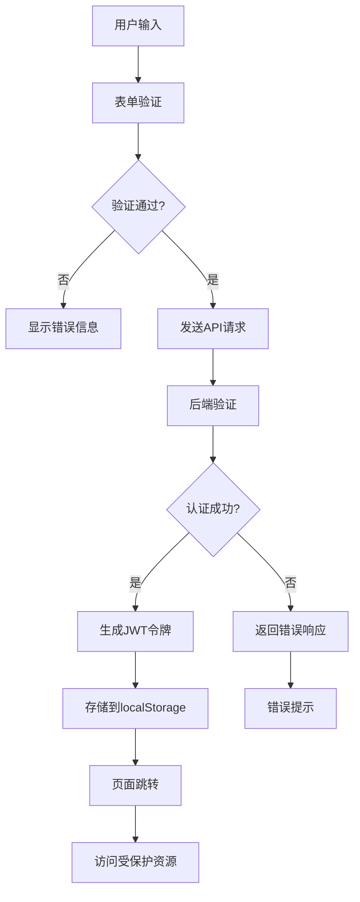
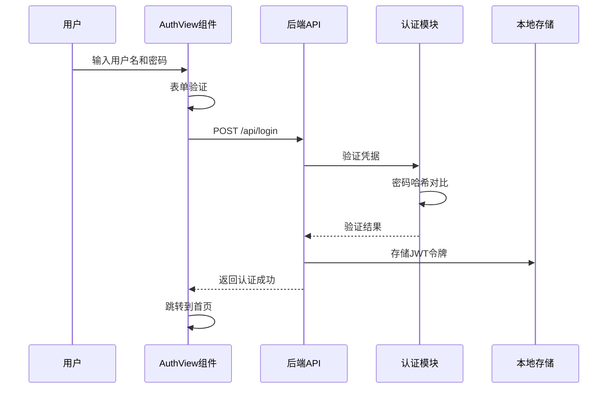
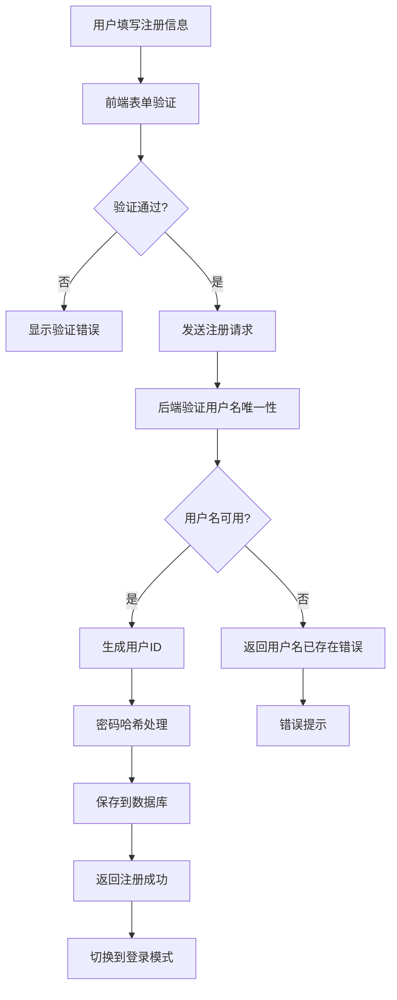
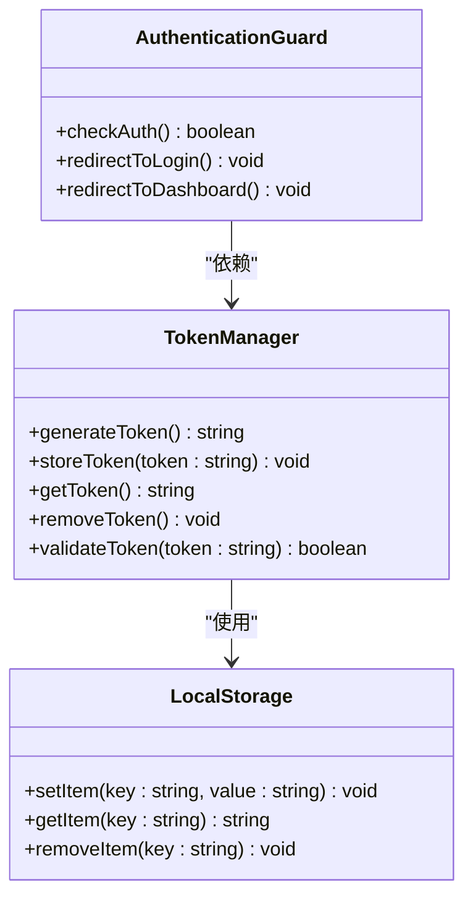
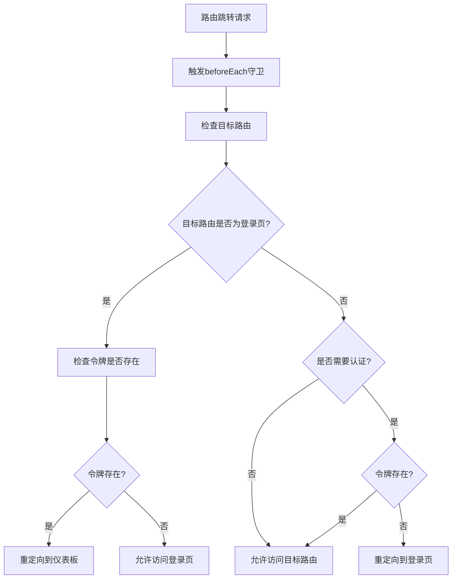
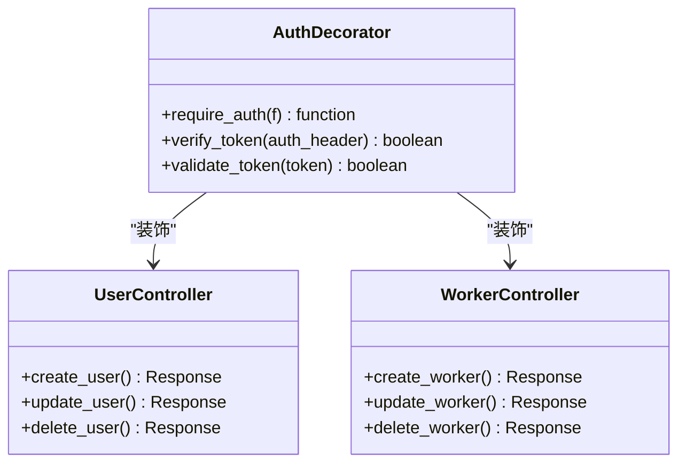
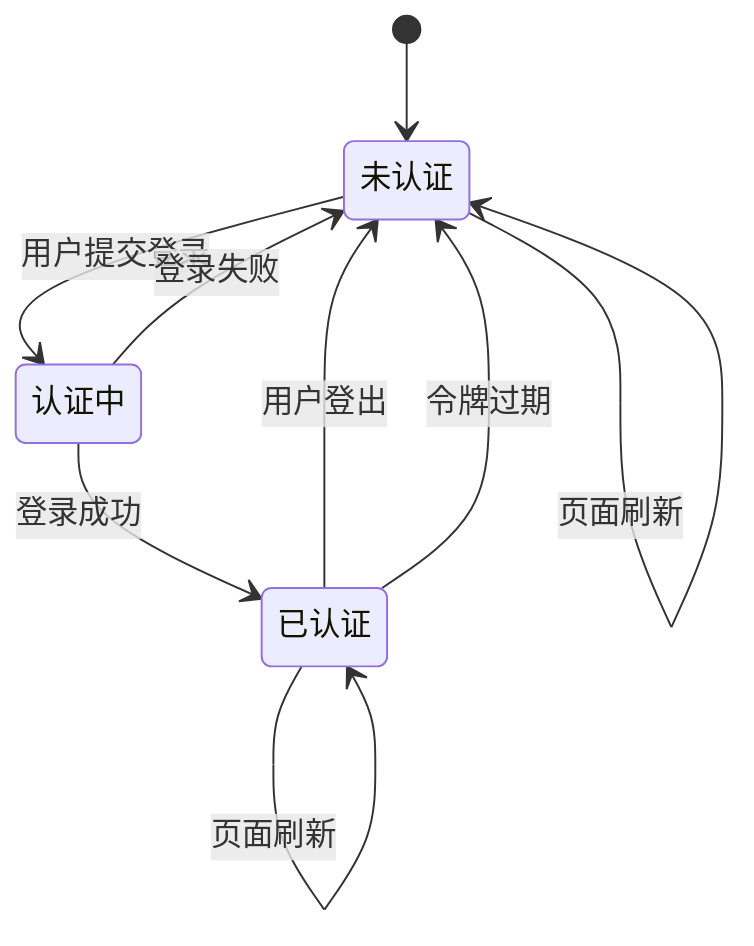
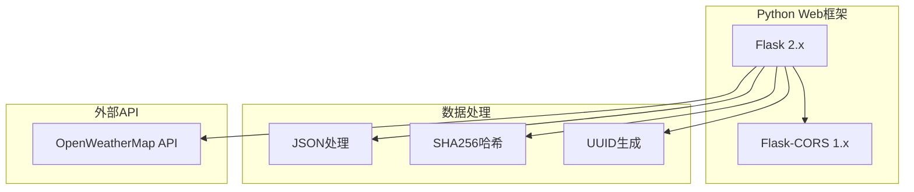

# 用户认证系统

<cite>
**本文档引用的文件**
- [AuthView.vue](file://src/views/AuthView.vue)
- [index.js](file://src/router/index.js)
- [main.js](file://src/main.js)
- [app.py](file://backend/app.py)
- [accounts.json](file://database/accounts.json)
- [AppLayout.vue](file://src/components/layout/AppLayout.vue)
- [UserView.vue](file://src/views/UserView.vue)
- [WorkerView.vue](file://src/views/WorkerView.vue)
- [Dashboard.vue](file://src/views/Dashboard.vue)
- [package.json](file://package.json)
</cite>

## 目录
1. [简介](#简介)
2. [项目结构](#项目结构)
3. [核心组件](#核心组件)
4. [架构概览](#架构概览)
5. [详细组件分析](#详细组件分析)
6. [依赖关系分析](#依赖关系分析)
7. [性能考虑](#性能考虑)
8. [故障排除指南](#故障排除指南)
9. [结论](#结论)

## 简介

智慧康养养老院用户认证系统是一个基于Vue.js前端框架和Flask后端的完整认证解决方案。该系统实现了完整的用户注册、登录、权限控制和状态管理功能，为养老院的智能化管理提供了安全可靠的用户认证基础。

系统采用前后端分离架构，前端使用Vue 3 + Vite构建现代化的SPA应用，后端使用Python Flask提供RESTful API服务。认证机制基于本地存储的令牌进行会话管理，配合路由守卫实现访问控制。

## 项目结构

该项目采用典型的Vue.js单页应用结构，主要分为以下几个层次：



**图表来源**
- [main.js:1-11](file://src/main.js#L1-L11)
- [index.js:1-61](file://src/router/index.js#L1-L61)
- [app.py:1-330](file://backend/app.py#L1-L330)

**章节来源**
- [main.js:1-11](file://src/main.js#L1-L11)
- [index.js:1-61](file://src/router/index.js#L1-L61)
- [package.json:1-28](file://package.json#L1-L28)

## 核心组件

### 认证视图组件

认证视图组件是用户交互的核心界面，提供了完整的登录和注册功能：

- **登录表单**：用户名、密码输入，支持记住设备功能
- **注册表单**：用户名、邮箱、密码输入，信息完整性验证
- **表单切换**：登录/注册模式切换动画
- **错误处理**：统一的错误提示和异常处理机制

### 路由守卫系统

路由守卫实现了基于令牌的访问控制：

- **令牌检查**：每次路由跳转前检查localStorage中的user_token
- **访问控制**：未登录用户自动重定向到登录页面
- **已登录保护**：已登录用户访问登录页面时重定向到仪表板

### 布局管理系统

AppLayout组件提供了统一的界面布局和用户状态管理：

- **用户信息展示**：显示当前登录用户的ID和姓名
- **导航菜单**：提供首页、老人信息、护工信息等导航
- **登出功能**：一键清除本地存储并返回登录页面

**章节来源**
- [AuthView.vue:1-380](file://src/views/AuthView.vue#L1-L380)
- [index.js:42-59](file://src/router/index.js#L42-L59)
- [AppLayout.vue:19-29](file://src/components/layout/AppLayout.vue#L19-L29)

## 架构概览

系统采用前后端分离的微服务架构，各组件职责明确：



**图表来源**
- [AuthView.vue:23-46](file://src/views/AuthView.vue#L23-L46)
- [index.js:42-59](file://src/router/index.js#L42-L59)
- [app.py:148-169](file://backend/app.py#L148-L169)

### 数据流架构



**图表来源**
- [AuthView.vue:9-69](file://src/views/AuthView.vue#L9-L69)
- [app.py:120-169](file://backend/app.py#L120-L169)

## 详细组件分析

### 认证流程实现

#### 登录流程

登录流程严格按照安全规范实现，确保用户凭据的安全传输和验证：



**图表来源**
- [AuthView.vue:23-46](file://src/views/AuthView.vue#L23-L46)
- [app.py:148-169](file://backend/app.py#L148-L169)

#### 注册流程

注册流程实现了完整的用户信息收集和验证机制：



**图表来源**
- [AuthView.vue:49-69](file://src/views/AuthView.vue#L49-L69)
- [app.py:120-147](file://backend/app.py#L120-L147)

**章节来源**
- [AuthView.vue:23-69](file://src/views/AuthView.vue#L23-L69)
- [app.py:120-169](file://backend/app.py#L120-L169)

### JWT令牌管理

#### 令牌生成机制

系统采用简化的令牌管理方案，使用UUID生成的字符串作为令牌：



**图表来源**
- [AuthView.vue:34-36](file://src/views/AuthView.vue#L34-L36)
- [index.js:47-58](file://src/router/index.js#L47-L58)

#### 令牌存储策略

令牌采用localStorage进行持久化存储，支持跨会话访问：

- **存储位置**：localStorage.user_token
- **存储内容**：JWT格式的访问令牌
- **存储时机**：认证成功后的回调处理
- **清理机制**：登出时主动移除令牌

**章节来源**
- [AuthView.vue:34-36](file://src/views/AuthView.vue#L34-L36)
- [AppLayout.vue:20-29](file://src/components/layout/AppLayout.vue#L20-L29)

### 权限控制系统

#### 路由守卫实现

系统通过Vue Router的全局前置守卫实现统一的权限控制：



**图表来源**
- [index.js:42-59](file://src/router/index.js#L42-L59)

#### API级权限控制

后端通过装饰器实现API级别的权限验证：



**图表来源**
- [app.py:15-25](file://backend/app.py#L15-L25)
- [app.py:209-262](file://backend/app.py#L209-L262)

**章节来源**
- [index.js:42-59](file://src/router/index.js#L42-L59)
- [app.py:15-25](file://backend/app.py#L15-L25)

### 认证状态管理

#### 全局状态管理

系统采用localStorage进行认证状态的全局管理：



#### 用户信息管理

用户基本信息通过localStorage进行管理：

- **user_name**：存储用户名
- **user_id**：存储用户ID
- **user_token**：存储认证令牌

**章节来源**
- [AppLayout.vue:60-73](file://src/components/layout/AppLayout.vue#L60-L73)
- [AuthView.vue:35-36](file://src/views/AuthView.vue#L35-L36)

## 依赖关系分析

### 前端依赖关系

```mermaid
graph TB
subgraph "Vue生态系统"
A[Vue 3.5.25]
B[Vue Router 4.6.4]
C[Pinia 3.0.4]
D[Vite 7.3.1]
end
subgraph "业务依赖"
E[ECharts 5.5.0]
F[@jiaminghi/data-view 2.10.0]
G[Three.js 0.182.0]
end
subgraph "开发工具"
H[@vitejs/plugin-vue]
I[vite-plugin-singlefile]
end
A --> B
A --> C
A --> E
A --> F
A --> G
D --> H
D --> I
```

**图表来源**
- [package.json:11-26](file://package.json#L11-L26)

### 后端依赖关系



**图表来源**
- [app.py:1-8](file://backend/app.py#L1-L8)

**章节来源**
- [package.json:11-26](file://package.json#L11-L26)
- [app.py:1-8](file://backend/app.py#L1-L8)

## 性能考虑

### 前端性能优化

1. **懒加载路由**：使用动态导入实现按需加载
2. **组件缓存**：合理使用keep-alive缓存组件状态
3. **事件节流**：对高频事件进行防抖处理
4. **图片优化**：使用合适的图片格式和尺寸

### 后端性能优化

1. **数据库索引**：对常用查询字段建立索引
2. **API缓存**：对静态数据进行缓存
3. **连接池**：使用连接池管理数据库连接
4. **异步处理**：对耗时操作使用异步处理

### 安全性能平衡

1. **令牌有效期**：设置合理的令牌过期时间
2. **频率限制**：对API请求进行频率限制
3. **输入验证**：严格的输入参数验证
4. **日志记录**：记录关键安全事件

## 故障排除指南

### 常见认证问题

#### 登录失败问题

**症状**：用户输入正确凭据但仍提示认证失败

**排查步骤**：
1. 检查用户名密码是否正确
2. 验证数据库中用户是否存在
3. 确认密码哈希算法一致性
4. 检查网络连接和API可达性

**解决方案**：
- 确保数据库文件accounts.json存在且格式正确
- 验证后端服务正常运行
- 检查前端API端点配置

#### 令牌过期问题

**症状**：用户登录后一段时间内出现401未授权错误

**排查步骤**：
1. 检查localStorage中令牌是否仍然存在
2. 验证令牌格式是否正确
3. 确认后端令牌验证逻辑

**解决方案**：
- 实现令牌刷新机制
- 增加令牌过期检测
- 提供自动重新登录功能

#### 路由跳转问题

**症状**：用户无法正确跳转到目标页面

**排查步骤**：
1. 检查路由配置是否正确
2. 验证路由守卫逻辑
3. 确认令牌状态检查

**解决方案**：
- 修复路由配置错误
- 优化路由守卫逻辑
- 增强错误处理机制

**章节来源**
- [AuthView.vue:42-45](file://src/views/AuthView.vue#L42-L45)
- [index.js:47-58](file://src/router/index.js#L47-L58)

### 开发调试技巧

1. **浏览器开发者工具**：监控网络请求和响应
2. **Vue DevTools**：检查组件状态和props
3. **后端日志**：查看API调用和错误信息
4. **数据库检查**：验证用户数据完整性

## 结论

智慧康养养老院用户认证系统提供了一个完整、安全、易用的认证解决方案。系统采用现代化的技术栈，实现了以下关键特性：

### 核心优势

1. **安全性**：采用令牌驱动的认证机制，支持API级权限控制
2. **用户体验**：简洁直观的界面设计，流畅的交互体验
3. **可扩展性**：模块化的架构设计，便于功能扩展
4. **可靠性**：完善的错误处理和异常恢复机制

### 技术亮点

- **前后端分离**：清晰的职责划分，独立的开发和部署
- **路由守卫**：统一的访问控制，防止未授权访问
- **本地存储**：持久化的用户状态管理
- **RESTful API**：标准化的接口设计

### 改进建议

1. **增强安全**：实现JWT令牌的自动刷新和轮换
2. **完善监控**：增加认证日志和审计功能
3. **用户体验**：提供密码重置和账户激活功能
4. **性能优化**：实现API缓存和负载均衡

该系统为智慧康养养老院的数字化转型提供了坚实的技术基础，能够有效保障用户数据安全，提升管理效率，为老年人提供更好的服务体验。