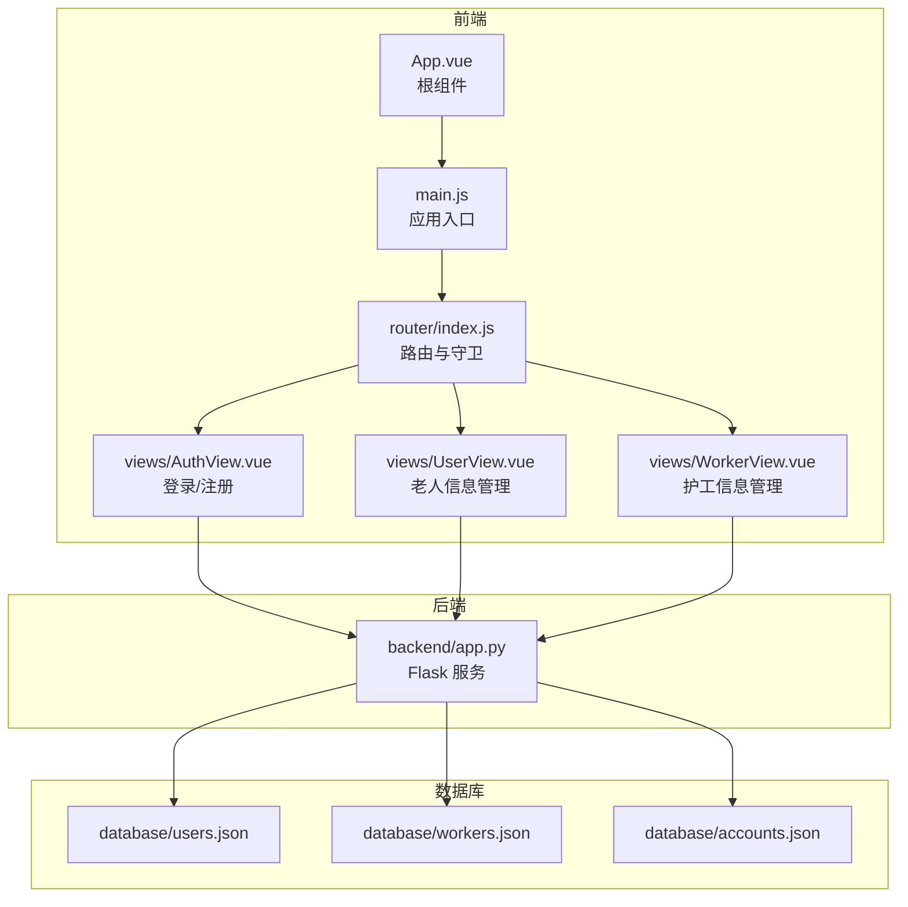
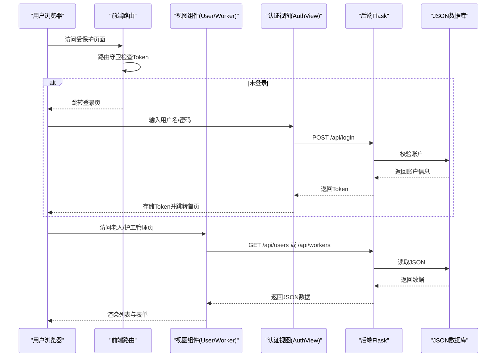
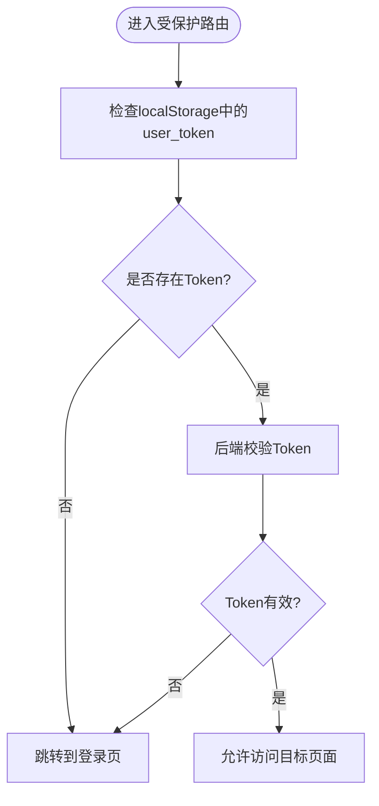
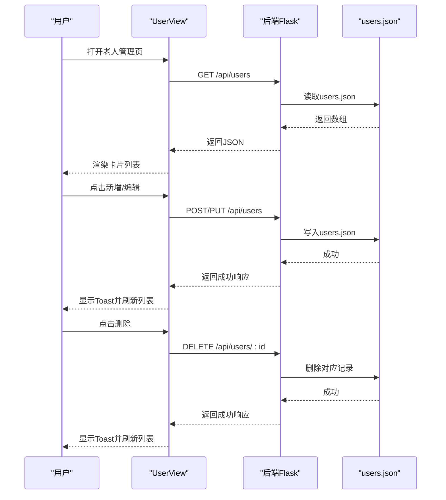
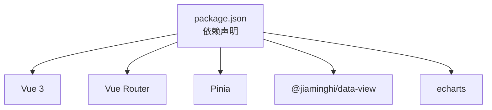

# 老人信息管理系统

<cite>
**本文引用的文件**
- [backend/app.py](file://backend/app.py)
- [src/views/UserView.vue](file://src/views/UserView.vue)
- [src/views/WorkerView.vue](file://src/views/WorkerView.vue)
- [src/views/AuthView.vue](file://src/views/AuthView.vue)
- [src/router/index.js](file://src/router/index.js)
- [src/main.js](file://src/main.js)
- [src/App.vue](file://src/App.vue)
- [database/users.json](file://database/users.json)
- [database/workers.json](file://database/workers.json)
- [database/accounts.json](file://database/accounts.json)
- [package.json](file://package.json)
</cite>

## 目录
1. [简介](#简介)
2. [项目结构](#项目结构)
3. [核心组件](#核心组件)
4. [架构总览](#架构总览)
5. [详细组件分析](#详细组件分析)
6. [依赖关系分析](#依赖关系分析)
7. [性能考虑](#性能考虑)
8. [故障排查指南](#故障排查指南)
9. [结论](#结论)
10. [附录](#附录)

## 简介
本系统为“智慧康养养老院老人信息管理系统”，围绕老人与护工两类实体，提供完整的 CRUD 操作、搜索与筛选、表单验证、数据持久化与同步、以及基础认证与路由守卫。前端采用 Vue 3 + Vue Router + Pinia，后端采用 Python Flask，数据以 JSON 文件形式存储于本地数据库目录。系统支持：
- 老人信息管理（UserView）：新增、编辑、删除、查看、搜索与筛选、表单验证、健康指标展示
- 护工信息管理（WorkerView）：新增、编辑、删除、查看、搜索与筛选、评分与描述
- 认证与路由守卫：登录/注册、Token 校验、未登录自动跳转登录页
- 数据持久化：前后端均基于本地 JSON 文件，后端提供 REST 接口

## 项目结构
系统采用前后端分离架构，前端负责界面与交互，后端提供 REST API 与本地 JSON 数据库。

图表来源
- [src/App.vue:1-24](file://src/App.vue#L1-L24)
- [src/main.js:1-11](file://src/main.js#L1-L11)
- [src/router/index.js:1-61](file://src/router/index.js#L1-L61)
- [src/views/AuthView.vue:1-380](file://src/views/AuthView.vue#L1-L380)
- [src/views/UserView.vue:1-520](file://src/views/UserView.vue#L1-L520)
- [src/views/WorkerView.vue:1-800](file://src/views/WorkerView.vue#L1-L800)
- [backend/app.py:1-330](file://backend/app.py#L1-L330)
- [database/users.json:1-582](file://database/users.json#L1-L582)
- [database/workers.json:1-442](file://database/workers.json#L1-L442)
- [database/accounts.json:1-14](file://database/accounts.json#L1-L14)

章节来源
- [src/App.vue:1-24](file://src/App.vue#L1-L24)
- [src/main.js:1-11](file://src/main.js#L1-L11)
- [src/router/index.js:1-61](file://src/router/index.js#L1-L61)
- [backend/app.py:1-330](file://backend/app.py#L1-L330)

## 核心组件
- 认证与路由守卫：登录/注册、Token 校验、未登录自动跳转登录页
- 老人信息视图：搜索、筛选、表单验证、CRUD、详情弹窗
- 护工信息视图：搜索、筛选、表单验证、CRUD、详情弹窗
- 后端 API：用户/护工的 REST 接口、认证接口、数据读写

章节来源
- [src/views/AuthView.vue:1-380](file://src/views/AuthView.vue#L1-L380)
- [src/views/UserView.vue:1-520](file://src/views/UserView.vue#L1-L520)
- [src/views/WorkerView.vue:1-800](file://src/views/WorkerView.vue#L1-L800)
- [backend/app.py:120-324](file://backend/app.py#L120-L324)

## 架构总览
系统采用前后端分离架构，前端通过 fetch 调用后端 REST API，后端以 JSON 文件作为数据源，提供统一的 CRUD 接口。认证采用 Bearer Token，路由守卫拦截未登录访问。

图表来源
- [src/router/index.js:42-59](file://src/router/index.js#L42-L59)
- [src/views/AuthView.vue:23-69](file://src/views/AuthView.vue#L23-L69)
- [backend/app.py:148-170](file://backend/app.py#L148-L170)
- [backend/app.py:204-262](file://backend/app.py#L204-L262)
- [backend/app.py:264-320](file://backend/app.py#L264-L320)

## 详细组件分析

### 认证与路由守卫
- 登录/注册：前端通过 fetch 调用后端 /api/login 与 /api/register，成功后将 Token 存入 localStorage
- 路由守卫：未登录访问受保护路由时自动跳转登录页；已登录访问登录页则跳转仪表盘
- Token 校验：所有需要认证的 API 请求头携带 Authorization: Bearer token

图表来源
- [src/router/index.js:42-59](file://src/router/index.js#L42-L59)
- [src/views/AuthView.vue:23-69](file://src/views/AuthView.vue#L23-L69)
- [backend/app.py:15-25](file://backend/app.py#L15-L25)

章节来源
- [src/views/AuthView.vue:1-380](file://src/views/AuthView.vue#L1-L380)
- [src/router/index.js:1-61](file://src/router/index.js#L1-L61)
- [backend/app.py:15-25](file://backend/app.py#L15-L25)

### 老人信息管理（UserView）
- 数据查询：首次挂载时通过 GET /api/users 拉取全部老人数据
- 搜索与筛选：关键词在多个字段上进行模糊匹配；支持性别、文化程度、婚姻状况、行动能力等筛选
- 表单验证：必填字段校验、年龄范围校验、电话号码格式校验、行动能力与床位必填
- CRUD 操作：新增/编辑通过 POST/PUT /api/users，删除通过 DELETE /api/users/:id
- 数据持久化：后端写入 database/users.json；前端本地状态与后端数据保持一致
- 详情弹窗：展示老人基本信息、联系方式、入院信息、健康指标与账户余额

图表来源
- [src/views/UserView.vue:34-43](file://src/views/UserView.vue#L34-L43)
- [src/views/UserView.vue:45-78](file://src/views/UserView.vue#L45-L78)
- [src/views/UserView.vue:129-149](file://src/views/UserView.vue#L129-L149)
- [src/views/UserView.vue:165-190](file://src/views/UserView.vue#L165-L190)
- [src/views/UserView.vue:193-214](file://src/views/UserView.vue#L193-L214)
- [backend/app.py:204-262](file://backend/app.py#L204-L262)
- [database/users.json:1-582](file://database/users.json#L1-L582)

章节来源
- [src/views/UserView.vue:1-520](file://src/views/UserView.vue#L1-L520)
- [backend/app.py:204-262](file://backend/app.py#L204-L262)
- [database/users.json:1-582](file://database/users.json#L1-L582)

### 护工信息管理（WorkerView）
- 数据查询：首次挂载时通过 GET /api/workers 拉取全部护工数据
- 搜索与筛选：关键词在多个字段上进行模糊匹配；支持性别、文化程度、婚姻状况、政治面貌等筛选
- 表单验证：必填字段校验、年龄范围校验、电话号码格式校验、评分范围校验
- CRUD 操作：新增/编辑通过 POST/PUT /api/workers，删除通过 DELETE /api/workers/:id
- 数据持久化：后端写入 database/workers.json；前端本地状态与后端数据保持一致
- 详情弹窗：展示护工基本信息、联系方式、工作信息与个人描述

章节来源
- [src/views/WorkerView.vue:1-800](file://src/views/WorkerView.vue#L1-L800)
- [backend/app.py:264-320](file://backend/app.py#L264-L320)
- [database/workers.json:1-442](file://database/workers.json#L1-L442)

### 表单验证机制
- 必填字段验证：姓名、性别、年龄、电话、行动能力、床位等
- 数据格式检查：年龄数值范围、电话号码长度与格式、评分范围
- 错误提示显示：表单项旁显示错误文本，输入框高亮错误状态
- Payload 构建：将字符串年龄/评分转换为数值，健康指标为空时转换为 null

章节来源
- [src/views/UserView.vue:129-149](file://src/views/UserView.vue#L129-L149)
- [src/views/UserView.vue:151-163](file://src/views/UserView.vue#L151-L163)
- [src/views/WorkerView.vue:237-273](file://src/views/WorkerView.vue#L237-L273)

### 数据持久化策略
- 本地存储：前端使用 localStorage 存储用户 Token 与用户名，便于会话保持
- 后端 API：所有 CRUD 操作通过 REST 接口完成，后端读写 JSON 文件
- 数据同步：前端每次新增/编辑/删除后主动刷新数据，确保视图与后端一致

章节来源
- [src/views/AuthView.vue:33-37](file://src/views/AuthView.vue#L33-L37)
- [src/views/UserView.vue:180-181](file://src/views/UserView.vue#L180-L181)
- [src/views/WorkerView.vue:313-314](file://src/views/WorkerView.vue#L313-L314)
- [backend/app.py:48-59](file://backend/app.py#L48-L59)

### 搜索与筛选实现
- 关键词匹配：对 id、name、性别、籍贯、住址、电话、入院原因、行动能力、床位等字段进行包含匹配
- 多条件筛选：支持性别、文化程度、婚姻状况、行动能力（老人）、政治面貌（护工）等
- 结果排序：当前未实现显式排序逻辑，按数据源顺序展示

章节来源
- [src/views/UserView.vue:45-78](file://src/views/UserView.vue#L45-L78)
- [src/views/WorkerView.vue:108-147](file://src/views/WorkerView.vue#L108-L147)

### 用户体验优化
- 弹窗交互：详情弹窗、表单弹窗、删除确认弹窗，避免页面跳转
- Toast 提示：成功/失败消息自动消失，提升反馈效率
- 响应式布局：网格卡片在不同屏幕尺寸下自适应排列
- 加载状态：表单保存与删除过程中禁用按钮，防止重复提交

章节来源
- [src/views/UserView.vue:216-222](file://src/views/UserView.vue#L216-L222)
- [src/views/WorkerView.vue:367-375](file://src/views/WorkerView.vue#L367-L375)
- [src/views/UserView.vue:407-408](file://src/views/UserView.vue#L407-L408)
- [src/views/WorkerView.vue:718-720](file://src/views/WorkerView.vue#L718-L720)

### 数据安全保护措施
- 认证与授权：后端提供 /api/login 与 /api/register，所有受保护接口需携带 Bearer Token
- Token 校验：装饰器 require_auth 校验 Authorization 头与 Token 有效性
- 密码存储：后端使用 SHA-256 对密码进行哈希存储
- CORS 支持：启用跨域资源共享，便于前端访问

章节来源
- [backend/app.py:15-25](file://backend/app.py#L15-L25)
- [backend/app.py:148-170](file://backend/app.py#L148-L170)
- [backend/app.py:62](file://backend/app.py#L62)
- [backend/app.py:11-11](file://backend/app.py#L11-L11)

## 依赖关系分析
- 前端依赖：Vue 3、Vue Router、Pinia、@jiaminghi/data-view、echarts 等
- 后端依赖：Flask、flask_cors、requests（天气 API 调用）

图表来源
- [package.json:11-27](file://package.json#L11-L27)

章节来源
- [package.json:1-28](file://package.json#L1-L28)

## 性能考虑
- 前端搜索与筛选：当前为内存过滤，适合中小规模数据；若数据量增大，建议后端分页与条件查询
- 表单提交：每次 CRUD 后刷新列表，避免复杂状态管理；对于高频操作可考虑局部更新
- 图标与样式：使用 CSS 动画与过渡，注意在低端设备上的性能表现
- 后端 API：当前为同步阻塞式处理，建议引入异步任务队列与缓存层以提升吞吐

## 故障排查指南
- 登录失败：检查用户名/密码是否正确，确认后端 /api/login 是否返回 Token
- 未授权访问：确认请求头 Authorization 是否包含 Bearer token
- 数据加载失败：检查后端 /api/users 或 /api/workers 是否正常返回 JSON
- 删除失败：确认目标记录是否存在，后端是否返回成功状态
- 网络错误：检查本地开发服务器与后端 Flask 服务是否启动

章节来源
- [src/views/AuthView.vue:23-69](file://src/views/AuthView.vue#L23-L69)
- [src/views/UserView.vue:39-42](file://src/views/UserView.vue#L39-L42)
- [src/views/WorkerView.vue:97-106](file://src/views/WorkerView.vue#L97-L106)
- [src/views/UserView.vue:208-211](file://src/views/UserView.vue#L208-L211)
- [src/views/WorkerView.vue:340-364](file://src/views/WorkerView.vue#L340-L364)

## 结论
本系统以简洁的前后端分离架构实现了老人与护工信息的完整生命周期管理，具备良好的可扩展性与可维护性。通过本地 JSON 数据库与 REST 接口，系统易于部署与测试；通过表单验证与路由守卫，保障了基本的安全性与用户体验。后续可在搜索性能、数据一致性与权限模型方面进一步增强。

## 附录

### API 定义概览
- 登录：POST /api/login
- 注册：POST /api/register
- 获取老人列表：GET /api/users
- 新增老人：POST /api/users
- 更新老人：PUT /api/users/:id
- 删除老人：DELETE /api/users/:id
- 获取护工列表：GET /api/workers
- 新增护工：POST /api/workers
- 更新护工：PUT /api/workers/:id
- 删除护工：DELETE /api/workers/:id

章节来源
- [backend/app.py:120-324](file://backend/app.py#L120-L324)

### 字段扩展与自定义验证示例（路径指引）
- 扩展老人字段：在 UserView 表单中添加新的输入项，更新表单默认值与验证逻辑
  - 示例路径：[src/views/UserView.vue:18-28](file://src/views/UserView.vue#L18-L28)，[src/views/UserView.vue:129-149](file://src/views/UserView.vue#L129-L149)
- 自定义验证规则：在 validateForm 中增加字段校验逻辑
  - 示例路径：[src/views/UserView.vue:129-149](file://src/views/UserView.vue#L129-L149)
- 扩展护工字段：在 WorkerView 表单中添加新的输入项，更新表单默认值与验证逻辑
  - 示例路径：[src/views/WorkerView.vue:22-42](file://src/views/WorkerView.vue#L22-L42)，[src/views/WorkerView.vue:237-273](file://src/views/WorkerView.vue#L237-L273)
- 自定义验证规则：在 validateForm 中增加字段校验逻辑
  - 示例路径：[src/views/WorkerView.vue:237-273](file://src/views/WorkerView.vue#L237-L273)