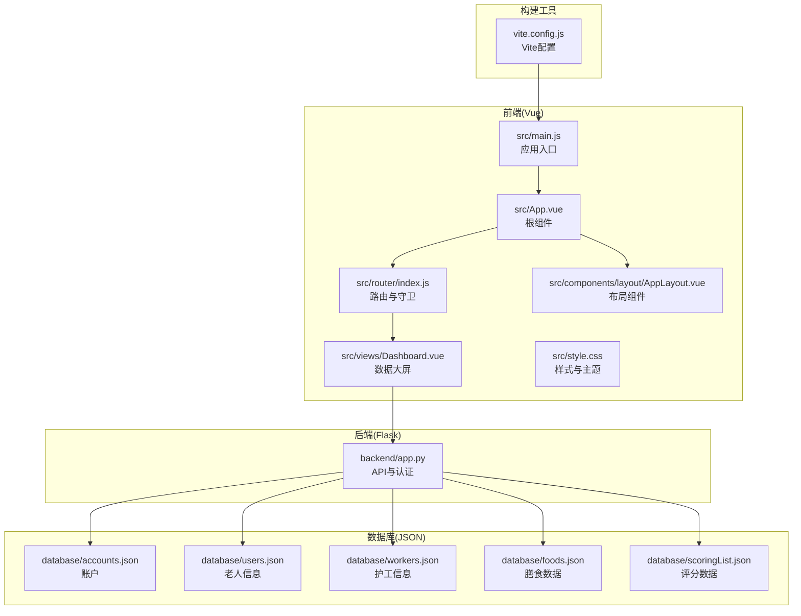
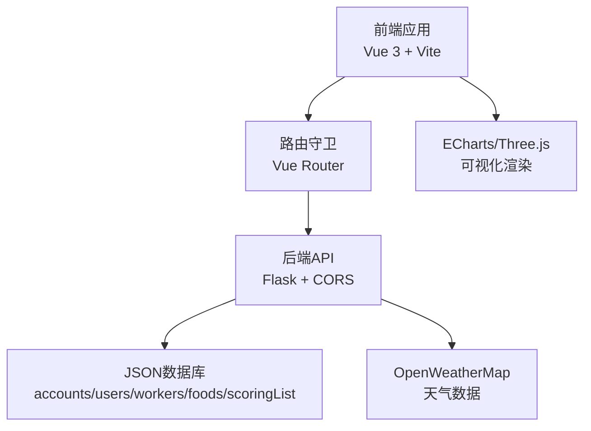
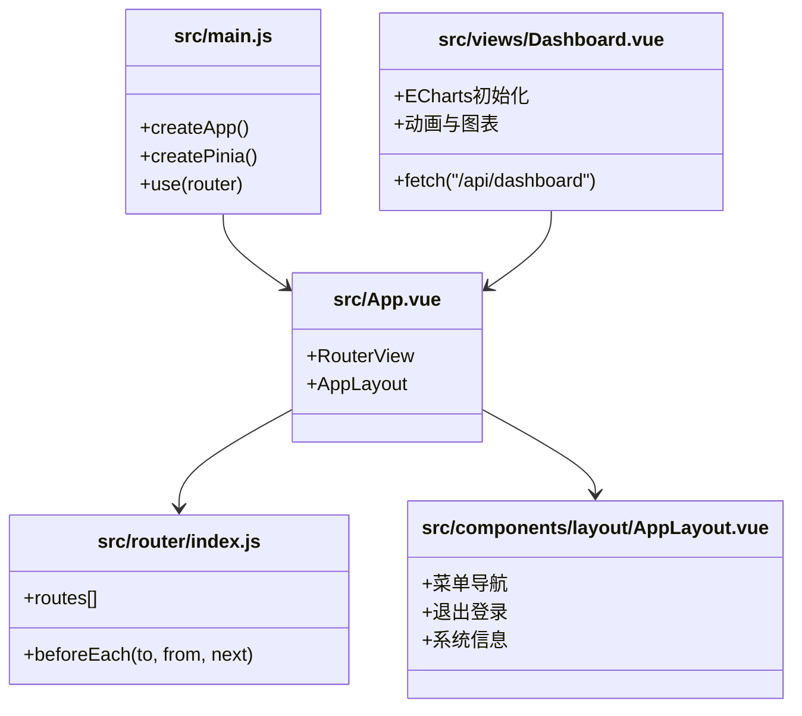
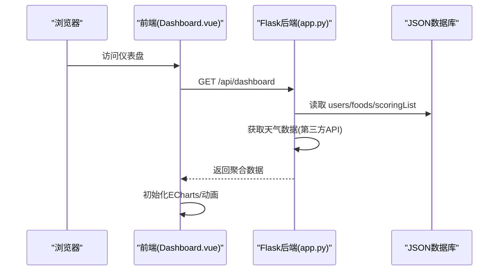
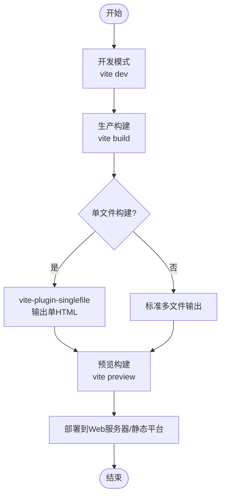
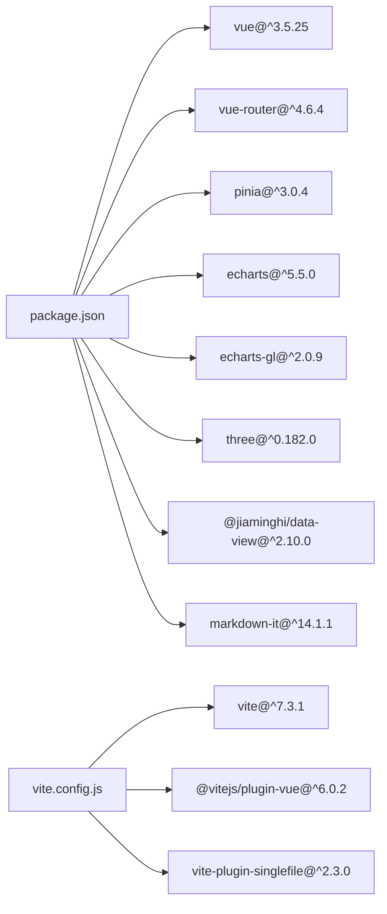

# 技术栈

<cite>
**本文引用的文件**
- [package.json](file://package.json)
- [vite.config.js](file://vite.config.js)
- [src/main.js](file://src/main.js)
- [src/router/index.js](file://src/router/index.js)
- [src/App.vue](file://src/App.vue)
- [src/views/Dashboard.vue](file://src/views/Dashboard.vue)
- [src/components/layout/AppLayout.vue](file://src/components/layout/AppLayout.vue)
- [backend/app.py](file://backend/app.py)
- [README.md](file://README.md)
- [src/style.css](file://src/style.css)
- [database/accounts.json](file://database/accounts.json)
</cite>

## 目录
1. [引言](#引言)
2. [项目结构](#项目结构)
3. [核心组件](#核心组件)
4. [架构总览](#架构总览)
5. [详细组件分析](#详细组件分析)
6. [依赖分析](#依赖分析)
7. [性能考虑](#性能考虑)
8. [故障排查指南](#故障排查指南)
9. [结论](#结论)
10. [附录](#附录)

## 引言
本技术栈文档围绕智慧康养养老院管理系统，系统性梳理前后端技术选型、版本与配置、集成方式与性能考量，并给出升级建议与最佳实践。项目采用前后端分离架构：前端基于 Vue 3.5.25、Vue Router 4.6.4、Pinia 3.0.4、ECharts 5.5.0、Three.js 0.182.0 与 Vite 7.3.1；后端基于 Flask 与 CORS 配置，提供 REST API 与认证机制。文档同时给出版本兼容性与升级建议，帮助团队在保证稳定性的同时持续演进。

## 项目结构
项目采用模块化组织，前端以 Vue 应用为核心，后端以 Flask 提供 API，数据库以 JSON 文件作为轻量持久化存储。整体结构清晰，便于开发与部署。

**图表来源**
- [src/main.js:1-11](file://src/main.js#L1-L11)
- [src/App.vue:1-24](file://src/App.vue#L1-L24)
- [src/router/index.js:1-61](file://src/router/index.js#L1-L61)
- [src/views/Dashboard.vue:1-210](file://src/views/Dashboard.vue#L1-L210)
- [src/components/layout/AppLayout.vue:1-167](file://src/components/layout/AppLayout.vue#L1-L167)
- [backend/app.py:1-330](file://backend/app.py#L1-L330)
- [vite.config.js:1-27](file://vite.config.js#L1-L27)

**章节来源**
- [README.md:42-62](file://README.md#L42-L62)
- [src/main.js:1-11](file://src/main.js#L1-L11)
- [src/router/index.js:1-61](file://src/router/index.js#L1-L61)
- [backend/app.py:1-330](file://backend/app.py#L1-L330)

## 核心组件
- 前端核心：Vue 3.5.25 提供响应式与 Composition API；Pinia 3.0.4 提供状态管理；Vue Router 4.6.4 提供路由与守卫；ECharts 5.5.0 与 Three.js 0.182.0 用于数据可视化与 3D 图形渲染；Vite 7.3.1 提供快速开发与构建体验。
- 后端核心：Flask 提供 REST API，集成 CORS 支持跨域；内置认证装饰器与令牌集合；对接 OpenWeatherMap 获取天气数据；提供用户、护工、膳食等数据接口。
- 构建工具：Vite 7.3.1 配合单文件打包插件，支持标准与单文件两种构建模式，便于本地预览与生产部署。

**章节来源**
- [package.json:11-26](file://package.json#L11-L26)
- [backend/app.py:1-330](file://backend/app.py#L1-L330)
- [vite.config.js:1-27](file://vite.config.js#L1-L27)

## 架构总览
系统采用前后端分离架构，前端通过 fetch 请求后端 API，后端通过 Flask 提供 REST 接口并启用 CORS。认证采用 Bearer Token 方案，路由守卫与后端装饰器共同保障访问安全。

**图表来源**
- [src/views/Dashboard.vue:173-204](file://src/views/Dashboard.vue#L173-L204)
- [src/router/index.js:42-59](file://src/router/index.js#L42-L59)
- [backend/app.py:11-11](file://backend/app.py#L11-L11)
- [backend/app.py:120-182](file://backend/app.py#L120-L182)

## 详细组件分析

### 前端技术栈与配置
- Vue 3.5.25：采用 Composition API，组件化开发，具备良好的性能与生态支持。
- Vue Router 4.6.4：使用 Hash History，配合路由守卫实现登录拦截与标题设置。
- Pinia 3.0.4：集中式状态管理，与 Vue 3 深度契合，易于维护。
- ECharts 5.5.0：用于温度趋势、行动能力分布等图表渲染，支持响应式与自适应。
- Three.js 0.182.0：用于 3D 场景渲染（如地图或模型），提升可视化表现力。
- Vite 7.3.1：开发体验优秀，热更新快；单文件插件支持将产物打包为单 HTML，便于本地直接打开。

**图表来源**
- [src/main.js:1-11](file://src/main.js#L1-L11)
- [src/router/index.js:1-61](file://src/router/index.js#L1-L61)
- [src/App.vue:1-24](file://src/App.vue#L1-L24)
- [src/views/Dashboard.vue:1-210](file://src/views/Dashboard.vue#L1-L210)
- [src/components/layout/AppLayout.vue:1-167](file://src/components/layout/AppLayout.vue#L1-L167)

**章节来源**
- [src/main.js:1-11](file://src/main.js#L1-L11)
- [src/router/index.js:1-61](file://src/router/index.js#L1-L61)
- [src/App.vue:1-24](file://src/App.vue#L1-L24)
- [src/views/Dashboard.vue:1-210](file://src/views/Dashboard.vue#L1-L210)
- [src/components/layout/AppLayout.vue:1-167](file://src/components/layout/AppLayout.vue#L1-L167)

### 后端技术栈与配置
- Flask：轻量 Web 框架，适合小型项目与快速迭代。
- CORS：全局启用，允许前端跨域访问，便于本地联调。
- 认证机制：基于 Authorization 头的 Bearer Token，后端维护有效 Token 集合，装饰器统一校验。
- 数据接口：
  - 登录注册：账户信息存于 accounts.json，密码采用 SHA-256 哈希。
  - 仪表盘：聚合天气、评分、用户、膳食数据。
  - 用户/护工：增删改查接口，带认证守卫。
  - 健康检查：返回服务状态。

**图表来源**
- [src/views/Dashboard.vue:173-204](file://src/views/Dashboard.vue#L173-L204)
- [backend/app.py:171-182](file://backend/app.py#L171-L182)
- [backend/app.py:65-117](file://backend/app.py#L65-L117)

**章节来源**
- [backend/app.py:1-330](file://backend/app.py#L1-L330)
- [database/accounts.json:1-14](file://database/accounts.json#L1-L14)

### 构建工具与部署
- Vite 7.3.1：开发模式热更新，生产模式 Rollup 打包；单文件插件将产物打包为单 HTML，便于本地直接打开。
- 构建输出：标准构建与单文件构建两种模式，分别适用于 Web 服务器部署与静态托管平台。

**图表来源**
- [vite.config.js:1-27](file://vite.config.js#L1-L27)
- [README.md:82-116](file://README.md#L82-L116)

**章节来源**
- [vite.config.js:1-27](file://vite.config.js#L1-L27)
- [README.md:82-116](file://README.md#L82-L116)

## 依赖分析
- 前端依赖：Vue 3.5.25、Vue Router 4.6.4、Pinia 3.0.4、ECharts 5.5.0、Three.js 0.182.0、@jiaminghi/data-view、markdown-it 等。
- 开发依赖：Vite 7.3.1、@vitejs/plugin-vue、vite-plugin-singlefile。
- 后端依赖：Flask、flask_cors、requests（第三方天气 API）。

**图表来源**
- [package.json:11-26](file://package.json#L11-L26)
- [vite.config.js:1-27](file://vite.config.js#L1-L27)

**章节来源**
- [package.json:11-26](file://package.json#L11-L26)
- [vite.config.js:1-27](file://vite.config.js#L1-L27)

## 性能考虑
- 前端性能
  - 使用 Composition API 与细粒度响应式，减少不必要的重渲染。
  - ECharts 图表在 mounted 后初始化，避免首屏阻塞；窗口 resize 事件中自动适配。
  - 动画采用 requestAnimationFrame 与缓动函数，保证流畅度。
- 构建性能
  - Vite 开发模式热更新快速；生产模式 Rollup 输出优化。
  - 单文件构建适合静态部署，减少请求数量。
- 后端性能
  - JSON 文件读写简单高效；第三方天气 API 有超时保护与降级策略。
  - 路由守卫与认证装饰器减少无效请求。

[本节为通用性能讨论，无需特定文件引用]

## 故障排查指南
- 跨域问题
  - 确认后端已启用 CORS；前端请求地址与端口一致。
  - 若使用单文件部署，需通过 HTTP 服务器提供，避免浏览器同源限制。
- 认证失败
  - 检查 Authorization 头是否为 Bearer Token；确认 Token 是否在后端集合中。
  - 登录成功后，前端应将 token 写入 localStorage，路由守卫会据此放行。
- 图表不显示
  - 确认 DOM 已渲染后再初始化 ECharts；监听 resize 事件以适配容器尺寸。
- 数据加载失败
  - 检查后端 /api/dashboard 接口是否可达；查看网络面板错误信息。
- 构建异常
  - 单文件构建时注意资源内联策略；如出现资源过大，可调整内联模式或回退标准构建。

**章节来源**
- [backend/app.py:11-25](file://backend/app.py#L11-L25)
- [src/router/index.js:42-59](file://src/router/index.js#L42-L59)
- [src/views/Dashboard.vue:173-204](file://src/views/Dashboard.vue#L173-L204)
- [vite.config.js:8-12](file://vite.config.js#L8-L12)

## 结论
本项目在技术选型上兼顾性能、易用性与社区支持：前端以 Vue 3 生态为核心，搭配 ECharts 与 Three.js 实现丰富的可视化；后端以 Flask + CORS 提供简洁可靠的 API；构建工具 Vite 7.3.1 提升开发效率与部署灵活性。建议在后续版本中关注依赖的安全更新与性能优化，逐步引入更完善的测试与 CI 流程，以保障系统的长期稳定演进。

[本节为总结性内容，无需特定文件引用]

## 附录

### 版本兼容性与升级建议
- Vue 3.5.25
  - 与 Vue Router 4.6.x、Pinia 3.x 兼容良好；建议保持同步升级。
  - 升级前先运行测试，确保 Composition API 使用无破坏性变更。
- Vue Router 4.6.4
  - 与 Vue 3.5.x 兼容；升级时关注路由守卫与命名路由的兼容性。
- Pinia 3.0.4
  - 与 Vue 3.5.x 兼容；升级时注意 store 定义与模块化导入的变化。
- ECharts 5.5.0
  - 与 Vue 3 兼容；升级时关注图表配置项的废弃与迁移。
- Three.js 0.182.0
  - 与现代浏览器兼容；升级时关注 WebGL 相关 API 的变更。
- Vite 7.3.1
  - 与 Vue 3 生态兼容；升级时关注插件生态与 Rollup 配置变化。
- Flask
  - 与 flask_cors 兼容；升级时关注跨域策略与中间件变更。

[本节为通用升级建议，无需特定文件引用]