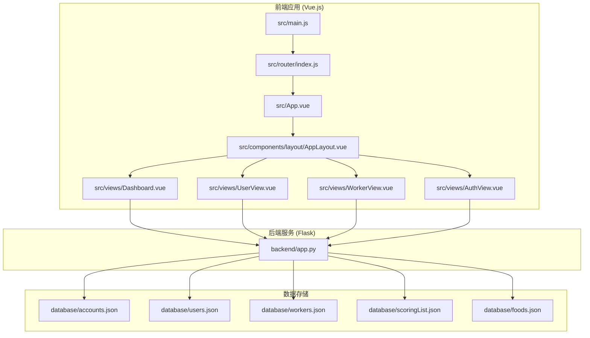
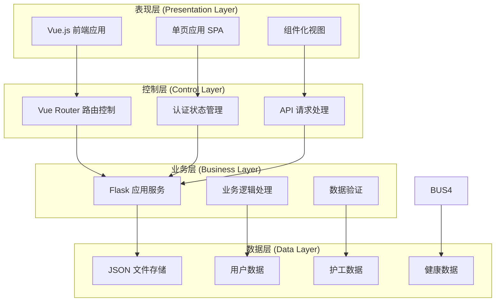
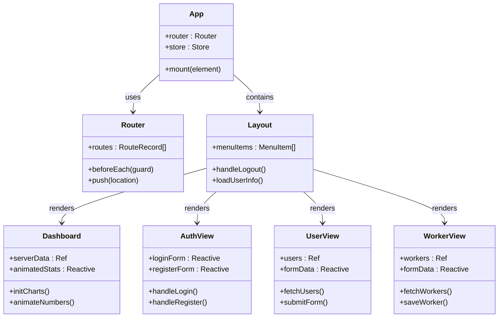
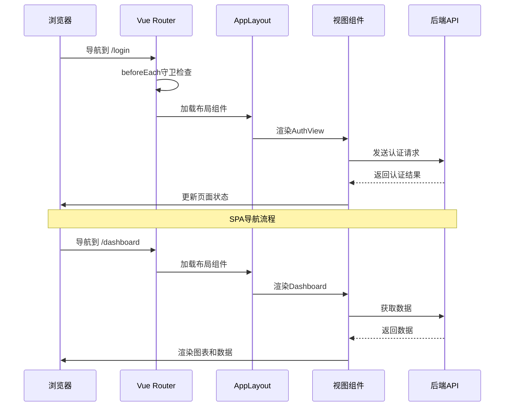
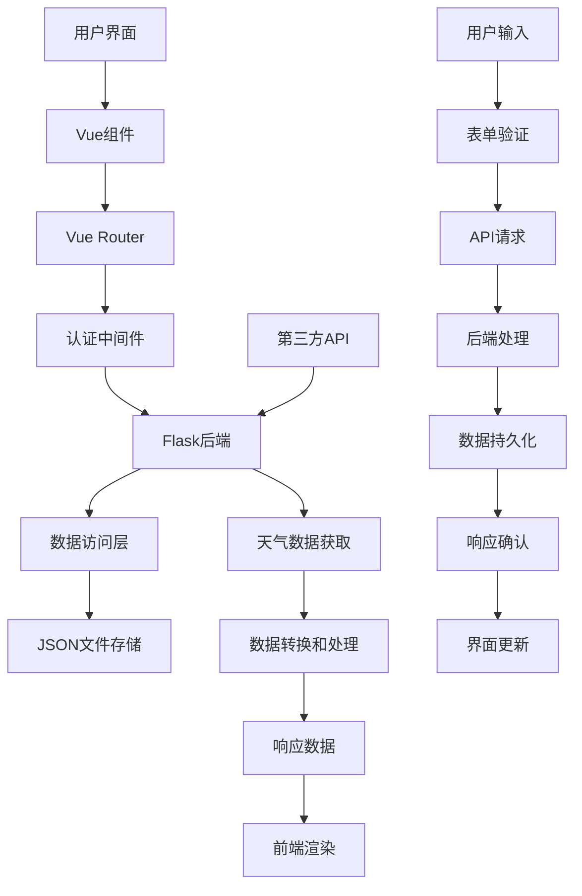
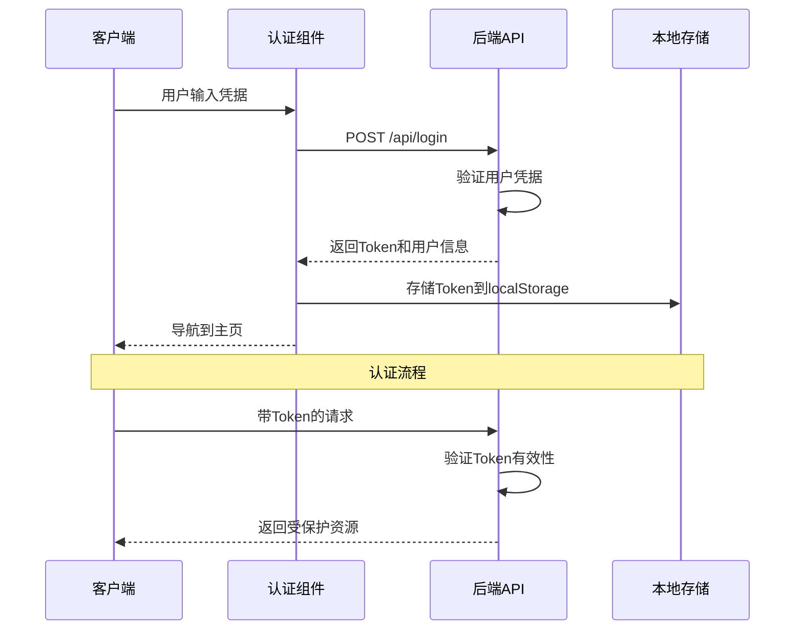
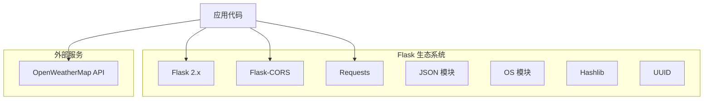

# 架构设计

<cite>
**本文档引用的文件**
- [backend/app.py](file://backend/app.py)
- [src/main.js](file://src/main.js)
- [src/router/index.js](file://src/router/index.js)
- [src/App.vue](file://src/App.vue)
- [src/components/layout/AppLayout.vue](file://src/components/layout/AppLayout.vue)
- [src/views/Dashboard.vue](file://src/views/Dashboard.vue)
- [src/views/AuthView.vue](file://src/views/AuthView.vue)
- [src/views/UserView.vue](file://src/views/UserView.vue)
- [src/views/WorkerView.vue](file://src/views/WorkerView.vue)
- [package.json](file://package.json)
- [vite.config.js](file://vite.config.js)
- [database/accounts.json](file://database/accounts.json)
- [database/users.json](file://database/users.json)
- [database/workers.json](file://database/workers.json)
</cite>

## 目录
1. [引言](#引言)
2. [项目结构](#项目结构)
3. [核心组件](#核心组件)
4. [架构概览](#架构概览)
5. [详细组件分析](#详细组件分析)
6. [依赖分析](#依赖分析)
7. [性能考虑](#性能考虑)
8. [故障排除指南](#故障排除指南)
9. [结论](#结论)

## 引言

智慧康养养老院管理系统是一个基于前后端分离架构的现代化Web应用。该项目采用Vue.js作为前端框架，Flask作为后端服务，实现了完整的MVC架构模式。系统旨在为养老院提供全面的信息化管理解决方案，包括老人信息管理、护工信息管理、健康数据监控等功能模块。

该系统的核心设计理念是通过前后端分离实现高内聚低耦合的架构，前端负责用户交互和数据可视化，后端专注于业务逻辑处理和数据持久化。通过RESTful API实现前后端通信，确保系统的可扩展性和可维护性。

## 项目结构

项目采用典型的前后端分离项目结构，前端使用Vue.js 3.x + Vite构建工具，后端使用Python Flask框架。



**图表来源**
- [src/main.js:1-11](file://src/main.js#L1-L11)
- [src/router/index.js:1-61](file://src/router/index.js#L1-L61)
- [backend/app.py:1-330](file://backend/app.py#L1-L330)

**章节来源**
- [src/main.js:1-11](file://src/main.js#L1-L11)
- [src/router/index.js:1-61](file://src/router/index.js#L1-L61)
- [backend/app.py:1-330](file://backend/app.py#L1-L330)

## 核心组件

### 前端核心组件

前端应用基于Vue.js 3.x构建，采用Composition API和单文件组件(SFC)开发模式。主要组件包括：

- **应用入口**: main.js负责应用初始化和插件注册
- **路由系统**: Vue Router实现客户端路由和页面导航
- **布局组件**: AppLayout提供统一的页面布局和导航
- **视图组件**: 各功能页面的独立组件实现
- **状态管理**: Pinia实现全局状态管理

### 后端核心组件

后端服务基于Flask框架，采用模块化设计：

- **应用实例**: Flask应用实例配置和CORS支持
- **认证中间件**: JWT令牌验证和权限控制
- **数据访问层**: JSON文件作为数据存储
- **API路由**: RESTful接口定义和业务逻辑处理

**章节来源**
- [src/main.js:1-11](file://src/main.js#L1-L11)
- [backend/app.py:1-330](file://backend/app.py#L1-L330)

## 架构概览

系统采用经典的三层架构设计，实现了清晰的职责分离：



**图表来源**
- [src/App.vue:1-24](file://src/App.vue#L1-L24)
- [src/router/index.js:1-61](file://src/router/index.js#L1-L61)
- [backend/app.py:1-330](file://backend/app.py#L1-L330)

### MVC 架构模式应用

系统严格遵循MVC架构模式：

**视图层 (View)**: Vue.js组件负责用户界面展示
- Dashboard.vue: 数据大屏展示
- UserView.vue: 老人信息管理
- WorkerView.vue: 护工信息管理
- AuthView.vue: 用户认证界面

**控制器层 (Controller)**: Vue Router和组件逻辑处理用户交互
- 路由控制: 客户端路由导航
- 认证控制: Token验证和权限管理
- 数据控制: API请求和响应处理

**模型层 (Model)**: Flask后端服务和数据存储
- 数据模型: JSON文件结构
- 业务模型: 用户、护工、健康数据实体
- 认证模型: 用户凭据和权限验证

**章节来源**
- [src/views/Dashboard.vue:1-800](file://src/views/Dashboard.vue#L1-L800)
- [src/views/UserView.vue:1-520](file://src/views/UserView.vue#L1-L520)
- [src/views/WorkerView.vue:1-800](file://src/views/WorkerView.vue#L1-L800)
- [backend/app.py:1-330](file://backend/app.py#L1-L330)

## 详细组件分析

### 前端应用架构



**图表来源**
- [src/App.vue:1-24](file://src/App.vue#L1-L24)
- [src/router/index.js:1-61](file://src/router/index.js#L1-L61)
- [src/components/layout/AppLayout.vue:1-800](file://src/components/layout/AppLayout.vue#L1-L800)
- [src/views/Dashboard.vue:1-800](file://src/views/Dashboard.vue#L1-L800)
- [src/views/AuthView.vue:1-380](file://src/views/AuthView.vue#L1-L380)
- [src/views/UserView.vue:1-520](file://src/views/UserView.vue#L1-L520)
- [src/views/WorkerView.vue:1-800](file://src/views/WorkerView.vue#L1-L800)

### 单页应用(SPA)架构

系统采用Vue Router实现客户端路由，提供流畅的用户体验：



**图表来源**
- [src/router/index.js:42-59](file://src/router/index.js#L42-L59)
- [src/App.vue:12-20](file://src/App.vue#L12-L20)
- [src/views/Dashboard.vue:173-204](file://src/views/Dashboard.vue#L173-L204)

### 数据流向设计

系统的数据流遵循清晰的层次结构：



**图表来源**
- [src/views/AuthView.vue:23-46](file://src/views/AuthView.vue#L23-L46)
- [src/views/UserView.vue:165-190](file://src/views/UserView.vue#L165-L190)
- [src/views/WorkerView.vue:276-323](file://src/views/WorkerView.vue#L276-L323)
- [backend/app.py:65-117](file://backend/app.py#L65-L117)

**章节来源**
- [src/router/index.js:42-59](file://src/router/index.js#L42-L59)
- [src/views/Dashboard.vue:173-204](file://src/views/Dashboard.vue#L173-L204)
- [backend/app.py:120-182](file://backend/app.py#L120-L182)

### 认证与授权机制

系统实现了基于Token的认证机制：



**图表来源**
- [src/views/AuthView.vue:23-46](file://src/views/AuthView.vue#L23-L46)
- [src/router/index.js:42-59](file://src/router/index.js#L42-L59)
- [backend/app.py:148-169](file://backend/app.py#L148-L169)

**章节来源**
- [src/views/AuthView.vue:1-380](file://src/views/AuthView.vue#L1-L380)
- [backend/app.py:15-25](file://backend/app.py#L15-L25)

## 依赖分析

### 前端依赖关系

```mermaid
graph TB
subgraph "Vue.js 生态系统"
VUE[Vue 3.5.25]
ROUTER[Vue Router 4.6.4]
PINIA[Pinia 3.0.4]
ECHARTS[ECharts 5.5.0]
end
subgraph "构建工具"
VITE[Vite 7.3.1]
PLUGINS[Vite 插件]
end
subgraph "第三方库"
CORE[@vueuse/core]
THREE[Three.js]
MD[markdown-it]
DV[@jiaminghi/data-view]
end
APP[应用代码] --> VUE
APP --> ROUTER
APP --> PINIA
APP --> ECHARTS
VITE --> PLUGINS
VITE --> APP
```

**图表来源**
- [package.json:11-27](file://package.json#L11-L27)
- [vite.config.js:1-27](file://vite.config.js#L1-L27)

### 后端依赖关系



**图表来源**
- [backend/app.py:1-8](file://backend/app.py#L1-L8)

**章节来源**
- [package.json:1-28](file://package.json#L1-L28)
- [backend/app.py:1-330](file://backend/app.py#L1-L330)

## 性能考虑

### 前端性能优化

1. **懒加载**: 路由级别的组件懒加载减少初始包体积
2. **响应式数据**: Vue 3的响应式系统提供高效的UI更新
3. **图表优化**: ECharts按需初始化，避免不必要的渲染
4. **缓存策略**: localStorage存储认证信息，减少重复登录

### 后端性能优化

1. **文件系统**: JSON文件存储适合小规模数据，便于部署
2. **API设计**: RESTful接口设计简洁高效
3. **第三方集成**: 天气API调用添加超时和降级机制
4. **内存管理**: 基于进程的Flask应用，适合单机部署

## 故障排除指南

### 常见问题诊断

1. **认证失败**
   - 检查localStorage中的user_token是否存在
   - 验证后端API是否正常运行
   - 确认CORS配置正确

2. **数据加载错误**
   - 检查后端API端点是否可达
   - 验证JSON文件格式正确性
   - 确认文件权限设置

3. **路由导航问题**
   - 检查Vue Router配置
   - 验证路由守卫逻辑
   - 确认组件导入路径

**章节来源**
- [src/router/index.js:42-59](file://src/router/index.js#L42-L59)
- [src/views/AuthView.vue:23-46](file://src/views/AuthView.vue#L23-L46)
- [backend/app.py:148-169](file://backend/app.py#L148-L169)

## 结论

智慧康养养老院管理系统成功实现了前后端分离的现代Web应用架构。通过Vue.js和Flask的组合，系统具备了以下优势：

1. **清晰的架构分离**: 前后端职责明确，便于维护和扩展
2. **良好的用户体验**: SPA架构提供流畅的交互体验
3. **模块化设计**: 组件化的前端架构和模块化的后端服务
4. **可扩展性**: 基于RESTful API的设计便于功能扩展
5. **易部署性**: 前端单文件打包，后端轻量级部署

该系统为养老院管理提供了完整的数字化解决方案，通过可视化的数据展示和便捷的操作界面，有效提升了管理效率和服务质量。未来可以在现有基础上进一步增强数据分析能力、移动端适配和云端部署能力。