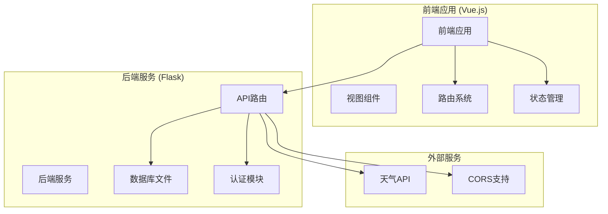
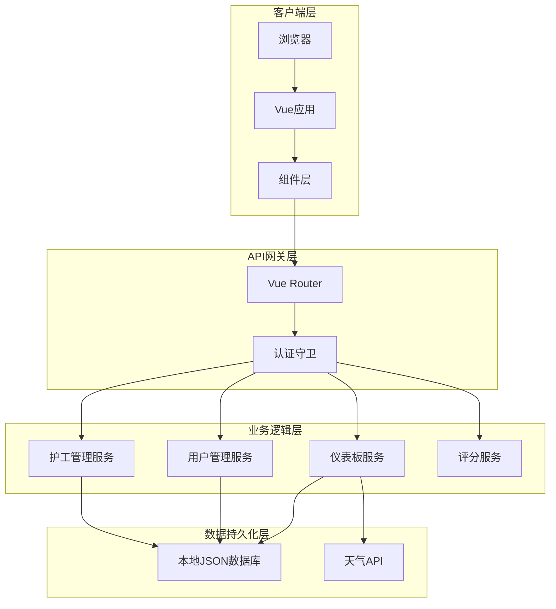
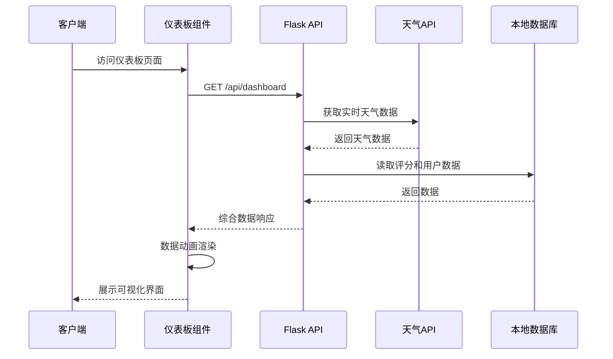
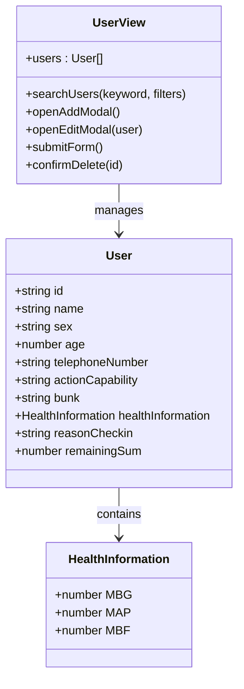
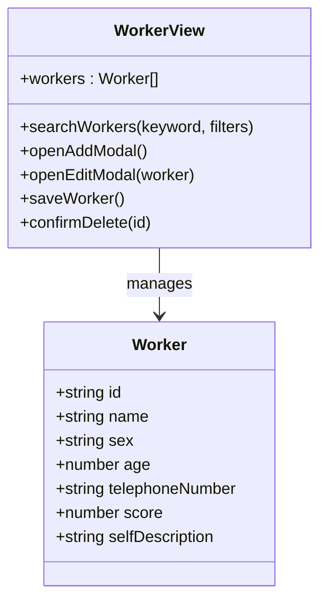
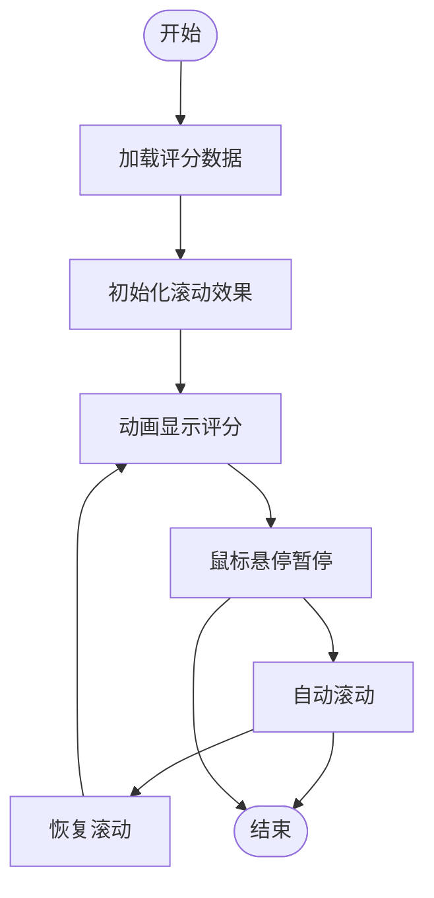
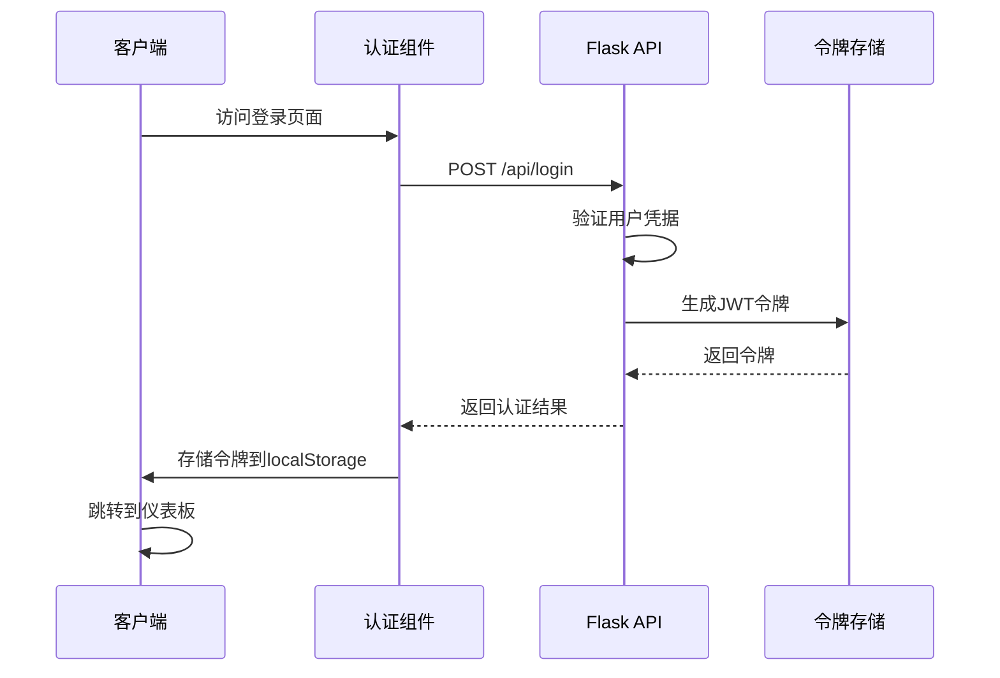
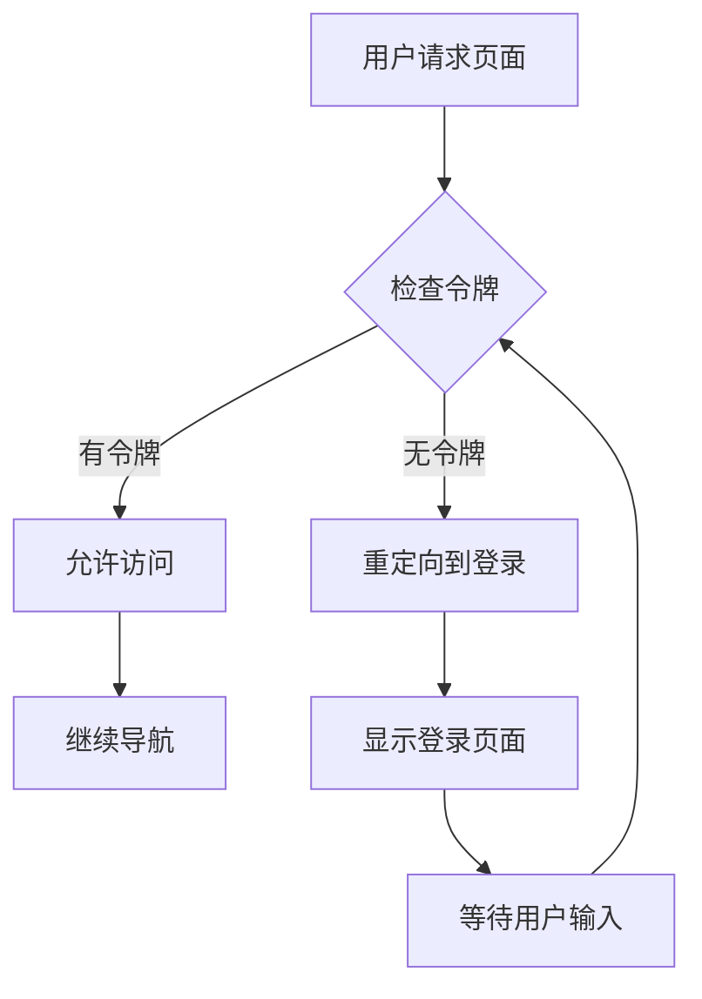
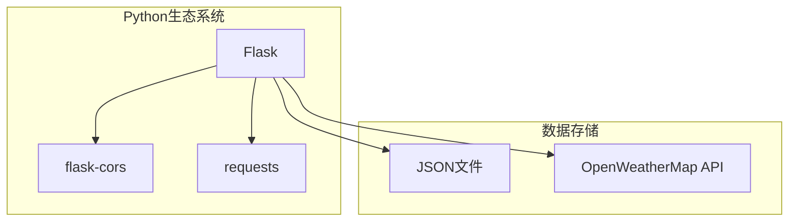

# 核心功能

<cite>
**本文档引用的文件**
- [backend/app.py](file://backend/app.py)
- [src/main.js](file://src/main.js)
- [src/router/index.js](file://src/router/index.js)
- [src/App.vue](file://src/App.vue)
- [src/views/Dashboard.vue](file://src/views/Dashboard.vue)
- [src/views/AuthView.vue](file://src/views/AuthView.vue)
- [src/views/UserView.vue](file://src/views/UserView.vue)
- [src/views/WorkerView.vue](file://src/views/WorkerView.vue)
- [database/accounts.json](file://database/accounts.json)
- [database/users.json](file://database/users.json)
- [database/workers.json](file://database/workers.json)
- [database/scoringList.json](file://database/scoringList.json)
- [database/foods.json](file://database/foods.json)
- [package.json](file://package.json)
</cite>

## 目录
1. [简介](#简介)
2. [项目结构](#项目结构)
3. [核心组件](#核心组件)
4. [架构概览](#架构概览)
5. [详细组件分析](#详细组件分析)
6. [依赖分析](#依赖分析)
7. [性能考虑](#性能考虑)
8. [故障排除指南](#故障排除指南)
9. [结论](#结论)

## 简介

智慧康养养老院管理系统是一个基于Vue.js前端框架和Flask后端的现代化养老院管理平台。该系统旨在为养老院提供全方位的数字化管理解决方案，包括环境数据监控、人员信息管理、护工评分系统和用户认证管理等功能模块。

系统采用前后端分离架构，前端使用Vue 3 + Vite构建，后端使用Python Flask提供RESTful API服务。通过集成第三方天气API，系统能够实时获取和展示环境数据，为养老院的日常运营提供数据支持。

## 项目结构

该项目采用典型的前后端分离架构，具有清晰的模块化组织：



**图表来源**
- [src/main.js:1-11](file://src/main.js#L1-L11)
- [backend/app.py:10-11](file://backend/app.py#L10-L11)

**章节来源**
- [src/main.js:1-11](file://src/main.js#L1-L11)
- [backend/app.py:10-11](file://backend/app.py#L10-L11)
- [package.json:11-26](file://package.json#L11-L26)

## 核心组件

系统包含四大核心功能模块，每个模块都有其独特的职责和业务价值：

### 1. 实时数据监控模块
负责环境数据的采集、处理和可视化展示，包括温度、湿度、空气质量、能见度、大气压强等指标。

### 2. 人员信息管理模块
管理养老院内老人和护工的基本信息、健康数据和生活信息，提供完整的人员档案管理功能。

### 3. 评分系统模块
对护工的工作表现进行量化评估和实时展示，支持星级评分和详细评价。

### 4. 用户认证系统
提供基于JWT的安全登录机制，确保系统的访问安全性和用户身份验证。

**章节来源**
- [src/views/Dashboard.vue:1-800](file://src/views/Dashboard.vue#L1-L800)
- [src/views/UserView.vue:1-520](file://src/views/UserView.vue#L1-L520)
- [src/views/WorkerView.vue:1-800](file://src/views/WorkerView.vue#L1-L800)
- [backend/app.py:148-170](file://backend/app.py#L148-L170)

## 架构概览

系统采用现代Web应用的标准架构模式：



**图表来源**
- [src/router/index.js:42-59](file://src/router/index.js#L42-L59)
- [backend/app.py:171-182](file://backend/app.py#L171-L182)

**章节来源**
- [src/router/index.js:42-59](file://src/router/index.js#L42-L59)
- [backend/app.py:171-182](file://backend/app.py#L171-L182)

## 详细组件分析

### 实时数据监控模块

#### 功能概述
实时数据监控模块负责收集和展示养老院环境数据，包括温度、湿度、空气质量、能见度、大气压强等关键指标。

#### 核心实现


**图表来源**
- [src/views/Dashboard.vue:173-204](file://src/views/Dashboard.vue#L173-L204)
- [backend/app.py:171-182](file://backend/app.py#L171-L182)

#### 数据流分析
系统通过以下流程实现数据监控：
1. 前端组件发起数据请求
2. 后端API整合多源数据
3. 第三方天气API提供实时环境数据
4. 本地数据库提供静态业务数据
5. 前端组件进行数据可视化

**章节来源**
- [src/views/Dashboard.vue:173-204](file://src/views/Dashboard.vue#L173-L204)
- [backend/app.py:65-117](file://backend/app.py#L65-L117)

### 人员信息管理模块

#### 老人信息管理
老人信息管理模块提供完整的老人档案管理功能：



**图表来源**
- [src/views/UserView.vue:18-32](file://src/views/UserView.vue#L18-L32)
- [src/views/UserView.vue:45-85](file://src/views/UserView.vue#L45-L85)

#### 护工信息管理
护工信息管理模块专注于护工的个人信息和工作表现：



**图表来源**
- [src/views/WorkerView.vue:22-42](file://src/views/WorkerView.vue#L22-L42)
- [src/views/WorkerView.vue:108-156](file://src/views/WorkerView.vue#L108-L156)

**章节来源**
- [src/views/UserView.vue:18-32](file://src/views/UserView.vue#L18-L32)
- [src/views/WorkerView.vue:22-42](file://src/views/WorkerView.vue#L22-L42)

### 评分系统模块

#### 护工评分展示
评分系统模块提供实时的护工工作表现展示：



**图表来源**
- [src/views/Dashboard.vue:276-293](file://src/views/Dashboard.vue#L276-L293)

#### 数据结构设计
评分系统使用简洁的数据结构来表示护工表现：

| 字段 | 类型 | 描述 |
|------|------|------|
| flag | string | 评分标识符号 |
| text | string | 护工姓名 |
| score | string | 评分描述 |

**章节来源**
- [src/views/Dashboard.vue:276-293](file://src/views/Dashboard.vue#L276-L293)
- [database/scoringList.json:1-7](file://database/scoringList.json#L1-L7)

### 用户认证系统

#### JWT认证流程
用户认证系统基于JWT令牌实现安全的身份验证：



**图表来源**
- [src/views/AuthView.vue:23-46](file://src/views/AuthView.vue#L23-L46)
- [backend/app.py:148-170](file://backend/app.py#L148-L170)

#### 认证守卫机制
路由系统实现了全局认证守卫，确保只有认证用户才能访问受保护的页面：



**图表来源**
- [src/router/index.js:42-59](file://src/router/index.js#L42-L59)

**章节来源**
- [src/views/AuthView.vue:23-46](file://src/views/AuthView.vue#L23-L46)
- [src/router/index.js:42-59](file://src/router/index.js#L42-L59)

## 依赖分析

### 前端依赖关系

```mermaid
graph TB
subgraph "Vue生态系统"
Vue[Vue 3.5.25]
Router[Vue Router 4.6.4]
Pinia[Pinia 3.0.4]
end
subgraph "可视化库"
ECharts[ECharts 5.5.0]
GL[echarts-gl 2.0.9]
end
subgraph "工具库"
VueUse[@vueuse/core 14.2.1]
ThreeJS[Three.js 0.182.0]
end
Vue --> Router
Vue --> Pinia
Vue --> ECharts
ECharts --> GL
Vue --> VueUse
Vue --> ThreeJS
```

**图表来源**
- [package.json:11-26](file://package.json#L11-L26)

### 后端依赖关系



**图表来源**
- [backend/app.py:1-8](file://backend/app.py#L1-L8)

**章节来源**
- [package.json:11-26](file://package.json#L11-L26)
- [backend/app.py:1-8](file://backend/app.py#L1-L8)

## 性能考虑

### 前端性能优化
- **懒加载组件**：使用动态导入实现按需加载
- **响应式数据**：利用Vue 3的响应式系统优化渲染
- **图表优化**：ECharts按需初始化，避免不必要的计算
- **内存管理**：组件卸载时清理定时器和事件监听器

### 后端性能优化
- **缓存策略**：本地JSON文件读写优化
- **API设计**：统一的错误处理和状态码
- **CORS配置**：跨域资源共享优化
- **第三方API**：超时控制和降级策略

## 故障排除指南

### 常见问题诊断

#### 认证相关问题
- **令牌失效**：检查localStorage中的user_token是否过期
- **登录失败**：验证用户名和密码格式
- **权限不足**：确认用户角色和访问权限

#### 数据加载问题
- **API连接失败**：检查后端服务是否正常运行
- **数据格式错误**：验证JSON数据结构完整性
- **第三方API限制**：检查OpenWeatherMap API配额

#### 前端渲染问题
- **组件未更新**：检查响应式数据绑定
- **图表渲染异常**：确认DOM元素存在且尺寸正确
- **路由跳转失败**：验证认证守卫逻辑

**章节来源**
- [src/views/AuthView.vue:42-46](file://src/views/AuthView.vue#L42-L46)
- [src/views/Dashboard.vue:201-203](file://src/views/Dashboard.vue#L201-L203)

## 结论

智慧康养养老院管理系统通过四个核心功能模块的协同工作，为养老院提供了完整的数字化管理解决方案。系统采用现代化的技术栈，具有良好的可扩展性和维护性。

### 主要优势
1. **模块化设计**：四大功能模块职责明确，便于独立开发和测试
2. **实时数据**：集成第三方天气API，提供准确的环境数据
3. **用户友好**：直观的界面设计和流畅的用户体验
4. **安全可靠**：基于JWT的认证机制确保系统安全性

### 业务价值
- **提升管理效率**：自动化数据收集和展示减少人工工作量
- **改善服务质量**：实时监控环境数据，及时调整护理方案
- **增强透明度**：公开的评分系统促进服务质量提升
- **降低运营成本**：数字化管理减少纸质文档和人工统计成本

该系统为智慧康养行业提供了一个可扩展的基础平台，可以根据具体需求进一步定制和扩展功能。