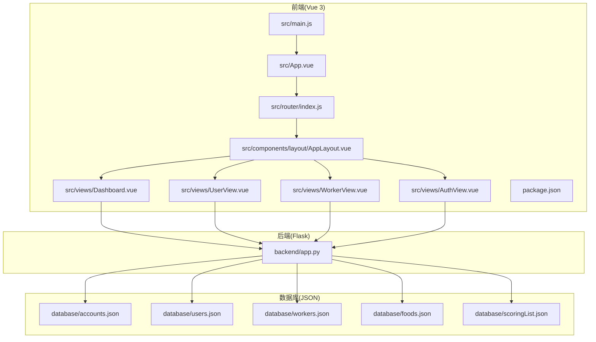
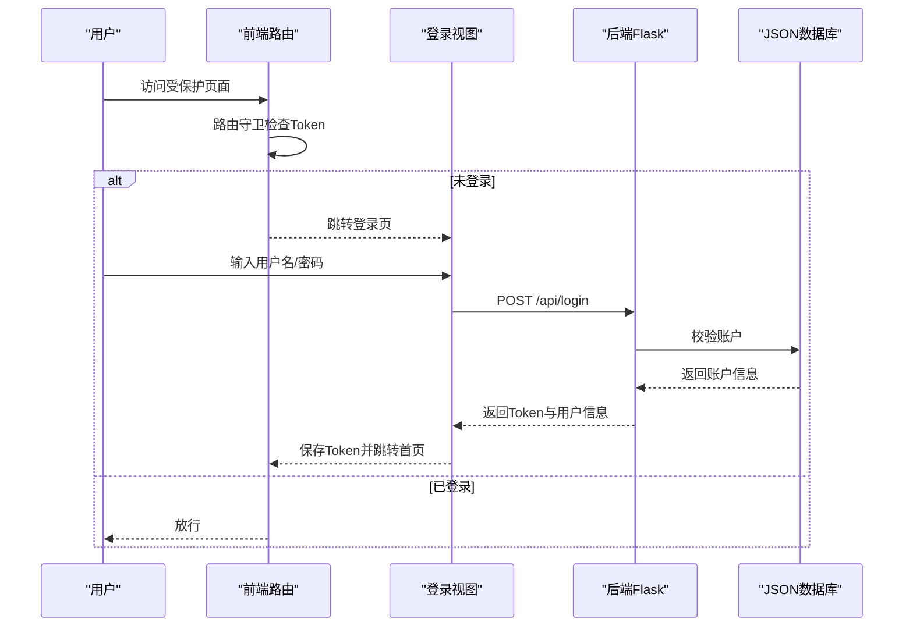
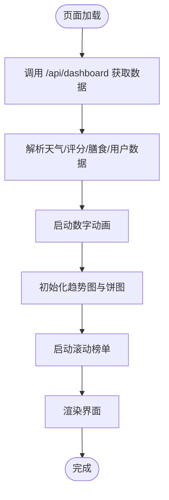
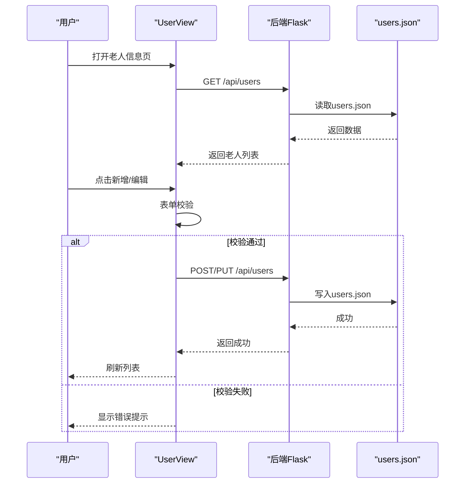
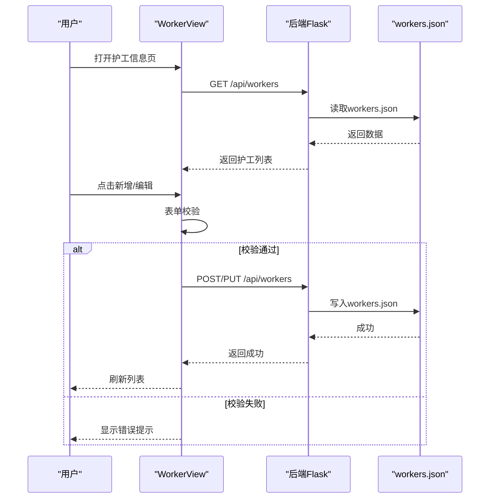
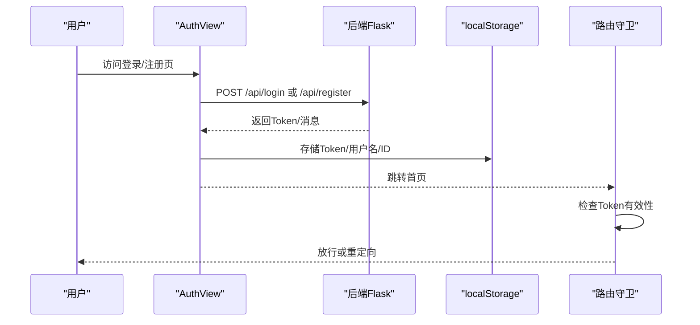
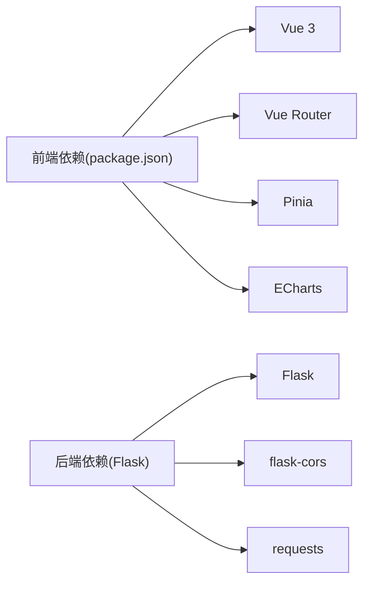

# 项目介绍

<cite>
**本文档引用的文件**
- [README.md](file://README.md)
- [backend/app.py](file://backend/app.py)
- [src/main.js](file://src/main.js)
- [src/App.vue](file://src/App.vue)
- [src/router/index.js](file://src/router/index.js)
- [src/components/layout/AppLayout.vue](file://src/components/layout/AppLayout.vue)
- [src/views/AuthView.vue](file://src/views/AuthView.vue)
- [src/views/Dashboard.vue](file://src/views/Dashboard.vue)
- [src/views/UserView.vue](file://src/views/UserView.vue)
- [src/views/WorkerView.vue](file://src/views/WorkerView.vue)
- [database/accounts.json](file://database/accounts.json)
- [database/users.json](file://database/users.json)
- [database/workers.json](file://database/workers.json)
- [database/foods.json](file://database/foods.json)
- [database/scoringList.json](file://database/scoringList.json)
- [package.json](file://package.json)
</cite>

## 目录
1. [引言](#引言)
2. [项目结构](#项目结构)
3. [核心组件](#核心组件)
4. [架构总览](#架构总览)
5. [详细组件分析](#详细组件分析)
6. [依赖分析](#依赖分析)
7. [性能考虑](#性能考虑)
8. [故障排除指南](#故障排除指南)
9. [结论](#结论)
10. [附录](#附录)

## 引言
本项目是面向智慧康养养老院的管理系统，旨在通过可视化数据大屏、实时天气监控、老人与护工信息管理、护工评分展示等功能，帮助养老院实现高效运营与精细化服务。系统采用前后端分离架构：后端基于Flask提供REST API，前端基于Vue 3 + Vite构建，使用ECharts进行数据可视化，整体具备良好的扩展性与可维护性。

系统的核心业务目标包括：
- 实时数据监控：对接第三方天气API，动态展示温度、湿度、空气质量、能见度等指标，支撑环境健康管理。
- 人员信息管理：提供老人与护工信息的增删改查、筛选与详情查看，支持健康指标（如血糖、血压、血脂）的可视化呈现。
- 护工评分展示：通过滚动榜单展示护工服务质量评分，辅助管理决策与激励机制。
- 安全与权限：基于Token的身份认证与路由守卫，保障系统访问安全。

## 项目结构
项目采用模块化组织方式，前后端分离，数据库采用JSON文件作为轻量级数据仓库，便于开发与演示。

**图表来源**
- [src/main.js:1-11](file://src/main.js#L1-L11)
- [src/App.vue:1-24](file://src/App.vue#L1-L24)
- [src/router/index.js:1-61](file://src/router/index.js#L1-L61)
- [src/components/layout/AppLayout.vue:1-1094](file://src/components/layout/AppLayout.vue#L1-L1094)
- [src/views/AuthView.vue:1-380](file://src/views/AuthView.vue#L1-L380)
- [src/views/Dashboard.vue:1-967](file://src/views/Dashboard.vue#L1-L967)
- [src/views/UserView.vue:1-520](file://src/views/UserView.vue#L1-L520)
- [src/views/WorkerView.vue:1-1384](file://src/views/WorkerView.vue#L1-L1384)
- [backend/app.py:1-330](file://backend/app.py#L1-L330)
- [database/accounts.json:1-14](file://database/accounts.json#L1-L14)
- [database/users.json:1-582](file://database/users.json#L1-L582)
- [database/workers.json:1-442](file://database/workers.json#L1-L442)
- [database/foods.json:1-38](file://database/foods.json#L1-L38)
- [database/scoringList.json:1-7](file://database/scoringList.json#L1-L7)

**章节来源**
- [README.md:42-62](file://README.md#L42-L62)
- [package.json:1-28](file://package.json#L1-L28)

## 核心组件
- 身份认证与路由守卫
  - 前端通过路由守卫拦截未登录访问，自动跳转登录页；登录成功后将Token存入localStorage，后续请求携带Authorization头。
  - 后端提供注册、登录接口，登录成功返回Token并记录有效Token集合；部分API（用户与护工相关）启用鉴权装饰器。
- 数据大屏(Dashboard)
  - 聚合天气、护工评分、膳食信息与老人行动能力分布，使用ECharts渲染趋势图与饼图，支持数字动画与响应式布局。
- 老人信息(UserView)
  - 支持按性别、文化程度、婚姻状况、行动能力等多维筛选，提供新增、编辑、删除与详情查看，表单包含健康指标输入。
- 护工信息(WorkerView)
  - 支持按性别、文化程度、婚姻状况、政治面貌等筛选，提供新增、编辑、删除与详情查看，支持评分输入与校验。
- 布局与导航(AppLayout)
  - 提供左侧导航菜单、移动端适配、当前登录用户信息展示与退出登录功能。

**章节来源**
- [src/router/index.js:42-59](file://src/router/index.js#L42-L59)
- [src/views/AuthView.vue:22-69](file://src/views/AuthView.vue#L22-L69)
- [backend/app.py:15-25](file://backend/app.py#L15-L25)
- [backend/app.py:120-170](file://backend/app.py#L120-L170)
- [src/views/Dashboard.vue:1-210](file://src/views/Dashboard.vue#L1-L210)
- [src/views/UserView.vue:34-43](file://src/views/UserView.vue#L34-L43)
- [src/views/WorkerView.vue:97-106](file://src/views/WorkerView.vue#L97-L106)
- [src/components/layout/AppLayout.vue:75-113](file://src/components/layout/AppLayout.vue#L75-L113)

## 架构总览
系统采用前后端分离架构，前端负责UI与交互，后端提供REST API与数据持久化（JSON文件）。认证采用Bearer Token方案，路由守卫与后端装饰器双重保障。

**图表来源**
- [src/router/index.js:42-59](file://src/router/index.js#L42-L59)
- [src/views/AuthView.vue:22-69](file://src/views/AuthView.vue#L22-L69)
- [backend/app.py:148-170](file://backend/app.py#L148-L170)
- [database/accounts.json:1-14](file://database/accounts.json#L1-L14)

## 详细组件分析

### 数据大屏(Dashboard)组件分析
- 数据来源
  - 调用后端 /api/dashboard 接口，聚合天气、护工评分、膳食与老人信息。
  - 天气数据通过第三方API获取并转换，兜底使用模拟数据。
- 可视化展示
  - 数字动画：温度、湿度、AQI、能见度、气压等指标采用缓动动画过渡。
  - 趋势图：使用ECharts绘制一周最高/最低温度趋势。
  - 饼图：展示老人行动能力分布。
  - 滚动榜单：展示护工评分列表，支持鼠标悬停暂停。
- 交互与性能
  - 生命周期钩子中按需初始化图表，窗口尺寸变化时自动重绘。
  - 页面卸载时清理定时器，避免内存泄漏。

**图表来源**
- [src/views/Dashboard.vue:173-204](file://src/views/Dashboard.vue#L173-L204)
- [backend/app.py:171-182](file://backend/app.py#L171-L182)

**章节来源**
- [src/views/Dashboard.vue:1-210](file://src/views/Dashboard.vue#L1-L210)
- [backend/app.py:65-117](file://backend/app.py#L65-L117)

### 老人信息(UserView)组件分析
- 数据获取与筛选
  - 通过 /api/users 获取全部老人信息，支持关键词与多维筛选（性别、文化程度、婚姻状况、行动能力）。
- 表单与校验
  - 新增/编辑表单包含基本信息、证件信息、联系信息、入院信息、健康信息、医疗信息与工作信息等字段。
  - 校验规则覆盖必填项、年龄范围、电话格式、行动能力与床位等。
- 操作流程
  - 新增/编辑：提交前校验，成功后刷新列表。
  - 删除：二次确认，成功后刷新列表。
  - 详情：弹窗展示关键信息。

**图表来源**
- [src/views/UserView.vue:34-43](file://src/views/UserView.vue#L34-L43)
- [backend/app.py:204-262](file://backend/app.py#L204-L262)
- [database/users.json:1-582](file://database/users.json#L1-L582)

**章节来源**
- [src/views/UserView.vue:118-190](file://src/views/UserView.vue#L118-L190)
- [backend/app.py:204-262](file://backend/app.py#L204-L262)

### 护工信息(WorkerView)组件分析
- 数据获取与筛选
  - 通过 /api/workers 获取全部护工信息，支持关键词与多维筛选（性别、文化程度、婚姻状况、政治面貌）。
- 表单与校验
  - 新增/编辑表单包含基本信息、证件信息、联系信息、工作信息与个人描述等字段。
  - 校验规则覆盖必填项、年龄范围、电话格式与评分范围（0-5）。
- 操作流程
  - 新增/编辑：提交前校验，成功后刷新列表。
  - 删除：二次确认，成功后刷新列表。
  - 详情：弹窗展示关键信息。

**图表来源**
- [src/views/WorkerView.vue:97-106](file://src/views/WorkerView.vue#L97-L106)
- [backend/app.py:264-321](file://backend/app.py#L264-L321)
- [database/workers.json:1-442](file://database/workers.json#L1-442)

**章节来源**
- [src/views/WorkerView.vue:236-323](file://src/views/WorkerView.vue#L236-L323)
- [backend/app.py:264-321](file://backend/app.py#L264-L321)

### 身份认证(AuthView)与路由守卫
- 登录流程
  - 用户输入用户名与密码，前端调用 /api/login，成功后将Token、用户名与ID存入localStorage并跳转首页。
- 注册流程
  - 用户输入用户名、邮箱与密码，前端调用 /api/register，成功后提示切换到登录模式。
- 路由守卫
  - 未登录访问受保护页面将被重定向至登录页；已登录访问登录页将被重定向至仪表盘。

**图表来源**
- [src/views/AuthView.vue:22-69](file://src/views/AuthView.vue#L22-L69)
- [src/router/index.js:42-59](file://src/router/index.js#L42-L59)
- [backend/app.py:120-170](file://backend/app.py#L120-L170)

**章节来源**
- [src/views/AuthView.vue:1-380](file://src/views/AuthView.vue#L1-L380)
- [src/router/index.js:42-59](file://src/router/index.js#L42-L59)
- [backend/app.py:120-170](file://backend/app.py#L120-L170)

### 布局与导航(AppLayout)
- 导航菜单
  - 提供首页、老人信息展示、护工信息展示三个一级菜单，支持移动端抽屉式导航。
- 当前用户信息
  - 从localStorage读取用户ID与姓名，支持退出登录并跳转登录页。
- 响应式设计
  - 在小屏设备上自动切换为移动端布局，保证良好体验。

**章节来源**
- [src/components/layout/AppLayout.vue:75-113](file://src/components/layout/AppLayout.vue#L75-L113)
- [src/components/layout/AppLayout.vue:194-214](file://src/components/layout/AppLayout.vue#L194-L214)

## 依赖分析
- 前端依赖
  - Vue 3、Vue Router、Pinia、ECharts、@jiaminghi/data-view等，用于构建交互式界面与数据可视化。
- 后端依赖
  - Flask、flask-cors、requests等，用于提供REST API、跨域支持与第三方天气API调用。
- 数据存储
  - JSON文件作为轻量级数据库，便于开发与演示阶段的数据持久化。

**图表来源**
- [package.json:11-20](file://package.json#L11-L20)
- [backend/app.py:7](file://backend/app.py#L7)

**章节来源**
- [package.json:1-28](file://package.json#L1-L28)
- [backend/app.py:1-11](file://backend/app.py#L1-L11)

## 性能考虑
- 前端性能
  - 图表初始化使用nextTick确保DOM就绪，resize事件监听自动重绘，减少不必要的重排。
  - 页面卸载时清理定时器，避免内存泄漏。
- 后端性能
  - 天气数据通过第三方API获取，失败时使用模拟数据兜底，保证系统可用性。
  - JSON文件读写采用批量操作，避免频繁IO。
- 网络优化
  - 路由守卫与鉴权减少无效请求，降低服务器压力。

[本节为通用指导，无需特定文件引用]

## 故障排除指南
- 登录失败
  - 检查用户名与密码是否正确，确认后端账户是否存在；查看浏览器控制台网络请求与后端返回消息。
- 未授权访问
  - 确认localStorage中是否存在user_token；若无或过期，重新登录。
- 图表不显示或空白
  - 检查网络连通性与后端接口状态；确认ECharts初始化时机与容器尺寸。
- 数据未更新
  - 确认后端JSON文件写入是否成功；刷新页面后再次尝试。

**章节来源**
- [src/views/AuthView.vue:22-69](file://src/views/AuthView.vue#L22-L69)
- [src/router/index.js:42-59](file://src/router/index.js#L42-L59)
- [src/views/Dashboard.vue:173-204](file://src/views/Dashboard.vue#L173-L204)

## 结论
本项目通过可视化数据大屏、实时天气监控、老人与护工信息管理、护工评分展示等核心功能，为智慧康养养老院提供了高效、直观的管理手段。系统采用前后端分离架构，具备良好的扩展性与可维护性，适合在养老院日常运营中推广使用。未来可在以下方面持续优化：
- 引入数据库替代JSON文件，提升并发与可靠性。
- 增强移动端体验与离线缓存策略。
- 扩展健康监测与预警机制，实现更智能的服务闭环。

[本节为总结性内容，无需特定文件引用]

## 附录
- 快速开始
  - 安装依赖：npm install
  - 开发模式：npm run dev
  - 构建部署：npm run build
- 部署方式
  - Web服务器部署、单文件HTML部署、静态托管平台均可支持。

**章节来源**
- [README.md:64-129](file://README.md#L64-L129)