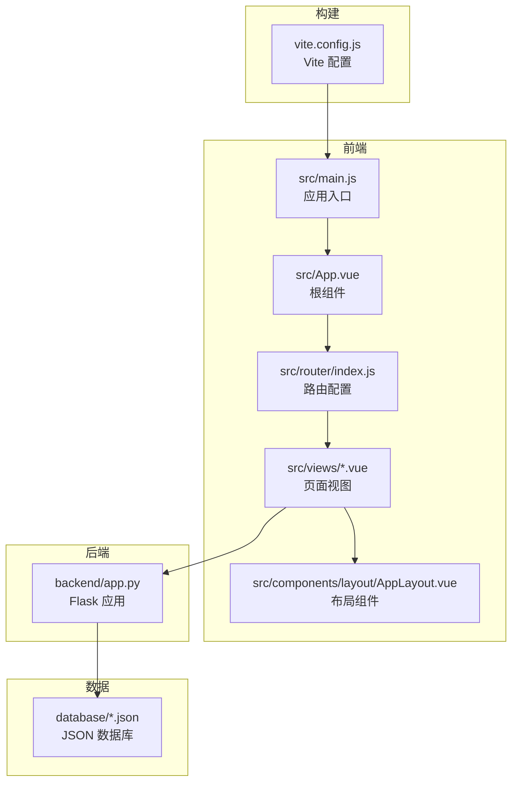
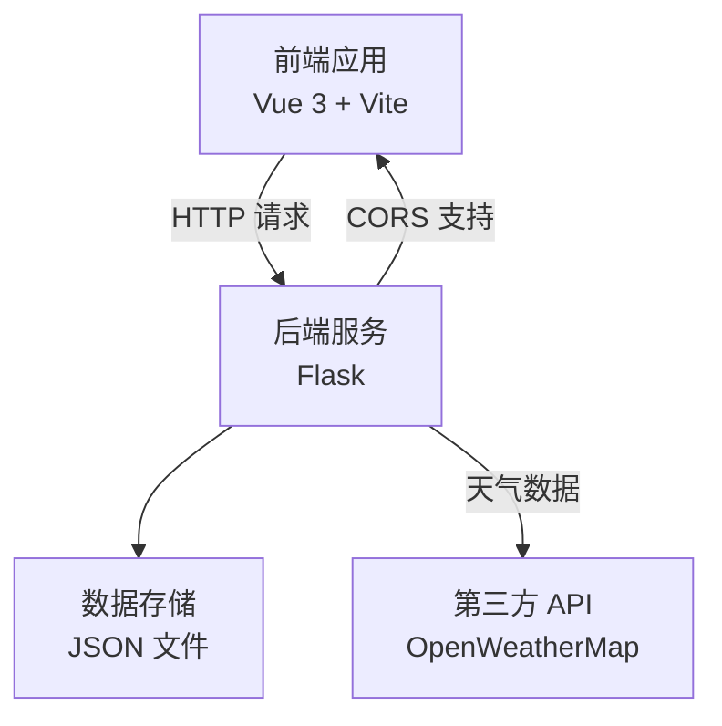
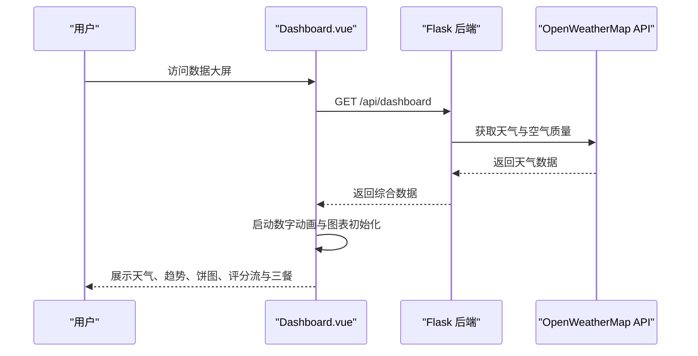
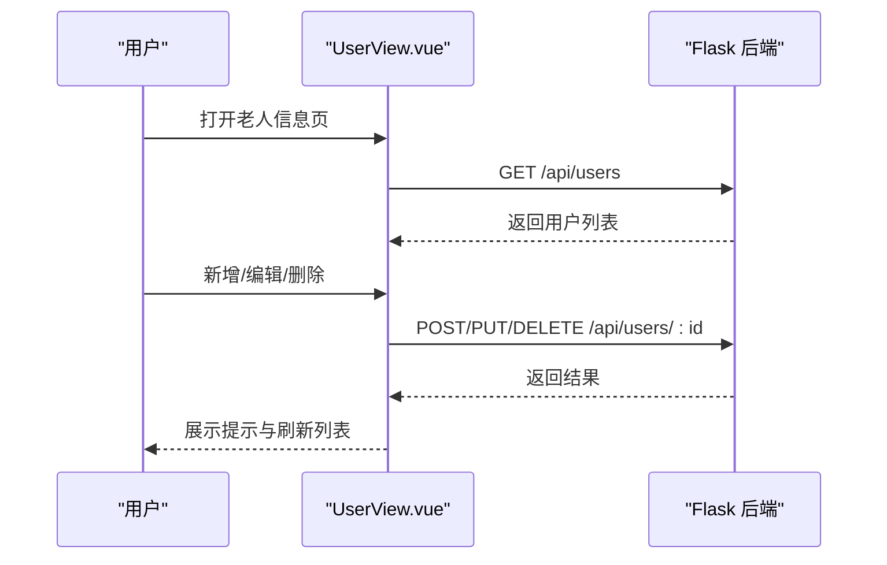
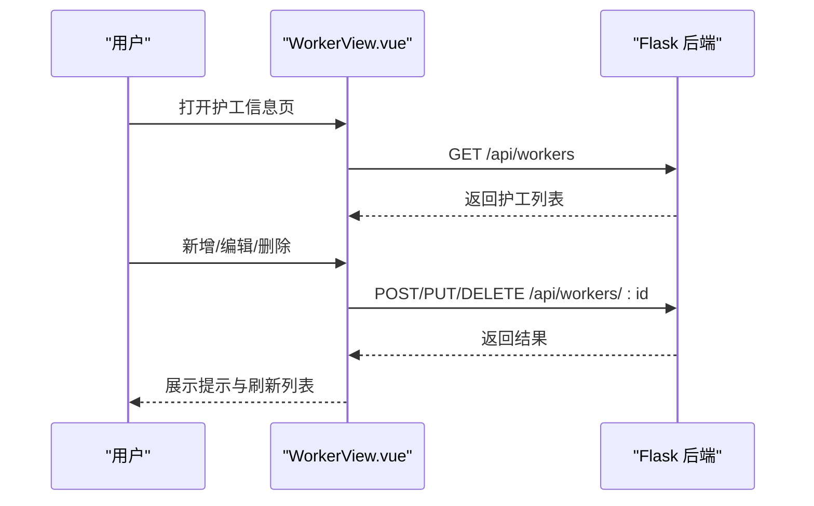
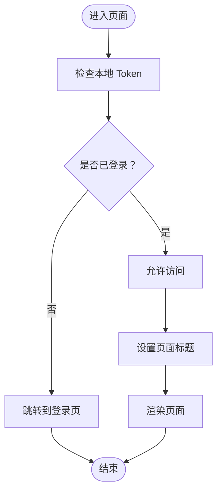
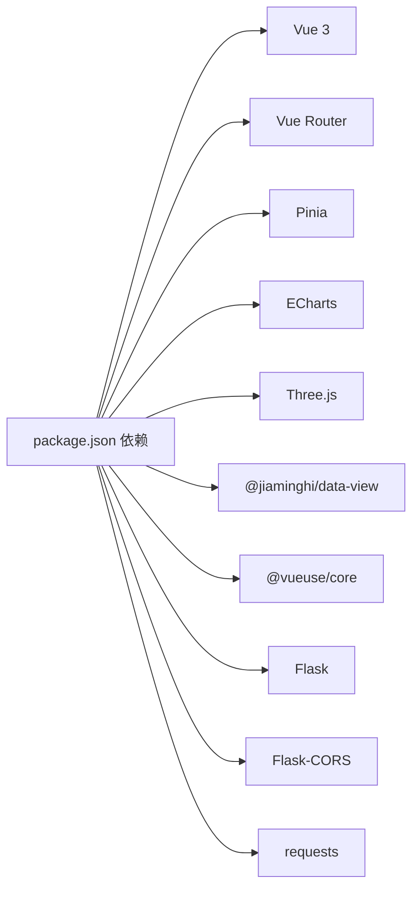
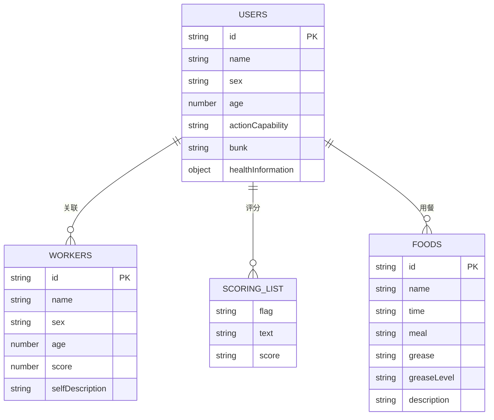

# 项目概述

<cite>
**本文档引用的文件**
- [package.json](file://package.json)
- [backend/app.py](file://backend/app.py)
- [src/main.js](file://src/main.js)
- [src/App.vue](file://src/App.vue)
- [src/router/index.js](file://src/router/index.js)
- [src/views/Dashboard.vue](file://src/views/Dashboard.vue)
- [src/views/UserView.vue](file://src/views/UserView.vue)
- [src/views/WorkerView.vue](file://src/views/WorkerView.vue)
- [src/components/layout/AppLayout.vue](file://src/components/layout/AppLayout.vue)
- [database/users.json](file://database/users.json)
- [database/workers.json](file://database/workers.json)
- [database/scoringList.json](file://database/scoringList.json)
- [database/foods.json](file://database/foods.json)
- [vite.config.js](file://vite.config.js)
</cite>

## 目录
1. [引言](#引言)
2. [项目结构](#项目结构)
3. [核心组件](#核心组件)
4. [架构总览](#架构总览)
5. [详细组件分析](#详细组件分析)
6. [依赖关系分析](#依赖关系分析)
7. [性能考量](#性能考量)
8. [故障排查指南](#故障排查指南)
9. [结论](#结论)
10. [附录](#附录)

## 引言
本项目为“智慧康养养老院管理系统”，旨在通过前后端分离架构，提供实时数据监控、人员信息管理与护工评分展示等核心能力。系统采用 Vue.js 3 作为前端框架，Flask 作为后端服务，结合 ECharts、Three.js、Pinia 等关键依赖，构建直观、易用、可扩展的可视化与交互体验。项目面向养老机构管理者与一线护工，覆盖日常运营中的关键场景：数据大屏、老人与护工信息管理、健康与饮食监控等。

## 项目结构
项目采用典型的前后端分离结构：
- 前端位于 src 目录，基于 Vue 3 + Vite 构建，使用 Vue Router 进行路由管理，Pinia 管理全局状态。
- 后端位于 backend 目录，基于 Flask 提供 RESTful API，使用 CORS 支持跨域。
- 数据库存放于 database 目录，采用 JSON 文件模拟数据库，便于开发与演示。
- 构建工具使用 Vite，支持单文件打包以便部署。

**图表来源**
- [src/main.js:1-11](file://src/main.js#L1-L11)
- [src/App.vue:1-24](file://src/App.vue#L1-L24)
- [src/router/index.js:1-61](file://src/router/index.js#L1-L61)
- [src/components/layout/AppLayout.vue:1-800](file://src/components/layout/AppLayout.vue#L1-L800)
- [backend/app.py:1-330](file://backend/app.py#L1-L330)
- [database/users.json:1-582](file://database/users.json#L1-L582)
- [database/workers.json:1-442](file://database/workers.json#L1-L442)
- [vite.config.js:1-27](file://vite.config.js#L1-L27)

**章节来源**
- [src/main.js:1-11](file://src/main.js#L1-L11)
- [src/App.vue:1-24](file://src/App.vue#L1-L24)
- [src/router/index.js:1-61](file://src/router/index.js#L1-L61)
- [backend/app.py:1-330](file://backend/app.py#L1-L330)
- [vite.config.js:1-27](file://vite.config.js#L1-L27)

## 核心组件
- 应用入口与状态管理
  - 应用入口通过 main.js 初始化 Vue 应用，注册 Pinia 与路由，挂载根组件。
  - 根组件 App.vue 根据路由元信息决定是否渲染布局，实现登录页与业务页的差异化展示。
- 路由与权限
  - 路由配置包含登录、仪表盘、首页、老人信息、护工信息等页面；路由守卫负责鉴权与标题设置。
- 视图组件
  - Dashboard.vue：数据大屏，集成 ECharts 图表，展示天气、趋势、行动能力分布、护工评分流与三餐情况。
  - UserView.vue：老人信息管理，支持搜索、筛选、新增/编辑/删除、表单校验与提示。
  - WorkerView.vue：护工信息管理，支持搜索、筛选、新增/编辑/删除、评分与自我描述展示。
- 布局组件
  - AppLayout.vue：侧边导航、顶部栏、移动端菜单、系统信息弹窗与退出登录逻辑。

**章节来源**
- [src/main.js:1-11](file://src/main.js#L1-L11)
- [src/App.vue:1-24](file://src/App.vue#L1-L24)
- [src/router/index.js:1-61](file://src/router/index.js#L1-L61)
- [src/views/Dashboard.vue:1-800](file://src/views/Dashboard.vue#L1-L800)
- [src/views/UserView.vue:1-200](file://src/views/UserView.vue#L1-L200)
- [src/views/WorkerView.vue:1-200](file://src/views/WorkerView.vue#L1-L200)
- [src/components/layout/AppLayout.vue:1-800](file://src/components/layout/AppLayout.vue#L1-L800)

## 架构总览
系统采用前后端分离架构：
- 前端：Vue 3 + Vue Router + Pinia，负责页面渲染、交互与图表展示。
- 后端：Flask，提供 RESTful 接口，统一处理认证、数据读写与第三方天气 API 调用。
- 数据：JSON 文件模拟数据库，便于本地开发与演示。
- 构建：Vite + 单文件插件，优化资源打包与部署。

**图表来源**
- [backend/app.py:1-330](file://backend/app.py#L1-L330)
- [src/views/Dashboard.vue:173-204](file://src/views/Dashboard.vue#L173-L204)
- [src/views/UserView.vue:34-43](file://src/views/UserView.vue#L34-L43)
- [src/views/WorkerView.vue:97-106](file://src/views/WorkerView.vue#L97-L106)

## 详细组件分析

### Dashboard 数据大屏
- 功能要点
  - 实时天气与趋势：从后端接口获取天气统计，使用 ECharts 展示最高/最低温度趋势与行动能力分布饼图。
  - 数字动画：通过 requestAnimationFrame 实现平滑补间动画，提升数据呈现的动态效果。
  - 护工评分流：使用 CSS 动画实现滚动列表，鼠标悬停暂停，增强可读性。
  - 三餐情况：按早餐/午餐/晚餐分组展示菜品名称、描述与油脂等级。
- 数据来源
  - 后端接口 /api/dashboard 返回天气统计、评分列表、用户与食物数据。
  - 用户数据来自 database/users.json，护工评分来自 database/scoringList.json，食物数据来自 database/foods.json。

**图表来源**
- [src/views/Dashboard.vue:173-204](file://src/views/Dashboard.vue#L173-L204)
- [backend/app.py:171-182](file://backend/app.py#L171-L182)

**章节来源**
- [src/views/Dashboard.vue:1-800](file://src/views/Dashboard.vue#L1-L800)
- [backend/app.py:171-182](file://backend/app.py#L171-L182)
- [database/scoringList.json:1-7](file://database/scoringList.json#L1-L7)
- [database/foods.json:1-38](file://database/foods.json#L1-L38)

### 用户信息管理（老人）
- 功能要点
  - 搜索与筛选：支持关键字与多维度筛选（性别、教育、婚姻、行动能力）。
  - 表单管理：新增/编辑表单，包含健康信息对象，表单校验与错误提示。
  - 权限控制：新增/编辑/删除均携带 Bearer Token，后端进行鉴权。
- 数据来源
  - 后端接口 /api/users 提供 CRUD 操作，数据来自 database/users.json。

**图表来源**
- [src/views/UserView.vue:34-43](file://src/views/UserView.vue#L34-L43)
- [src/views/UserView.vue:165-190](file://src/views/UserView.vue#L165-L190)
- [backend/app.py:204-262](file://backend/app.py#L204-L262)

**章节来源**
- [src/views/UserView.vue:1-200](file://src/views/UserView.vue#L1-L200)
- [backend/app.py:204-262](file://backend/app.py#L204-L262)
- [database/users.json:1-582](file://database/users.json#L1-L582)

### 护工信息管理（护工）
- 功能要点
  - 搜索与筛选：支持关键字与多维度筛选（性别、教育、婚姻、政治面貌）。
  - 表单管理：新增/编辑表单，包含评分与自我描述字段。
  - 权限控制：新增/编辑/删除均携带 Bearer Token，后端进行鉴权。
- 数据来源
  - 后端接口 /api/workers 提供 CRUD 操作，数据来自 database/workers.json。

**图表来源**
- [src/views/WorkerView.vue:97-106](file://src/views/WorkerView.vue#L97-L106)
- [src/views/WorkerView.vue:170-200](file://src/views/WorkerView.vue#L170-L200)
- [backend/app.py:264-320](file://backend/app.py#L264-L320)

**章节来源**
- [src/views/WorkerView.vue:1-200](file://src/views/WorkerView.vue#L1-L200)
- [backend/app.py:264-320](file://backend/app.py#L264-L320)
- [database/workers.json:1-442](file://database/workers.json#L1-L442)

### 路由与鉴权
- 路由守卫
  - 设置页面标题，检查本地 Token，未登录访问非登录页自动跳转登录，已登录访问登录页自动跳转仪表盘。
- 登录与 Token
  - 登录接口返回 Bearer Token，后续请求头携带 Authorization: Bearer token。
- 布局与菜单
  - AppLayout.vue 提供侧边导航、移动端菜单、系统信息弹窗与退出登录逻辑。

**图表来源**
- [src/router/index.js:43-59](file://src/router/index.js#L43-L59)
- [src/components/layout/AppLayout.vue:19-29](file://src/components/layout/AppLayout.vue#L19-L29)

**章节来源**
- [src/router/index.js:1-61](file://src/router/index.js#L1-L61)
- [src/components/layout/AppLayout.vue:1-800](file://src/components/layout/AppLayout.vue#L1-L800)

## 依赖关系分析
- 前端依赖
  - Vue 3：响应式与组件化基础。
  - Vue Router：页面路由与导航。
  - Pinia：全局状态管理。
  - ECharts：图表绘制（折线图、饼图）。
  - Three.js：3D 场景（用于数据可视化或装饰）。
  - @jiaminghi/data-view：数据可视化组件库。
  - @vueuse/core：组合式工具集。
- 后端依赖
  - Flask：Web 框架。
  - Flask-CORS：跨域支持。
  - requests：调用第三方天气 API。
- 构建依赖
  - Vite：开发与构建工具。
  - vite-plugin-singlefile：单文件打包插件。

**图表来源**
- [package.json:11-26](file://package.json#L11-L26)
- [backend/app.py:7-8](file://backend/app.py#L7-L8)

**章节来源**
- [package.json:1-28](file://package.json#L1-L28)
- [backend/app.py:1-330](file://backend/app.py#L1-L330)

## 性能考量
- 前端性能
  - 使用 requestAnimationFrame 实现平滑动画，减少主线程阻塞。
  - ECharts 图表在 nextTick 后初始化，避免 DOM 尺寸未就绪导致的渲染问题。
  - 路由守卫与生命周期钩子确保定时器在组件卸载时清理，防止内存泄漏。
- 后端性能
  - 第三方天气 API 请求设置超时，失败时回退模拟数据，保证服务可用性。
  - JSON 文件读写封装为辅助函数，避免重复 IO 开销。
- 构建优化
  - Vite 单文件打包减少请求数量，适合内网或单机部署场景。

[本节为通用指导，无需具体文件引用]

## 故障排查指南
- 登录失败
  - 检查本地是否存在 user_token；若无则路由守卫会跳转登录。
  - 确认后端 /api/login 返回的 Bearer Token 是否正确写入本地存储。
- 数据加载失败
  - Dashboard.vue、UserView.vue、WorkerView.vue 在请求失败时打印错误并提示。
  - 检查后端是否正常运行（默认监听 5000 端口）。
- CORS 错误
  - 确认后端已启用 CORS，前端请求头携带正确的 Authorization。
- 图表不显示
  - 确保 DOM 已渲染后再初始化 ECharts；使用 nextTick 保证时机。
  - 检查容器尺寸与 resize 事件绑定。

**章节来源**
- [src/router/index.js:43-59](file://src/router/index.js#L43-L59)
- [src/views/Dashboard.vue:201-203](file://src/views/Dashboard.vue#L201-L203)
- [src/views/UserView.vue:39-42](file://src/views/UserView.vue#L39-L42)
- [src/views/WorkerView.vue:102-105](file://src/views/WorkerView.vue#L102-L105)
- [backend/app.py:11-11](file://backend/app.py#L11-L11)

## 结论
本项目通过前后端分离架构，结合 Vue 3 的现代化特性与 Flask 的简洁高效，实现了智慧康养养老院管理的核心业务场景。系统具备良好的可扩展性与可维护性，适合在养老机构中进行二次开发与定制。建议后续在生产环境中引入数据库、完善的鉴权体系与监控告警机制，进一步提升稳定性与安全性。

[本节为总结性内容，无需具体文件引用]

## 附录
- 技术栈选择理由
  - Vue 3：组合式 API、更好的 TypeScript 支持与性能。
  - Pinia：轻量级状态管理，API 更简洁。
  - ECharts：丰富的图表类型与强大的交互能力。
  - Three.js：用于 3D 场景或可视化装饰，增强用户体验。
  - Vite：更快的冷启动与热更新，开发体验优秀。
  - Flask：轻量、易上手，适合快速迭代与原型验证。
- 数据模型概览
  - users.json：老人基本信息、行动能力、床位、健康信息等。
  - workers.json：护工基本信息、评分、自我描述等。
  - scoringList.json：护工评分滚动列表。
  - foods.json：三餐菜品名称、描述、油脂等级与分类。

**图表来源**
- [database/users.json:1-582](file://database/users.json#L1-L582)
- [database/workers.json:1-442](file://database/workers.json#L1-L442)
- [database/scoringList.json:1-7](file://database/scoringList.json#L1-L7)
- [database/foods.json:1-38](file://database/foods.json#L1-L38)